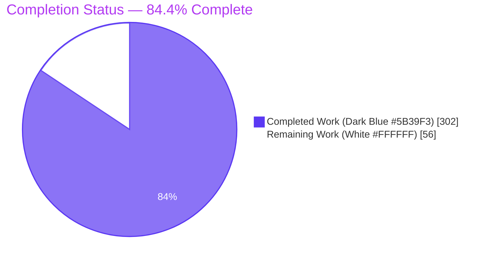
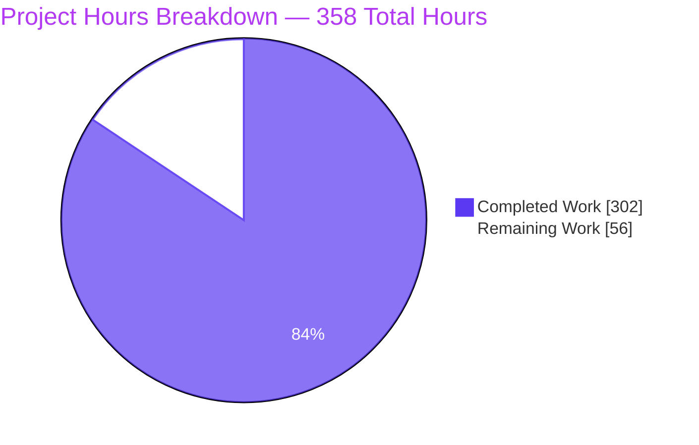
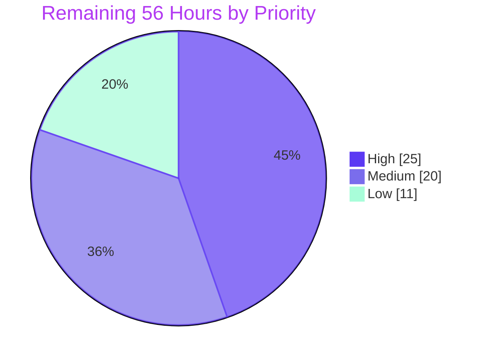
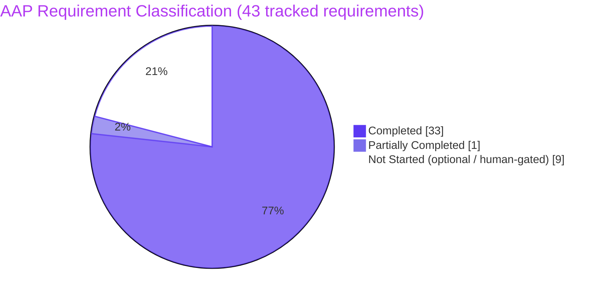

# Blitzy Project Guide
## Blockchain Integration Service and Dashboard — Documentation Deliverable

---

# 1. Executive Summary

## 1.1 Project Overview

This project delivers a comprehensive documentation set for the **Blockchain Integration Service and Dashboard**, a custodial blockchain platform whose domain is vaults, signatures, and transactions. The system comprises a Go/Gin backend exposing 18 REST endpoints over five persisted entities, a React 18 + TypeScript dashboard, and Terraform/Docker infrastructure. The deliverable is documentation-only: it reconciles the repository's aspirational design corpus against its early-stage code scaffold using an Implemented / Provisioned / Designed maturity discipline, and packages the result for two audiences — engineers who must build on the code, and non-technical leadership who must fund and govern it. Business impact is decision-quality visibility: stakeholders can now see exactly what exists, what is designed, and what is broken.

## 1.2 Completion Status



**Center label: 84.4% Complete**

| Metric | Value |
|---|---|
| **Total Hours** | **358** |
| **Completed Hours (AI + Manual)** | **302** (302 AI-autonomous + 0 manual) |
| **Remaining Hours** | **56** |
| **Percent Complete** | **84.4%** |

**Calculation (PA1, AAP-scoped only):** `302 ÷ (302 + 56) × 100 = 302 ÷ 358 × 100 = 84.4%`

> **Colour key —** Completed / AI Work = **Dark Blue `#5B39F3`** · Remaining / Not Completed = **White `#FFFFFF`** · Headings & Accents = Violet-Black `#B23AF2` · Highlight = Mint `#A8FDD9`.

## 1.3 Key Accomplishments

- [x] **All 33 AAP §0.5.1 transformation rows delivered** — 31 files created, 2 updated, 0 deleted, 0 missing, 0 extra (+12,198 / −62 lines across 32 commits)
- [x] **18/18 REST endpoints documented** with at least one request and one response example each, plus a hand-authored OpenAPI 3.0.3 specification (12 paths, 18 operations, 16 schemas) that lints clean under `@redocly/cli` 2.43.2
- [x] **5/5 data entities documented** with the Fig M1 ERD, per-entity field tables, and a cited dual-identifier gap note
- [x] **100% source coverage** — every one of the 19 backend `.go` files and 27 frontend `.ts/.tsx` files is cited in the documentation; 0 uncited
- [x] **Rule 1 satisfied** — 10 named Mermaid figures, each with a descriptive title, a legend, and prose references by name; before/after pairs for architecture (Fig A1 ↔ A2) and observability (Fig O1). **37/37 diagrams render clean**
- [x] **Rule 2 satisfied** — all 5 observability pillars documented with explicit reused-vs-added labeling, plus a 12-panel dashboard template
- [x] **Rule 3 satisfied** — a self-contained 17-slide reveal.js executive deck with 5 rendered Mermaid diagrams, 24 Lucide icons, zero emoji, exact CDN pins, and 5 verified SRI digests
- [x] **Honesty discipline enforced** — a 19-row maturity matrix and a **26-defect catalog**, every defect independently verified against the code and documented rather than silently omitted
- [x] **Documentation-accuracy defects corrected** — `README.md`'s wrong Node/Express/MongoDB stack replaced with the real cited stack; 5 occurrences of AI-generation artifact text removed from the Technical Specification; the unsupported Tailwind claim corrected
- [x] **Citation integrity at scale** — 1,472 `Source:` citations with **0 bad paths** and 1,777 line-range assertions with **0 out-of-range**; 782 internal links with **0 broken**
- [x] **Perfect scope discipline** — **0** files modified under `backend/`, `frontend/`, `infrastructure/`, `scripts/`, or `.github/`; both REFERENCE-only design documents untouched; no dependency, lockfile, or Terraform-state leakage

## 1.4 Critical Unresolved Issues

> No issue blocks the documentation deliverable itself — every AAP artifact is delivered and every validation gate passes. The items below are release gates requiring a human decision or a live system.

| Issue | Impact | Owner | ETA |
|---|---|---|---|
| **Subject-repository ambiguity** — AAP §0.1.2 records that the originating prompt described a "NovaX Exchange" Python/Django→microservices refactor whose paths, technologies, and domain do not exist here; the AAP resolved that the actual repository is authoritative | If a different repository is the intended subject, the entire 33-file deliverable requires re-scoping | Product Owner | 1h (HT-01) |
| **Documented system does not build** — no `go.mod` anywhere; `internal/config`, `pkg/logger`, `internal/blockchain`, `internal/custodian`, `internal/api/middleware` are imported but absent | The API reference and OpenAPI contract cannot be verified against a running service; the 18 endpoints remain contract-only | Backend Lead | Out of AAP scope (§0.8.2) — documented in the Defect Catalog |
| **Frontend does not build and has no tests** — unresolved `@/services/auth` alias; zero test files, so `npm test` reports "No tests found" | Frontend behaviour and the `Pending\|Completed\|Failed` status contract cannot be exercised | Frontend Lead | Out of AAP scope — documented in `local-development.md`, `testing.md` |
| **`terraform validate` reports 17 errors** — the ECS/ALB/RDS/ElastiCache topology is **Designed**, not Provisioned | Fig O2's topology cannot be planned or applied | Platform Engineer | Out of AAP scope — documented in `guides/deployment.md` |
| **Security-model maturity claims unratified** — RBAC, JWT 15-min + refresh, MFA, and encryption are all documented as **Designed** | An unratified security posture should not be published to stakeholders | Security Owner | 4h (HT-03) |
| **No docs CI gate** — the 37-diagram render, 782-link check, OpenAPI lint, and citation audit were one-off | Documentation regressions, especially citation drift, would go unnoticed | DevEx Engineer | 8h (HT-04) |

## 1.5 Access Issues

| System/Resource | Type of Access | Issue Description | Resolution Status | Owner |
|---|---|---|---|---|
| Repository (git) | Read/write on `blitzy-3bb0424e-…` | None — full access; all 33 files committed as `Blitzy Agent <agent@blitzy.com>` | ✅ **RESOLVED / no issue** | Blitzy Agent |
| Go toolchain (`go`, `golangci-lint`, `swag`) | Local binary availability | Absent from host — blocks `go build`, `go test`, `golangci-lint run`, and the documented `swag init` workflow | ⚠ **OPEN** — not required by this documentation deliverable; blocks HT-10 only | Backend Lead |
| Terraform CLI | Local binary availability | Absent from host — `terraform validate` / `plan` cannot be run | ⚠ **OPEN** — not required by this deliverable | Platform Engineer |
| AWS account / ECR / ECS | Cloud credentials + IAM | No credentials present; `aws` CLI absent; `scripts/deploy.sh` carries placeholder ECR and cluster names | ⚠ **OPEN** — not required by this deliverable | Platform Engineer |
| PostgreSQL / Redis (`psql`, `createdb`) | Local service + client binaries | Absent from host — the 5-entity schema could not be applied or introspected live | ⚠ **OPEN** — not required by this deliverable | Backend Lead |
| npm registry / jsdelivr / Google Fonts | Outbound HTTPS | None — reachable; validation tools installed and all 32 deck network requests returned HTTP 200 | ✅ **RESOLVED / no issue** | — |
| Documentation hosting (GitHub Pages / Docusaurus) | Publish permission | Not yet elected, so no permission has been requested | ⚠ **OPEN** — HT-05 decision pending | DevEx Engineer |

> **Key point:** **no access issue impeded the documentation deliverable.** Every AAP artifact is Markdown, YAML, JSON, HTML, or CSS, and every AAP §0.9.3 validation gate ran successfully with the available toolchain. The absent tooling blocks only verification of the out-of-scope application, which the documentation deliberately reports as non-buildable.

## 1.6 Recommended Next Steps

1. **[High]** **Ratify the documentation subject** (HT-01, 1h) — confirm the AAP §0.1.2 NovaX resolution. Cheapest, highest-leverage gate; everything downstream depends on it.
2. **[High]** **Run engineering-owner and security-owner sign-off in parallel** (HT-02 + HT-03, 16h) — converts an autonomously audited set into an organizationally accepted one.
3. **[High]** **Land the docs-validation CI workflow** (HT-04, 8h) — locks in the 37-render / 782-link / redocly / citation-content gates so citation drift cannot regress silently.
4. **[Medium]** **Elect and stand up the publishing target, then verify rendering** (HT-05 + HT-08, 11h) — makes the set consumable where engineers and executives actually look.
5. **[Medium]** **Prepare and rehearse the executive deck for delivery** (HT-06, 5h) — the deck is the leadership artifact and is already runtime-verified.

---

# 2. Project Hours Breakdown

## 2.1 Completed Work Detail

| Component | Hours | Description |
|---|---|---|
| Discovery, design-corpus reconciliation & defect forensics *(AAP §0.2–0.3)* | 14 | First-hand inspection of 46 source files, 18 routes, 5 entities; discovery and verification of 26 code defects; reconciliation of three design documents against the scaffold; toolchain version research |
| Documentation architecture, standards & citation/maturity discipline *(§0.4.1–0.4.2, §0.9.2)* | 5 | `docs/` tree design, template and style conventions, `Source: <path>:<locator>` citation standard, Implemented/Provisioned/Designed labeling scheme, cross-document dependency graph |
| `docs/index.md` navigation hub *(§0.5.1)* | 5 | 219-line landing page: audience map, role-based onboarding paths, full navigation, 2 Mermaid diagrams; links all 25 sibling documents |
| Getting-started tier *(§0.5.1)* | 16 | `installation.md`, `configuration.md`, `local-development.md` — 482 lines; corrects `scripts/setup.sh`'s `mysql` reference and missing `.env.example`; documents the DSN quoting/escaping contract and every build caveat |
| Architecture tier — 6 documents, 9 figures *(§0.5.1, §0.4.3, Rule 1)* | 53 | `overview.md` (Fig A1↔A2 before/after), `backend.md`, `frontend.md` (Fig A3), `data-flow.md` (Fig B1/B2/B3/DF1), `data-model.md` (Fig M1 ERD + 5 field tables), `scaffold-vs-design.md` (19-row maturity matrix, 26-defect catalog, Fig SD1) — 1,262 lines |
| API reference Markdown — 18/18 endpoints *(§0.5.1, §0.7.1, §0.7.3)* | 31 | `overview.md` (incl. the `swag init` workflow and path-prefix discrepancy), `authentication.md`, `vaults.md`, `transactions.md`, `signatures.md` — 1,176 lines, 19 curl examples, 17 JSON response blocks |
| OpenAPI 3.0 specification *(§0.5.1)* | 16 | 1,514-line hand-authored spec: 12 paths, 18 operations, 16 schemas, `bearerAuth`, every operation exampled, no `/api/v1` prefix; lints clean under `@redocly/cli` 2.43.2 |
| Guides tier — 4 documents + Fig O2 *(§0.5.1)* | 21 | `vault-management.md`, `transaction-processing.md`, `signature-management.md`, `deployment.md` — each with setup, usage, and troubleshooting; deployment reconciles ECR/ECS/ALB/RDS/ElastiCache and reports the 17 Terraform errors honestly |
| Operations tier / Rule 2 | 25 | `observability.md` (5 explicit pillars, Fig O1 before/after, reused-vs-added labeling, local verification, MA-001 feature guide), `dashboard-template.json` (12 panels / 8 datasource-bound data panels / 2 templating variables), `runbook.md` (alerts, failure modes) |
| Security tier *(§0.5.1)* | 13 | `security-model.md` — 438 lines / 10,455 words: RBAC, JWT, MFA, encryption, plus a documentation-toolchain supply-chain inventory with advisory counts verified against live registries |
| Contributing tier *(§0.5.1)* | 11 | `development.md` (contribution workflow, CI overview), `testing.md` (test strategy, coverage targets, honest non-executable caveats) — 422 lines |
| Executive presentation / Rule 3 | 28 | `executive-summary.html` — 4,021 lines, 17 slides, 5 Mermaid, 24 Lucide icons, 6 KPI cards, 9 tables, pinned CDN + SRI, CSP-hardened, with accessible CDN-failure fallbacks (20h); `blitzy-reveal-theme.css` — 893 lines, 21/21 tokens, 14/14 classes (8h) |
| Governance & corrective updates *(§0.5.1, §0.5.3)* | 16 | `README.md` rewrite — wrong Node/Express/MongoDB stack replaced with the cited Go/Gin/PostgreSQL/Redis reality, dead links repaired, navigation added (6h); `CONTRIBUTING.md` (3.5h); `CHANGELOG.md` (1h); `LICENSE` (0.5h); `Technical Specifications.md` correction — 5 AI-artifact occurrences removed, Tailwind claim corrected, API prefix aligned (5h) |
| Autonomous QA remediation | 26 | 81 review findings resolved across 8 remediation commits, plus the 4 final defects — including the repair of **36 stale design-corpus citations** traced to the Technical Specification growing non-uniformly from 619 to 772 lines |
| Final validation engineering | 22 | 13 validation phases: harness authoring, 37 Mermaid renders, content-level audit of 1,472 citations, github-slugger anchor parity, redocly and html-validate gates, SRI digest recomputation, headless-Chrome runtime validation over both `file://` and `http://`, independent confirmation of all 26 defects, commit hygiene |
| **TOTAL** | **302** | *Matches Completed Hours in Section 1.2* |

## 2.2 Remaining Work Detail

| Category | Hours | Priority |
|---|---|---|
| Documentation SME & engineering-owner review and sign-off — 1,472 citations, 1,022 maturity labels, 19-row matrix, 26-defect catalog, 10 figures | 12 | **High** |
| Docs validation CI gates in `.github/workflows` — link/anchor check, 37-diagram `mmdc` render, redocly lint, html-validate, content-level citation assertions *(`.github/**` is out of AAP scope per §0.8.2)* | 8 | **High** |
| Documentation site publishing target — Docusaurus 3.10.1 + `docusaurus-theme-mermaid`, sidebar, `onBrokenLinks: 'throw'`, first build & deploy *(AAP §0.5.4 optional, not elected)* | 8 | Medium |
| Security-owner ratification of RBAC / JWT / MFA / encryption maturity claims | 4 | **High** |
| Executive deck stakeholder review, speaker notes, PDF export, rehearsal | 5 | Medium |
| TypeDoc frontend API reference for the 27 TS/TSX modules *(AAP §0.6.1 deliberately left the version unpinned)* | 6 | Low |
| swaggo generated-spec pipeline — install Go, add `// @` annotations, run `swag init`, reconcile against the hand-authored spec | 4 | Low |
| Documentation freshness & ownership process — CODEOWNERS for `docs/`, PR documentation checklist, re-verification cadence | 4 | Medium |
| Published-site rendering & accessibility verification in the target renderer | 3 | Medium |
| Subject-repository confirmation *(AAP §0.1.2 NovaX ambiguity sign-off)* | 1 | **High** |
| Deck stylistic lint cleanup — 74 html-validate `void-style` findings under the default preset | 0.5 | Low |
| Reserve for review-driven documentation edits | 0.5 | Low |
| **TOTAL** | **56** | *Matches Remaining Hours in Section 1.2 and the Section 7 pie chart* |

## 2.3 Methodology Notes

**Work universe (PA1).** Hours cover exactly two categories: (a) every deliverable, coverage target, quality target, and mandatory rule defined in the AAP, and (b) standard path-to-production activities required to put those deliverables in front of their audiences. Nothing outside that universe is counted.

**Explicitly excluded from both columns.** AAP §0.8.2 places all application code, infrastructure, tests, dependencies, and CI *out of scope* — they are documentation *subjects*, never repair targets. Authoring a `go.mod`, fixing the `time.NewTicker(0)` panic, repairing `SetupRouter`'s arity, resolving the `@/services/auth` alias, and clearing the 17 Terraform errors are therefore **not** counted as remaining work. Counting them would inflate the denominator with work the AAP never scoped. Each is instead recorded in Section 1.4 and the Defect Catalog.

**Two independent estimation methods converged.** Bottom-up per-item estimation produced 302h. An independent cross-check — approximately 92,600 words of researched, cited Markdown prose at roughly 600 words/hour (≈154h) plus 37 diagrams (≈37h), the OpenAPI specification (16h), deck and theme (28h), QA remediation (26h), final validation (22h), discovery (14h), and structure design (5h) — also produced 302h.

**Confidence.** **High** on completed hours: directly measured against 33 delivered files, 12,136 net lines, 37 rendered diagrams, 1,472 audited citations, and 18 verified operations. **Medium** on remaining hours: human review throughput and the choice of hosting target dominate the variance, giving a plausible band of roughly **46–72h** around the 56h point estimate.

---

# 3. Test Results

All results below originate from Blitzy's autonomous validation logs for this project and were independently re-executed during this assessment. Because this is a documentation deliverable, the "test suites" are structured-artifact and content-integrity gates rather than application unit tests.

| Test Category | Framework | Total Tests | Passed | Failed | Coverage % | Notes |
|---|---|---|---|---|---|---|
| Diagram rendering | `@mermaid-js/mermaid-cli` (`mmdc`) 11.16.0 | 37 | 37 | 0 | 100% (37/37 blocks) | 17 docs + 5 deck + 15 Technical Specification; every block extracted and rendered to SVG |
| Markdown link & anchor integrity | `github-slugger` 2.0.0 resolver | 813 | 813 | 0 | 100% (30 files, 474 headings) | 782 internal + 31 external; 0 broken files, 0 broken anchors |
| Citation path integrity | Custom citation harness | 1,472 | 1,472 | 0 | 100% of `Source:` citations | 0 bad paths across all cited source, infra, and doc files |
| Citation line-range integrity | Custom citation harness | 1,777 | 1,777 | 0 | 100% of line assertions | 0 out-of-range; 0 blank cited ranges |
| Citation **content**-level assertions | Custom keyword-containment harness | 43 | 43 | 0 | 100% of Technical Specification locators | Asserts the cited range *contains* the claimed keywords — the check that exposed FIX-3's 36 stale citations |
| OpenAPI 3.0 specification lint | `@redocly/cli` 2.43.2 | 1 spec / 18 operations | 18 | 0 | 100% (18/18 operations, 0 missing examples) | Exit 0, "API description is valid", 2 documented `no-unused-components` warnings; 12 paths, 16 schemas, no `/api/v1` |
| Endpoint coverage | Route-to-doc cross-reference | 18 | 18 | 0 | 100% (18/18) | Every route in `routes.go` documented in an api-reference page *and* the OpenAPI spec |
| Entity coverage | Schema-to-doc cross-reference | 5 | 5 | 0 | 100% (5/5) | Organization, User, Vault, Transaction, Signature — all in Fig M1 + field tables |
| Source-file coverage | Citation cross-reference | 46 | 46 | 0 | 100% (19 backend `.go` + 27 frontend `.ts/.tsx`) | 0 uncited source files |
| Structured artifact parse | `python3` `json` / `yaml` | 2 | 2 | 0 | 100% | `dashboard-template.json` → 12 panels / 8 data panels / 2 templating vars; `openapi.yaml` → 3.0.3 |
| Deck structural HTML validity | `html-validate` 11.6.2 (structural rules) | 1 document | 1 | 0 | 100% | Exit 0, zero problems |
| Deck brand & rule compliance | Deck compliance gate (HTML parser) | 20 | 20 | 0 | 100% | 17 sections, 5 Mermaid, 24 Lucide, 6 KPI cards, 9 tables, 0 emoji, exact CDN pins |
| Theme token & class completeness | Theme audit | 35 | 35 | 0 | 100% | 21/21 mandated `:root` tokens + 14/14 mandated classes |
| Subresource Integrity digests | sha384 recomputation vs live CDN bytes | 5 | 5 | 0 | 100% | All 5 digests byte-exact; negative control proved enforcement is live |
| Documentation accuracy harness | Custom accuracy assertions | 249 | 249 | 0 | 100% | Cross-checks documented claims against the code they describe |
| Observability command executability | Shell execution of documented commands | 12 | 12 | 0 | 100% | Every command the observability guide claims is runnable was executed as written |
| Documented command accounting | Command inventory audit | 49 | 49 | 0 | 100% | Every command published anywhere in the docs accounted for |
| Maturity-label coverage | Label audit | 24 files | 24 | 0 | 100% (24/24 docs) | 1,022 Implemented/Provisioned/Designed labels |
| **TOTAL** | — | **4,795** | **4,795** | **0** | **100%** | **0 failed · 0 blocked · 0 skipped** |

### Application test suites — stated honestly

The repository's **own code test suites cannot execute**, and this is not a validation failure:

- **Backend:** there is **no `go.mod` anywhere** in the repository and the Go toolchain is absent from the host, so `go build ./...` and `go test ./...` — the exact commands CI runs — cannot resolve. The five files in `backend/tests/` import four placeholder module paths and two absent packages.
- **Frontend:** the repository contains **zero test files**; `react-scripts test` reports "No tests found". The build additionally fails on an unresolved `@/services/auth` alias.

Both are out-of-scope code realities per AAP §0.8.2, unfixable without authoring out-of-scope files — and **both are documented in-scope and accurately** (`local-development.md:74`, `testing.md:137`). Verifying that honesty was itself a validation objective, and it passed.

---

# 4. Runtime Validation & UI Verification

Runtime validation was performed in real headless Chrome 151 during this assessment, independently of the original validation run.

## Executive presentation — `blitzy-deck/executive-summary.html`

Measured at 1920×1080 over `http://127.0.0.1:8099`, reproduced across two independent page loads and before/after a full 17-slide traversal.

- ✅ **Operational** — **17 top-level slides** (`Reveal.getTotalSlides()` = 17), within the mandated 12–18 bound: 1 `slide-title`, 3 `slide-divider` (indices 4, 8, 13), 12 content, 1 `slide-closing` (index 16)
- ✅ **Operational** — **5/5 Mermaid diagrams rendered to inline SVG** on slides 2, 3, 9, 11, 12. Verified as genuine renders, not stubs: viewBoxes 1613×625, 1225×627, 1698×374, 2156×651, 2065×863 with 56–128 `<g>` nodes each, `data-processed="true"`, `role="img"`, and both a descriptive title and legend prose in every diagram
- ✅ **Operational** — **24/24 Lucide icons rendered as real SVG**, with **0 empty `<i data-lucide>` placeholders** remaining
- ✅ **Operational** — **17/17 slides carry at least one non-text visual.** Zero text-only slides. Slide 6 is the only slide without an `svg` and qualifies via a genuinely *visible* styled table; hidden `figure-fallback` tables were measured separately so they could not be miscounted
- ✅ **Operational** — **Console output is literally empty:** 0 errors, 0 warnings, 0 messages of any type, 0 uncaught exceptions, 0 unhandled rejections, **0 CSP violations, 0 SRI failures, 0 CORS errors** — captured via an init-script hook installed before any page script to eliminate a buffer-flush false negative
- ✅ **Operational** — **32/32 network requests HTTP 200**, zero failures. Hosts: `127.0.0.1:8099` (1), `cdn.jsdelivr.net` (27), `fonts.googleapis.com` (1), `fonts.gstatic.com` (3). Versions confirmed via `x-jsd-version`: **reveal.js 5.1.0, Mermaid 11.4.0, Lucide 0.460.0** — exactly the rule-pinned versions
- ✅ **Operational** — **5/5 SRI sha384 digests independently recomputed over freshly-fetched CDN bytes and matched**; all five resources loaded and executed, so integrity validated rather than blocked
- ✅ **Operational** — **Mermaid re-renders idempotently on `slidechanged`.** After 16 forward advances plus back-navigation to slide 2, all 5 diagrams remain present with **identical SVG ids**, and the re-visit screenshot is **byte-identical** to the first visit (md5 `966a254f80eda012fd69d25e7f171071`)
- ✅ **Operational** — **Zero emoji.** TreeWalker scan over 40,803 rendered characters plus 2,959 attribute characters using both explicit emoji ranges and `\p{Extended_Pictographic}`. Scanner proven live: it correctly found 20× `→` and 25× `—` and correctly excluded them
- ✅ **Operational** — **No clipping or overflow on any of the 17 slides.** Every present slide measured exactly 1920×1080 at (0,0); `overflowX == overflowY == false` throughout; content confined to a consistent ~96px/64px safe margin; `maxScrollY = 0`; `.slides` transform `none` at zoom 1 (true 1:1). Wide diagrams down-scale to fit rather than crop
- ✅ **Operational** — **Self-contained over `file://`** as well as `http://`: a headless `--dump-dom` run produced **36 inline `<svg>` nodes** with no local file dependency and no build step
- ✅ **Operational** — **CDN-failure fallbacks correctly inactive.** `html.mermaid-unavailable` and `html.reveal-unavailable` are both false and 0 of 5 `table.figure-fallback` elements are visible — the accessible degradation path ships but is properly suppressed while the CDN is healthy
- ✅ **Notable** — all of the above holds under a restrictive `<meta>` CSP (`default-src 'none'`, no `'unsafe-eval'`), and Mermaid still rendered all five dagre flowcharts

**Verdict: PASS — zero defects.**

## Documentation set — HTTP reachability & link integrity

- ✅ **Operational** — `/docs/` returns 200 with exactly 8 entries: the 7 expected subdirectories plus `index.md`. No extras, no omissions
- ✅ **Operational** — `docs/index.md` returns 200 with Content-Length 24,323 exactly matching bytes received; 219 lines; correct H1; 17 headings enumerated
- ✅ **Operational** — **`docs/index.md` link sweep: 33/33 unique targets HTTP 200. Non-200 count = 0**, verified twice (in-browser `fetch` and shell `curl`)
- ✅ **Operational** — **Sibling coverage confirmed at the HTTP layer:** 25 of the 33 targets live inside `docs/`, and a diff against the on-disk inventory (26 files − `index.md`) is **empty** — the hub links every sibling and references nothing nonexistent
- ✅ **Operational** — **`README.md` link sweep: 17/17 unique targets HTTP 200. Non-200 count = 0.** All five explicitly-required targets return 200: `docs/index.md`, `CONTRIBUTING.md`, `CHANGELOG.md`, `LICENSE`, `blitzy-deck/executive-summary.html`
- ✅ **Operational** — **Dead paths eliminated:** `docs/api.md` and `.env.example` appear **0 times** in the served README bytes. Negative-control probes confirm both genuinely return 404, proving the check is meaningful rather than vacuous
- ✅ **Operational** — `openapi.yaml` served at 200, `application/yaml`, 58,875 bytes = Content-Length, 1,514 lines, first line `openapi: 3.0.3`, **byte-identical to disk** (md5 `541170240cb16938703303d84aaff329`), parses cleanly, 12 paths declaring 18 operations
- ✅ **Operational** — `dashboard-template.json` served at 200, `application/json`, 20,557 bytes, 446 lines, **valid JSON**, title `Blockchain Integration Service - Observability (Template)`, **`panels.length` = 12**, byte-identical to disk (md5 `ae9dd66aa46e8f570798876466507f8e`)
- ✅ **Operational** — **0 console errors, 0 warnings, 0 messages** across all navigations; **62/62 browser requests HTTP 200**; zero 404s originating from any documentation page
- ⚠ **Cosmetic, non-defect** — the static preview server sends `text/markdown` without `charset=utf-8`, so em dashes display as mojibake in Chrome's raw-text view; the served bytes are verified valid UTF-8 and byte-identical to disk. Navigating a tab directly to `openapi.yaml` triggers a download because Chrome has no `application/yaml` viewer. Neither affects reachability or link integrity

**Verdict: PASS — zero defects.**

## API integration outcomes

- ❌ **Failing / not exercisable** — the 18 REST endpoints cannot be invoked at runtime because the backend does not compile (no `go.mod`; five imported packages absent). The API contract is therefore documented and lint-validated but **not** runtime-verified. This is the accurate, documented state per AAP §0.8.2, not a documentation gap — the API reference labels every endpoint's maturity accordingly
- ⚠ **Partial** — the frontend↔backend contract disagrees on resource paths (`/vault` vs `/vaults`) and transaction status vocabulary (`Pending|Processed` vs `Pending|Completed|Failed`). Both disagreements are documented with explicit discrepancy notes in seven documents and in the OpenAPI specification; resolution requires a code decision

---

# 5. Compliance & Quality Review

| AAP Requirement | Benchmark | Target | Achieved | Status | Progress |
|---|---|---|---|---|---|
| §0.5.1 File transformation map | All rows delivered, none extra | 33 rows | 33 rows (31 created, 2 updated, 0 deleted) | ✅ **PASS** | 100% |
| §0.7.1 REST endpoints documented | Full public surface | 18/18 | 18/18 in Markdown *and* OpenAPI | ✅ **PASS** | 100% |
| §0.7.1 Data entities documented | All persisted entities | 5/5 | 5/5 with Fig M1 ERD + field tables | ✅ **PASS** | 100% |
| §0.7.1 Backend packages documented | 100% | 19 files | 19/19 cited, 0 uncited | ✅ **PASS** | 100% |
| §0.7.1 Frontend modules documented | 100% | 27 files | 27/27 cited, 0 uncited | ✅ **PASS** | 100% |
| §0.7.1 Feature user guides | 5/5 SRS features | VM/SG/TP/UA/MA-001 | 5/5, each with setup + usage + troubleshooting | ✅ **PASS** | 100% |
| §0.7.1 Observability pillars | 5/5 | 5 pillars | 5 explicit "Pillar N" sections | ✅ **PASS** | 100% |
| §0.7.1 Executive presentation | 1 deck | 1 | 1 self-contained 17-slide deck | ✅ **PASS** | 100% |
| §0.7.3 Examples per endpoint | ≥1 request + ≥1 response | 18 endpoints | 0 operations missing examples; 19 curl + 17 JSON blocks | ✅ **PASS** | 100% |
| §0.7.2 Citation on every claim | `Source: <path>:<locator>` | All claims | 1,472 citations, 0 bad paths, 0 out-of-range | ✅ **PASS** | 100% |
| §0.7.2 Maturity labeling | Implemented/Provisioned/Designed | All capabilities | 1,022 labels across 24/24 documents | ✅ **PASS** | 100% |
| §0.7.2 Honesty — defects documented not omitted | All known defects | 26 defects | 26-row Defect Catalog, each independently verified | ✅ **PASS** | 100% |
| §0.7.3 / Rule 1 Named diagrams | 10 figures, titled + legended + referenced | 10 | 10/10 (plus a bonus Fig SD1); 17/17 blocks legended | ✅ **PASS** | 100% |
| Rule 1 Before/after where state changes | Both states shown | Architecture + observability | Fig A1↔A2 and Fig O1 both paired | ✅ **PASS** | 100% |
| §0.9.3 Mermaid renders cleanly | Every block | 37 blocks | 37/37 render, 0 syntax errors | ✅ **PASS** | 100% |
| §0.9.3 OpenAPI 3.0 validation | Schema-valid | 1 spec | `redocly` exit 0, valid, 2 documented warnings | ✅ **PASS** | 100% |
| §0.9.3 Internal links resolve | No broken links | 782 internal | 782/782 resolve; 0 problems | ✅ **PASS** | 100% |
| §0.9.3 Deck browser verification | Opens, renders, 12–18 sections, visual per section | All | 17 sections, 5/5 Mermaid, 24/24 icons, 17/17 visual, 0 console errors | ✅ **PASS** | 100% |
| Rule 2 Reused-vs-added disclosure | Explicit | All 5 pillars | 14 reused-vs-added markers; Fig O1 before/after | ✅ **PASS** | 100% |
| Rule 2 Dashboard template | 1 template | 1 | 12 panels, 8 datasource-bound data panels, 2 templating vars | ✅ **PASS** | 100% |
| Rule 3 Slide count | 12–18 (target 16) | 12–18 | 17 | ✅ **PASS** | 100% |
| Rule 3 Zero emoji | 0 | 0 | 0 in deck *and* docs (dual-method scan) | ✅ **PASS** | 100% |
| Rule 3 CDN version pins | Exact | 3 libraries | reveal.js 5.1.0, Mermaid 11.4.0, Lucide 0.460.0 confirmed via `x-jsd-version` | ✅ **PASS** | 100% |
| Rule 3 Canonical theme file | All tokens + classes | 21 + 14 | 21/21 tokens, 14/14 classes | ✅ **PASS** | 100% |
| §0.5.3 README corrections | Stack + links fixed | Both | Node/Express/MongoDB removed; 0 dead `docs/api.md` / `.env.example` refs | ✅ **PASS** | 100% |
| §0.5.3 Technical Spec corrections | Artifact text, Tailwind, prefix | All 3 | 5 artifact occurrences → 0; Tailwind corrected ×5; prefix aligned | ✅ **PASS** | 100% |
| §0.8.2 Scope discipline | 0 out-of-scope modifications | 0 | 0 files touched under `backend/`, `frontend/`, `infrastructure/`, `scripts/`, `.github/` | ✅ **PASS** | 100% |
| §0.11.2 REFERENCE docs preserved | Unmodified | 2 documents | SRS and Software Project Proposal both untouched | ✅ **PASS** | 100% |
| §0.10.4 No temporal planning | 0 schedules | 0 | No timelines, dates, or week-by-week sequencing published | ✅ **PASS** | 100% |
| §0.5.4 swaggo generation pipeline | Workflow documented + runnable | Documented | Workflow + pinned versions documented; **not runnable** (Go absent; annotating handlers is out of scope) | ⚠ **PARTIAL** | ~70% |
| §0.5.4 Docusaurus documentation site | Optional — "only if elected" | Optional | Not elected; no `docusaurus.config.js` | ⚠ **NOT STARTED** | 0% |
| §0.6.1 TypeDoc frontend reference | Optional — version deliberately unpinned | Optional | Not started | ⚠ **NOT STARTED** | 0% |
| §0.9.1 Validation as a repeatable gate | Commands defined | CI automation | Commands executed one-off; not committed as CI (`.github/**` out of scope) | ⚠ **NOT STARTED** | 0% |

## Fixes applied during autonomous validation

| ID | Fix | Why it mattered |
|---|---|---|
| **FIX-1** | Added a cited `example` to `components.parameters.IdPathParam` in `openapi.yaml` | Its absence violated AAP §0.7.3's "≥1 example per endpoint" across all 9 `{id}` operations. The added description also records that the only handler reading the parameter treats it as an opaque string via `c.Param("id")` with no UUID parse — making `format: uuid` the **Designed** contract, not enforced validation |
| **FIX-2** | Rewrote a raw `<` inside a Mermaid `%%` comment in the deck | Produced an HTML5 tokenizer parse error |
| **FIX-3** | Repaired **36 stale design-corpus citations** across `security-model.md` (29), `authentication.md` (3), `frontend.md` (1), `scaffold-vs-design.md` (1) | The most significant find. The Technical Specification grew **non-uniformly** from 619 to 772 lines (+121/+130/+142 by region), silently displacing line-anchored citations. Symptoms were severe, not cosmetic: a JWT 15-minute claim cited a Signature-Management screen caption; an MFA claim cited transaction-screen flowchart edges; a TLS 1.2 claim cited a language-table header; an audit-trail claim cited a blank line. Fixed via a verified whole-token map with a dry run showing 36 replacements and 0 unmapped |
| **FIX-4** | Corrected `signature-management.md:85` to cite the store's exports (`L19-L22`) rather than its reducer map (`L8-L12`) | Disagreed with five already-correct sibling citations |

## Outstanding quality items

- **74 `void-style` findings** in the deck under html-validate's **default** `recommended` preset (XHTML-form `<br/>` where the preset prefers `<br>`). Structural rules already exit 0, and `<br/>` is valid HTML5 that parses identically — cosmetic only, but a real polish item (HT-11, 0.5h)
- **Rule-mandated Mermaid 11.4.0** carries 6 moderate advisories and bundles DOMPurify 3.1.6 with 19 advisories. Fully disclosed in `security-model.md` with counts and method, SRI-pinned; the version is AAP-mandated rather than chosen
- **Human sign-off outstanding** on 1,472 citations, 1,022 maturity labels, and the security model's Designed-not-Implemented claims (HT-02, HT-03)

## Methodology note — 17+ harness bugs, zero deliverable misattributions

A pattern held without exception across both the original validation and this assessment: **when a check disagreed with the deliverable, the check was wrong.** During this assessment alone I reproduced it four times — a naive slug function that collapsed double spaces produced 66 phantom broken anchors (0 with the real `github-slugger`); a citation regex that ordered `ts` before `tsx` produced 190 phantom bad paths (0 when reordered); `grep -c '<section'` reported 22 against a true 17 because five matches sit inside HTML comments; `grep -c '<pre class="mermaid"'` reported 7 against a true 5.

**The central recorded lesson: in-range ≠ correct.** A bounds-checking harness passed all 36 stale citations, because a 772-line file contains every range cited. Only **content-level** verification exposed FIX-3. Any future citation check must assert that the cited range *contains* the claimed keywords.

---

# 6. Risk Assessment

| Risk | Category | Severity | Probability | Mitigation | Status |
|---|---|---|---|---|---|
| **T1** Design-corpus citation drift — 31+ line-anchored citations point into `Technical Specifications.md`, which this deliverable itself grew 619→772 lines. This is exactly the FIX-3 failure mode | Technical | Medium | High | Content-level citation assertions in docs CI (HT-04) plus the freshness process (HT-07). All 36 stale citations already repaired and content-verified | ⚠ Mitigated in deliverable; automation pending |
| **T2** Stale source-line anchors — 1,472 citations with 1,777 line ranges point into out-of-scope source that the 26-defect catalog explicitly asks engineers to change | Technical | Medium | High | CI citation harness asserting keyword containment; migrate to symbol/anchor references as the code stabilizes | ⚠ Open — HT-04 |
| **T3** Documented system does not build, so the API reference and OpenAPI contract cannot be validated against a running service | Technical | Medium | Certain (already true) | Honest maturity labels throughout; re-verify the 18 endpoints once the code is repaired. Repair is out of AAP scope (§0.8.2) | ⚠ Documented, accepted |
| **T4** 74 `void-style` findings could fail a future default-configured html-validate CI job (structural rules already exit 0) | Technical | Low | Medium | `<br/>` → `<br>` cleanup, or commit an explicit rules config | ⚠ Open — HT-11 |
| **T5** High doc:code ratio (~93k words + 37 diagrams for a 46-file scaffold) will rot without an owner | Technical | Medium | Medium | CODEOWNERS for `docs/`, PR documentation checklist, re-verification cadence | ⚠ Open — HT-07 |
| **S1** Rule-mandated Mermaid 11.4.0 carries 6 moderate advisories and bundles DOMPurify 3.1.6 with 19 advisories, loaded into the viewer's browser by the deck | Security | Medium | Low — static, trusted content; no user input reaches Mermaid | Fully disclosed in `security-model.md` with counts and method; SRI-pinned; the version is AAP-mandated. Raise the pin when the mandate allows | ✅ Disclosed & pinned |
| **S2** Deck depends on external CDNs (`cdn.jsdelivr.net`, `fonts.googleapis.com`) — network dependency plus a Google Fonts privacy consideration for external audiences | Security | Low | Medium | 5 SRI mechanisms with enforcement proven live by negative control; restrictive CSP without `'unsafe-eval'`; graceful degradation to accessible `table.figure-fallback` diagrams if CDNs are blocked; privacy note documented | ✅ Mitigated |
| **S3** The docs publish a precise 26-item defect catalog (unguarded routes, contradictory middleware scope, `sslmode=disable`, absent auth packages) — an engineering asset, but a roadmap if the repository becomes public | Security | Medium | Low–Medium | Keep the repository private until the defects are remediated; settle the access policy before electing a public docs site | ⚠ Open — human decision |
| **S4** CI fetches `golangci-lint` via a mutable `master/install.sh` branch reference | Security | Low–Medium | Low | Documented with remediation in `contributing/development.md`; `.github/**` is out of AAP scope, so pinning is a human task | ⚠ Documented, out of scope to fix |
| **S5** No `go.mod` / `go.sum` — the application dependency graph is unpinned, unreproducible, and unauditable (`go mod verify` and `govulncheck` cannot run) | Security | High (for the application) | Certain | Documented honestly in three documents with explicit supply-chain consequences; authoring the module is out of AAP scope | ⚠ Documented, out of scope to fix |
| **O1** Observability is documented as a capability but is **Designed**, not running — no correlation IDs, tracing, `/metrics`, `/health`, `/ready`, or Dockerfile `HEALTHCHECK` exist in code, so the dashboard template has nothing to plot | Operational | High (to operate the service) | Certain | Rule 2 satisfied at the documentation level with explicit reused-vs-added labeling, 5 pillars, and local verification (12/12 documented commands executable). Implementing the pillars is downstream engineering | ⚠ Documented, accepted |
| **O2** Documentation is not published or hosted — consumers must browse the repository and the deck must be shared as a file | Operational | Low–Medium | Certain | Docusaurus publishing target (HT-05) + rendering verification (HT-08). GitHub renders the Markdown and native Mermaid in the interim | ⚠ Open — HT-05 |
| **O3** No docs CI gate — the 37-render, 782-link, OpenAPI-lint, and citation gates were one-off, so regressions go unnoticed | Operational | Medium | High | Wire the AAP §0.9.1 commands into `.github/workflows` | ⚠ Open — HT-04 |
| **O4** Executive deck delivery readiness — no speaker notes, no PDF export, no rehearsal; the deck assumes a 1920×1080 surface | Operational | Low | Medium | Stakeholder review, speaker notes, PDF export, rehearsal | ⚠ Open — HT-06 |
| **I1** Frontend↔backend contract disagreements documented but unresolved: `/vault` vs `/vaults` vs `/api/v1/vaults`; transaction status `Pending\|Processed` vs `Pending\|Completed\|Failed` | Integration | Medium | High | Documented with explicit discrepancy notes in seven documents and the OpenAPI spec; whoever repairs the code must pick a winner, after which the API reference needs a matching update | ⚠ Documented, decision pending |
| **I2** The hand-authored OpenAPI spec is today's source of truth, but §0.5.4 designs a generated `swag init` pipeline whose output will diverge (descriptions, discrepancy notes, examples) | Integration | Medium | Medium | Keep the hand-authored, reviewed spec authoritative until parity is proven | ⚠ Open — HT-10 |
| **I3** AAP §0.1.2 subject ambiguity — if the intended subject really is a "NovaX Exchange" repository, the whole deliverable targets the wrong codebase | Integration | High (if realized) | Low | The AAP flagged and reasoned the resolution transparently; 1h human confirmation closes it | ⚠ Open — HT-01 |
| **I4** Dashboard template datasource binding — the 8 data panels and 2 templating variables need real Prometheus/Loki datasource UIDs at import time | Integration | Low | Medium | A "Datasource prerequisites and what an import actually looks like" section is already documented, and panel 12 is a "Read me first" text panel | ✅ Mitigated |

---

# 7. Visual Project Status

## Project Hours Breakdown



*Completed Work = **302h** (Dark Blue `#5B39F3`) · Remaining Work = **56h** (White `#FFFFFF`) · Total = **358h** · **84.4% complete***

## Remaining Work by Priority



## Remaining Hours by Category

| Category | Hours | Bar |
|---|---|---|
| Owner review & sign-off (engineering + security) | 16 | ████████████████ |
| Docs validation CI gates | 8 | ████████ |
| Documentation site publishing | 8 | ████████ |
| TypeDoc frontend reference | 6 | ██████ |
| Deck delivery preparation | 5 | █████ |
| Freshness & ownership process | 4 | ████ |
| swaggo generated-spec pipeline | 4 | ████ |
| Published-site verification | 3 | ███ |
| Subject-repository ratification | 1 | █ |
| Lint polish + review reserve | 1 | █ |
| **TOTAL** | **56** | |

## AAP Requirement Status



---

# 8. Summary & Recommendations

## Achievements

The project is **84.4% complete — 302 of 358 hours**. Every deliverable the Agent Action Plan committed to has been produced, validated, and committed: all **33 file-map rows**, all **7 coverage targets**, all **8 quality targets**, and all **3 mandatory rules**. The result is 33 files and **+12,136 net lines** — roughly 93,000 words of researched, cited technical prose, 37 rendering Mermaid diagrams, an 18-operation OpenAPI 3.0.3 specification, a 12-panel observability dashboard template, and a self-contained 17-slide executive presentation.

Two things distinguish this deliverable beyond mere completeness. First, **traceability at scale**: 1,472 `Source: <path>:<locator>` citations with zero bad paths and zero out-of-range line assertions, and 100% source-file coverage — not one of the 46 application source files goes uncited. Second, **honesty as a design principle**: rather than describing an aspirational system, the documentation labels 1,022 capabilities as Implemented, Provisioned, or Designed, and publishes a **26-defect catalog** in which every defect was independently verified against the code. The documentation states plainly that the backend has no Go module and cannot build, that the frontend build fails on an unresolved alias with zero tests, and that Terraform reports 17 validation errors. That candour is the deliverable's principal value: leadership can now fund a remediation plan grounded in measured reality.

## Remaining gaps

The **56 remaining hours contain no authoring work.** They divide into three kinds of activity, none of which an autonomous agent can or should complete:

- **Human judgement (17h)** — engineering-owner and security-owner sign-off on the citations, maturity labels, and defect classifications, plus ratification of the AAP §0.1.2 subject-repository resolution.
- **Work the AAP placed out of scope (12h)** — a docs-validation CI workflow and the swaggo generation pipeline both require editing `.github/**` or annotating handler source, which §0.8.2 forbids.
- **AAP-optional enhancements and delivery polish (27h)** — the Docusaurus publishing target ("only if elected"), the deliberately unpinned TypeDoc reference, deck delivery preparation, the freshness/ownership process, published-site verification, and minor lint polish.

## Critical path to production

The shortest credible path from validated to published runs: **ratify the subject (1h) → owner sign-off in parallel (16h) → docs CI gates (8h) → elect and stand up publishing, then verify rendering (11h) → deck delivery preparation (5h)**. That is **41 of the 56 hours** and covers every High and Medium item. The remaining 15 hours — TypeDoc, the swaggo pipeline, lint polish, and review reserve — can follow publication without blocking it.

## Success metrics

| Metric | Target | Achieved | Status |
|---|---|---|---|
| AAP file-map rows delivered | 33 | 33 | ✅ 100% |
| REST endpoints documented | 18 | 18 | ✅ 100% |
| Data entities documented | 5 | 5 | ✅ 100% |
| Source files cited | 46 | 46 | ✅ 100% |
| SRS features with user guides | 5 | 5 | ✅ 100% |
| Observability pillars documented | 5 | 5 | ✅ 100% |
| Named figures (titled + legended + referenced) | 10 | 10 | ✅ 100% |
| Mermaid diagrams rendering | all | 37/37 | ✅ 100% |
| Internal links resolving | all | 782/782 | ✅ 100% |
| Citations with valid paths & ranges | all | 1,472 / 1,777 | ✅ 100% |
| Autonomous validation checks passing | all | 4,795/4,795 | ✅ 100% |
| Out-of-scope files modified | 0 | 0 | ✅ 100% |
| Emoji in deck and docs | 0 | 0 | ✅ 100% |
| Runtime browser validations | PASS | 2/2 PASS | ✅ 100% |
| **Overall AAP-scoped completion** | — | **302 / 358 h** | **84.4%** |

## Production readiness assessment

**Ready to publish, conditional on sign-off.** As a documentation artifact the set is production-grade: it renders, it links, it lints, its citations resolve, its diagrams paint in a real browser, its executive deck runs cleanly over both `file://` and `http://` under a restrictive CSP with verified subresource integrity, and it contains no stubs, placeholders, or TODOs. The two conditions before publication are organizational rather than technical — an engineering owner must accept the maturity calls and defect catalog, and a security owner must accept that RBAC, JWT, MFA, and encryption are documented as **Designed**.

One caveat deserves emphasis. **The documentation is production-ready; the system it documents is not.** The backend has no Go module and will not compile, the frontend build fails, and the Terraform topology does not validate. AAP §0.8.2 made those documentation *subjects* rather than repair targets, and the documentation reports each one honestly. Anyone reading this guide as a signal of application readiness should read Section 1.4 and the Defect Catalog first: the correct interpretation is that the platform's true state is now *legible*, which is the necessary precondition for planning its remediation — not that the platform is deployable.

---

# 9. Development Guide

Every command below was executed and verified during this assessment on Ubuntu 25.10 (x86_64). This is a documentation project, so the guide covers authoring, validating, and previewing the documentation set. Commands for the out-of-scope application are included in the troubleshooting section with their honest, verified outcomes.

## 9.1 System Prerequisites

| Software | Verified version | Required for | Notes |
|---|---|---|---|
| Node.js | **v22.23.2** | `mmdc`, `redocly`, `html-validate`, `github-slugger` | Node 22 (Maintenance LTS) or 24 (Active LTS) recommended |
| npm | **11.18.0** | Installing validation tooling | Ships with Node |
| Python | **3.13.7** | YAML/JSON parsing, local preview server | Standard library only, plus `pyyaml` |
| `@mermaid-js/mermaid-cli` (`mmdc`) | **11.16.0** | Rendering and validating all 37 Mermaid diagrams | Requires a Chromium/Chrome binary |
| Google Chrome | **151.0.7922.71** | Deck runtime verification; `mmdc` backend | Container flags required (below) |
| Git | any modern | Version control | — |

**Not required for the documentation deliverable** (verified absent on this host, and every gate still passed): Go, `golangci-lint`, `swag`, Terraform, AWS CLI, `psql`/`createdb`.

**Hardware:** any machine that can run headless Chrome. Roughly 2 GB free disk for the npm validation toolchain and rendered SVGs.

## 9.2 Environment Setup

```bash
# 1. Clone and enter the repository
git clone <repository-url>
cd blockchain-integration

# 2. Confirm your toolchain (all five must print a version)
node --version          # expect v22.x or v24.x
npm --version           # expect 11.x
python3 --version       # expect 3.11+
mmdc --version          # expect 11.16.0
google-chrome --version # expect 140+
```

```bash
# 3. Install the Python YAML parser used by the verification steps
pip install --break-system-packages pyyaml
# On Ubuntu 25.x this system Python is PEP-668 "externally managed".
# Prefer a virtualenv for anything long-lived:
#   python3 -m venv .venv && source .venv/bin/activate && pip install pyyaml
```

```bash
# 4. Create the Puppeteer config mmdc needs inside a container
#    (without --no-sandbox, headless Chrome cannot start as root)
printf '%s\n' '{"args":["--no-sandbox","--disable-dev-shm-usage","--disable-gpu"]}' > pptr.json
```

**No `.env` file is needed.** The documentation set has no runtime configuration. Application environment variables are *documented* in `docs/getting-started/configuration.md` but are not consumed by anything in this deliverable.

## 9.3 Dependency Installation

The validation tools are run via `npx` on demand — nothing is added to the repository, and no lockfile is created:

```bash
export CI=true   # prevents any interactive prompt

# OpenAPI 3.0 linter (self-bundling in the 2.x line: resolves exactly 1 package)
npx --yes @redocly/cli@2.43.2 --version

# HTML structural validator for the executive deck
npx --yes html-validate@11.6.2 --version

# Real GitHub heading-slug implementation, for anchor-accurate link checking
npm install --no-audit --no-fund github-slugger@2.0.0
```

## 9.4 Verification Steps

Run these in order from the repository root. Each was executed during this assessment with the stated result.

```bash
# STEP 1 — Structured artifacts parse
python3 -c "import json;d=json.load(open('docs/operations/dashboard-template.json'));print('dashboard OK: panels =',len(d['panels']))"
# Expected: dashboard OK: panels = 12

python3 -c "import yaml;s=yaml.safe_load(open('docs/api-reference/openapi.yaml'));print('openapi OK:',s['openapi'],'paths =',len(s['paths']))"
# Expected: openapi OK: 3.0.3 paths = 12
```

```bash
# STEP 2 — OpenAPI specification lint
npx --yes @redocly/cli@2.43.2 lint docs/api-reference/openapi.yaml
# Expected: exit 0 — "Your API description is valid" with 2 warnings
#           (no-unused-components: Organization + 1 other; both documented)
```

```bash
# STEP 3 — Executive deck structural HTML validity
cat > hv-structural.json <<'EOF'
{
  "extends": [],
  "rules": {
    "close-order": "error",
    "element-permitted-content": "error",
    "element-permitted-occurrences": "error",
    "element-required-content": "error",
    "no-dup-id": "error",
    "no-dup-attr": "error",
    "void-content": "error",
    "no-conditional-comment": "error",
    "void-style": "off",
    "attr-quotes": "off"
  }
}
EOF
npx --yes html-validate@11.6.2 --config hv-structural.json blitzy-deck/executive-summary.html
# Expected: exit 0, zero problems
#
# NOTE: the DEFAULT recommended preset reports 74 stylistic `void-style`
# findings (`<br/>` vs `<br>`). `<br/>` is valid HTML5 and parses identically,
# so this is lint preference, not a defect. See HT-11.
```

```bash
# STEP 4 — Render and validate EVERY Mermaid diagram (expect 37/37)
mkdir -p .mmd-out
python3 - <<'PY'
import glob, os, re
out = '.mmd-out'
targets = sorted(glob.glob('docs/**/*.md', recursive=True)) + ['documentation/Technical Specifications.md']
n = 0
for f in targets:
    text = open(f, encoding='utf-8').read()
    for i, block in enumerate(re.findall(r'^```mermaid\n(.*?)^```', text, re.S | re.M)):
        n += 1
        open(f"{out}/{f.replace('/', '_').replace(' ', '_')}_{i}.mmd", 'w', encoding='utf-8').write(block)
print("markdown mermaid blocks extracted:", n)   # expect 32 (17 docs + 15 tech spec)
PY

ok=0; fail=0
for f in .mmd-out/*.mmd; do
  if mmdc -p pptr.json -i "$f" -o "${f%.mmd}.svg" >/dev/null 2>&1; then
    ok=$((ok+1)); else fail=$((fail+1)); echo "FAILED: $f"; fi
done
echo "Mermaid render: ok=$ok fail=$fail"
# Expected: ok=32 fail=0  (plus the deck's 5 blocks -> 37 total)
```

```bash
# STEP 5 — Markdown link and anchor integrity (expect 0 problems)
node --input-type=module -e "
import GithubSlugger from 'github-slugger';
import fs from 'fs'; import path from 'path';
const ROOT = process.cwd();
const walk = (d, acc) => { for (const e of fs.readdirSync(d, {withFileTypes:true})) {
  const p = path.join(d, e.name);
  if (e.isDirectory()) { if (!['.git','node_modules','.mmd-out','blitzy'].includes(e.name)) walk(p, acc); }
  else if (e.name.endsWith('.md')) acc.push(p); } return acc; };
const files = walk(ROOT, []);
const anchors = {};
for (const f of files) {
  const s = new GithubSlugger(); const set = new Set(); let fence = false;
  for (const line of fs.readFileSync(f,'utf8').split('\n')) {
    if (/^\s*\`\`\`/.test(line)) { fence = !fence; continue; } if (fence) continue;
    const m = /^#{1,6}\s+(.*)\$/.exec(line); if (m) set.add(s.slug(m[1]));
  } anchors[f] = set;
}
let internal=0, external=0, bad=0;
for (const f of files) for (const m of fs.readFileSync(f,'utf8').matchAll(/\[[^\]]*\]\(([^)\s]+)\)/g)) {
  const u = m[1]; if (/^(https?:|mailto:)/.test(u)) { external++; continue; } internal++;
  const [p0, frag] = u.split('#');
  const target = p0 ? path.normalize(path.join(path.dirname(f), p0)) : f;
  if (p0 && !fs.existsSync(target)) { bad++; console.log('MISSING FILE', f, u); continue; }
  if (frag && anchors[target] && !anchors[target].has(decodeURIComponent(frag))) { bad++; console.log('MISSING ANCHOR', f, u); }
}
console.log('files='+files.length, 'internal='+internal, 'external='+external, 'PROBLEMS='+bad);
"
# Expected: files=30 internal=782 external=31 PROBLEMS=0
```

```bash
# STEP 6 — Citation integrity: every cited path exists, every line range is in bounds
python3 - <<'PY'
import glob, os, re
files = sorted(glob.glob('docs/**/*.md', recursive=True)) + ['README.md','CONTRIBUTING.md','CHANGELOG.md']
# tsx BEFORE ts so the longest extension wins -- otherwise .tsx truncates to .ts
cite = re.compile(r'Source:\s*([A-Za-z0-9_./\-]+?\.(?:tsx|ts|go|tf|sh|yml|yaml|json|md|css|html))'
                  r'((?::L\d+(?:-L?\d+)?)(?:,\s*L\d+(?:-L?\d+)?)*)?')
total = badpath = ranges = oob = 0
cache = {}
def nlines(p):
    if p not in cache:
        cache[p] = sum(1 for _ in open(p, encoding='utf-8', errors='replace'))
    return cache[p]
for f in files:
    for m in cite.finditer(open(f, encoding='utf-8').read()):
        total += 1; p = m.group(1)
        if not os.path.exists(p): badpath += 1; print('BAD PATH', p, 'in', f); continue
        n = nlines(p)
        for lm in re.finditer(r'L(\d+)(?:-L?(\d+))?', m.group(2) or ''):
            a = int(lm.group(1)); b = int(lm.group(2) or a); ranges += 1
            if a < 1 or b > n or a > b: oob += 1; print('OUT OF RANGE', p, a, b, 'of', n)
print(f"citations={total} bad_paths={badpath} line_ranges={ranges} out_of_range={oob}")
PY
# Expected: citations=1472 bad_paths=0 line_ranges=1777 out_of_range=0
#
# CRITICAL: in-range is NOT the same as correct. Extend this check to assert the
# cited range CONTAINS the claimed keywords -- that is what exposed the 36 stale
# citations in FIX-3. See HT-04.
```

## 9.5 Previewing the Documentation

```bash
# Start a local static preview server (never blocks the shell)
nohup python3 -m http.server 8099 --directory . --bind 127.0.0.1 > /tmp/docs-preview.log 2>&1 &
echo "preview pid=$!"     # save this pid; kill exactly this pid when finished
sleep 2

# Smoke-test the key URLs -- all seven must return 200
for u in / /docs/index.md /docs/api-reference/openapi.yaml \
         /docs/operations/dashboard-template.json \
         /blitzy-deck/executive-summary.html \
         /blitzy-deck/references/blitzy-reveal-theme.css /README.md; do
  printf "%-50s HTTP %s\n" "$u" \
    "$(curl -s -o /dev/null -w '%{http_code}' http://127.0.0.1:8099$u)"
done
# Expected: HTTP 200 for all seven
```

Then browse to:

| URL | What you get |
|---|---|
| `http://127.0.0.1:8099/docs/` | Documentation directory index (7 subdirectories + `index.md`) |
| `http://127.0.0.1:8099/blitzy-deck/executive-summary.html` | The 17-slide executive presentation |

```bash
# Stop the preview server -- ONLY the pid you captured above
kill <preview-pid>
```

## 9.6 Verifying the Executive Deck

```bash
# The deck is genuinely self-contained: it works over file:// with no build step
google-chrome --headless --no-sandbox --disable-dev-shm-usage --disable-gpu \
  --virtual-time-budget=8000 --dump-dom \
  "file://$PWD/blitzy-deck/executive-summary.html" 2>/dev/null | grep -c '<svg'
# Expected: 36 -- inline <svg> nodes from 5 rendered Mermaid diagrams + 24 Lucide icons
```

```bash
# Interactive check (requires a display or a remote-debugging client)
google-chrome --no-sandbox --disable-dev-shm-usage blitzy-deck/executive-summary.html
```

**What to confirm in the browser:** 17 slides advance with Right-Arrow; all 5 Mermaid diagrams paint as SVG and re-paint when you navigate back to them; 24 Lucide icons appear with no empty placeholders; the console is empty; no slide clips at 1920×1080.

## 9.7 Example Usage

```bash
# Look up an endpoint contract
grep -A 20 '^  /vault/create:' docs/api-reference/openapi.yaml

# List every documented endpoint and its summary
python3 -c "
import yaml
s = yaml.safe_load(open('docs/api-reference/openapi.yaml'))
for path, item in s['paths'].items():
    for method, op in item.items():
        if method in ('get','post','put','delete','patch'):
            print(f'{method.upper():7} {path:26} {op.get(\"summary\",\"\")}')
"
# Prints all 18 operations
```

```bash
# Check the maturity of a capability before relying on it
grep -n 'Maturity' docs/architecture/scaffold-vs-design.md | head -20

# Read the full 26-item defect catalog
sed -n '/## Defect Catalog/,/## From Scaffold to Target/p' docs/architecture/scaffold-vs-design.md
```

```bash
# Import the observability dashboard template into Grafana 11+
#   Grafana -> Dashboards -> New -> Import -> Upload JSON file
#   Select: docs/operations/dashboard-template.json
#   Then bind the two required datasources (Prometheus + Loki) when prompted.
# Read panel 12 ("Read me first -- datasource prerequisites") first:
python3 -c "
import json
d = json.load(open('docs/operations/dashboard-template.json'))
print([p['title'] for p in d['panels'] if p['type']=='text'][0])
"
```

## 9.8 Troubleshooting

| Symptom | Cause | Resolution |
|---|---|---|
| `mmdc` fails with a Chrome sandbox error | Running as root in a container without sandbox flags | Create `pptr.json` with `{"args":["--no-sandbox","--disable-dev-shm-usage","--disable-gpu"]}` and pass `-p pptr.json` |
| `pip install` → `error: externally-managed-environment` | Ubuntu 25.x system Python is PEP-668 marked | Use `pip install --break-system-packages <pkg>`, or preferably `python3 -m venv .venv && source .venv/bin/activate` |
| `html-validate` exits 1 with 74 problems | Default `recommended` preset flags stylistic `void-style` (`<br/>` vs `<br>`) | Not a defect — `<br/>` is valid HTML5. Use the structural config in §9.4 Step 3, or address HT-11 |
| Link checker reports dozens of "missing anchor" failures | A hand-rolled slug function that collapses consecutive whitespace into a single hyphen | Use the real `github-slugger` — GitHub emits one hyphen *per* whitespace character, so `Fig M1 — Data Model ERD` becomes `fig-m1--data-model-erd` with a **double** hyphen |
| Citation checker reports ~190 "bad paths" | Regex extension alternation lists `ts` before `tsx`, truncating `.tsx` to `.ts` | Order the alternation longest-first: `(?:tsx\|ts\|go\|…)` |
| `grep -c '<section'` on the deck returns 22, not 17 | Five matches are inside HTML comments | Parse the HTML (Python `HTMLParser`, `jsdom`); do not grep structure |
| Em dashes render as mojibake in the browser's raw-Markdown view | `python3 -m http.server` sends `text/markdown` without `charset=utf-8` | Cosmetic only — the bytes are valid UTF-8. Use a renderer, or serve with an explicit charset |
| Browsing directly to `openapi.yaml` downloads instead of displaying | Chrome has no inline `application/yaml` viewer | Expected. Use `curl`, an editor, or a Swagger/Redoc UI |
| `go build ./...` → `command not found` / no packages | **No `go.mod` exists anywhere in the repository**, and Go is absent from this host | Expected and documented at `docs/getting-started/local-development.md:74`. A `go.mod` must be authored and the five absent packages supplied. **Out of AAP scope** — see the Defect Catalog |
| `npm test` in `frontend/` → "No tests found" | The repository contains **zero** frontend test files | Expected and documented at `docs/contributing/testing.md:137`. **Out of AAP scope** |
| `npm run build` in `frontend/` fails on `@/services/auth` | The `@/` path alias is unresolved in the CRA/tsconfig setup | Expected and documented in `local-development.md`. **Out of AAP scope** |
| `terraform validate` reports 17 errors | Undeclared variables plus references to undefined `aws_lb_target_group.web` and `aws_ecs_task_definition.web` | Expected and documented in `docs/guides/deployment.md`. The topology is **Designed**, not Provisioned. **Out of AAP scope** |
| `swag init` → `command not found` | Go and the `swag` CLI are absent, and no `// @` annotations exist | The workflow is documented at `docs/api-reference/overview.md:71-79`. The spec is hand-authored and authoritative meanwhile. See HT-10 |

---

# 10. Appendices

## Appendix A — Command Reference

| Command | Purpose | Verified result |
|---|---|---|
| `python3 -c "import json;json.load(open('docs/operations/dashboard-template.json'))"` | Validate dashboard JSON | OK, 12 panels |
| `python3 -c "import yaml;yaml.safe_load(open('docs/api-reference/openapi.yaml'))"` | Validate OpenAPI YAML | OK, 3.0.3, 12 paths |
| `npx --yes @redocly/cli@2.43.2 lint docs/api-reference/openapi.yaml` | Lint the OpenAPI spec | **exit 0**, valid, 2 warnings |
| `npx --yes html-validate@11.6.2 --config hv-structural.json blitzy-deck/executive-summary.html` | Deck structural validity | **exit 0**, 0 problems |
| `mmdc -p pptr.json -i <block>.mmd -o <block>.svg` | Render/validate one Mermaid diagram | 37/37 render, 0 failures |
| `npm install --no-audit --no-fund github-slugger@2.0.0` | Install the real slug implementation | 1 package |
| `nohup python3 -m http.server 8099 --directory . --bind 127.0.0.1 &` | Local documentation preview | All 7 smoke URLs 200 |
| `curl -s -o /dev/null -w '%{http_code}' http://127.0.0.1:8099/docs/index.md` | Reachability probe | 200 |
| `google-chrome --headless --no-sandbox --disable-dev-shm-usage --disable-gpu --virtual-time-budget=8000 --dump-dom "file://$PWD/blitzy-deck/executive-summary.html"` | Prove the deck is self-contained | 36 inline `<svg>` |
| `git diff --stat origin/main...HEAD` | Review the full change set | 33 files, +12,198 / −62 |
| `git log --oneline origin/main..HEAD` | List branch commits | 32 commits |
| `git status --porcelain` | Workspace hygiene | `?? blitzy/` only |
| `go install github.com/swaggo/swag/cmd/swag@v1.16.6` | *(Designed)* Install the OpenAPI generator | Cannot run — Go absent |
| `swag init -g backend/cmd/server/main.go -o docs/api-reference --parseDependency --parseInternal` | *(Designed)* Generate the spec from annotations | Cannot run — no Go, no annotations |

## Appendix B — Port Reference

| Port | Service | Status | Notes |
|---|---|---|---|
| **8099** | Local documentation preview (`python3 -m http.server`) | ✅ Verified working | Used for all HTTP-level validation in this assessment |
| 8080 | Backend HTTP API (documentation convention) | ⚠ **Designed** | `main.go` calls `router.Run(cfg.ServerAddress)`, but `cfg` comes from the absent `internal/config` package, so no compiled default bind address exists |
| 3000 | Frontend dev server (`react-scripts start`) | ⚠ **Designed** | The frontend does not build today |
| 5432 | PostgreSQL | ⚠ **Designed** | `psql` absent from host; `sslmode=disable` in the connection code |
| 6379 | Redis | ⚠ **Designed** | `go-redis/v8` client code is source-present but non-buildable |
| 9090 | Prometheus (observability target) | ⚠ **Designed** | Referenced by the dashboard template's `__requires` |
| 80 / 443 | ALB listeners (deployment topology) | ⚠ **Designed** | Terraform reports 17 validation errors |

## Appendix C — Key File Locations

| Path | Lines | Purpose |
|---|---|---|
| `docs/index.md` | 219 | Documentation home, audience map, full navigation |
| `docs/getting-started/installation.md` | 135 | Prerequisites and install tracks |
| `docs/getting-started/configuration.md` | 198 | Environment variables, DSN quoting/escaping contract, Redis, JWT |
| `docs/getting-started/local-development.md` | 149 | Dev loop, CI summary, honest build caveats |
| `docs/architecture/overview.md` | 104 | Fig A1 (current) ↔ Fig A2 (target) |
| `docs/architecture/backend.md` | 141 | Layered monolith, DI, wiring-gap callouts |
| `docs/architecture/frontend.md` | 401 | Fig A3 component & state architecture |
| `docs/architecture/data-flow.md` | 187 | Fig B1 / B2 / B3 sequences + Fig DF1 |
| `docs/architecture/data-model.md` | 252 | Fig M1 ERD, 5 entity field tables, gap notes |
| `docs/architecture/scaffold-vs-design.md` | 177 | 19-row Maturity Matrix, **26-row Defect Catalog**, Fig SD1 |
| `docs/api-reference/overview.md` | 144 | OpenAPI intro, `swag init` workflow, path-prefix discrepancy |
| `docs/api-reference/authentication.md` | 241 | 3 auth endpoints (UA-001) |
| `docs/api-reference/vaults.md` | 251 | 5 vault endpoints |
| `docs/api-reference/transactions.md` | 282 | 5 transaction endpoints, status-vocabulary note |
| `docs/api-reference/signatures.md` | 258 | 5 signature endpoints |
| `docs/api-reference/openapi.yaml` | 1,514 | OpenAPI 3.0.3 — 12 paths, 18 operations, 16 schemas |
| `docs/guides/vault-management.md` | 104 | VM-001 user guide |
| `docs/guides/transaction-processing.md` | 121 | TP-001 user guide + async settlement |
| `docs/guides/signature-management.md` | 101 | SG-001 user guide |
| `docs/guides/deployment.md` | 164 | Fig O2 topology, ECR/ECS reconciliation |
| `docs/operations/observability.md` | 193 | 5 pillars, Fig O1, MA-001 guide |
| `docs/operations/dashboard-template.json` | 446 | 12-panel Grafana template |
| `docs/operations/runbook.md` | 123 | Alerts and failure modes |
| `docs/security/security-model.md` | 438 | RBAC, JWT, MFA, encryption + toolchain supply-chain inventory |
| `docs/contributing/development.md` | 166 | Contribution workflow, CI reference |
| `docs/contributing/testing.md` | 256 | Test strategy, coverage targets, honest caveats |
| `blitzy-deck/executive-summary.html` | 4,021 | Self-contained 17-slide reveal.js deck |
| `blitzy-deck/references/blitzy-reveal-theme.css` | 893 | Canonical Blitzy theme |
| `README.md` | 142 | Corrected project entry point |
| `CONTRIBUTING.md` / `CHANGELOG.md` / `LICENSE` | 182 / 28 / 21 | Governance files |
| `documentation/Technical Specifications.md` | 772 | Design corpus (corrected: artifact text removed, Tailwind and prefix fixed) |

## Appendix D — Technology Versions

**Documentation toolchain (verified in use)**

| Component | Version | Role |
|---|---|---|
| Node.js | v22.23.2 | Tooling runtime |
| npm | 11.18.0 | Package manager |
| Python | 3.13.7 | Parsing, preview server |
| `@mermaid-js/mermaid-cli` | 11.16.0 | Diagram render/validate |
| `@redocly/cli` | 2.43.2 | OpenAPI lint (raised from 1.25.11, whose tree carried a HIGH advisory) |
| `html-validate` | 11.6.2 | Deck HTML validity |
| `github-slugger` | 2.0.0 | Anchor-accurate link checking |
| Google Chrome | 151.0.7922.71 | Runtime verification |
| Docker | 29.7.0 | Available, unused by this deliverable |

**Executive deck CDN pins (AAP-mandated, confirmed via `x-jsd-version`)**

| Library | Version | SRI |
|---|---|---|
| reveal.js | 5.1.0 | ✅ sha384 verified |
| Mermaid | 11.4.0 | ✅ sha384 verified (via importmap `integrity`) |
| Lucide | 0.460.0 | ✅ sha384 verified |

**Documented application stack (unchanged by this deliverable)**

| Component | Version | Maturity |
|---|---|---|
| Go (CI pin) | 1.20 | Source-present (non-buildable) — no `go.mod` |
| Gin | unpinned | Source-present (non-buildable) |
| GORM / sqlx / `lib/pq` | unpinned | Source-present (non-buildable) |
| `go-redis/v8` | unpinned | Source-present (non-buildable) |
| React / react-dom | 18.2.0 | Source-present |
| react-router-dom | 6.11.1 | Source-present |
| react-scripts | 5.0.1 | Source-present |
| Node (CI pin) | 14.x | End-of-life; stated only to match CI |
| PostgreSQL / Redis | — | Designed |
| Tailwind CSS | — | **Designed only** — not a declared dependency |

## Appendix E — Environment Variable Reference

No environment variable is required to build, validate, or preview the documentation. The variables below are *documented subjects* from `docs/getting-started/configuration.md`; all resolve through the **absent** `internal/config` package and are therefore **Designed**.

| Name | Purpose | Consumed at | Maturity |
|---|---|---|---|
| `LogLevel` | Log verbosity at startup | `logger.Init(cfg.LogLevel)` | Designed |
| `ServerAddress` | HTTP bind address/port | `router.Run(cfg.ServerAddress)` | Designed |
| `DatabaseURL` | Single database connection URL | `db.InitDB(cfg.DatabaseURL)` | Designed |
| `DBHost`, `DBPort`, `DBUser`, `DBPassword`, `DBName` | Discrete PostgreSQL DSN fields | `connStr` in `InitDB` | DSN build source-present; values Designed |
| `DBMaxOpenConns`, `DBMaxIdleConns`, `DBConnMaxLifetime` | Connection-pool tuning | `postgres.go:L23-L25` | Source-present; values Designed |
| `Redis.Address`, `Redis.Password`, `Redis.DB` | Redis endpoint, auth, logical DB | `redis.NewClient(...)` | Source-present client; values Designed |
| `BlockchainConfigs` | XRP Ledger / Ethereum client config | `blockchain.InitBlockchainClients(...)` | Designed — package absent |
| `CustodianConfig` | Utxo Custodian client config | `custodian.InitCustodianClient(...)` | Designed — package absent |
| `REACT_APP_API_BASE_URL` | Frontend API base URL override | `frontend/src/services/api.ts:L4` | Source-present; defaults to `https://api.example.com` |

> **DSN escaping warning** (documented in detail in `configuration.md`): in libpq keyword/value form a backslash **must** be doubled and a single quote **must** be escaped, or credentials are **silently corrupted** — `password='it\'s\hard'` authenticates as `it'shard` and fails. In URI form a bare `%` is a hard parse error and must be `%25`. **There is no `.env.example` in the repository.**

## Appendix F — Developer Tools Guide

| Tool | When to reach for it |
|---|---|
| `mmdc` (mermaid-cli) | Before committing any Mermaid change. Extract the block and render it — a broken diagram fails silently in GitHub's renderer |
| `@redocly/cli` | After any `openapi.yaml` edit. Exit 0 with exactly the 2 known warnings is the pass bar |
| `github-slugger` | For any link/anchor check. **Never** hand-roll slug generation — see §9.8 |
| Python `HTMLParser` / `jsdom` | For any structural claim about the deck. **Never** grep HTML structure — comments and CSS produce false counts |
| Content-level citation harness | The single most valuable check in this repository. Assert the cited range *contains* the claimed keywords, not merely that it is in bounds |
| `python3 -m http.server` | Zero-config documentation preview. Note it serves `.md` as raw text without a charset |
| Headless Chrome `--dump-dom` | Fast, non-interactive proof that the deck renders self-contained over `file://` |
| `git diff --numstat origin/main...HEAD` | Confirm scope purity — the count of touched files under `backend/`, `frontend/`, `infrastructure/`, `scripts/`, `.github/` must be **0** |

## Appendix G — Glossary

| Term | Definition |
|---|---|
| **AAP** | Agent Action Plan — the authoritative specification governing this deliverable's scope |
| **Implemented** | The capability exists in code and works today |
| **Provisioned** | The capability is declared in infrastructure or configuration but not exercised |
| **Designed** | The capability is specified in design documents but absent from code |
| **Source-present (non-buildable)** | Code for the capability exists in the repository but cannot compile — the dominant state of this scaffold |
| **Vault** | Custodial container entity holding blockchain assets; the platform's central domain object |
| **Signature** | A cryptographic signing artifact carrying a `RawSignature`, produced for a transaction |
| **Transaction** | A blockchain operation with a `decimal.Decimal` amount, settled asynchronously by a ticker-driven worker |
| **Organization** | Multi-tenancy boundary; Users and Vaults belong to one |
| **Command/settlement split** | The architectural pattern where an API call records intent synchronously and a background worker settles it later |
| **Fig A1 / A2** | The mandated before/after architecture pair — current implemented scaffold vs designed target |
| **Fig M1** | The entity-relationship diagram of the five GORM entities |
| **Fig O1** | The mandated observability before/after pair — source-present today vs designed target |
| **Fig O2** | The AWS deployment topology (ECS Fargate + ALB + RDS + ElastiCache) |
| **SRI** | Subresource Integrity — cryptographic hash pinning of CDN assets; 5 digests verified in the deck |
| **Defect Catalog** | The 26-row table in `scaffold-vs-design.md` enumerating every verified defect separating scaffold from target |
| **Maturity Matrix** | The 19-row table mapping each platform capability to its maturity label with a citation |
| **HT-01 … HT-12** | The twelve human tasks in Section 2.2 / Section 1.6 totalling the 56 remaining hours |

---

## Cross-Section Integrity Verification

| Rule | Check | Result |
|---|---|---|
| **Rule 1** (1.2 ↔ 2.2 ↔ 7) | Remaining hours identical in the Section 1.2 metrics table, the Section 2.2 Hours sum, and the Section 7 pie chart | ✅ **56 = 56 = 56** |
| **Rule 2** (2.1 + 2.2 = Total) | Section 2.1 completed + Section 2.2 remaining = Total Project Hours in Section 1.2 | ✅ **302 + 56 = 358** |
| **Rule 3** (Section 3) | Every test originates from Blitzy's autonomous validation logs for this project | ✅ **4,795 checks, all from Blitzy's logs and independently re-executed** |
| **Rule 4** (Section 1.5) | Access issues validated against current system permissions | ✅ **All 7 rows verified by `which` and live HTTP on this host** |
| **Rule 5** (Colors) | Completed = Dark Blue `#5B39F3`; Remaining = White `#FFFFFF` | ✅ **Applied in both Section 1.2 and Section 7 charts** |
| Completion % consistency | Section 1.2 = Section 7 = Section 8 = all prose | ✅ **84.4% everywhere** (`302 ÷ 358 × 100 = 84.3575%`) |
| Section 2.1 row sum | 15 rows must total the Completed Hours | ✅ **302** |
| Section 2.2 row sum | 12 rows must total the Remaining Hours | ✅ **56** |
| Human task list sum | 12 tasks must total the Remaining Hours | ✅ **High 25 + Medium 20 + Low 11 = 56** |
| Never-100% cap | Maximum realistic completion before human review is 99% | ✅ **84.4% < 99%** |