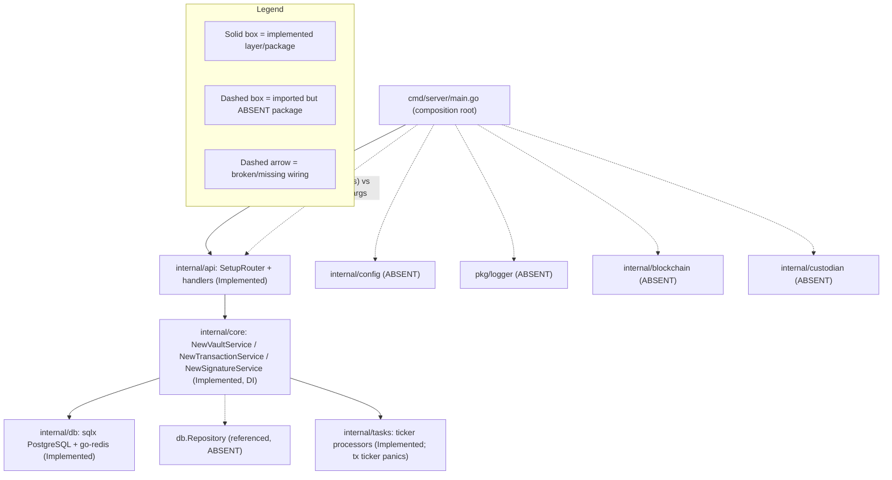

# Backend Architecture

The backend of the Blockchain Integration Service and Dashboard is a **Go/Gin layered modular monolith**: an HTTP router and its resource handlers delegate to core services, those core services are constructed through `NewXService` dependency injection, and the services in turn use a database layer for persistence. `Source: backend/internal/api/routes.go:L9-L54`, `Source: backend/internal/core/vault/service.go:L15-L52`. Three core services — vault, transaction, and signature — encapsulate the domain logic, and each receives its collaborators as constructor arguments rather than reaching for globals. `Source: backend/internal/core/transaction/service.go:L18-L85`, `Source: backend/internal/core/signature/service.go:L15-L75`. The composition root in `main.go` wires these layers together, registers middleware, and launches two background processors before starting the HTTP server. `Source: backend/cmd/server/main.go:L17-L62`. This page documents the backend **as it exists in code today**, with the designed target called out explicitly; it is the layer-by-layer detail that [`overview.md`](overview.md) delegates here for the picture behind its before/after architecture pair.

## Maturity Legend

Every capability named on this page is tagged with the project-wide maturity discipline, consistent with the labeling used across the documentation set and in [`overview.md`](overview.md) and [`data-model.md`](data-model.md):

- **Implemented** — present and functional in the code as-declared today.
- **Provisioned** — scaffolding or configuration exists, but the capability is not yet fully wired to run.
- **Designed** — specified in the design corpus (`documentation/*.md`), not yet present in code.

The whole-backend before/after picture is owned by [`overview.md`](overview.md): **Fig A1 — Current Implemented Scaffold** ([`overview.md#fig-a1--current-implemented-scaffold-backend`](overview.md#fig-a1--current-implemented-scaffold-backend)) shows the backend exactly as wired today, and **Fig A2 — Designed Target Architecture** ([`overview.md#fig-a2--designed-target-architecture`](overview.md#fig-a2--designed-target-architecture)) shows the intended end state. This page references **Fig A1** and **Fig A2** by name rather than duplicating them, and adds one focused diagram — **Fig BE1** — for the layering and dependency-injection structure. The consolidated Implemented / Provisioned / Designed reconciliation matrix, including the full defect catalog, is maintained in [`scaffold-vs-design.md`](scaffold-vs-design.md).

## Fig BE1 — Backend Layering & Dependency Injection

**Fig BE1 — Backend Layering & Dependency Injection** shows the four backend layers and how the composition root wires them. Solid boxes are packages that are **Implemented** and functional today; dashed boxes are packages that are imported but **absent** from the tree, and dashed arrows are broken or missing wiring. The figure deliberately renders these gaps rather than hiding them, so the boundary between what runs and what is merely referenced is legible at a glance; the gaps themselves are enumerated with locators in [Wiring-Gap Callouts](#wiring-gap-callouts-documented-not-fixed).

**Figure BE1 — Backend Layering & Dependency Injection (as-wired today)**



As the `Legend_BE1` subgraph in **Fig BE1** states, the solid path from `Main` through `RouterL`, `CoreL`, and `DBL` is the **Implemented** request-handling core, while the dashed edges out of `Main` and `CoreL` mark the absent packages and broken signatures. Each layer is summarized below.

- **Composition root — `cmd/server/main.go` (Implemented, with broken wiring).** `main()` loads configuration, initializes the logger and database, constructs the blockchain and custodian clients, builds a `gin.New()` engine, registers middleware via `setupMiddleware`, wires the router, and starts the two background processors before calling `router.Run`. `Source: backend/cmd/server/main.go:L17-L62`. `setupMiddleware` registers `gin.Logger()`, `gin.Recovery()`, a TODO CORS placeholder, and `middleware.AuthMiddleware()`. `Source: backend/cmd/server/main.go:L65-L77`.
- **Router layer — `internal/api` (Implemented).** `SetupRouter` builds four route groups — `/auth`, `/vault`, `/transactions`, and `/signatures` — for 18 endpoints total, applying `middleware.AuthMiddleware()` to the three protected groups. `Source: backend/internal/api/routes.go:L9-L54`. The full HTTP contract for these endpoints is documented in [`../api-reference/overview.md`](../api-reference/overview.md).
- **Core-service layer — `internal/core` (Implemented, dependency injection).** Each service exposes a `NewXService` constructor that receives its collaborators explicitly: `NewVaultService(repo *db.Repository, blockchainClient blockchain.BlockchainClient)` provides `CreateVault`, `GetVault`, and `ListVaults`. `Source: backend/internal/core/vault/service.go:L15-L52`. `NewTransactionService(repo, blockchainClient, custodianClient)` provides `CreateTransaction`, `GetTransaction`, and `ProcessTransaction`, and models monetary amounts with `decimal.Decimal`. `Source: backend/internal/core/transaction/service.go:L18-L85`. `NewSignatureService(repo, custodianClient)` provides `RequestSignature`, `GetSignature`, and `CheckSignatureStatus`. `Source: backend/internal/core/signature/service.go:L15-L75`.
- **Database layer — `internal/db` (Implemented struct level; mixed persistence).** `InitDB()`/`CloseDB()` open and close a `sqlx` PostgreSQL connection built from `config.GetConfig()` with `sslmode=disable`. `Source: backend/internal/db/postgres.go:L10-L40`. `InitRedis()`/`CloseRedis()` build and close a `go-redis/v8` client from the same configuration source. `Source: backend/internal/db/redis.go:L9-L34`. Note the **mixed persistence** posture: the `db` package connects with `sqlx`, whereas the entity definitions in `schema.go` are GORM models — the entity/field detail and this gap are documented in [`data-model.md`](data-model.md) (see **Fig M1 — Data Model ERD**, [`data-model.md#fig-m1--data-model-erd`](data-model.md#fig-m1--data-model-erd)).
- **Background-task layer — `internal/tasks` (Implemented; one processor panics).** Two ticker-based pollers run as goroutines. The signature processor polls on a `5 * time.Minute` interval. `Source: backend/internal/tasks/signature_processor.go:L13-L16`. The transaction processor's interval is declared but never initialized, so its ticker panics at startup — documented in [Wiring-Gap Callouts](#wiring-gap-callouts-documented-not-fixed). `Source: backend/internal/tasks/transaction_processor.go:L13-L16`.

## Request Lifecycle

An inbound HTTP request flows through the layers in **Fig BE1** from top to bottom: the client (the React frontend or any API consumer) reaches the Gin router, which applies the global middleware chain and — for protected groups — `middleware.AuthMiddleware()`, then dispatches to the resource handler, which invokes the corresponding core service, which persists through the database layer and (in the designed target) calls out to the blockchain and custodian adapters. `Source: backend/cmd/server/main.go:L65-L77`, `Source: backend/internal/api/routes.go:L9-L54`. For example, the vault group is registered as an auth-protected group whose five routes bind to the `VaultHandler` methods that delegate to `VaultService`. `Source: backend/internal/api/routes.go:L25-L31`, `Source: backend/internal/core/vault/service.go:L15-L52`.

Because a diagram communicates the timed, cross-boundary interaction more clearly than prose, the per-scenario request sequences are documented in [`data-flow.md`](data-flow.md): authentication (**Fig B1**), transaction create plus asynchronous settlement (**Fig B2**), and signature generation plus the designed Kafka publish (**Fig B3**). The public request/response contract for each endpoint is documented in [`../api-reference/overview.md`](../api-reference/overview.md); this page covers only the internal wiring those requests traverse.

## Ports-and-Adapters Target (Designed)

The designed target keeps the layering of **Fig BE1** but formalizes the boundary to external systems as **ports and adapters** — the direction depicted in **Fig A2 — Designed Target Architecture** ([`overview.md#fig-a2--designed-target-architecture`](overview.md#fig-a2--designed-target-architecture)). The core services already point in this direction: the transaction service holds `blockchainClient blockchain.BlockchainClient` and `custodianClient custodian.CustodianClient` interface fields rather than concrete integrations, which is the seam a ports-and-adapters design depends on. `Source: backend/internal/core/transaction/service.go:L12-L16`.

- **Ports (interfaces).** `BlockchainClient` and `CustodianClient` are the ports the core services depend on; the vault and transaction services accept a `BlockchainClient`, and the transaction and signature services accept a `CustodianClient`, through their constructors (**Designed** for the interface contracts; the injecting constructors are **Implemented**). `Source: backend/internal/core/transaction/service.go:L18-L24`, `Source: backend/internal/core/signature/service.go:L15-L20`.
- **Blockchain adapter — `internal/blockchain` (Designed).** The intended adapter implements `BlockchainClient` for the XRP Ledger and the Ethereum network. It is imported by the composition root and the services but its package directory does not exist today. `Source: backend/cmd/server/main.go:L8`, `Source: backend/internal/core/vault/service.go:L6`.
- **Custodian adapter — `internal/custodian` (Designed).** The intended adapter implements `CustodianClient` against the Utxo Custodian. It is likewise imported but absent. `Source: backend/cmd/server/main.go:L9`, `Source: backend/internal/core/transaction/service.go:L8`.
- **Configuration — `internal/config` via Viper (Designed).** The composition root calls `config.LoadConfig()` and the database layer calls `config.GetConfig()`, but the `internal/config` package is absent; the target supplies centralized configuration (Viper). `Source: backend/cmd/server/main.go:L6`, `Source: backend/internal/db/postgres.go:L13`.
- **Logging — `pkg/logger` via Logrus with correlation IDs (Designed).** `main.go` and both task processors call `logger.Init`, `logger.Info`, `logger.Fatal`, and `logger.Error`, but `pkg/logger` is absent; the target supplies structured logging (Logrus) with correlation IDs propagated across service boundaries. `Source: backend/cmd/server/main.go:L10`, `Source: backend/internal/tasks/transaction_processor.go:L10`. The observability posture — what is reused versus added — is documented in [`../operations/observability.md`](../operations/observability.md).

## Wiring-Gap Callouts (documented, not fixed)

The following gaps are **documented honestly and are not fixed** by this deliverable; no `.go` source is modified. Each describes the code as it exists today, with a `Source:` locator and a maturity tag. Collectively they mean the backend **does not compile or run as checked in**. The consolidated Implemented / Provisioned / Designed matrix that catalogs these is maintained in [`scaffold-vs-design.md`](scaffold-vs-design.md).

### Router signature mismatch (Implemented defect; correction Designed)

The composition root calls `api.SetupRouter` with four arguments, but the router defines `SetupRouter()` with none, so the call does not compile. `Source: backend/cmd/server/main.go:L52`, `Source: backend/internal/api/routes.go:L9`.

```go
api.SetupRouter(router, dbConn, blockchainClients, custodianClient) // main.go:L52 — 4 args
func SetupRouter() *gin.Engine                                       // routes.go:L9 — 0 args
```

### Database initialization mismatch (Implemented defect; correction Designed)

`main.go` calls `db.InitDB(cfg.DatabaseURL)` expecting one argument and two return values (a connection plus an error) and then defers `dbConn.Close()`, but `InitDB` is defined with no arguments and a single `error` return, operating on a package-level connection variable. `Source: backend/cmd/server/main.go:L31`, `Source: backend/cmd/server/main.go:L35`, `Source: backend/internal/db/postgres.go:L12`.

```go
dbConn, err := db.InitDB(cfg.DatabaseURL) // main.go:L31 — 1 arg, 2 returns; then dbConn.Close() at L35
func InitDB() error                        // postgres.go:L12 — 0 args, single return
```

### Background processor signature mismatch (Implemented defect; correction Designed)

Both processors are defined to take `(ctx context.Context, redisClient *redis.Client, xService ...)`, but the composition root launches them with `(dbConn, blockchainClients, custodianClient)`. `Source: backend/internal/tasks/transaction_processor.go:L15`, `Source: backend/internal/tasks/signature_processor.go:L15`, `Source: backend/cmd/server/main.go:L55-L56`.

```go
func StartTransactionProcessor(ctx context.Context, redisClient *redis.Client, txService *transaction.TransactionService) error // L15
go tasks.StartTransactionProcessor(dbConn, blockchainClients, custodianClient)                                                  // main.go:L56
```

### Uninitialized ticker panic (Implemented defect; correction Designed)

`transactionCheckInterval` is declared as a package-level `time.Duration` but never assigned, so it holds the zero value and `time.NewTicker(transactionCheckInterval)` evaluates to `time.NewTicker(0)`, which panics at startup. `Source: backend/internal/tasks/transaction_processor.go:L13-L16`. By contrast the signature processor uses a real `5 * time.Minute` constant. `Source: backend/internal/tasks/signature_processor.go:L13`.

```go
var transactionCheckInterval time.Duration         // L13 — zero value (0)
ticker := time.NewTicker(transactionCheckInterval) // L16 — NewTicker(0) panics
```

### Absent imported packages and missing module manifest (Designed)

The composition root imports `internal/config`, `internal/blockchain`, `internal/custodian`, `pkg/logger`, and `internal/api/middleware`, none of whose directories exist in the tree; the services and handlers additionally import `pkg/utils` and `internal/core/auth`, which are also absent, and there is **no `go.mod`**, so the module is not buildable as checked in (**Designed**). `Source: backend/cmd/server/main.go:L6-L12`.

### Absent `db` package symbols (Implemented defect; correction Designed)

The core services and processors reference `db` symbols that the `db` package does not define: the services type their repository field as `*db.Repository` and set transaction status via `db.TransactionStatusPending` and `db.TransactionStatusProcessed`, while the transaction processor calls `db.GetPendingTransactions` and `db.UpdateTransaction` — none of which are declared in `internal/db`. `Source: backend/internal/core/transaction/service.go:L13`, `Source: backend/internal/core/transaction/service.go:L46`, `Source: backend/internal/core/transaction/service.go:L81`, `Source: backend/internal/tasks/transaction_processor.go:L35`, `Source: backend/internal/tasks/transaction_processor.go:L48`. This is the `RepoX["db.Repository (referenced, ABSENT)"]` node in **Fig BE1**; the related persistence gap (sqlx connection versus GORM models, no `Repository`, no migrations) is documented in [`data-model.md`](data-model.md).

## Related Documentation

This page is the layer-and-wiring detail behind the whole-backend before/after pair; the surrounding architecture set carries the rest:

- [`overview.md`](overview.md) — the authoritative home of **Fig A1 — Current Implemented Scaffold** ([`overview.md#fig-a1--current-implemented-scaffold-backend`](overview.md#fig-a1--current-implemented-scaffold-backend)) and **Fig A2 — Designed Target Architecture** ([`overview.md#fig-a2--designed-target-architecture`](overview.md#fig-a2--designed-target-architecture)).
- [`data-flow.md`](data-flow.md) — the authentication, transaction-settlement, and signature request sequences (**Fig B1**, **Fig B2**, **Fig B3**) and the end-to-end data flow (**Fig DF1**).
- [`data-model.md`](data-model.md) — the five persisted entities and their relationships in **Fig M1 — Data Model ERD** ([`data-model.md#fig-m1--data-model-erd`](data-model.md#fig-m1--data-model-erd)).
- [`scaffold-vs-design.md`](scaffold-vs-design.md) — the consolidated Implemented / Provisioned / Designed reconciliation matrix and full defect catalog.
- [`../api-reference/overview.md`](../api-reference/overview.md) — the public HTTP contract for the 18 endpoints the router exposes.
