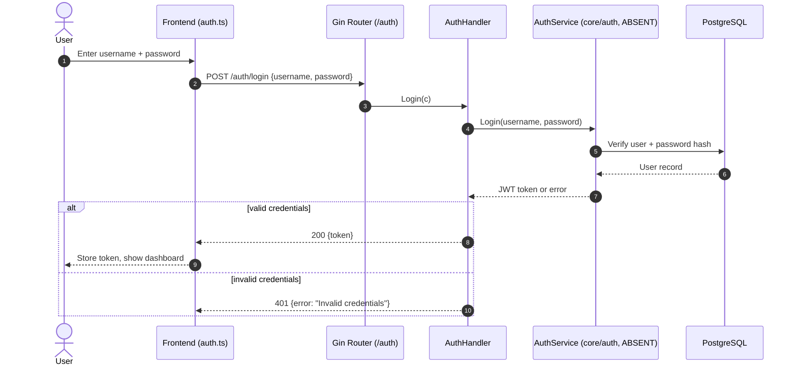
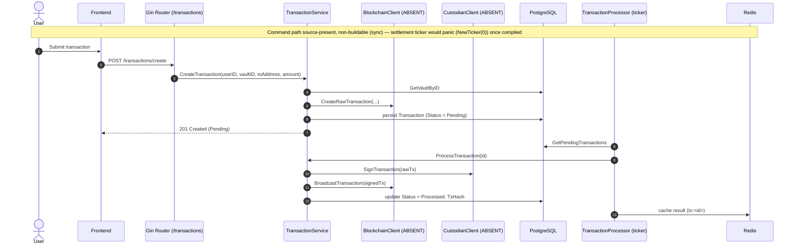
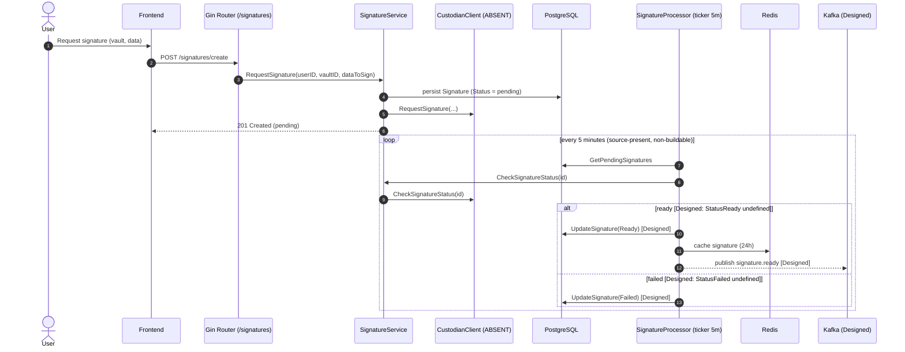
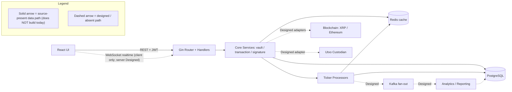

# Data Flow & Sequences

This reference documents how data is **intended** to move through the Blockchain Integration Service and Dashboard, tracing each request from the React frontend through the Gin router and its handlers into the core services, the PostgreSQL system of record, and the Redis cache. Because the backend has no `go.mod` and every package carries a compile-blocking defect, **none of these flows executes today**; every sequence below describes what the source is *written to* do once its blockers are resolved, not observed runtime behavior. The backend is structured as a **command/settlement split**: the synchronous *command* path is coded to accept a request and persist it in a `Pending` state, while an asynchronous *settlement* path — driven by ticker-based background processors — is coded to later advance the record toward its terminal state. `Source: backend/internal/core/transaction/service.go:L29-L85`, `Source: backend/internal/tasks/transaction_processor.go:L13-L61`. Four named figures capture this behavior: **Fig B1 — Authentication Sequence**, **Fig B2 — Transaction Create + Async Settlement**, **Fig B3 — Signature Generation + Kafka Publish (Designed)**, and **Fig DF1 — End-to-End Data Flow**; each is discussed in prose only after it has been introduced by name, in keeping with the documentation set's diagram-first convention.

## Maturity Legend

Every capability and every step named on this page is tagged with the project-wide maturity discipline, consistent with the labeling used across the documentation set and in [`backend.md`](backend.md) and [`data-model.md`](data-model.md):

- **Implemented** — present in code, building, and functional today. Reserved for genuinely working capability; at this checkpoint **nothing qualifies for it**, because the backend has no Go module and every package carries a compile-blocking defect.
- **Implemented-with-defects (source-present, non-buildable)** — the code is present and substantially written, but a compile-blocking defect prevents its module from building, so no runtime behavior can be claimed. Every solid step in the sequences below is source-present but non-buildable, consistent with [`scaffold-vs-design.md`](scaffold-vs-design.md).
- **Provisioned** — scaffolding or configuration exists, but the capability is not yet fully wired to run.
- **Designed** — specified in the design corpus (`documentation/*.md`), not yet present in code.

The consolidated Implemented / Provisioned / Designed matrix that reconciles the design corpus with the on-disk scaffold is maintained in [`scaffold-vs-design.md`](scaffold-vs-design.md).

## Diagram Conventions

The four figures on this page share one notation so the boundary between what is present in source and what is merely referenced stays legible. Because the backend does not build, **none of these paths executes today**; the diagrams describe the flow the source is *written to* perform:

- In the sequence diagrams (**Fig B1**, **Fig B2**, **Fig B3**), a participant tagged **`(ABSENT)`** is a package that the code imports but that does not exist in the tree — for example `internal/core/auth`, `internal/blockchain`, and `internal/custodian`. `Source: backend/internal/api/handlers/auth.go:L5`, `Source: backend/internal/core/transaction/service.go:L7-L8`.
- Steps are labeled **source-present (non-buildable)** or **Designed** inline (and in each figure's legend), so a reader can tell source-present code from intended target at a glance; no step denotes an observed running behavior.
- In the flowchart (**Fig DF1**), a solid arrow is a **source-present (non-buildable)** data path and a dashed arrow is a **Designed** (or absent) path, as stated in that figure's embedded `Legend_DF1` block.

Each figure below carries a descriptive title and a legend, and is referenced by name from the surrounding prose, per the visual-architecture documentation rule (AAP §0.10.1).

## Fig B1 — Authentication Sequence

**Fig B1 — Authentication Sequence** traces a login attempt from the browser to the database and back: the user submits credentials, the frontend `auth.ts` client issues `POST /auth/login`, the Gin router dispatches to `AuthHandler.Login`, and the handler delegates to the `AuthService`. The `alt` fragment shows the two terminal outcomes — a `200 {token}` on valid credentials, or a `401 {error}` otherwise. This login handler is **source-present but non-buildable**; the service it calls is **Designed/Absent** (see the legend), and because the handler imports the absent `internal/core/auth` and the `api` package does not compile, this flow does not execute today. `Source: backend/internal/api/handlers/auth.go:L21-L39`, `Source: backend/internal/api/routes.go:L19`.

**Figure B1 — Authentication Sequence (login flow, as-wired today)**

**Legend — Fig B1**

Mermaid `sequenceDiagram` does not support an in-diagram legend, so the participant notation is explained here:

- **U** — the end user; **F** — the frontend auth client (`frontend/src/services/auth.ts`); **R** — the Gin router group `/auth`; **H** — `AuthHandler` (**source-present, non-buildable**); **DB** — the PostgreSQL system of record.
- **S — `AuthService (core/auth, ABSENT)`** — the handler imports `backend/internal/core/auth` and holds an `*auth.AuthService`, but that package is **not present** in the tree. The service is therefore **Designed/Absent**, and the handler that calls it is **source-present but non-buildable** (its package does not compile). `Source: backend/internal/api/handlers/auth.go:L5,L21-L39`.
- The `alt` fragment names the two response branches: `200 {token}` (success) and `401 {error: "Invalid credentials"}` (failure). `Source: backend/internal/api/handlers/auth.go:L32-L38`.
- Design reference for this flow: `Source: documentation/Technical Specifications.md:§SEQUENCE DIAGRAMS (User Authentication)`.

## Fig B2 — Transaction Create + Async Settlement

**Fig B2 — Transaction Create + Async Settlement** shows the backend's command/settlement split for transactions. On the synchronous **command** path (**source-present, non-buildable**), `POST /transactions/create` is coded to reach `TransactionService.CreateTransaction(userID, vaultID, toAddress, amount)`, which reads the source vault via `GetVaultByID`, builds an unsigned transaction through the blockchain client, and persists a `Transaction` with `Status = Pending`. `Source: backend/internal/core/transaction/service.go:L29-L56`, `Source: backend/internal/api/routes.go:L37`. On the asynchronous **settlement** path, the `TransactionProcessor` ticker is coded to poll `GetPendingTransactions`, call `ProcessTransaction(id)`, sign via the custodian, broadcast via the blockchain client, and advance the record to `Status = Processed` with its `TxHash` before caching the result in Redis under `tx:<id>`. Neither path runs today: the `internal/core/transaction`, `internal/tasks`, and `internal/db` packages all carry compile-blocking defects (absent `internal/blockchain`/`internal/custodian`/`pkg/logger`, undefined `db.GetPendingTransactions`/`db.UpdateTransaction`, and a mismatched `ProcessTransaction` signature). `Source: backend/internal/tasks/transaction_processor.go:L34-L58`, `Source: backend/internal/core/transaction/service.go:L65-L85`.

**Figure B2 — Transaction Create + Async Settlement (command path source-present, non-buildable; settlement ticker panic latent)**

**Legend — Fig B2**

- **TS — `TransactionService`** (**source-present, non-buildable**) declares both `CreateTransaction` (command) and `ProcessTransaction` (settlement). **TP — `TransactionProcessor (ticker)`** is the background poller. **RD — Redis** holds the cached settlement result. **BC** and **CU** are tagged **`(ABSENT)`** because `internal/blockchain` and `internal/custodian` are imported but not present in the tree. `Source: backend/internal/core/transaction/service.go:L7-L8`.
- **Status transition (backend vocabulary): `Pending` → `Processed`.** The service sets `db.TransactionStatusPending` on create and `db.TransactionStatusProcessed` on settlement; this backend vocabulary differs from the frontend's `Pending | Completed | Failed` schema, as noted in [`data-model.md`](data-model.md) and [`../api-reference/transactions.md`](../api-reference/transactions.md). `Source: backend/internal/core/transaction/service.go:L46,L81`.
- **The settlement path is source-present but would panic at startup once it compiled.** `transactionCheckInterval` is declared as a package-level `time.Duration` and never initialized, so `time.NewTicker(transactionCheckInterval)` is effectively `time.NewTicker(0)`, which panics. This is a *latent* runtime crash: the worker package does not compile (absent `pkg/logger`, undefined `db` symbols, mismatched call sites), so neither the command path nor the settlement ticker actually runs today — as the diagram's `Note` records, the panic is only reachable once the compile-blocking defects are resolved. This defect is documented, not fixed; the failure mode and its remediation are catalogued in [`backend.md`](backend.md#uninitialized-ticker-panic-source-present-defect-correction-designed) and the operations [`runbook.md`](../operations/runbook.md). `Source: backend/internal/tasks/transaction_processor.go:L13-L16`.

## Fig B3 — Signature Generation + Kafka Publish (Designed)

**Fig B3 — Signature Generation + Kafka Publish (Designed)** shows the signature lifecycle and the one designed extension to it. On the **source-present (non-buildable)** command path, `POST /signatures/create` is coded to reach `SignatureService.RequestSignature(userID, vaultID, dataToSign)`, which persists a `Signature` with the literal `Status = "pending"` and forwards the request to the custodian. `Source: backend/internal/core/signature/service.go:L24-L47`, `Source: backend/internal/api/routes.go:L47`. A 5-minute ticker, `StartSignatureProcessor` — whose interval constant is correctly initialized, unlike the transaction ticker — is coded to poll `GetPendingSignatures` and call `CheckSignatureStatus`, then advance the record to a terminal state. Those terminal states are written against `signature.StatusReady`/`signature.StatusFailed`, which are **undefined in code**, so the `Ready`/`Failed` outcomes are **Designed**, and the worker package does not compile in any case (it imports the absent `pkg/logger` and references the undefined `db.GetPendingSignatures`/`db.UpdateSignature`). `Source: backend/internal/tasks/signature_processor.go:L13,L40,L46-L55`. The Kafka publish of a `signature.ready` event is a further **Designed** step — it appears in the SRS process flowchart but no Kafka client exists in code. `Source: documentation/Software Requirements Specifications (SRS).md:§PROCESS FLOWCHART (Signature Generation Process)`.

**Figure B3 — Signature Generation + Kafka Publish (polling loop source-present, non-buildable; Ready/Failed and Kafka publish Designed)**

**Legend — Fig B3**

- **SS — `SignatureService`** (**source-present, non-buildable**) declares `RequestSignature` and `CheckSignatureStatus`. **SP — `SignatureProcessor (ticker 5m)`** is the background poller, whose interval is a real `const signatureCheckInterval = 5 * time.Minute` — so, unlike the transaction ticker of **Fig B2**, it carries no *uninitialized-ticker* defect; its package still does not compile, however (absent `pkg/logger`, undefined `db`/`signature` symbols). **CU** is tagged **`(ABSENT)`** because `internal/custodian` is imported but not present. **K — `Kafka (Designed)`** has no client in code. `Source: backend/internal/tasks/signature_processor.go:L13,L40`, `Source: backend/internal/core/signature/service.go:L6`.
- **Status transition (backend vocabulary): `pending` → `Ready` / `Failed`.** `RequestSignature` persists the literal `Status = "pending"`; the processor's `loop` is coded to advance the record to `Ready` (with a 24-hour Redis cache under `signature:<id>`) or to `Failed`. Because `signature.StatusReady`/`signature.StatusFailed` are undefined in code, the `Ready`/`Failed` terminal states are **Designed**. The `loop` and `alt` fragments in the figure mirror the polling interval and the ready/failed branches. `Source: backend/internal/core/signature/service.go:L30`, `Source: backend/internal/tasks/signature_processor.go:L40,L46-L58`.
- **`publish signature.ready [Designed]` is one of several Designed elements.** The `RequestSignature` call and the 5-minute polling loop are **source-present but non-buildable**; the `Ready`/`Failed` terminal states and the Kafka publish are **Designed** — the latter drawn from the SRS Signature Generation Process, with no Kafka producer present in the code. `Source: backend/internal/tasks/signature_processor.go:L46-L54`, `Source: documentation/Software Requirements Specifications (SRS).md:§PROCESS FLOWCHART (Signature Generation Process)`.

## Fig DF1 — End-to-End Data Flow

**Fig DF1 — End-to-End Data Flow** places the per-scenario sequences above into the whole-system context, from the React UI to the persistence tier and outward to the designed integrations. It is a flowchart rather than a sequence because it depicts topology — which components exchange data — rather than an ordered exchange over time.

**Figure DF1 — End-to-End Data Flow (source-present, non-buildable solid paths; Designed dashed paths)**

As the embedded `Legend_DF1` block in **Fig DF1** states, solid arrows are **source-present (non-buildable)** data paths and dashed arrows are **Designed** (or absent) paths. The source-present paths are the ones drawn in **Fig B1**, **Fig B2**, and **Fig B3** — none of which executes today, since the backend does not build: the React UI is coded to reach the Gin router over REST with a JWT bearer token; the router is coded to delegate to the core services; and the core services and the ticker processors are coded to read and write PostgreSQL and the Redis cache. `Source: backend/internal/api/routes.go:L9-L54`, `Source: backend/internal/tasks/transaction_processor.go:L34-L58`. The WebSocket realtime channel is drawn dashed because it is only half-built: a frontend `WebSocketService` client class is authored, but **no backend WebSocket route exists**, so the end-to-end channel is **Designed** on the server side and cannot carry data today. This matches the WebSocket realtime channel row of the reconciliation matrix — **Implemented-with-defects** (client) / **Designed** (server) — and the Designed/Absent band of **Fig SD1** in [`scaffold-vs-design.md`](scaffold-vs-design.md). `Source: frontend/src/services/websocket.ts:L1-L11`, `Source: backend/internal/api/routes.go:L9-L54`. The **Designed** paths are the Kafka fan-out from the processors, the Analytics/Reporting consumer that reads from it, and the blockchain (XRP / Ethereum) and Utxo custodian adapters that the core services depend on through the `BlockchainClient` and `CustodianClient` ports — none of which are present in the tree today. `Source: documentation/Technical Specifications.md:§DATA-FLOW DIAGRAM`, `Source: backend/internal/core/transaction/service.go:L7-L8`.

## Related Documentation

- [`backend.md`](backend.md) — the layered modular monolith, dependency injection, and the wiring-gap catalogue behind these sequences (including the ticker panic referenced by **Fig B2**).
- [`overview.md`](overview.md) — the mandatory before/after architecture pair, **Fig A1 — Current Implemented Scaffold** ([`overview.md#fig-a1--current-implemented-scaffold-backend`](overview.md#fig-a1--current-implemented-scaffold-backend)) and **Fig A2 — Designed Target Architecture** ([`overview.md#fig-a2--designed-target-architecture`](overview.md#fig-a2--designed-target-architecture)).
- [`data-model.md`](data-model.md) — the entity definitions used by these flows, shown in **Fig M1 — Data Model ERD** ([`data-model.md#fig-m1--data-model-erd`](data-model.md#fig-m1--data-model-erd)).
- [`scaffold-vs-design.md`](scaffold-vs-design.md) — the consolidated Implemented / Provisioned / Designed reconciliation matrix.
- [`../api-reference/overview.md`](../api-reference/overview.md) — the public HTTP contract for the endpoints that originate these flows.
- [`../api-reference/transactions.md`](../api-reference/transactions.md) — the transaction endpoints and the `Pending` / `Processed` versus `Pending` / `Completed` / `Failed` status-vocabulary note referenced by **Fig B2**.
- [`../operations/runbook.md`](../operations/runbook.md) — failure modes and alerts, including the settlement-ticker panic surfaced in **Fig B2**.
