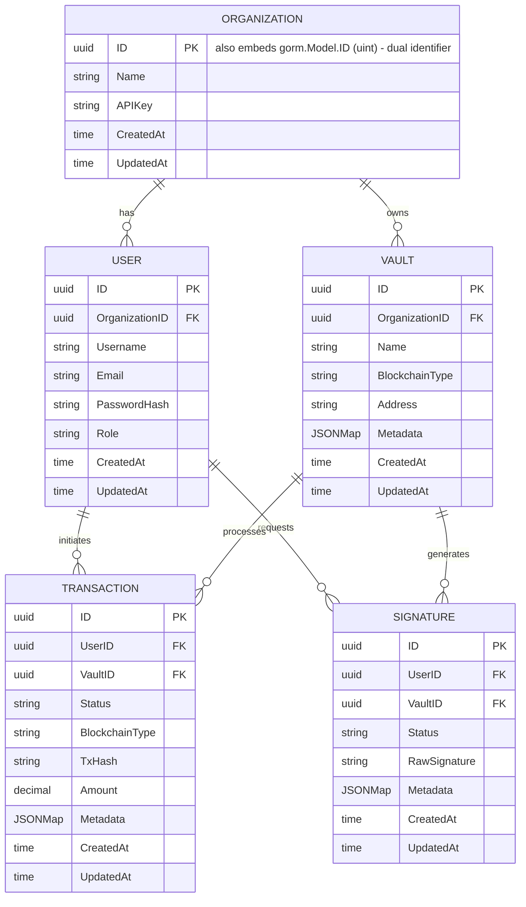

# Data Model Reference

The Blockchain Integration Service and Dashboard **defines** five entities — **Organization**, **User**, **Vault**, **Transaction**, and **Signature** — that model the custodial domain of organizations onboarding users who operate vaults to initiate transactions and request signatures. These are **logical, source-present (non-buildable) models only**: no entity is persisted today. PostgreSQL is the *designed* system of record for all five entities, but nothing binds these structs to it — `schema.go` does not compile (see below), and the `db` package connects with `sqlx`/`database/sql` rather than GORM and defines **no** GORM handle, `AutoMigrate`, `Repository`, or migration, so the GORM structs are never wired to a live schema. `Source: backend/internal/db/schema.go:L11-L68`, `Source: backend/internal/db/postgres.go:L4-L18` (uses `database/sql` + `sqlx`, not GORM; no migration/repository).

The entity **structs are source-present (non-buildable)** in the sense that they are declared as Go/GORM models in code — a *declared-in-source* status, not a claim that the model compiles or runs today. In fact, `schema.go` does not currently compile: it declares each `Metadata` field as `gorm.JSONMap`, a type that is **undefined in `gorm.io/gorm`** (Defect 4), so the entity structs cannot be built or exercised as-declared. `Source: backend/internal/db/schema.go:L39,L53,L65`. Separately, the **physical persistence of these entities is Designed**: even setting the compile defect aside, the `db` package connects with `sqlx`/`database/sql` (not GORM) and defines no GORM handle, `AutoMigrate`, `Repository`, or migration, so the GORM structs are never bound to a live schema and no table is created for them. `Source: backend/internal/db/postgres.go:L4-L18`. (The raw `sqlx` connection code itself is separate source-present, non-buildable scaffolding — it imports the absent `internal/config` package — and, being GORM-unrelated, does not persist any of the five entities regardless.) `Source: backend/internal/db/postgres.go:L7,L13`. The full defect catalog and cross-page reconciliation live in [`scaffold-vs-design.md`](scaffold-vs-design.md).

## Maturity Legend

Every capability and field-set in this reference is labeled with the project-wide maturity discipline:

- **Implemented** — present in code, building, and functional today. This is the operational-truth definition adopted across the entire documentation set; it is **reserved**, and at this checkpoint **nothing in this repository qualifies for it** (the backend has no `go.mod` and `schema.go` does not compile). `Source: backend/internal/db/schema.go:L39,L53,L65`.
- **Implemented-with-defects (source-present, non-buildable)** — the code exists as declared in source but does **not** compile, so no runtime behavior may be claimed. Every entity struct in this reference carries this status, never the unqualified **Implemented**. This matches the single operational-truth vocabulary defined in [`scaffold-vs-design.md`](scaffold-vs-design.md).
- **Provisioned** — configuration or scaffolding exists and would validly apply, but is not yet wired to run. In this data-model reference **nothing carries this label**: the raw `sqlx` connection scaffold that might appear Provisioned is itself source-present (non-buildable) — it imports the absent `internal/config` package — and, being GORM-unrelated, persists none of these entities, so the persistence of the five entities is labeled **Designed**, not Provisioned. `Source: backend/internal/db/postgres.go:L7,L13`.
- **Designed** — specified in the design corpus (`documentation/*.md`), not yet present in code.

The consolidated Implemented / Provisioned / Designed matrix that reconciles the design corpus with the on-disk scaffold is maintained in [`scaffold-vs-design.md`](scaffold-vs-design.md).

The entity-relationship model is shown in **Fig M1 — Data Model ERD** below, reproduced exactly as the GORM structs are declared in code, including the dual-identifier annotation discussed in the Gap Notes. `Source: backend/internal/db/schema.go:L11-L68`.

## Fig M1 — Data Model ERD

**Fig M1 — Data Model ERD (as declared in `backend/internal/db/schema.go`)**



**Legend — Fig M1**

Mermaid `erDiagram` does not support an in-diagram legend, so the notation is explained here:

- **`||--o{`** — a one-to-mandatory to zero-or-many relationship: exactly one parent record relates to zero or more child records (i.e. one parent "has many" children). The label in quotes (`"has"`, `"owns"`, `"initiates"`, `"requests"`, `"processes"`, `"generates"`) names the relationship.
- **`PK`** — primary key column.
- **`FK`** — a logical foreign-key *association*: a UUID field on the child entity (for example `OrganizationID`, `UserID`, `VaultID`) that names its parent by convention. This is a modeling notation only — the code declares these as plain `uuid.UUID` fields with **no** database foreign-key constraint, and no migration exists to create one (the `db` package opens a `sqlx` connection with no `AutoMigrate`). Referential integrity is therefore **Designed**, not enforced today. `Source: backend/internal/db/schema.go:L20-L68`, `Source: backend/internal/db/postgres.go:L10-L18`.
- **Type tokens map to Go types** as declared in code: `uuid` -> `uuid.UUID`, `string` -> `string`, `decimal` -> `decimal.Decimal`, `time` -> `time.Time`, and `JSONMap` -> `gorm.JSONMap` (*intended* as a JSONB column — **Designed**, not functional: `gorm.JSONMap` is undefined in `gorm.io/gorm`, so it does not compile and no JSONB column is created; see [Notable Field Types](#notable-field-types)). `Source: backend/internal/db/schema.go:L11-L68`, `Source: backend/internal/db/schema.go:L39,L53,L65`.
- The diagram reflects the code **as-declared**, including the `"also embeds gorm.Model.ID (uint) - dual identifier"` annotation on `ORGANIZATION.ID`. That annotation applies to every entity and is explained in [Gap Notes](#gap-notes). `Source: backend/internal/db/schema.go:L11-L18`.

## Entity Field Reference

Each of the five entities is a GORM struct that embeds `gorm.Model` and then redeclares a UUID `ID` together with `CreatedAt`/`UpdatedAt`. The **(Source-present, non-buildable)** tag on each entity heading below denotes *declared-in-source* status — the struct is written in code — and not that it compiles or runs today; as noted above and in the [Gap Notes](#gap-notes), `schema.go` does not currently compile because `Metadata gorm.JSONMap` is an undefined type in `gorm.io/gorm` (Defect 4). The tables below reproduce every field exactly as declared — Go field name, Go type, key/constraint, and notes — with no invented fields. `Source: backend/internal/db/schema.go:L39,L53,L65`.

The **Key/Constraint** column records the *logical* role of each field, not an enforced database constraint. In particular, an `FK -> <Entity>` entry denotes a **logical association only** — a plain `uuid.UUID` field that names a parent by convention — exactly as defined in the [Fig M1 legend](#fig-m1--data-model-erd); the code declares **no** database foreign-key constraint and no migration creates one (see [Relationships](#relationships)). Likewise, `PK` records the intended primary key as annotated in the struct tag, which does not take effect until the schema compiles and a migration runs. No field-level constraint in these tables is enforced by a live database today.

### Organization (Source-present, non-buildable)

`Source: backend/internal/db/schema.go:L11-L18`.

| Field | Go Type | Key/Constraint | Notes |
|-------|---------|----------------|-------|
| `gorm.Model` | embedded struct | — | Embedded base; contributes `ID uint`, `CreatedAt`, `UpdatedAt`, `DeletedAt`. Collides with the redeclared fields below (see [Gap Notes](#gap-notes)). |
| `ID` | `uuid.UUID` | PK (`gorm:"type:uuid;primary_key"`) | UUID primary key, redeclared alongside `gorm.Model.ID uint`. |
| `Name` | `string` | — | Organization display name. |
| `APIKey` | `string` | — | **Secret (sensitive).** Per-organization API key for programmatic access. Declared today as a **plaintext `string` with no `json:"-"` tag** (Source: backend/internal/db/schema.go:L15), so it would serialize into normal responses/logs. The intended secret-handling contract is **Designed**: persist only a one-way **hash/verifier** (never the raw key), reveal the raw key **exactly once** at creation, **never** return it in read responses/DTOs, and **redact** it from logs. See [Sensitive & Secret Fields](#sensitive--secret-fields) and [`../security/security-model.md`](../security/security-model.md). |
| `CreatedAt` | `time.Time` | — | Redeclares `gorm.Model.CreatedAt`. |
| `UpdatedAt` | `time.Time` | — | Redeclares `gorm.Model.UpdatedAt`. |

### User (Source-present, non-buildable)

`Source: backend/internal/db/schema.go:L20-L30`.

| Field | Go Type | Key/Constraint | Notes |
|-------|---------|----------------|-------|
| `gorm.Model` | embedded struct | — | Embedded base (see [Gap Notes](#gap-notes)). |
| `ID` | `uuid.UUID` | PK | UUID primary key. |
| `OrganizationID` | `uuid.UUID` | FK -> Organization | Multi-tenancy scope; associates the user with its organization. |
| `Username` | `string` | — | Login username. |
| `Email` | `string` | — | Contact email. |
| `PasswordHash` | `string` | — | **Sensitive.** Field name and design **intend** it to hold only a hashed credential so that plaintext passwords are never persisted. This is a **Designed** security contract, **not an evidenced runtime guarantee**: no auth/persistence path compiles or runs today (the `internal/core/auth` service and hashing code are absent), so no code has been observed to hash a password or reject plaintext. Treat "plaintext never persisted" as the intended contract to implement, and exclude this field from normal DTOs and logs. `Source: backend/internal/db/schema.go:L26`. |
| `Role` | `string` | — | Role-based access-control role for the user. |
| `CreatedAt` | `time.Time` | — | Redeclares `gorm.Model.CreatedAt`. |
| `UpdatedAt` | `time.Time` | — | Redeclares `gorm.Model.UpdatedAt`. |

### Vault (Source-present, non-buildable)

`Source: backend/internal/db/schema.go:L32-L42`.

| Field | Go Type | Key/Constraint | Notes |
|-------|---------|----------------|-------|
| `gorm.Model` | embedded struct | — | Embedded base (see [Gap Notes](#gap-notes)). |
| `ID` | `uuid.UUID` | PK | UUID primary key. |
| `OrganizationID` | `uuid.UUID` | FK -> Organization | Multi-tenancy scope; the owning organization. |
| `Name` | `string` | — | Vault display name. |
| `BlockchainType` | `string` | — | Target chain for the vault (e.g. XRP Ledger, Ethereum Network). |
| `Address` | `string` | — | On-chain address held by the custodial vault. |
| `Metadata` | `gorm.JSONMap` | JSONB *(intended; Designed)* | Free-form JSON metadata associated with the vault. The JSONB column is **Designed**, not functional: `gorm.JSONMap` is undefined, so it does not compile and no column is created (see [Notable Field Types](#notable-field-types)). |
| `CreatedAt` | `time.Time` | — | Redeclares `gorm.Model.CreatedAt`. |
| `UpdatedAt` | `time.Time` | — | Redeclares `gorm.Model.UpdatedAt`. |

### Transaction (Source-present, non-buildable)

`Source: backend/internal/db/schema.go:L44-L56`.

| Field | Go Type | Key/Constraint | Notes |
|-------|---------|----------------|-------|
| `gorm.Model` | embedded struct | — | Embedded base (see [Gap Notes](#gap-notes)). |
| `ID` | `uuid.UUID` | PK | UUID primary key. |
| `UserID` | `uuid.UUID` | FK -> User | The user who initiated the transaction. |
| `VaultID` | `uuid.UUID` | FK -> Vault | The source vault the transaction draws from. |
| `Status` | `string` | — | Lifecycle status. Backend vocabulary is `Pending` / `Processed` (see [Gap Notes](#gap-notes)). |
| `BlockchainType` | `string` | — | Target chain for the transaction. |
| `TxHash` | `string` | — | On-chain transaction hash; populated after broadcast. |
| `Amount` | `decimal.Decimal` | — | Arbitrary-precision monetary amount (see [Notable Field Types](#notable-field-types)). |
| `Metadata` | `gorm.JSONMap` | JSONB *(intended; Designed)* | Free-form JSON metadata. The JSONB column is **Designed**, not functional (undefined `gorm.JSONMap`; see [Notable Field Types](#notable-field-types)). |
| `CreatedAt` | `time.Time` | — | Redeclares `gorm.Model.CreatedAt`. |
| `UpdatedAt` | `time.Time` | — | Redeclares `gorm.Model.UpdatedAt`. |

### Signature (Source-present, non-buildable)

`Source: backend/internal/db/schema.go:L58-L68`.

| Field | Go Type | Key/Constraint | Notes |
|-------|---------|----------------|-------|
| `gorm.Model` | embedded struct | — | Embedded base (see [Gap Notes](#gap-notes)). |
| `ID` | `uuid.UUID` | PK | UUID primary key. |
| `UserID` | `uuid.UUID` | FK -> User | The user who requested the signature. |
| `VaultID` | `uuid.UUID` | FK -> Vault | The vault whose key produces the signature. |
| `Status` | `string` | — | Signature lifecycle status. |
| `RawSignature` | `string` | — | **Sensitive cryptographic material.** Raw custodian signature bytes for the signing request (see [Notable Field Types](#notable-field-types) and [Sensitive & Secret Fields](#sensitive--secret-fields)). Handling contract is **Designed**: classify as sensitive, minimize retention (the settlement path caches the full signature object under `signature:<id>` in **unencrypted** Redis for 24h — a retention concern), encrypt at rest and in transit, and never log. |
| `Metadata` | `gorm.JSONMap` | JSONB *(intended; Designed)* | Free-form JSON metadata. The JSONB column is **Designed**, not functional (undefined `gorm.JSONMap`; see [Notable Field Types](#notable-field-types)). |
| `CreatedAt` | `time.Time` | — | Redeclares `gorm.Model.CreatedAt`. |
| `UpdatedAt` | `time.Time` | — | Redeclares `gorm.Model.UpdatedAt`. |

### Notable Field Types

- **`Transaction.Amount` is `decimal.Decimal`.** Monetary amounts use arbitrary-precision decimals rather than floating-point, which avoids the rounding errors inherent to `float` types when representing currency. `Source: backend/internal/db/schema.go:L52`.
- **`Signature.RawSignature` is a `string` holding sensitive cryptographic material.** It is intended to hold the raw signature bytes returned by the custodian for the signing request. Because raw signatures are sensitive, this field is subject to the sensitive-material contract in [Sensitive & Secret Fields](#sensitive--secret-fields) below. `Source: backend/internal/db/schema.go:L64`.
- **`Metadata` is declared as `gorm.JSONMap` (intended as a JSONB column) — but this type is undefined in `gorm.io/gorm`.** Vault, Transaction, and Signature each declare a `Metadata` field intended to persist free-form key/value attributes as JSONB without schema changes; however, `gorm.JSONMap` does not exist in `gorm.io/gorm`, so `schema.go` does not compile as-declared (Defect 4 in [`scaffold-vs-design.md`](scaffold-vs-design.md)). The JSONB behavior is therefore **Designed**, not functional today. `Source: backend/internal/db/schema.go:L39,L53,L65`.

### Sensitive & Secret Fields

Two fields hold material that must be protected. Both handling contracts below are **Designed** — the code today declares plain `string` fields with no protection, classification, or `json:"-"` tag, and no auth/custodian/persistence path compiles to enforce them. They are documented here (not fixed) so the intended contract is unambiguous, and are cross-referenced from [`../security/security-model.md`](../security/security-model.md), [`../api-reference/openapi.yaml`](../api-reference/openapi.yaml), and [`../api-reference/signatures.md`](../api-reference/signatures.md).

- **`Organization.APIKey` — a secret.** Declared as a plaintext `string` with no `json:"-"` tag, so it would serialize into any response or log that returns an Organization. `Source: backend/internal/db/schema.go:L15`. Intended contract (**Designed**): store only a one-way **hash/verifier**, never the raw key; reveal the raw key **exactly once** at creation time; **never** return it in read responses or reusable DTOs; and **redact** it from all logs.
- **`Signature.RawSignature` — sensitive cryptographic material.** Declared as a plaintext `string`. `Source: backend/internal/db/schema.go:L64`. Intended contract (**Designed**): classify explicitly as sensitive; **minimize retention** — the settlement processor is coded to cache the full signature object (including `RawSignature`) under `signature:<id>` in **unencrypted** Redis for 24 hours, which is a retention/exposure concern to reduce and protect `Source: backend/internal/tasks/signature_processor.go:L46-L58`; **encrypt** it at rest and in transit; and **never** log it. This ties to the raw-signature guidance in [`../guides/signature-management.md`](../guides/signature-management.md).

## Relationships

The six relationships depicted in **Fig M1 — Data Model ERD** are all one-to-many, inferred from the UUID association fields (modeled as foreign keys) declared on the child entities. These associations are logical only: no database foreign-key constraint enforces them, because `schema.go` does not compile and the `db` package defines no migrations. `Source: backend/internal/db/schema.go:L20-L68`, `Source: backend/internal/db/postgres.go:L10-L18`.

- **Organization 1..\* User** — an organization *has* many users; each user carries an `OrganizationID`. `Source: backend/internal/db/schema.go:L23`.
- **Organization 1..\* Vault** — an organization *owns* many vaults; each vault carries an `OrganizationID`. `Source: backend/internal/db/schema.go:L35`.
- **User 1..\* Transaction** — a user *initiates* many transactions; each transaction carries a `UserID`. `Source: backend/internal/db/schema.go:L47`.
- **User 1..\* Signature** — a user *requests* many signatures; each signature carries a `UserID`. `Source: backend/internal/db/schema.go:L61`.
- **Vault 1..\* Transaction** — a vault *processes* many transactions; each transaction carries a `VaultID`. `Source: backend/internal/db/schema.go:L48`.
- **Vault 1..\* Signature** — a vault *generates* many signatures; each signature carries a `VaultID`. `Source: backend/internal/db/schema.go:L62`.

**Multi-tenancy.** The data model *represents* tenancy through UUID association fields — Users and Vaults carry an `OrganizationID`, while Transactions and Signatures carry both a `UserID` and a `VaultID`, logically tying every operational record back to the acting user and the vault it touches. `Source: backend/internal/db/schema.go:L20-L68`. However, nothing in the current code **enforces** that tenant isolation: (1) there are no database foreign-key constraints and no migrations, and `schema.go` does not compile, so the fields exist only as plain `uuid.UUID` columns with no referential integrity `Source: backend/internal/db/schema.go:L39,L53,L65`, `Source: backend/internal/db/postgres.go:L10-L18`; (2) the `db` package defines no `Repository` layer that would scope queries by `OrganizationID`, so no data-access path filters records by tenant `Source: backend/internal/db/postgres.go:L10-L18`; and (3) there is no authorization boundary in the request path that checks a caller's organization against the record being accessed (the `internal/api/middleware` package that would carry such a check is absent — see [`scaffold-vs-design.md`](scaffold-vs-design.md)). Tenant isolation is therefore **Designed** — the fields to support it are declared in source, but the constraints, repository scoping, and authorization checks that would make it an enforced guarantee do not exist today.

## Gap Notes

The following model-level gaps are **documented honestly and are not fixed** by this deliverable; they describe the current state of the code as-declared. Each is expanded in [`scaffold-vs-design.md`](scaffold-vs-design.md).

### Undefined `gorm.JSONMap` type — schema does not compile (source-present defect)

Every entity that carries a `Metadata` column declares it as `gorm.JSONMap`, but `gorm.JSONMap` is an **undefined type in `gorm.io/gorm`**. Because the type does not exist in the imported package, `schema.go` does not compile, and consequently none of the five entity structs can be built or exercised as-declared today. This is the compile-blocking defect catalogued as **Defect 4** in [`scaffold-vs-design.md`](scaffold-vs-design.md); the dual-identifier conflict below likewise cannot be exercised until it is resolved. `Source: backend/internal/db/schema.go:L39,L53,L65`.

### Dual-identifier inconsistency (source-present defect)

Every entity embeds `gorm.Model` — which itself provides `ID uint`, `CreatedAt`, `UpdatedAt`, and `DeletedAt` — **and** redeclares `ID uuid.UUID`, `CreatedAt time.Time`, and `UpdatedAt time.Time`. This creates conflicting primary-key semantics (`uint` versus `uuid`) and duplicate timestamp fields that GORM cannot map cleanly. `Source: backend/internal/db/schema.go:L11-L18` (Organization is representative; all five entities share the pattern).

```go
gorm.Model                                  // embeds ID uint, CreatedAt, UpdatedAt, DeletedAt
ID uuid.UUID `gorm:"type:uuid;primary_key"` // redeclares ID as uuid.UUID (conflicts)
```

### Fields the services write but no entity declares (source-present defect)

Three fields are written — and in one case read back — by the core services, yet are declared on **no** entity in `schema.go`. Every composite literal that sets them, and every read of them, is an unknown-field reference that fails to compile, so these are additional compile-blocking faults on top of the undefined `gorm.JSONMap` above.

| Field | Written / read by | Declared on | Consequence |
|-------|-------------------|-------------|-------------|
| `ToAddress` | the `db.Transaction{…}` literal in `TransactionService.CreateTransaction`. `Source: backend/internal/core/transaction/service.go:L44`. | **Nowhere.** `Transaction` declares only `ID`, `UserID`, `VaultID`, `Status`, `BlockchainType`, `TxHash`, `Amount`, `Metadata`, `CreatedAt`, `UpdatedAt`. `Source: backend/internal/db/schema.go:L44-L56`. | The transaction's destination address has no column, so a created transaction could not record where it was headed. |
| `RawTx` | set in that same literal, then read back by `ProcessTransaction` and handed to the custodian for signing. `Source: backend/internal/core/transaction/service.go:L47,L71`. | **Nowhere** — same entity, same field list. | The unsigned payload that the asynchronous settlement path must sign is never persisted, so settlement has nothing to resume from. |
| `DataToSign` | the `db.Signature{…}` literal in `SignatureService.RequestSignature`. `Source: backend/internal/core/signature/service.go:L29`. | **Nowhere.** `Signature` declares only `ID`, `UserID`, `VaultID`, `Status`, `RawSignature`, `Metadata`, `CreatedAt`, `UpdatedAt`. `Source: backend/internal/db/schema.go:L58-L68`. | The payload submitted for signing is never persisted, so a signature record cannot be audited against what was actually signed. |

Note the asymmetry the gap creates: `Signature` persists the signing **output** (`RawSignature`) but not its **input** (`DataToSign`), and `Transaction` persists the settled `TxHash` but neither the destination (`ToAddress`) nor the unsigned payload (`RawTx`) that produced it. The three fields consequently appear in the **API** contract — `toAddress` is a documented required field on `POST /transactions/create` (see [`../api-reference/transactions.md`](../api-reference/transactions.md#post-transactionscreate)) — while existing nowhere in the **data** model, and the asynchronous settlement and signature-polling loops both depend on state that no column holds. Declaring the three fields is therefore a prerequisite for the command/settlement split to work end to end. Catalogued as part of **Defect 7** in [`scaffold-vs-design.md`](scaffold-vs-design.md#defect-catalog).

### Status vocabulary mismatch (note)

The backend Transaction status vocabulary is `Pending` / `Processed`, set via the `db.TransactionStatusPending` and `db.TransactionStatusProcessed` constants. `Source: backend/internal/core/transaction/service.go:L46,L81`. The frontend Zod schema, however, validates a different vocabulary of `Pending` / `Completed` / `Failed`. `Source: frontend/src/schema/transaction.ts:L10`. This divergence is detailed in [`scaffold-vs-design.md`](scaffold-vs-design.md) and reflected in the endpoint documentation at [`../api-reference/transactions.md`](../api-reference/transactions.md).

### No migrations / no entity persistence (Designed)

The `db` package connects with `sqlx`/`database/sql` (not GORM) and defines no GORM handle, no `AutoMigrate`, and no `Repository`, so these GORM structs are not bound to any live physical schema and no table is created for them. `Source: backend/internal/db/postgres.go:L4-L18`. The logical entity model above is therefore **source-present (non-buildable)** at the struct level, while the **physical persistence of the entities is Designed** — it requires GORM wiring plus migrations that do not exist today. The raw `sqlx` connection scaffold is itself source-present (non-buildable) and, being GORM-unrelated, persists none of the five entities regardless. `Source: backend/internal/db/postgres.go:L7,L13`.

## Design vs. Code

The design entity-relationship model in the Technical Specification models the same six relationships as **Fig M1 — Data Model ERD**, but with clean single `uuid id PK` columns and snake_case column names (for example `api_key`, `organization_id`, `tx_hash`, `raw_signature`, `created_at`, `updated_at`), using `timestamp` for time columns, `jsonb` for metadata, and `text` for the raw signature. `Source: documentation/Technical Specifications.md:§DATABASE DESIGN`. Notably, the design does **not** carry the dual-identifier gap; it is the intended target that the current scaffold has yet to reach.

## Referenced By

**Fig M1 — Data Model ERD** is the shared entity-relationship diagram and the single source of truth for entity definitions across the API reference. The following pages link back to this document (anchor `#fig-m1--data-model-erd`) for entity structure rather than redefining fields:

- [`../api-reference/vaults.md`](../api-reference/vaults.md) — Vault resource.
- [`../api-reference/transactions.md`](../api-reference/transactions.md) — Transaction resource.
- [`../api-reference/signatures.md`](../api-reference/signatures.md) — Signature resource.
