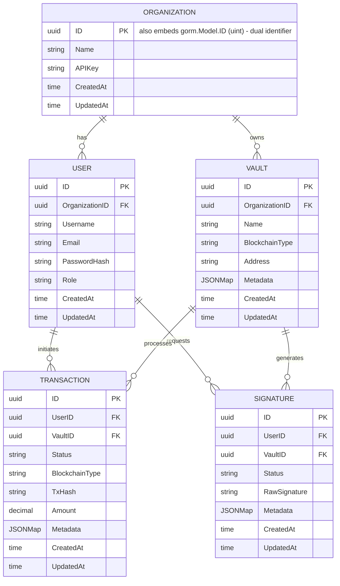

# Data Model Reference

The Blockchain Integration Service and Dashboard persists five entities — **Organization**, **User**, **Vault**, **Transaction**, and **Signature** — that model the custodial domain of organizations onboarding users who operate vaults to initiate transactions and request signatures. PostgreSQL is the system of record for all five entities. `Source: backend/internal/db/schema.go:L11-L68`, `Source: backend/internal/db/postgres.go:L1-L33`.

The entity **structs are Implemented** (declared as Go/GORM models in code), while the **physical persistence wiring is Provisioned**: the models exist, but the `db` package initializes a `sqlx` connection and defines no GORM `AutoMigrate`, `Repository`, or migrations, so the structs are not yet bound to a live schema. `Source: backend/internal/db/postgres.go:L10-L18`.

## Maturity Legend

Every capability and field-set in this reference is labeled with the project-wide maturity discipline:

- **Implemented** — present and functional in the code as-declared today.
- **Provisioned** — scaffolding or configuration exists, but the capability is not yet fully wired to run.
- **Designed** — specified in the design corpus (`documentation/*.md`), not yet present in code.

The consolidated Implemented / Provisioned / Designed matrix that reconciles the design corpus with the on-disk scaffold is maintained in [`scaffold-vs-design.md`](scaffold-vs-design.md).

The entity-relationship model is shown in **Fig M1 — Data Model ERD** below, reproduced exactly as the GORM structs are declared in code, including the dual-identifier annotation discussed in the Gap Notes. `Source: backend/internal/db/schema.go:L11-L68`.

## Fig M1 — Data Model ERD

**Fig M1 — Data Model ERD (as declared in `backend/internal/db/schema.go`)**



**Legend — Fig M1**

Mermaid `erDiagram` does not support an in-diagram legend, so the notation is explained here:

- **`||--o{`** — a one-to-mandatory to zero-or-many relationship: exactly one parent record relates to zero or more child records (i.e. one parent "has many" children). The label in quotes (`"has"`, `"owns"`, `"initiates"`, `"requests"`, `"processes"`, `"generates"`) names the relationship.
- **`PK`** — primary key column.
- **`FK`** — foreign-key column referencing a parent entity's primary key.
- **Type tokens map to Go types** as declared in code: `uuid` -> `uuid.UUID`, `string` -> `string`, `decimal` -> `decimal.Decimal`, `time` -> `time.Time`, and `JSONMap` -> `gorm.JSONMap` (a JSONB column). `Source: backend/internal/db/schema.go:L11-L68`.
- The diagram reflects the code **as-declared**, including the `"also embeds gorm.Model.ID (uint) - dual identifier"` annotation on `ORGANIZATION.ID`. That annotation applies to every entity and is explained in [Gap Notes](#gap-notes). `Source: backend/internal/db/schema.go:L11-L18`.

## Entity Field Reference

Each of the five entities is a GORM struct that embeds `gorm.Model` and then redeclares a UUID `ID` together with `CreatedAt`/`UpdatedAt`. The tables below reproduce every field exactly as declared — Go field name, Go type, key/constraint, and notes — with no invented fields.

### Organization (Implemented)

`Source: backend/internal/db/schema.go:L11-L18`.

| Field | Go Type | Key/Constraint | Notes |
|-------|---------|----------------|-------|
| `gorm.Model` | embedded struct | — | Embedded base; contributes `ID uint`, `CreatedAt`, `UpdatedAt`, `DeletedAt`. Collides with the redeclared fields below (see [Gap Notes](#gap-notes)). |
| `ID` | `uuid.UUID` | PK (`gorm:"type:uuid;primary_key"`) | UUID primary key, redeclared alongside `gorm.Model.ID uint`. |
| `Name` | `string` | — | Organization display name. |
| `APIKey` | `string` | — | Per-organization API key used for programmatic access. |
| `CreatedAt` | `time.Time` | — | Redeclares `gorm.Model.CreatedAt`. |
| `UpdatedAt` | `time.Time` | — | Redeclares `gorm.Model.UpdatedAt`. |

### User (Implemented)

`Source: backend/internal/db/schema.go:L20-L30`.

| Field | Go Type | Key/Constraint | Notes |
|-------|---------|----------------|-------|
| `gorm.Model` | embedded struct | — | Embedded base (see [Gap Notes](#gap-notes)). |
| `ID` | `uuid.UUID` | PK | UUID primary key. |
| `OrganizationID` | `uuid.UUID` | FK -> Organization | Multi-tenancy scope; associates the user with its organization. |
| `Username` | `string` | — | Login username. |
| `Email` | `string` | — | Contact email. |
| `PasswordHash` | `string` | — | Hashed credential; plaintext passwords are never persisted. |
| `Role` | `string` | — | Role-based access-control role for the user. |
| `CreatedAt` | `time.Time` | — | Redeclares `gorm.Model.CreatedAt`. |
| `UpdatedAt` | `time.Time` | — | Redeclares `gorm.Model.UpdatedAt`. |

### Vault (Implemented)

`Source: backend/internal/db/schema.go:L32-L42`.

| Field | Go Type | Key/Constraint | Notes |
|-------|---------|----------------|-------|
| `gorm.Model` | embedded struct | — | Embedded base (see [Gap Notes](#gap-notes)). |
| `ID` | `uuid.UUID` | PK | UUID primary key. |
| `OrganizationID` | `uuid.UUID` | FK -> Organization | Multi-tenancy scope; the owning organization. |
| `Name` | `string` | — | Vault display name. |
| `BlockchainType` | `string` | — | Target chain for the vault (e.g. XRP Ledger, Ethereum Network). |
| `Address` | `string` | — | On-chain address held by the custodial vault. |
| `Metadata` | `gorm.JSONMap` | JSONB | Free-form JSON metadata associated with the vault. |
| `CreatedAt` | `time.Time` | — | Redeclares `gorm.Model.CreatedAt`. |
| `UpdatedAt` | `time.Time` | — | Redeclares `gorm.Model.UpdatedAt`. |

### Transaction (Implemented)

`Source: backend/internal/db/schema.go:L44-L56`.

| Field | Go Type | Key/Constraint | Notes |
|-------|---------|----------------|-------|
| `gorm.Model` | embedded struct | — | Embedded base (see [Gap Notes](#gap-notes)). |
| `ID` | `uuid.UUID` | PK | UUID primary key. |
| `UserID` | `uuid.UUID` | FK -> User | The user who initiated the transaction. |
| `VaultID` | `uuid.UUID` | FK -> Vault | The source vault the transaction draws from. |
| `Status` | `string` | — | Lifecycle status. Backend vocabulary is `Pending` / `Processed` (see [Gap Notes](#gap-notes)). |
| `BlockchainType` | `string` | — | Target chain for the transaction. |
| `TxHash` | `string` | — | On-chain transaction hash; populated after broadcast. |
| `Amount` | `decimal.Decimal` | — | Arbitrary-precision monetary amount (see [Notable Field Types](#notable-field-types)). |
| `Metadata` | `gorm.JSONMap` | JSONB | Free-form JSON metadata. |
| `CreatedAt` | `time.Time` | — | Redeclares `gorm.Model.CreatedAt`. |
| `UpdatedAt` | `time.Time` | — | Redeclares `gorm.Model.UpdatedAt`. |

### Signature (Implemented)

`Source: backend/internal/db/schema.go:L58-L68`.

| Field | Go Type | Key/Constraint | Notes |
|-------|---------|----------------|-------|
| `gorm.Model` | embedded struct | — | Embedded base (see [Gap Notes](#gap-notes)). |
| `ID` | `uuid.UUID` | PK | UUID primary key. |
| `UserID` | `uuid.UUID` | FK -> User | The user who requested the signature. |
| `VaultID` | `uuid.UUID` | FK -> Vault | The vault whose key produces the signature. |
| `Status` | `string` | — | Signature lifecycle status. |
| `RawSignature` | `string` | — | Raw custodian signature material (see [Notable Field Types](#notable-field-types)). |
| `Metadata` | `gorm.JSONMap` | JSONB | Free-form JSON metadata. |
| `CreatedAt` | `time.Time` | — | Redeclares `gorm.Model.CreatedAt`. |
| `UpdatedAt` | `time.Time` | — | Redeclares `gorm.Model.UpdatedAt`. |

### Notable Field Types

- **`Transaction.Amount` is `decimal.Decimal`.** Monetary amounts use arbitrary-precision decimals rather than floating-point, which avoids the rounding errors inherent to `float` types when representing currency. `Source: backend/internal/db/schema.go:L52`.
- **`Signature.RawSignature` is a `string`.** It holds the raw signature material returned by the custodian for the signing request. `Source: backend/internal/db/schema.go:L64`.
- **`Metadata` is `gorm.JSONMap` (JSONB).** Vault, Transaction, and Signature each carry a `Metadata` column persisted as JSONB, enabling free-form key/value attributes without schema changes. `Source: backend/internal/db/schema.go:L39,L53,L65`.

## Relationships

The six relationships depicted in **Fig M1 — Data Model ERD** are all one-to-many, inferred from the foreign-key fields declared on the child entities. `Source: backend/internal/db/schema.go:L20-L68`.

- **Organization 1..\* User** — an organization *has* many users; each user carries an `OrganizationID`. `Source: backend/internal/db/schema.go:L23`.
- **Organization 1..\* Vault** — an organization *owns* many vaults; each vault carries an `OrganizationID`. `Source: backend/internal/db/schema.go:L35`.
- **User 1..\* Transaction** — a user *initiates* many transactions; each transaction carries a `UserID`. `Source: backend/internal/db/schema.go:L47`.
- **User 1..\* Signature** — a user *requests* many signatures; each signature carries a `UserID`. `Source: backend/internal/db/schema.go:L61`.
- **Vault 1..\* Transaction** — a vault *processes* many transactions; each transaction carries a `VaultID`. `Source: backend/internal/db/schema.go:L48`.
- **Vault 1..\* Signature** — a vault *generates* many signatures; each signature carries a `VaultID`. `Source: backend/internal/db/schema.go:L62`.

**Multi-tenancy.** Tenancy is enforced through the foreign keys: Users and Vaults are scoped by `OrganizationID`, while Transactions and Signatures are scoped by both `UserID` and `VaultID`, tying every operational record back to both the acting user and the vault it touches. `Source: backend/internal/db/schema.go:L20-L68`.

## Gap Notes

The following model-level gaps are **documented honestly and are not fixed** by this deliverable; they describe the current state of the code as-declared. Each is expanded in [`scaffold-vs-design.md`](scaffold-vs-design.md).

### Dual-identifier inconsistency (Implemented defect)

Every entity embeds `gorm.Model` — which itself provides `ID uint`, `CreatedAt`, `UpdatedAt`, and `DeletedAt` — **and** redeclares `ID uuid.UUID`, `CreatedAt time.Time`, and `UpdatedAt time.Time`. This creates conflicting primary-key semantics (`uint` versus `uuid`) and duplicate timestamp fields that GORM cannot map cleanly. `Source: backend/internal/db/schema.go:L11-L18` (Organization is representative; all five entities share the pattern).

```go
gorm.Model                                  // embeds ID uint, CreatedAt, UpdatedAt, DeletedAt
ID uuid.UUID `gorm:"type:uuid;primary_key"` // redeclares ID as uuid.UUID (conflicts)
```

### Status vocabulary mismatch (note)

The backend Transaction status vocabulary is `Pending` / `Processed`, set via the `db.TransactionStatusPending` and `db.TransactionStatusProcessed` constants. `Source: backend/internal/core/transaction/service.go:L46,L81`. The frontend Zod schema, however, validates a different vocabulary of `Pending` / `Completed` / `Failed`. `Source: frontend/src/schema/transaction.ts:L10`. This divergence is detailed in [`scaffold-vs-design.md`](scaffold-vs-design.md) and reflected in the endpoint documentation at [`../api-reference/transactions.md`](../api-reference/transactions.md).

### No migrations / mixed persistence (Provisioned)

The `db` package initializes a `sqlx` connection and defines no GORM `AutoMigrate` and no `Repository`, so these GORM structs are not yet bound to a live physical schema. `Source: backend/internal/db/postgres.go:L10-L18`. The logical entity model above is therefore **Implemented** at the struct level, while the **physical schema is Designed/Provisioned** until migration wiring is added.

## Design vs. Code

The design entity-relationship model in the Technical Specification models the same six relationships as **Fig M1 — Data Model ERD**, but with clean single `uuid id PK` columns and snake_case column names (for example `api_key`, `organization_id`, `tx_hash`, `raw_signature`, `created_at`, `updated_at`), using `timestamp` for time columns, `jsonb` for metadata, and `text` for the raw signature. `Source: documentation/Technical Specifications.md:§DATABASE DESIGN`. Notably, the design does **not** carry the dual-identifier gap; it is the intended target that the current scaffold has yet to reach.

## Referenced By

**Fig M1 — Data Model ERD** is the shared entity-relationship diagram and the single source of truth for entity definitions across the API reference. The following pages link back to this document (anchor `#fig-m1--data-model-erd`) for entity structure rather than redefining fields:

- [`../api-reference/vaults.md`](../api-reference/vaults.md) — Vault resource.
- [`../api-reference/transactions.md`](../api-reference/transactions.md) — Transaction resource.
- [`../api-reference/signatures.md`](../api-reference/signatures.md) — Signature resource.
