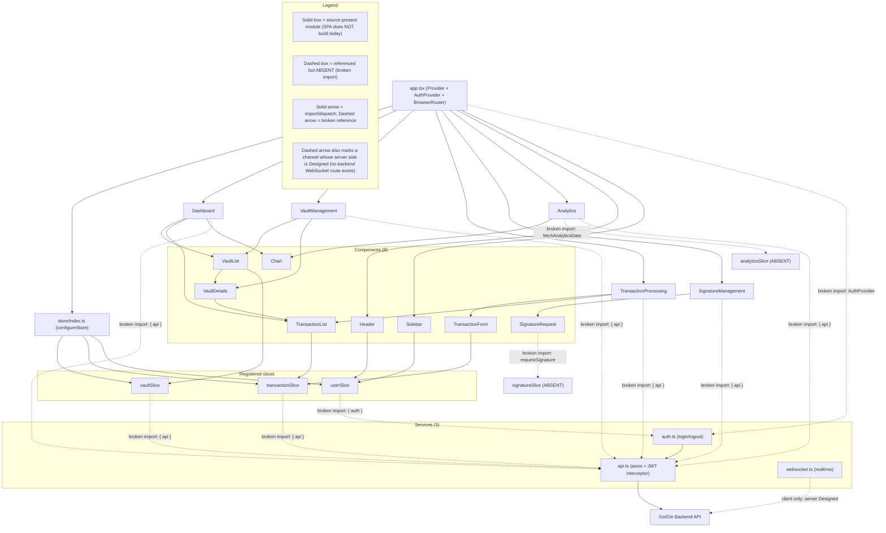

# Frontend Architecture

The frontend of the Blockchain Integration Service and Dashboard is a React 18 + TypeScript single-page application (SPA) whose global state is managed with Redux Toolkit and whose navigation is handled by React Router. `Source: frontend/src/app.tsx:L14-L38`, `Source: frontend/src/store/index.ts:L8-L12`. The application shell composes a Redux `Provider`, an `AuthProvider`, and a `BrowserRouter`, and it frames every routed page with a shared `Header` and `Sidebar`. `Source: frontend/src/app.tsx:L16-L34`. Server communication runs over an Axios client whose request interceptor attaches a JWT bearer token to every call, while a `WebSocketService` class opens a realtime channel that authenticates itself on connection. `Source: frontend/src/services/api.ts:L11-L17`, `Source: frontend/src/services/websocket.ts:L14-L21`. This page is the authoritative home of **Fig A3 — Frontend Component & State Architecture**, the component-and-state graph that complements the backend before/after pair — **Fig A1** and **Fig A2** — authored in [`overview.md`](overview.md).

## Maturity Legend

Every capability named on this page is tagged with the project-wide maturity discipline, consistent with the labeling used in [`overview.md`](overview.md) and [`data-model.md`](data-model.md):

- **Implemented** — present in code, building, and functional today. Reserved for genuinely working capability; at this checkpoint **nothing qualifies for it**, because the single-page application does not build.
- **Implemented-with-defects (source-present, non-buildable)** — the code is present and substantially written, but a compile-blocking defect prevents the SPA from building, so no runtime behavior can be claimed. This is the operational-truth label applied to every source-present frontend module shown as solid in **Fig A3**, consistent with [`scaffold-vs-design.md`](scaffold-vs-design.md).
- **Provisioned** — scaffolding or configuration exists, but the capability is not yet fully wired to run.
- **Designed** — specified in the design corpus (`documentation/*.md`), not yet present in code.

Two frontend-specific qualifications apply. First, the React component tree, the routing shell, the three registered Redux slices, and the three service modules are **source-present but non-buildable** (**Implemented-with-defects (source-present, non-buildable)**): the SPA does not compile today because it uses **seven** undeclared dependencies (`@reduxjs/toolkit`, `axios`, `chart.js`, `date-fns`, `react-chartjs-2`, `react-redux`, `zod`), an `@/` path alias unsupported by `react-scripts`, absent store slices and absent store hooks, and named/default export mismatches — so no page renders at runtime. Specific broken store and utility references are called out below as **source-present defects** rather than hidden. Second, the visual styling of the UI is **Designed** only — the design corpus describes the frontend as "React with Tailwind CSS" `Source: documentation/Software Requirements Specifications (SRS).md:L339`, but `frontend/package.json` declares no Tailwind dependency and the source tree contains zero `.css` files, so components carry `className` hooks with no accompanying stylesheet today. The Technical Specification records the same conclusion, labeling Tailwind a design-time proposal that is not a declared or installed dependency. `Source: frontend/package.json`, `Source: documentation/Technical Specifications.md:§TECHNOLOGY STACK`.

## Fig A3 — Frontend Component & State Architecture

**Fig A3 — Frontend Component & State Architecture** maps the React application shell to its five routed pages, the eight shared components, the three registered Redux slices, and the three service modules. It deliberately renders the two broken store references — `analyticsSlice` and `signatureSlice` — as dashed nodes so that the difference between what is wired and what is merely referenced is legible at a glance. The figure is the frontend counterpart to the backend before/after pair in [`overview.md`](overview.md), and it is referenced by name from the [Known Gaps and Divergences](#known-gaps-and-divergences) section below. Fig A3 is authored here only: the executive summary deck ([`../../blitzy-deck/executive-summary.html`](../../blitzy-deck/executive-summary.html)) re-expresses the backend and operations figures (**Fig A1**, **Fig A2**, **Fig O1**, and **Fig O2**) rather than this frontend graph, so this page is the single home for the component-and-state view.

**Figure A3 — Frontend Component & State Architecture (React 18 + TypeScript, as-wired today)**



As the `Legend_A3` subgraph in **Fig A3** states, solid boxes and solid arrows denote source-present modules and their intended import/dispatch wiring — all **Implemented-with-defects (source-present, non-buildable)**, since the SPA does not build: `app.tsx` is written to compose the store and mount the five routed pages (**source-present, non-buildable**); the store registers the `vault`, `transaction`, and `user` slices (**source-present, non-buildable**); and the `Header`, `Sidebar`, `VaultList`, `VaultDetails`, `TransactionForm`, `TransactionList`, and `Chart` components are coded to read from or dispatch to those registered slices (**source-present, non-buildable**). `Source: frontend/src/app.tsx:L16-L34`, `Source: frontend/src/store/index.ts:L8-L12`. The dashed boxes `analyticsSlice (ABSENT)` and `signatureSlice (ABSENT)`, together with the dashed arrows into them, mark the two broken references (**source-present defect**): the `Analytics` page and the `SignatureRequest` component import from store slices that do not exist and that the store never registers. `Source: frontend/src/pages/Analytics.tsx:L7`, `Source: frontend/src/components/SignatureRequest.tsx:L3`, `Source: frontend/src/store/index.ts:L8-L12`. Both defects are dissected in the [Known Gaps and Divergences](#known-gaps-and-divergences) section.

Three further groups of dashed edges in **Fig A3** carry the remaining broken bindings, each matching an entry in that same section. The five pages and the `vaultSlice`/`transactionSlice` reach the Axios client through `broken import: { api }`, because `api.ts` publishes three named functions and no `api` namespace; `userSlice` reaches the session helpers through `broken import: { auth }` for the same reason; and `app.tsx` reaches `auth.ts` through `broken import: AuthProvider`, a symbol `auth.ts` never defines. `Source: frontend/src/services/api.ts:L32,L38,L44`, `Source: frontend/src/services/auth.ts:L4,L19,L27`, `Source: frontend/src/app.tsx:L12`. The `websocket.ts → Go/Gin Backend API` edge is dashed for a different reason, which the `LG4` legend key names: the client half is written but **the backend declares no WebSocket route at all**, so the server side of that channel is **Designed**. `Source: backend/internal/api/routes.go:L9-L54`. This is the same dashed treatment **Fig DF1** applies to the realtime channel in [`data-flow.md`](data-flow.md#fig-df1--end-to-end-data-flow); the two figures now agree.

The solid render edges reflect the component tree as coded, including the duplication documented in [Application shell is composed twice and mounted with a legacy React API](#application-shell-is-composed-twice-and-mounted-with-a-legacy-react-api-source-present-defects): `app.tsx` renders `Header` and `Sidebar` around the route outlet, and each of the five pages renders that chrome again in its own markup — an edge pair the figure draws once from `App` to keep the graph legible, with the per-page repetition recorded in prose rather than as ten more arrows. `Source: frontend/src/app.tsx:L20,L22`.

## Pages and Routing

The router mounts five page components, each wrapped by the shared `Header` and `Sidebar` from the application shell. `Source: frontend/src/app.tsx:L20-L34`. The route-to-page mapping is declared directly in `app.tsx`.

| Route | Page component | Purpose | Maturity |
|-------|----------------|---------|----------|
| `/` | `Dashboard` | Landing overview that aggregates vaults, transactions, and a summary `Chart`; dispatches `fetchVaults` and the **absent** `fetchTransactions` on mount. | Source-present (non-buildable) |
| `/vault-management` | `VaultManagement` | Create, list, and inspect custodial vaults via `VaultList` and `VaultDetails`; dispatches `fetchVaults` and the **absent** `createVault`. | Source-present (non-buildable) |
| `/transaction-processing` | `TransactionProcessing` | Submit new transactions through `TransactionForm` and track them via `TransactionList`; dispatches `createTransaction` and the **absent** `fetchTransactions`. | Source-present (non-buildable) |
| `/signature-management` | `SignatureManagement` | Request and monitor signatures via `SignatureRequest`; imports `requestSignature`/`checkSignatureStatus` from the absent `signatureSlice`. | Source-present (non-buildable) |
| `/analytics` | `Analytics` | Render analytics visualizations via `Chart`; imports `fetchAnalyticsData` from the absent `analyticsSlice` and reads `state.analytics.data`. | Source-present (non-buildable) |

The route declarations are at `Source: frontend/src/app.tsx:L25-L29`. What is verifiable in the page sources is the *import and dispatch intent*, **not** that the imported symbols exist: `Dashboard` imports `fetchVaults` and `fetchTransactions` `Source: frontend/src/pages/Dashboard.tsx:L9-L10`; `VaultManagement` imports `fetchVaults, createVault` `Source: frontend/src/pages/VaultManagement.tsx:L8`; `TransactionProcessing` imports `createTransaction, fetchTransactions` `Source: frontend/src/pages/TransactionProcessing.tsx:L8`; `SignatureManagement` imports from the absent `signatureSlice` `Source: frontend/src/pages/SignatureManagement.tsx:L7`; and `Analytics` imports from the absent `analyticsSlice` `Source: frontend/src/pages/Analytics.tsx:L7`. Of those, only `fetchVaults` and `createTransaction` are actually exported by a slice; the rest are enumerated immediately below.

### Absent slice symbols imported by pages and components (source-present defect)

Beyond the two absent *slices* (`analyticsSlice`, `signatureSlice`), five individual symbols are imported from slices that **do exist** but never export them. Each import therefore fails to resolve, so every consuming page and component is compile-blocked independently of the absent slices. The three registered slices export exactly `fetchVaults`, `setVaults`, and a default reducer (`vaultSlice`); `createTransaction`, `addTransaction`, and a default reducer (`transactionSlice`); and `loginUser`, `setUser`, and a default reducer (`userSlice`). `Source: frontend/src/store/vaultSlice.ts:L6,L55-L56`, `Source: frontend/src/store/transactionSlice.ts:L6,L54-L55`, `Source: frontend/src/store/userSlice.ts:L20,L64-L65`.

| Imported symbol | Slice it is imported from | Import sites | Maturity |
|-----------------|---------------------------|--------------|----------|
| `fetchTransactions` | `transactionSlice` (exports `createTransaction`, `addTransaction`, default reducer) | `Source: frontend/src/pages/Dashboard.tsx:L10,L26`, `Source: frontend/src/pages/TransactionProcessing.tsx:L8,L32` | Designed (absent) |
| `createVault` | `vaultSlice` (exports `fetchVaults`, `setVaults`, default reducer) | `Source: frontend/src/pages/VaultManagement.tsx:L8,L44` | Designed (absent) |
| `selectVaults` | `vaultSlice` | `Source: frontend/src/components/VaultList.tsx:L3,L8` | Designed (absent) |
| `selectTransactions` | `transactionSlice` | `Source: frontend/src/components/TransactionList.tsx:L3,L11` | Designed (absent) |
| `selectUser` | `userSlice` | `Source: frontend/src/components/Header.tsx:L4,L7`, `Source: frontend/src/components/Sidebar.tsx:L4,L7` | Designed (absent) |

No slice in the tree defines any selector at all — `selectVaults`, `selectTransactions`, and `selectUser` are the memoized-selector layer a Redux Toolkit slice would normally publish, and it is entirely **Designed**. Documented, not fixed; cataloged in [`scaffold-vs-design.md`](scaffold-vs-design.md#defect-catalog).

## Shared Components

Eight reusable components live under `frontend/src/components`. Each is **source-present but non-buildable**; where a component references an absent store slice it is additionally labeled a **source-present defect** and detailed in [Known Gaps and Divergences](#known-gaps-and-divergences).

| Component | Role | Store / utility dependencies | Maturity |
|-----------|------|------------------------------|----------|
| `Chart` | Data-visualization wrapper exposing `Line`, `Bar`, and `Pie` renderers. | chart.js, react-chartjs-2 (no store) | Source-present (non-buildable) |
| `Header` | Top navigation bar that reflects the current user. | `selectUser` from `userSlice` (**absent**) | Source-present (non-buildable) |
| `Sidebar` | Side navigation that reflects the current user. | `selectUser` from `userSlice` (**absent**) | Source-present (non-buildable) |
| `VaultList` | Lists vaults and renders `VaultDetails` for each. | `selectVaults` (**absent**)/`fetchVaults` from `vaultSlice` | Source-present (non-buildable) |
| `VaultDetails` | Shows a vault's detail and embeds `TransactionList`. | `utils/formatters` (`formatCurrency`, `truncateAddress`) | Source-present (non-buildable) |
| `TransactionForm` | Form that validates input and dispatches new transactions. | `createTransaction` from `transactionSlice`; `utils/validators` | Source-present (non-buildable) |
| `TransactionList` | Lists transactions with formatted amounts and dates. | `selectTransactions` from `transactionSlice` (**absent**); `utils/formatters` | Source-present (non-buildable) |
| `SignatureRequest` | Requests a signature and polls its status. | `requestSignature`/`checkSignatureStatus` from the absent `signatureSlice`; `utils/formatters` | Source-present (non-buildable) |

Component wiring is verifiable in each source file: `Source: frontend/src/components/Chart.tsx:L2-L3`, `Source: frontend/src/components/Header.tsx:L3-L4`, `Source: frontend/src/components/Sidebar.tsx:L3-L4`, `Source: frontend/src/components/VaultList.tsx:L3-L4`, `Source: frontend/src/components/VaultDetails.tsx:L2-L3`, `Source: frontend/src/components/TransactionForm.tsx:L3-L4`, `Source: frontend/src/components/TransactionList.tsx:L3-L4`, `Source: frontend/src/components/SignatureRequest.tsx:L3-L4`.

### Component prop contracts do not match their call sites (source-present defect)

Five of the eight components are invoked with props their own type signature does not accept, or declare required props their callers never pass. Each mismatch is an independent TypeScript compile error, so these are **source-present defects** in addition to the absent-symbol breakage above. Documented, not fixed.

| Component | Declared prop contract | How callers actually invoke it | Mismatch |
|-----------|------------------------|--------------------------------|----------|
| `VaultList` | `React.FC` with **no props interface at all** — accepts nothing. `Source: frontend/src/components/VaultList.tsx:L6` | `<VaultList vaults={vaults} />` `Source: frontend/src/pages/Dashboard.tsx:L43`; `<VaultList vaults onSelectVault onCreateVault />` `Source: frontend/src/pages/VaultManagement.tsx:L65-L69` | Three props passed to a component typed to accept none; the `onCreateVault` handler is therefore inert (see [`../guides/vault-management.md`](../guides/vault-management.md)) |
| `TransactionList` | `interface TransactionListProps { vaultId: string }` — `vaultId` required. `Source: frontend/src/components/TransactionList.tsx:L6-L8` | `<TransactionList transactions isLoading />` `Source: frontend/src/pages/TransactionProcessing.tsx:L56`; `<TransactionList transactions />` `Source: frontend/src/pages/Dashboard.tsx:L44`, `Source: frontend/src/components/VaultDetails.tsx:L23` | Required `vaultId` never passed; `transactions`/`isLoading` are not declared props |
| `TransactionForm` | `interface TransactionFormProps { vaultId: string }` — `vaultId` required. `Source: frontend/src/components/TransactionForm.tsx:L6-L8` | `<TransactionForm onSubmit={...} />` `Source: frontend/src/pages/TransactionProcessing.tsx:L55` | Required `vaultId` never passed; `onSubmit` is not a declared prop |
| `SignatureRequest` | `interface SignatureRequestProps { vaultId: string }` — `vaultId` required. `Source: frontend/src/components/SignatureRequest.tsx:L6-L8` | `<SignatureRequest onSubmit={...} />` `Source: frontend/src/pages/SignatureManagement.tsx:L52` | Required `vaultId` never passed; `onSubmit` is not a declared prop |
| `Chart` | `ChartComponentProps` with required `data`, `options`, and `type`, backed by two **empty** interfaces. `Source: frontend/src/components/Chart.tsx:L1-L22` | `<Chart data={...} />` only — `Source: frontend/src/pages/Dashboard.tsx:L45`, `Source: frontend/src/pages/Analytics.tsx:L40` | Required `options` and `type` never passed (also recorded in [`../operations/observability.md`](../operations/observability.md)) |

## Services

Three service modules under `frontend/src/services` mediate all communication with the backend. The Axios client is the REST transport; `auth.ts` manages the session; and `websocket.ts` provides the realtime channel.

| Service | Responsibility | Key notes | Maturity |
|---------|----------------|-----------|----------|
| `api.ts` | Axios instance factory for backend REST calls. | Exports exactly three named helpers — `getVaults`, `createTransaction`, `getSignatureStatus`; there is **no `api` namespace export**, yet seven modules import `{ api }` from it. Request interceptor attaches `Authorization: Bearer <token>`; response interceptor carries a 401-refresh TODO; issues `GET /vaults` and `POST /transactions`, which diverge from the router's `/vault/list` and `/transactions/create`, plus `GET /signatures/:id`, which matches the router exactly. | Source-present (non-buildable) |
| `auth.ts` | Session helpers `login`, `logout`, `isAuthenticated`. | Exports those three as **individual named functions**; there is **no `auth` namespace export**, yet `userSlice` imports `{ auth }`. `login` posts to `/auth/login`; persists the JWT via `utils/storage` (absent); imports `createApiInstance`, which `api.ts` does not export. | Source-present (non-buildable) |
| `websocket.ts` | `WebSocketService` realtime channel. | **Never imported by any module in the tree** — the class is dead code today. On open, sends `{ type: 'authenticate', token }`; reads the token from `utils/auth` (absent). Two independent type/runtime defects, detailed below. | Source-present (non-buildable) |

The Axios request interceptor attaches the bearer token on every outbound call (**source-present, non-buildable**). `Source: frontend/src/services/api.ts:L11-L17`:

```ts
const token = await getAuthToken();
if (token) config.headers['Authorization'] = `Bearer ${token}`;
```

The response interceptor is a pass-through with an outstanding 401-refresh TODO (**source-present, non-buildable**, incomplete). `Source: frontend/src/services/api.ts:L19-L27`. The REST helpers call plural resource paths that diverge from the backend router. `Source: frontend/src/services/api.ts:L32-L46`. The session helpers post to `/auth/login` and persist the JWT. `Source: frontend/src/services/auth.ts:L4-L17`. The realtime channel authenticates on open by sending an `authenticate` message with the token. `Source: frontend/src/services/websocket.ts:L14-L21`.

### Namespace imports of modules that export no namespace (source-present defect)

`api.ts` and `auth.ts` publish **individual named functions**, not namespace objects, but eight import sites destructure a namespace binding that does not exist. Every one of these imports resolves to `undefined` at type-check time and is an independent compile error. `api.ts` exports only `getVaults`, `createTransaction`, and `getSignatureStatus` `Source: frontend/src/services/api.ts:L32,L38,L44`; `auth.ts` exports only `login`, `logout`, and `isAuthenticated` `Source: frontend/src/services/auth.ts:L4,L19,L27`.

| Broken binding | Import sites | Specifier used |
|----------------|--------------|----------------|
| `import { api }` from `api.ts` (no `api` export) | `Source: frontend/src/pages/Dashboard.tsx:L7`, `Source: frontend/src/pages/VaultManagement.tsx:L6`, `Source: frontend/src/pages/TransactionProcessing.tsx:L6`, `Source: frontend/src/pages/SignatureManagement.tsx:L5`, `Source: frontend/src/pages/Analytics.tsx:L5` | `@/services/api` |
| `import { api }` from `api.ts` (no `api` export) | `Source: frontend/src/store/vaultSlice.ts:L2`, `Source: frontend/src/store/transactionSlice.ts:L2` | `frontend/src/services/api` (bare, unresolvable) |
| `import { auth }` from `auth.ts` (no `auth` export) | `Source: frontend/src/store/userSlice.ts:L2` | `frontend/src/services/auth` (bare, unresolvable) |

The `auth` binding carries a second, independent defect: `userSlice` calls `auth.login(credentials)` with a **single object argument**, while `auth.ts` declares `login(username: string, password: string)` — two positional strings. Even with a namespace export in place, the call would not type-check. `Source: frontend/src/store/userSlice.ts:L24`, `Source: frontend/src/services/auth.ts:L4`. Documented, not fixed.

### `websocket.ts` type and null-dereference defects (source-present defect)

The realtime service carries two further defects beyond the absent `utils/auth` import, and neither is reachable today because no module imports the class:

- **Non-nullable field assigned `null`.** `socket` is declared `private socket: WebSocket` — a non-nullable type — yet `disconnect()` assigns `this.socket = null`. Under the project's `strict` TypeScript configuration this is a type error. `Source: frontend/src/services/websocket.ts:L4`, `Source: frontend/src/services/websocket.ts:L49`.
- **`connect()` dereferences the field it is guarding.** The reconnect path reads `this.socket.url` to rebuild the connection, but that branch is exactly the one taken when `socket` is null after a `disconnect()`, so the expression would raise `TypeError: Cannot read properties of null (reading 'url')` at runtime. `Source: frontend/src/services/websocket.ts:L39-L43`.

**Maturity: source-present defect** for both; the correction (an explicit `WebSocket | null` type and a retained endpoint URL) is **Designed**. Documented, not fixed.

## State Management (Redux Store)

The Redux store is assembled by a single `configureStore` call that is *written to* register exactly three reducers — `vault`, `transaction`, and `user` — with the Redux DevTools enhancer gated on `NODE_ENV`. `Source: frontend/src/store/index.ts:L8-L13` (**source-present, non-buildable**). None of the three actually binds, for the import reason recorded in the table below. The module exports only the `RootState` and `AppDispatch` types derived from the configured store; it does **not** export typed `useAppSelector`/`useAppDispatch` hooks, yet pages and components import those hooks from `@/store`, so those imports are unresolved — a compile-blocking defect. `Source: frontend/src/store/index.ts:L21-L22` (**source-present defect**).

| Registered reducer | Store key | How the store imports it | How the slice exports it | Primary consumers | Maturity |
|--------------------|-----------|--------------------------|--------------------------|-------------------|----------|
| `vaultReducer` | `vault` | **named** — `import { vaultReducer } from './vaultSlice'` `Source: frontend/src/store/index.ts:L2` | **default only** — `export default vaultSlice.reducer` `Source: frontend/src/store/vaultSlice.ts:L56` | `VaultList`, `VaultManagement`, `Dashboard` | Source-present defect |
| `transactionReducer` | `transaction` | **named** — `import { transactionReducer } from './transactionSlice'` `Source: frontend/src/store/index.ts:L3` | **default only** — `export default transactionSlice.reducer` `Source: frontend/src/store/transactionSlice.ts:L55` | `TransactionForm`, `TransactionList`, `TransactionProcessing`, `Dashboard` | Source-present defect |
| `userReducer` | `user` | **named** — `import { userReducer } from './userSlice'` `Source: frontend/src/store/index.ts:L4` | **default only** — `export default userSlice.reducer` `Source: frontend/src/store/userSlice.ts:L65` | `Header`, `Sidebar` | Source-present defect |

**All three reducer imports are broken.** The store imports each reducer as a **named** binding, but every slice publishes its reducer as a **default** export and names no `vaultReducer`/`transactionReducer`/`userReducer` symbol at all — the only named exports the slices provide are their thunks and action creators (`fetchVaults`/`setVaults`, `createTransaction`/`addTransaction`, `loginUser`/`setUser`). Each of the three imports therefore resolves to `undefined`, so `configureStore` is a compile error on all three keys and **no reducer is registered even in principle**. This is the first compile failure inside `store/index.ts`, and it precedes the absent-selector and absent-hook defects described above. `Source: frontend/src/store/index.ts:L2-L4`, `Source: frontend/src/store/vaultSlice.ts:L55-L56`, `Source: frontend/src/store/transactionSlice.ts:L54-L55`, `Source: frontend/src/store/userSlice.ts:L64-L65`. **Maturity: source-present defect**; the correction (either default-importing the reducers or adding named re-exports) is **Designed**. Documented, not fixed.

Critically, the store registers no `analytics` reducer and no `signature` reducer, so the `state.analytics.data` read in `Analytics` and the `signatureSlice` dispatches in `SignatureRequest` and `SignatureManagement` resolve against slices that are never mounted (**source-present defect**). `Source: frontend/src/store/index.ts:L8-L12`, `Source: frontend/src/pages/Analytics.tsx:L15`, `Source: frontend/src/components/SignatureRequest.tsx:L3`.


## Client-Side Validation (Zod Schemas)

Three schema modules under `frontend/src/schema` declare the client-side validation contract, one per domain resource. Each module defines a TypeScript class whose constructor assigns a `z.object({ … })` to a public `schema` field. `Source: frontend/src/schema/transaction.ts:L3-L16`, `Source: frontend/src/schema/user.ts:L3-L14`, `Source: frontend/src/schema/vault.ts:L3-L14`. All three are **source-present but non-buildable**: each imports `zod`, which `frontend/package.json` does not declare, so no schema module resolves. `Source: frontend/src/schema/transaction.ts:L1`, `Source: frontend/src/schema/user.ts:L1`, `Source: frontend/src/schema/vault.ts:L1`, `Source: frontend/package.json:L5-L19`.

Two further facts qualify the maturity of client-side validation, and both are load-bearing. First, **no module under `frontend/src` imports any of the three schemas** — they are declared but never consumed, so even once the build blockers are resolved no Zod validation would run. Second, the only input validation actually wired into a component is hand-rolled: `TransactionForm` checks the amount inline and the recipient address with `isValidEthereumAddress`/`isValidXRPAddress` from `utils/validators`, and never references `TransactionSchema`. `Source: frontend/src/components/TransactionForm.tsx:L4,L23-L28`, `Source: frontend/src/utils/validators.ts:L8,L16`. Zod-enforced validation is therefore **Designed** in effect — the schema source exists, but nothing enforces it. The three modules deliberately do **not** appear in **Fig A3**: nothing imports them, so there is no import or dispatch edge to draw, and their absence from the component-and-state graph is itself the finding.

| Schema module | Declared symbol | Exported? | Mirrors backend entity | Maturity |
|---------------|-----------------|-----------|------------------------|----------|
| `schema/transaction.ts` | `TransactionSchema` | Yes (`export class`) | `db.Transaction` | Source-present (non-buildable); never imported |
| `schema/user.ts` | `UserSchema` | Yes (`export class`) | `db.User` | Source-present (non-buildable); never imported |
| `schema/vault.ts` | `VaultSchema` | **No** — module-private | `db.Vault` | Source-present defect (unimportable); never imported |

`Source: frontend/src/schema/transaction.ts:L3`, `Source: frontend/src/schema/user.ts:L3`, `Source: frontend/src/schema/vault.ts:L3`.

### `TransactionSchema` fields

| Field | Zod validator | Backend counterpart | Note |
|-------|---------------|---------------------|------|
| `id` | `z.string()` | `ID uuid.UUID` | No UUID format check on the client |
| `vaultId` | `z.string()` | `VaultID uuid.UUID` | No UUID format check on the client |
| `status` | `z.enum(['Pending','Completed','Failed'])` | `Status string` (`Pending` / `Processed`) | Vocabulary divergence — see below |
| `blockchainType` | `z.enum(['XRP','Ethereum'])` | `BlockchainType string` (unconstrained) | Enumeration exists only client-side |
| `txHash` | `z.string()` | `TxHash string` | — |
| `amount` | `z.number()` | `Amount decimal.Decimal` | Client narrows an arbitrary-precision decimal to a JS number |
| `createdAt` | `z.string().datetime()` | `CreatedAt time.Time` | ISO-8601, no precision constraint |

`Source: frontend/src/schema/transaction.ts:L8-L14`, `Source: backend/internal/db/schema.go:L44-L56`. The backend's `UserID`, `Metadata`, and `UpdatedAt` fields have no client-side counterpart.

### `UserSchema` fields

| Field | Zod validator | Backend counterpart | Note |
|-------|---------------|---------------------|------|
| `id` | `z.string()` | `ID uuid.UUID` | No UUID format check on the client |
| `username` | `z.string()` | `Username string` | — |
| `email` | `z.string().email()` | `Email string` | Format check exists only client-side |
| `role` | `z.enum(['Admin','Manager','Operator','Auditor'])` | `Role string` (unconstrained) | **Omits `API User`** — four of the five documented roles |
| `createdAt` | `z.string().datetime({ precision: 3 })` | `CreatedAt time.Time` | Millisecond precision required |

`Source: frontend/src/schema/user.ts:L8-L12`, `Source: backend/internal/db/schema.go:L20-L30`. The backend's `OrganizationID`, `PasswordHash`, and `UpdatedAt` fields have no client-side counterpart: omitting `PasswordHash` is correct — a password hash must never reach the client — but omitting `OrganizationID` drops the multi-tenancy key that the vault and transaction flows scope on.

### `VaultSchema` fields

| Field | Zod validator | Backend counterpart | Note |
|-------|---------------|---------------------|------|
| `id` | `z.string()` | `ID uuid.UUID` | No UUID format check on the client |
| `name` | `z.string()` | `Name string` | — |
| `blockchainType` | `z.enum(['XRP','Ethereum'])` | `BlockchainType string` (unconstrained) | Enumeration exists only client-side |
| `address` | `z.string()` | `Address string` | No chain-specific address check in the schema |
| `createdAt` | `z.string().datetime({ precision: 3 })` | `CreatedAt time.Time` | Millisecond precision required |

`Source: frontend/src/schema/vault.ts:L8-L12`, `Source: backend/internal/db/schema.go:L32-L42`. The backend's `OrganizationID`, `Metadata`, and `UpdatedAt` fields have no client-side counterpart.

### Divergences carried by the schemas

- **Role enumeration — four client values versus five documented roles (source-present defect).** `UserSchema` validates `role` against `['Admin','Manager','Operator','Auditor']`, omitting `API User`, whereas the design corpus and this documentation set both define a five-role RBAC model. `Source: frontend/src/schema/user.ts:L11`, `Source: documentation/Technical Specifications.md:L634-L638`, [`../security/security-model.md`](../security/security-model.md). A user whose role is `API User` would therefore fail client-side validation while remaining valid on the backend, where `Role` is an unconstrained `string` with no enumeration, check constraint, or middleware enforcement. `Source: backend/internal/db/schema.go:L27`. Because RBAC enforcement is itself **Designed** — the auth middleware is absent — the divergence is latent rather than active today, and it is cataloged in [`scaffold-vs-design.md`](scaffold-vs-design.md).
- **Role comparison is case-mismatched, so the Admin navigation can never render (source-present defect).** `Sidebar` gates the Admin link on `user.role === 'admin'` — **lowercase** — while `UserSchema` constrains `role` to the capitalized enumeration `['Admin','Manager','Operator','Auditor']`. `Source: frontend/src/components/Sidebar.tsx:L29`, `Source: frontend/src/schema/user.ts:L11`. JavaScript `===` on strings is case-sensitive, so a genuine administrator whose role is the schema-valid `'Admin'` fails the comparison and the `/admin` `NavLink` is never rendered: the Admin route becomes unreachable through the UI for **every** user, and no value the schema permits can satisfy the guard. This is distinct from the enumeration gap above — that one concerns *which* roles exist, this one concerns the *spelling* of a role that does exist — and it is the more consequential of the two because it silently removes a navigation affordance rather than rejecting a value. **Maturity: source-present defect**; the correction (comparing against the canonical capitalized value, or normalizing case at the comparison site) is **Designed**. The same mismatch is recorded in the RBAC section of [`../security/security-model.md`](../security/security-model.md) and cataloged in [`scaffold-vs-design.md`](scaffold-vs-design.md).
- **`Header` renders a `user.name` field no schema defines (source-present defect).** The header prints `<span>{user.name}</span>`, but neither `UserSchema` nor the slice's `User` type declares a `name` field: the schema defines `id`, `username`, `email`, `role`, and `createdAt`, and the backend entity carries `Username` and `Email` with no display-name column. `Source: frontend/src/components/Header.tsx:L25`, `Source: frontend/src/schema/user.ts:L8-L12`, `Source: backend/internal/db/schema.go:L20-L30`. The expression is additionally untypeable because `userSlice` declares `User` as an **empty interface** — `interface User { // Define user properties here }` — alongside an equally empty `LoginCredentials`, so both are placeholder stubs with no members at all. `Source: frontend/src/store/userSlice.ts:L4-L6`, `Source: frontend/src/store/userSlice.ts:L8-L10`. Under `strict` type-checking, `user.name` on an empty interface is a compile error; were it to run, it would render nothing. `Source: frontend/tsconfig.json:L14`. **Maturity: source-present defect**; populating the `User`/`LoginCredentials` shapes and rendering `username` (or adding a real display-name field end to end) is **Designed**.
- **`VaultSchema` is declared without `export` (source-present defect).** `vault.ts` declares `class VaultSchema`, while its two siblings declare `export class`, so the vault contract is module-private and no consumer can import it. `Source: frontend/src/schema/vault.ts:L3`, `Source: frontend/src/schema/transaction.ts:L3`, `Source: frontend/src/schema/user.ts:L3`. Because the class is also never referenced inside its own module and `frontend/tsconfig.json` sets `noUnusedLocals: true`, the declaration is additionally reported as an unused local during type-checking. `Source: frontend/tsconfig.json:L15`.
- **Identifiers are plain strings.** All three schemas type `id` — and `TransactionSchema` also types `vaultId` — as `z.string()` with no UUID validator, while every backend entity keys on `uuid.UUID`. `Source: frontend/src/schema/vault.ts:L8`, `Source: frontend/src/schema/transaction.ts:L8-L9`, `Source: backend/internal/db/schema.go:L34`. A malformed identifier passes client validation and is rejected only at the database boundary; the backend's own identifier conflict is covered by the dual-identifier note in [`data-model.md`](data-model.md).
- **Chain enumerations and address formats live only on the client.** `blockchainType` is constrained to `XRP` / `Ethereum` in both `VaultSchema` and `TransactionSchema`, but the corresponding backend fields are plain unconstrained strings, so the enumeration is **Designed** on the server. `Source: frontend/src/schema/vault.ts:L10`, `Source: frontend/src/schema/transaction.ts:L11`, `Source: backend/internal/db/schema.go:L37,L50`. Chain-specific address validation exists separately in `utils/validators` and is not referenced by any schema. `Source: frontend/src/utils/validators.ts:L8,L16`, `Source: frontend/src/schema/vault.ts:L11`.
- **Transaction status vocabulary and amount typing.** `TransactionSchema` validates `Pending` / `Completed` / `Failed` against a backend that produces only `Pending` / `Processed`, and types `amount` as a number against a `decimal.Decimal` that serializes as a JSON string. Both divergences are detailed in [API path and status vocabulary divergences](#api-path-and-status-vocabulary-divergences-note) below and in [`../api-reference/transactions.md`](../api-reference/transactions.md). `Source: frontend/src/schema/transaction.ts:L10,L13`, `Source: backend/internal/db/schema.go:L52`.

## Known Gaps and Divergences

The frontend scaffold is **source-present but non-buildable** as a component tree and routing shell, and it carries concrete defects and cross-boundary divergences. Consistent with the documentation-only scope of this deliverable, each is **documented, not fixed**; the code is left unmodified. The consolidated Implemented / Provisioned / Designed reconciliation is maintained in [`scaffold-vs-design.md`](scaffold-vs-design.md), and the resource-path contract is authoritative in [`../api-reference/overview.md`](../api-reference/overview.md).

### Broken `analyticsSlice` reference (source-present defect)

The `Analytics` page imports `fetchAnalyticsData` from `@/store/analyticsSlice` and reads `state.analytics.data`, but no `analyticsSlice` module exists in `frontend/src/store` and the store registers no `analytics` reducer. `Source: frontend/src/pages/Analytics.tsx:L7`, `Source: frontend/src/pages/Analytics.tsx:L15`, `Source: frontend/src/store/index.ts:L8-L12`. As a result, the `Analytics` page cannot resolve its state at runtime — the selector reads an undefined slice and the dispatched thunk has no reducer to service it. This is the dashed `analyticsSlice (ABSENT)` node and its dashed inbound arrow in **Fig A3**.

### Broken `signatureSlice` reference (related source-present defect)

The `SignatureRequest` component imports `requestSignature` and `checkSignatureStatus` from `@/store/signatureSlice`, which is likewise absent from the store. `Source: frontend/src/components/SignatureRequest.tsx:L3`, `Source: frontend/src/store/index.ts:L8-L12`. The same absent slice is imported by the `SignatureManagement` page. `Source: frontend/src/pages/SignatureManagement.tsx:L7`. This is the dashed `signatureSlice (ABSENT)` node and its dashed inbound arrow in **Fig A3**; both the component and the page fail to resolve their signature actions at runtime.

### Selector reads a slice key and a field that do not exist (source-present defect)

`TransactionProcessing` selects its data with `state.transactions.transactions` and `state.transactions.isLoading`, and both expressions are wrong on two counts. `Source: frontend/src/pages/TransactionProcessing.tsx:L28-L29`.

- **Wrong slice key.** The store mounts the transaction reducer under the **singular** key `transaction`, not `transactions`, so `state.transactions` is `undefined` and both selectors dereference it. `Source: frontend/src/store/index.ts:L8-L12`.
- **Absent state field.** Even under the correct key, `isLoading` does not exist: `TransactionState` declares exactly `transactions`, `status`, and `error`, and loading is modelled through the `status` string, not a boolean. `Source: frontend/src/store/transactionSlice.ts:L18-L22`.

The resulting `isLoading` value is then passed to `TransactionList` as an undeclared prop (see [Component prop contracts do not match their call sites](#component-prop-contracts-do-not-match-their-call-sites-source-present-defect)). **Maturity: source-present defect**; the correction (selecting `state.transaction.transactions` and deriving loading from `status`) is **Designed**.

### Formatter helpers are called with fewer arguments than they declare (source-present defect)

`utils/formatters` declares `formatCurrency(amount: number, currency: string)` and `truncateAddress(address: string, length: number)` — both parameters required, neither optional and neither defaulted. `Source: frontend/src/utils/formatters.ts:L3`, `Source: frontend/src/utils/formatters.ts:L20`. Five call sites pass only the first argument, so each is a "expected 2 arguments, but got 1" compile error:

| Helper | Declared arity | Call sites passing one argument |
|--------|----------------|---------------------------------|
| `formatCurrency` | 2 (`amount`, `currency`) | `Source: frontend/src/components/TransactionList.tsx:L36`, `Source: frontend/src/components/VaultDetails.tsx:L20` |
| `truncateAddress` | 2 (`address`, `length`) | `Source: frontend/src/components/SignatureRequest.tsx:L65`, `Source: frontend/src/components/SignatureRequest.tsx:L66`, `Source: frontend/src/components/VaultDetails.tsx:L19` |

`formatDate` is the one helper called correctly — it declares a single `dateString` parameter. `Source: frontend/src/utils/formatters.ts:L11`. **Maturity: source-present defect**; the correction (supplying the currency and truncation length, or giving the parameters defaults) is **Designed**.

### Application shell is composed twice and mounted with a legacy React API (source-present defects)

Three independent composition defects sit in the shell itself. None is caught by the type checker — each is a behavioral defect that would surface the moment the bundle compiled.

- **`Header` and `Sidebar` render twice on every route.** `app.tsx` renders the shared shell around the `<Routes>` outlet, and then **all five pages render their own `<Header />` and `<Sidebar />` again** inside their own markup. `Source: frontend/src/app.tsx:L20,L22`, `Source: frontend/src/pages/Dashboard.tsx:L35,L37`, `Source: frontend/src/pages/Analytics.tsx:L30,L32`, `Source: frontend/src/pages/VaultManagement.tsx:L56,L58`, `Source: frontend/src/pages/TransactionProcessing.tsx:L50,L52`, `Source: frontend/src/pages/SignatureManagement.tsx:L47,L49`. Every route would therefore paint two navigation bars and two sidebars, and each duplicate would run its own `selectUser` subscription. Either the shell or the per-page copies must go; the shell-owns-chrome direction is **Designed**.
- **`Provider` and `AuthProvider` are nested twice.** `index.tsx` wraps `<App />` in `<Provider store={store}><AuthProvider>`, and `app.tsx` wraps its own tree in `<Provider store={store}><AuthProvider>` a second time. `Source: frontend/src/index.tsx:L18-L19`, `Source: frontend/src/app.tsx:L16-L17`. The inner `Provider` shadows the outer one; since both receive the same store instance the redundancy is harmless to state, but the duplicated `AuthProvider` would run its session effects twice.
- **Mounted with `ReactDOM.render` under React 18.** `index.tsx` imports the legacy `react-dom` default export and calls `ReactDOM.render(...)`, rather than `createRoot(...).render(...)` from `react-dom/client`. `Source: frontend/src/index.tsx:L2`, `Source: frontend/src/index.tsx:L16`. With `react-dom` at `^18.2.0` this path is deprecated: React 18 logs a console warning and falls back to the legacy synchronous renderer, so concurrent features (automatic batching, transitions, `Suspense` streaming) are silently unavailable. `Source: frontend/package.json:L10`. Migrating to `createRoot` is **Designed**.

All three are **documented, not fixed**, and cataloged in [`scaffold-vs-design.md`](scaffold-vs-design.md#defect-catalog).

### API path and status vocabulary divergences (note)

The Axios client issues exactly three calls, and **two** of them diverge from the router while the third matches it: `GET /vaults` does not line up with the backend's singular, action-suffixed `/vault/list`; `POST /transactions` omits the `/create` sub-path the router declares as `/transactions/create`; but `GET /signatures/:id` **agrees** with the backend's registered `/signatures/:id` and is not a path divergence at all (it is unreachable for a different reason — the `GetSignature` handler it targets is absent). `Source: frontend/src/services/api.ts:L32-L46`, `Source: backend/internal/api/routes.go:L25-L31,L37,L45-L51`. Independently, the client-side Zod transaction schema uses the status vocabulary `Pending | Completed | Failed`, which diverges from the backend's `Pending | Processed`. `Source: frontend/src/schema/transaction.ts:L10`. Also independently of the path, the create-transaction **body** diverges: the form sends the destination as `recipientAddress` and the amount as a JSON number where the server reads `toAddress` and a decimal string. `Source: frontend/src/components/TransactionForm.tsx:L13,L34`, `Source: backend/internal/core/transaction/service.go:L29`. These divergences are cataloged in full in [`scaffold-vs-design.md`](scaffold-vs-design.md) and the endpoint contract is detailed in [`../api-reference/overview.md`](../api-reference/overview.md) (**Designed** reconciliation pending).

### Absent utility modules (source-present defect)

Three service modules import from utility modules that do not exist. `websocket.ts` and `api.ts` import `getAuthToken` from `utils/auth`, and `auth.ts` imports `setItem`/`getItem`/`removeItem` from `utils/storage`, but the `frontend/src/utils` directory contains only `formatters.ts` and `validators.ts`. `Source: frontend/src/services/websocket.ts:L1`, `Source: frontend/src/services/api.ts:L2`, `Source: frontend/src/services/auth.ts:L2`. Consequently, token retrieval and JWT persistence have no backing implementation today (**source-present defect**).

### Create React App HTML shell carries another product's branding (source-present defect)

The Create React App HTML shell that hosts the SPA is not this product's shell. `frontend/public/index.html` sets the document title to `Collaborative Task Manager` and the `description` meta tag to `Collaborative Task Management Application` — neither names the Blockchain Integration Service and Dashboard, and both are leftovers from an unrelated application. `Source: frontend/public/index.html:L7,L9`. The same shell links a favicon at `%PUBLIC_URL%/favicon.ico`, but `frontend/public/` contains `index.html` and nothing else, so no icon file is ever served. `Source: frontend/public/index.html:L8`. The request does **not** produce a 404: because the dev server answers unknown paths with the SPA history fallback, `GET /favicon.ico` is answered **HTTP 200** with `Content-Type: text/html` and the shell's own bytes, and the browser — handed HTML where an icon is expected — renders no site icon at all. The measured response and its consequences are detailed under [Stale product identity and absent CRA public assets](#stale-product-identity-and-absent-cra-public-assets-source-present-defects) below; that section is the authoritative account. Neither issue is compile-blocking — Create React App copies `public/` through to the build output verbatim — so the defect surfaces in the browser tab, the document metadata, and any link preview or crawler that reads the `description`, rather than at build time. Consistent with the documentation-only scope, both are **documented, not fixed**; they are cataloged as Defect 13 in [`scaffold-vs-design.md`](scaffold-vs-design.md).

### Additional verified scaffold defects (note)

Two further inconsistencies were confirmed first-hand while mapping the shell and services, and are recorded here for completeness. First, `app.tsx` imports `AuthProvider` from `@/services/auth`, but `auth.ts` exports only `login`, `logout`, and `isAuthenticated` — no `AuthProvider` symbol is defined. `Source: frontend/src/app.tsx:L12`, `Source: frontend/src/services/auth.ts:L4-L43` (**source-present defect**). Second, `auth.ts` imports `createApiInstance` from `api.ts`, yet `api.ts` declares `createApiInstance` as a non-exported local constant and exports only `getVaults`, `createTransaction`, and `getSignatureStatus`. `Source: frontend/src/services/auth.ts:L1`, `Source: frontend/src/services/api.ts:L6`, `Source: frontend/src/services/api.ts:L32-L44` (**source-present defect**). Finally, **seven** runtime libraries the source imports — `@reduxjs/toolkit`, `axios`, `chart.js`, `date-fns`, `react-chartjs-2`, `react-redux`, and `zod` — are not declared in `frontend/package.json`, which lists only `react`, `react-dom`, `react-router-dom`, `react-scripts`, `web-vitals`, and testing utilities. `Source: frontend/package.json:L5-L13` (**Designed** dependency reconciliation pending). `date-fns` is the least visible of the seven: it is imported once, by `utils/formatters`, which is in turn consumed by three components, so the missing declaration surfaces as a formatter failure rather than an obvious page-level one. `Source: frontend/src/utils/formatters.ts:L1`, `Source: frontend/src/components/TransactionList.tsx:L4`, `Source: frontend/src/components/SignatureRequest.tsx:L4`, `Source: frontend/src/components/VaultDetails.tsx:L2`. These are documented here and reconciled in [`scaffold-vs-design.md`](scaffold-vs-design.md).

### Stale product identity and absent CRA public assets (source-present defects)

The static shell that Create React App serves for every route is `frontend/public/index.html`, and it still carries the identity of an **entirely different product**: its description reads `Collaborative Task Management Application` and its title is `Collaborative Task Manager` — no mention of vaults, blockchain, or this dashboard. `Source: frontend/public/index.html:L7,L9`. This is not a cosmetic detail confined to source: the CRA dev server serves this shell verbatim (with the bundle `<script>` tag injected), so it is the title a developer sees in the browser tab, and the description a crawler or link preview would read, on **every** route — including while the bundle is failing to compile. `Source: frontend/public/index.html:L1-L15`, `Source: frontend/package.json:L21`.

The same directory is missing the rest of the standard CRA public set. `frontend/public/` contains **only** `index.html` (508 bytes); `favicon.ico`, `manifest.json`, `robots.txt`, and the `logo*.png` images are all absent. `Source: frontend/public/ (single file: index.html)`. Two consequences follow, and the second is the misleading one:

- The shell requests an icon that does not exist — `<link rel="icon" href="%PUBLIC_URL%/favicon.ico" />`. `Source: frontend/public/index.html:L8`.
- Because the dev server answers unknown paths with the SPA history fallback, `GET /favicon.ico` returns **HTTP 200** with `Content-Type: text/html` and the same shell bytes as `/` (identical `ETag`) rather than a 404. A reader checking status codes sees `200` and may conclude the asset exists; the browser receives HTML where an icon is expected and renders **no** site icon. The absent `manifest.json` is likewise never linked from the shell, so there is no web-app manifest, and no `robots.txt` is published.

**Maturity: Source-present defect** for the stale identity (the file exists and is served, with the wrong content) and **Designed** for the absent assets (retitling the shell to this product, supplying `favicon.ico`/`manifest.json`/`robots.txt`/logo images, and adding the `<link rel="manifest">` reference). Consistent with the documentation-only scope, both are **documented here, not fixed** — `frontend/public/index.html` is unmodified. They are catalogued as Defect 13 in [`scaffold-vs-design.md`](scaffold-vs-design.md#defect-catalog), and the runtime behavior a developer observes is described in [`../getting-started/local-development.md`](../getting-started/local-development.md#frontend-development-workflow-react--cra).

## Monitoring & Analytics (MA-001) — Feature Status and User Guidance

MA-001 (the Monitoring & Analytics Dashboard) is delivered on the frontend by the `Dashboard` and `Analytics` pages and the shared `Chart` component, backed — in the designed target — by the observability stack documented in [`../operations/observability.md`](../operations/observability.md). Because the SPA does not build and the `analyticsSlice` is absent, **no part of MA-001 renders today**. The end-user workflow (open the dashboard, read each panel, act on missing data) is authored canonically in the *Monitoring & Analytics (MA-001)* section of the operations guide; the capability/status matrix below is the frontend-side summary and honest status for each MA-001 subrequirement drawn from the SRS.

| MA-001 capability | Delivery surface | Status | Source / Reference |
|-------------------|------------------|--------|--------------------|
| Dashboard overview (vault + transaction summary with summary `Chart`) | `Dashboard` page + `Chart` | Source-present (non-buildable) | `Source: frontend/src/pages/Dashboard.tsx:L9-L10` |
| Analytics visualizations | `Analytics` page + `Chart` | Source-present (non-buildable); broken `analyticsSlice` reference | `Source: frontend/src/pages/Analytics.tsx:L7,L15` |
| Real-time metric feed | `websocket.ts` channel + backend `/metrics` | Designed (no backend WebSocket route; `/metrics` absent) | `Source: frontend/src/services/websocket.ts:L1`; [`../operations/observability.md`](../operations/observability.md) |
| Custom reports / export | — | Designed (not present in code) | `Source: documentation/Software Requirements Specifications (SRS).md:§Features (MA-001)` |
| Alerting / notifications | — | Designed | [`../operations/runbook.md`](../operations/runbook.md) |
| Troubleshooting workflow | operations guide | Documented (static, no runtime) | [`../operations/observability.md`](../operations/observability.md) |

For the step-by-step monitoring-and-analytics user workflow and troubleshooting, see the *Monitoring & Analytics (MA-001)* section of [`../operations/observability.md`](../operations/observability.md). Prerequisites for running the SPA at all (undeclared dependencies, `@/` alias, absent slices) are covered in [`../getting-started/local-development.md`](../getting-started/local-development.md).

## Documentation & Training Index

New engineers and operators onboard through the guides below; each is task-oriented (setup, usage, troubleshooting) and labels every capability with its maturity. This index is the frontend-side training map for the five SRS features and the onboarding/deployment paths; the documentation set's root navigation page, [`../index.md`](../index.md), is the published entry point that indexes every section.

| Audience task | Guide | Feature / Area |
|---------------|-------|----------------|
| Manage vaults | [`../guides/vault-management.md`](../guides/vault-management.md) | VM-001 |
| Process transactions | [`../guides/transaction-processing.md`](../guides/transaction-processing.md) | TP-001 |
| Request and monitor signatures | [`../guides/signature-management.md`](../guides/signature-management.md) | SG-001 |
| Authenticate and manage access | [`../api-reference/authentication.md`](../api-reference/authentication.md) | UA-001 |
| Monitor and analyze | [`../operations/observability.md`](../operations/observability.md) | MA-001 |
| Install and configure locally | [`../getting-started/installation.md`](../getting-started/installation.md), [`../getting-started/configuration.md`](../getting-started/configuration.md) | Onboarding |
| Deploy | [`../guides/deployment.md`](../guides/deployment.md) | Operations |

## Related Documentation

The frontend architecture is one page in a set of sibling architecture and reference documents:

- [`overview.md`](overview.md) — the system overview and the backend before/after pair, **Fig A1 — Current Implemented Scaffold** and **Fig A2 — Designed Target Architecture**.
- [`backend.md`](backend.md) — the Go/Gin layered modular monolith, dependency injection, and wiring-gap detail.
- [`data-flow.md`](data-flow.md) — the authentication, transaction-settlement, and signature sequences plus the end-to-end data flow that the pages and services above participate in.
- [`data-model.md`](data-model.md) — the five persisted entities and their relationships in **Fig M1 — Data Model ERD** ([`data-model.md#fig-m1--data-model-erd`](data-model.md#fig-m1--data-model-erd)), which the client-side Zod schemas mirror.
- [`scaffold-vs-design.md`](scaffold-vs-design.md) — the consolidated Implemented / Provisioned / Designed matrix that reconciles every gap named on this page.
- [`../api-reference/overview.md`](../api-reference/overview.md) — the authoritative public HTTP contract for the 18 endpoints, including the resource-path reconciliation.

Feature-level walkthroughs for the pages documented above are provided in the user guides: [`../guides/vault-management.md`](../guides/vault-management.md), [`../guides/transaction-processing.md`](../guides/transaction-processing.md), and [`../guides/signature-management.md`](../guides/signature-management.md).

