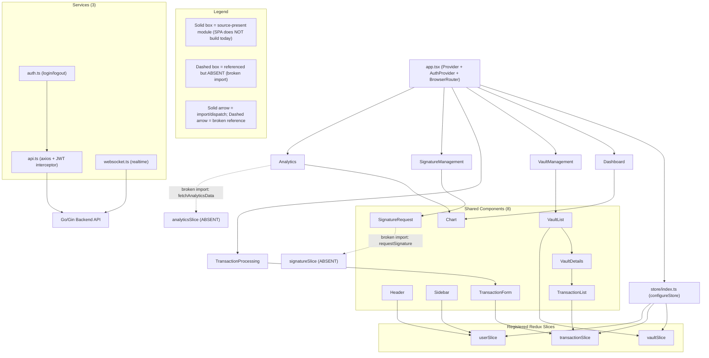

# Frontend Architecture

The frontend of the Blockchain Integration Service and Dashboard is a React 18 + TypeScript single-page application (SPA) whose global state is managed with Redux Toolkit and whose navigation is handled by React Router. `Source: frontend/src/app.tsx:L14-L38`, `Source: frontend/src/store/index.ts:L8-L12`. The application shell composes a Redux `Provider`, an `AuthProvider`, and a `BrowserRouter`, and it frames every routed page with a shared `Header` and `Sidebar`. `Source: frontend/src/app.tsx:L16-L34`. Server communication runs over an Axios client whose request interceptor attaches a JWT bearer token to every call, while a `WebSocketService` class opens a realtime channel that authenticates itself on connection. `Source: frontend/src/services/api.ts:L11-L17`, `Source: frontend/src/services/websocket.ts:L14-L21`. This page is the authoritative home of **Fig A3 — Frontend Component & State Architecture**, the component-and-state graph that complements the backend before/after pair — **Fig A1** and **Fig A2** — authored in [`overview.md`](overview.md).

## Maturity Legend

Every capability named on this page is tagged with the project-wide maturity discipline, consistent with the labeling used in [`overview.md`](overview.md) and [`data-model.md`](data-model.md):

- **Implemented** — present in code, building, and functional today. Reserved for genuinely working capability; at this checkpoint **nothing qualifies for it**, because the single-page application does not build.
- **Implemented-with-defects (source-present, non-buildable)** — the code is present and substantially written, but a compile-blocking defect prevents the SPA from building, so no runtime behavior can be claimed. This is the operational-truth label applied to every source-present frontend module shown as solid in **Fig A3**, consistent with [`scaffold-vs-design.md`](scaffold-vs-design.md).
- **Provisioned** — scaffolding or configuration exists, but the capability is not yet fully wired to run.
- **Designed** — specified in the design corpus (`documentation/*.md`), not yet present in code.

Two frontend-specific qualifications apply. First, the React component tree, the routing shell, the three registered Redux slices, and the three service modules are **source-present but non-buildable** (**Implemented-with-defects (source-present, non-buildable)**): the SPA does not compile today because it uses undeclared dependencies (`axios`, `zod`, `@reduxjs/toolkit`, `react-redux`), an `@/` path alias unsupported by `react-scripts`, absent store slices and absent store hooks, and named/default export mismatches — so no page renders at runtime. Specific broken store and utility references are called out below as **source-present defects** rather than hidden. Second, the visual styling of the UI is **Designed** only — the Technical Specification describes a "React with Tailwind CSS" frontend, but `frontend/package.json` declares no Tailwind dependency and the source tree contains zero `.css` files, so components carry `className` hooks with no accompanying stylesheet today. `Source: frontend/package.json`, `Source: documentation/Technical Specifications.md:§TECHNOLOGY STACK`.

## Fig A3 — Frontend Component & State Architecture

**Fig A3 — Frontend Component & State Architecture** maps the React application shell to its five routed pages, the eight shared components, the three registered Redux slices, and the three service modules. It deliberately renders the two broken store references — `analyticsSlice` and `signatureSlice` — as dashed nodes so that the difference between what is wired and what is merely referenced is legible at a glance. The figure is the frontend counterpart to the backend before/after pair in [`overview.md`](overview.md); it is referenced by name from the [Known Gaps and Divergences](#known-gaps-and-divergences) section below and re-expressed in the executive summary deck ([`../../blitzy-deck/executive-summary.html`](../../blitzy-deck/executive-summary.html)).

**Figure A3 — Frontend Component & State Architecture (React 18 + TypeScript, as-wired today)**



As the `Legend_A3` subgraph in **Fig A3** states, solid boxes and solid arrows denote source-present modules and their intended import/dispatch wiring — all **Implemented-with-defects (source-present, non-buildable)**, since the SPA does not build: `app.tsx` is written to compose the store and mount the five routed pages (**source-present, non-buildable**); the store registers the `vault`, `transaction`, and `user` slices (**source-present, non-buildable**); and the `Header`, `Sidebar`, `VaultList`, `VaultDetails`, `TransactionForm`, `TransactionList`, and `Chart` components are coded to read from or dispatch to those registered slices (**source-present, non-buildable**). `Source: frontend/src/app.tsx:L16-L34`, `Source: frontend/src/store/index.ts:L8-L12`. The dashed boxes `analyticsSlice (ABSENT)` and `signatureSlice (ABSENT)`, together with the dashed arrows into them, mark the two broken references (**source-present defect**): the `Analytics` page and the `SignatureRequest` component import from store slices that do not exist and that the store never registers. `Source: frontend/src/pages/Analytics.tsx:L7`, `Source: frontend/src/components/SignatureRequest.tsx:L3`, `Source: frontend/src/store/index.ts:L8-L12`. Both defects are dissected in the [Known Gaps and Divergences](#known-gaps-and-divergences) section.

## Pages and Routing

The router mounts five page components, each wrapped by the shared `Header` and `Sidebar` from the application shell. `Source: frontend/src/app.tsx:L20-L34`. The route-to-page mapping is declared directly in `app.tsx`.

| Route | Page component | Purpose | Maturity |
|-------|----------------|---------|----------|
| `/` | `Dashboard` | Landing overview that aggregates vaults, transactions, and a summary `Chart`; dispatches `fetchVaults` and `fetchTransactions` on mount. | Source-present (non-buildable) |
| `/vault-management` | `VaultManagement` | Create, list, and inspect custodial vaults via `VaultList` and `VaultDetails`; dispatches `fetchVaults`/`createVault`. | Source-present (non-buildable) |
| `/transaction-processing` | `TransactionProcessing` | Submit new transactions through `TransactionForm` and track them via `TransactionList`; dispatches `createTransaction`/`fetchTransactions`. | Source-present (non-buildable) |
| `/signature-management` | `SignatureManagement` | Request and monitor signatures via `SignatureRequest`; imports `requestSignature`/`checkSignatureStatus` from the absent `signatureSlice`. | Source-present (non-buildable) |
| `/analytics` | `Analytics` | Render analytics visualizations via `Chart`; imports `fetchAnalyticsData` from the absent `analyticsSlice` and reads `state.analytics.data`. | Source-present (non-buildable) |

The route declarations are at `Source: frontend/src/app.tsx:L25-L29`. The per-page slice wiring is verifiable in the page sources: `Dashboard` dispatches `fetchVaults`/`fetchTransactions` `Source: frontend/src/pages/Dashboard.tsx:L9-L10`; `VaultManagement` dispatches `fetchVaults`/`createVault` `Source: frontend/src/pages/VaultManagement.tsx:L8`; `TransactionProcessing` dispatches `createTransaction`/`fetchTransactions` `Source: frontend/src/pages/TransactionProcessing.tsx:L8`; `SignatureManagement` imports from the absent `signatureSlice` `Source: frontend/src/pages/SignatureManagement.tsx:L7`; and `Analytics` imports from the absent `analyticsSlice` `Source: frontend/src/pages/Analytics.tsx:L7`.

## Shared Components

Eight reusable components live under `frontend/src/components`. Each is **source-present but non-buildable**; where a component references an absent store slice it is additionally labeled a **source-present defect** and detailed in [Known Gaps and Divergences](#known-gaps-and-divergences).

| Component | Role | Store / utility dependencies | Maturity |
|-----------|------|------------------------------|----------|
| `Chart` | Data-visualization wrapper exposing `Line`, `Bar`, and `Pie` renderers. | chart.js, react-chartjs-2 (no store) | Source-present (non-buildable) |
| `Header` | Top navigation bar that reflects the current user. | `selectUser` from `userSlice` | Source-present (non-buildable) |
| `Sidebar` | Side navigation that reflects the current user. | `selectUser` from `userSlice` | Source-present (non-buildable) |
| `VaultList` | Lists vaults and renders `VaultDetails` for each. | `selectVaults`/`fetchVaults` from `vaultSlice` | Source-present (non-buildable) |
| `VaultDetails` | Shows a vault's detail and embeds `TransactionList`. | `utils/formatters` (`formatCurrency`, `truncateAddress`) | Source-present (non-buildable) |
| `TransactionForm` | Form that validates input and dispatches new transactions. | `createTransaction` from `transactionSlice`; `utils/validators` | Source-present (non-buildable) |
| `TransactionList` | Lists transactions with formatted amounts and dates. | `selectTransactions` from `transactionSlice`; `utils/formatters` | Source-present (non-buildable) |
| `SignatureRequest` | Requests a signature and polls its status. | `requestSignature`/`checkSignatureStatus` from the absent `signatureSlice`; `utils/formatters` | Source-present (non-buildable) |

Component wiring is verifiable in each source file: `Source: frontend/src/components/Chart.tsx:L2-L3`, `Source: frontend/src/components/Header.tsx:L3-L4`, `Source: frontend/src/components/Sidebar.tsx:L3-L4`, `Source: frontend/src/components/VaultList.tsx:L3-L4`, `Source: frontend/src/components/VaultDetails.tsx:L2-L3`, `Source: frontend/src/components/TransactionForm.tsx:L3-L4`, `Source: frontend/src/components/TransactionList.tsx:L3-L4`, `Source: frontend/src/components/SignatureRequest.tsx:L3-L4`.

## Services

Three service modules under `frontend/src/services` mediate all communication with the backend. The Axios client is the REST transport; `auth.ts` manages the session; and `websocket.ts` provides the realtime channel.

| Service | Responsibility | Key notes | Maturity |
|---------|----------------|-----------|----------|
| `api.ts` | Axios instance factory for backend REST calls. | Request interceptor attaches `Authorization: Bearer <token>`; response interceptor carries a 401-refresh TODO; calls plural paths `GET /vaults`, `POST /transactions`, `GET /signatures/:id`. | Source-present (non-buildable) |
| `auth.ts` | Session helpers `login`, `logout`, `isAuthenticated`. | `login` posts to `/auth/login`; persists the JWT via `utils/storage` (absent); imports `createApiInstance`, which `api.ts` does not export. | Source-present (non-buildable) |
| `websocket.ts` | `WebSocketService` realtime channel. | On open, sends `{ type: 'authenticate', token }`; reads the token from `utils/auth` (absent). | Source-present (non-buildable) |

The Axios request interceptor attaches the bearer token on every outbound call (**source-present, non-buildable**). `Source: frontend/src/services/api.ts:L11-L17`:

```ts
const token = await getAuthToken();
if (token) config.headers['Authorization'] = `Bearer ${token}`;
```

The response interceptor is a pass-through with an outstanding 401-refresh TODO (**source-present, non-buildable**, incomplete). `Source: frontend/src/services/api.ts:L19-L27`. The REST helpers call plural resource paths that diverge from the backend router. `Source: frontend/src/services/api.ts:L32-L46`. The session helpers post to `/auth/login` and persist the JWT. `Source: frontend/src/services/auth.ts:L4-L17`. The realtime channel authenticates on open by sending an `authenticate` message with the token. `Source: frontend/src/services/websocket.ts:L14-L21`.

## State Management (Redux Store)

The Redux store is assembled by a single `configureStore` call that registers exactly three reducers — `vault`, `transaction`, and `user` — with the Redux DevTools enhancer gated on `NODE_ENV`. `Source: frontend/src/store/index.ts:L8-L13` (**source-present, non-buildable**). The module exports only the `RootState` and `AppDispatch` types derived from the configured store; it does **not** export typed `useAppSelector`/`useAppDispatch` hooks, yet pages and components import those hooks from `@/store`, so those imports are unresolved — a compile-blocking defect. `Source: frontend/src/store/index.ts:L21-L22` (**source-present defect**).

| Registered reducer | Store key | Primary consumers | Maturity |
|--------------------|-----------|-------------------|----------|
| `vaultReducer` | `vault` | `VaultList`, `VaultManagement`, `Dashboard` | Source-present (non-buildable) |
| `transactionReducer` | `transaction` | `TransactionForm`, `TransactionList`, `TransactionProcessing`, `Dashboard` | Source-present (non-buildable) |
| `userReducer` | `user` | `Header`, `Sidebar` | Source-present (non-buildable) |

Critically, the store registers no `analytics` reducer and no `signature` reducer, so the `state.analytics.data` read in `Analytics` and the `signatureSlice` dispatches in `SignatureRequest` and `SignatureManagement` resolve against slices that are never mounted (**source-present defect**). `Source: frontend/src/store/index.ts:L8-L12`, `Source: frontend/src/pages/Analytics.tsx:L15`, `Source: frontend/src/components/SignatureRequest.tsx:L3`.


## Known Gaps and Divergences

The frontend scaffold is **source-present but non-buildable** as a component tree and routing shell, and it carries concrete defects and cross-boundary divergences. Consistent with the documentation-only scope of this deliverable, each is **documented, not fixed**; the code is left unmodified. The consolidated Implemented / Provisioned / Designed reconciliation is maintained in [`scaffold-vs-design.md`](scaffold-vs-design.md), and the resource-path contract is authoritative in [`../api-reference/overview.md`](../api-reference/overview.md).

### Broken `analyticsSlice` reference (source-present defect)

The `Analytics` page imports `fetchAnalyticsData` from `@/store/analyticsSlice` and reads `state.analytics.data`, but no `analyticsSlice` module exists in `frontend/src/store` and the store registers no `analytics` reducer. `Source: frontend/src/pages/Analytics.tsx:L7`, `Source: frontend/src/pages/Analytics.tsx:L15`, `Source: frontend/src/store/index.ts:L8-L12`. As a result, the `Analytics` page cannot resolve its state at runtime — the selector reads an undefined slice and the dispatched thunk has no reducer to service it. This is the dashed `analyticsSlice (ABSENT)` node and its dashed inbound arrow in **Fig A3**.

### Broken `signatureSlice` reference (related source-present defect)

The `SignatureRequest` component imports `requestSignature` and `checkSignatureStatus` from `@/store/signatureSlice`, which is likewise absent from the store. `Source: frontend/src/components/SignatureRequest.tsx:L3`, `Source: frontend/src/store/index.ts:L8-L12`. The same absent slice is imported by the `SignatureManagement` page. `Source: frontend/src/pages/SignatureManagement.tsx:L7`. This is the dashed `signatureSlice (ABSENT)` node and its dashed inbound arrow in **Fig A3**; both the component and the page fail to resolve their signature actions at runtime.

### API path and status vocabulary divergences (note)

The Axios client calls plural resource paths — `GET /vaults`, `POST /transactions`, and `GET /signatures/:id` — whereas the backend router exposes the singular vault group `/vault/*` alongside `/transactions/*` and `/signatures/*`, so the vault calls in particular do not line up. `Source: frontend/src/services/api.ts:L32-L46`. Independently, the client-side Zod transaction schema uses the status vocabulary `Pending | Completed | Failed`, which diverges from the backend's `Pending | Processed`. `Source: frontend/src/schema/transaction.ts:L10`. These divergences are cataloged in full in [`scaffold-vs-design.md`](scaffold-vs-design.md) and the endpoint contract is detailed in [`../api-reference/overview.md`](../api-reference/overview.md) (**Designed** reconciliation pending).

### Absent utility modules (source-present defect)

Three service modules import from utility modules that do not exist. `websocket.ts` and `api.ts` import `getAuthToken` from `utils/auth`, and `auth.ts` imports `setItem`/`getItem`/`removeItem` from `utils/storage`, but the `frontend/src/utils` directory contains only `formatters.ts` and `validators.ts`. `Source: frontend/src/services/websocket.ts:L1`, `Source: frontend/src/services/api.ts:L2`, `Source: frontend/src/services/auth.ts:L2`. Consequently, token retrieval and JWT persistence have no backing implementation today (**source-present defect**).

### Additional verified scaffold defects (note)

Two further inconsistencies were confirmed first-hand while mapping the shell and services, and are recorded here for completeness. First, `app.tsx` imports `AuthProvider` from `@/services/auth`, but `auth.ts` exports only `login`, `logout`, and `isAuthenticated` — no `AuthProvider` symbol is defined. `Source: frontend/src/app.tsx:L12`, `Source: frontend/src/services/auth.ts:L4-L43` (**source-present defect**). Second, `auth.ts` imports `createApiInstance` from `api.ts`, yet `api.ts` declares `createApiInstance` as a non-exported local constant and exports only `getVaults`, `createTransaction`, and `getSignatureStatus`. `Source: frontend/src/services/auth.ts:L1`, `Source: frontend/src/services/api.ts:L6`, `Source: frontend/src/services/api.ts:L32-L44` (**source-present defect**). Finally, several runtime libraries the source imports — `@reduxjs/toolkit`, `react-redux`, `chart.js`, `react-chartjs-2`, `zod`, and `axios` — are not declared in `frontend/package.json`, which lists only `react`, `react-dom`, `react-router-dom`, `react-scripts`, and testing utilities. `Source: frontend/package.json` (**Designed** dependency reconciliation pending). These are documented here and reconciled in [`scaffold-vs-design.md`](scaffold-vs-design.md).

## Monitoring & Analytics (MA-001) — Feature Status and User Guidance

MA-001 (the Monitoring & Analytics Dashboard) is delivered on the frontend by the `Dashboard` and `Analytics` pages and the shared `Chart` component, backed — in the designed target — by the observability stack documented in [`../operations/observability.md`](../operations/observability.md). Because the SPA does not build and the `analyticsSlice` is absent, **no part of MA-001 renders today**. The end-user workflow (open the dashboard, read each panel, act on missing data) is authored canonically in the *Monitoring & Analytics (MA-001)* section of the operations guide; the capability/status matrix below is the frontend-side summary and honest status for each MA-001 subrequirement drawn from the SRS.

| MA-001 capability | Delivery surface | Status | Source / Reference |
|-------------------|------------------|--------|--------------------|
| Dashboard overview (vault + transaction summary with summary `Chart`) | `Dashboard` page + `Chart` | Source-present (non-buildable) | `Source: frontend/src/pages/Dashboard.tsx:L9-L10` |
| Analytics visualizations | `Analytics` page + `Chart` | Source-present (non-buildable); broken `analyticsSlice` reference | `Source: frontend/src/pages/Analytics.tsx:L7,L15` |
| Real-time metric feed | `websocket.ts` channel + backend `/metrics` | Designed (no backend WebSocket route; `/metrics` absent) | `Source: frontend/src/services/websocket.ts:L1`; [`../operations/observability.md`](../operations/observability.md) |
| Custom reports / export | — | Designed (not present in code) | `Source: documentation/Software Requirements Specifications (SRS).md:§Features (MA-001)` |
| Alerting / notifications | — | Designed | [`../operations/runbook.md`](../operations/runbook.md) |
| Troubleshooting workflow | operations guide | Documented (static, no runtime) | [`../operations/observability.md`](../operations/observability.md) |

For the step-by-step monitoring-and-analytics user workflow and troubleshooting, see the *Monitoring & Analytics (MA-001)* section of [`../operations/observability.md`](../operations/observability.md). Prerequisites for running the SPA at all (undeclared dependencies, `@/` alias, absent slices) are covered in [`../getting-started/local-development.md`](../getting-started/local-development.md).

## Documentation & Training Index

New engineers and operators onboard through the guides below; each is task-oriented (setup, usage, troubleshooting) and labels every capability with its maturity. This index is the training map for the five SRS features and the onboarding/deployment paths until the planned root navigation page (`docs/index.md`) is published.

| Audience task | Guide | Feature / Area |
|---------------|-------|----------------|
| Manage vaults | [`../guides/vault-management.md`](../guides/vault-management.md) | VM-001 |
| Process transactions | [`../guides/transaction-processing.md`](../guides/transaction-processing.md) | TP-001 |
| Request and monitor signatures | [`../guides/signature-management.md`](../guides/signature-management.md) | SG-001 |
| Authenticate and manage access | [`../api-reference/authentication.md`](../api-reference/authentication.md) | UA-001 |
| Monitor and analyze | [`../operations/observability.md`](../operations/observability.md) | MA-001 |
| Install and configure locally | [`../getting-started/installation.md`](../getting-started/installation.md), [`../getting-started/configuration.md`](../getting-started/configuration.md) | Onboarding |
| Deploy | [`../guides/deployment.md`](../guides/deployment.md) | Operations |

## Related Documentation

The frontend architecture is one page in a set of sibling architecture and reference documents:

- [`overview.md`](overview.md) — the system overview and the backend before/after pair, **Fig A1 — Current Implemented Scaffold** and **Fig A2 — Designed Target Architecture**.
- [`backend.md`](backend.md) — the Go/Gin layered modular monolith, dependency injection, and wiring-gap detail.
- [`data-flow.md`](data-flow.md) — the authentication, transaction-settlement, and signature sequences plus the end-to-end data flow that the pages and services above participate in.
- [`data-model.md`](data-model.md) — the five persisted entities and their relationships in **Fig M1 — Data Model ERD** ([`data-model.md#fig-m1--data-model-erd`](data-model.md#fig-m1--data-model-erd)), which the client-side Zod schemas mirror.
- [`scaffold-vs-design.md`](scaffold-vs-design.md) — the consolidated Implemented / Provisioned / Designed matrix that reconciles every gap named on this page.
- [`../api-reference/overview.md`](../api-reference/overview.md) — the authoritative public HTTP contract for the 18 endpoints, including the resource-path reconciliation.

Feature-level walkthroughs for the pages documented above are provided in the user guides: [`../guides/vault-management.md`](../guides/vault-management.md), [`../guides/transaction-processing.md`](../guides/transaction-processing.md), and [`../guides/signature-management.md`](../guides/signature-management.md).

