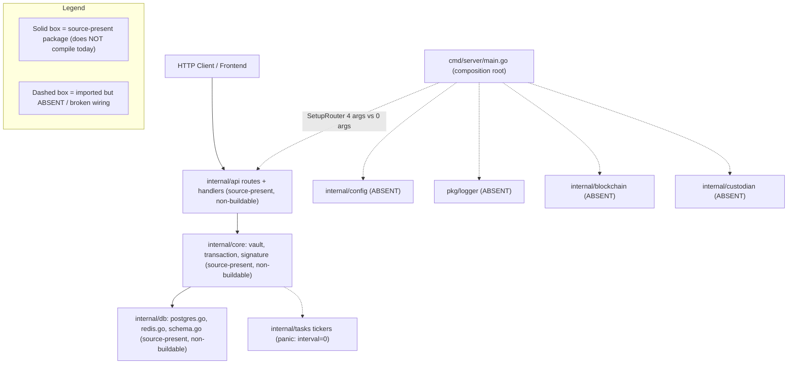
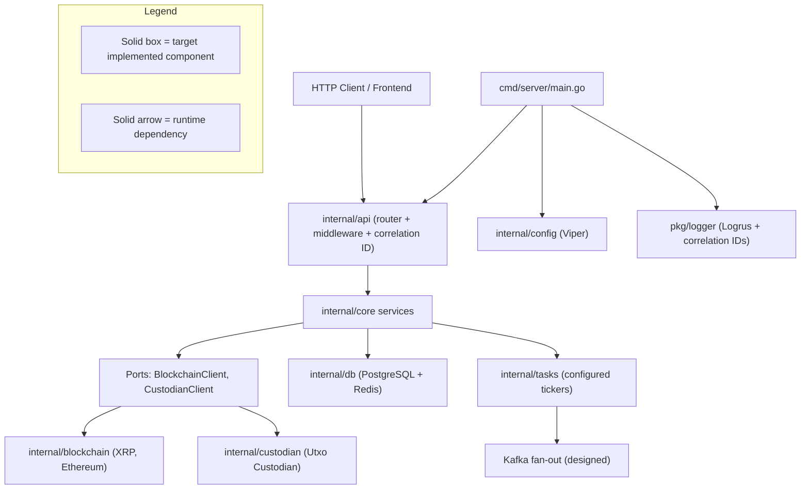

# Architecture Overview

The Blockchain Integration Service and Dashboard is a custodial blockchain platform whose domain is vaults, signatures, and transactions, delivered as a Go/Gin backend paired with a React 18 + TypeScript frontend, with initial support for the XRP Ledger and the Ethereum network. `Source: documentation/Technical Specifications.md:§SYSTEM OVERVIEW`, `Source: backend/internal/db/schema.go:L11-L68`. The backend is organized as a **layered modular monolith**: an HTTP router and its handlers delegate to core services that are constructed via `NewXService` dependency injection, and those services in turn use a database layer for persistence. `Source: backend/internal/api/routes.go:L9-L54`, `Source: backend/internal/core/vault/service.go:L15`. The composition root wires these layers together and launches two background processors in `main.go`. `Source: backend/cmd/server/main.go:L17-L62`. This page is the authoritative home of the mandatory before/after architecture pair — **Fig A1 — Current Implemented Scaffold** (the system exactly as it is wired in code today) and **Fig A2 — Designed Target Architecture** (the intended end state drawn from the design corpus) — which are shared assets referenced by [`scaffold-vs-design.md`](scaffold-vs-design.md) and the executive summary deck ([`../../blitzy-deck/executive-summary.html`](../../blitzy-deck/executive-summary.html)). `Source: documentation/Technical Specifications.md:§HIGH-LEVEL ARCHITECTURE DIAGRAM`. Because this documentation depicts a change of architectural state, **both** states are shown; the target is never presented alone.

## Maturity Legend

Every capability named on this page is tagged with the project-wide maturity discipline, consistent with the labeling used across the documentation set and in [`data-model.md`](data-model.md):

- **Implemented** — present in code, building, and functional today. Reserved for genuinely working capability; at this checkpoint **nothing qualifies for it**, because the backend has no Go module and every package carries a compile-blocking defect (and the frontend does not build).
- **Implemented-with-defects (source-present, non-buildable)** — the code is present and substantially written, but a compile-blocking defect prevents its module from building, so no runtime behavior can be claimed. This is the operational-truth label that applies to every source-present capability shown as solid in **Fig A1**, consistent with [`scaffold-vs-design.md`](scaffold-vs-design.md).
- **Provisioned** — scaffolding or configuration exists, but the capability is not yet fully wired to run.
- **Designed** — specified in the design corpus (`documentation/*.md`), not yet present in code.

The consolidated Implemented / Provisioned / Designed matrix that reconciles the design corpus against the on-disk scaffold — including the full catalog of known defects — is maintained in [`scaffold-vs-design.md`](scaffold-vs-design.md).

## Fig A1 — Current Implemented Scaffold (Backend)

**Fig A1 — Current Implemented Scaffold** shows the backend exactly as it is wired today: the request-handling path is present in source but does **not** build — the composition root imports several packages that do not exist and calls into the router and background tasks with mismatched signatures, and there is no `go.mod` anywhere, so nothing runs. The figure deliberately renders these gaps rather than hiding them, so that the difference between what is present in source and what is merely referenced is legible at a glance. Every solid box in the figure is **Implemented-with-defects (source-present, non-buildable)**, not functional.

**Figure A1 — Current Implemented Scaffold (Backend, as-wired today)**

As the `Legend_A1` subgraph in **Fig A1** states, solid boxes and arrows denote packages that are **present in source but do not compile today** — every one is **Implemented-with-defects (source-present, non-buildable)**, not functional: the router and handlers under `internal/api` *declare* 18 REST routes across the auth, vault, transaction, and signature resources, but the `api` package does not build (handler struct types are referenced as package values and several referenced handler methods do not exist); the three core services under `internal/core` *define* their constructors and methods, but each imports the absent `internal/blockchain`/`internal/custodian`/`pkg/utils` and references the undefined `db.Repository`, so none compiles; and the `internal/db` layer (`postgres.go`, `redis.go`, `schema.go`) *declares* persistence and the five GORM entities, but imports the absent `internal/config` and declares the undefined type `gorm.JSONMap`, so it does not build either. No request is actually served today. `Source: backend/internal/api/routes.go:L9-L54`, `Source: backend/internal/core/vault/service.go:L6-L15`, `Source: backend/internal/db/schema.go:L11-L68`, `Source: backend/internal/db/postgres.go:L7`.

The dashed elements are the wiring gaps that make the scaffold non-runnable as composed, and four of them are visible at the architecture level (**Designed** targets that are absent or broken in code today):

- **Absent-but-imported packages** — the composition root imports `internal/config`, `internal/blockchain`, `internal/custodian`, `pkg/logger`, and `internal/api/middleware`, none of which exist in the tree (**Designed**). `Source: backend/cmd/server/main.go:L6-L12`.
- **Router-signature mismatch** — `main.go` calls `api.SetupRouter(router, dbConn, blockchainClients, custodianClient)` with four arguments, but the router defines `SetupRouter()` with none, so the call does not compile (**Designed** correction pending). `Source: backend/cmd/server/main.go:L52`, `Source: backend/internal/api/routes.go:L9`.
- **Uninitialized ticker panic (latent)** — `transactionCheckInterval` is declared but never assigned, so `time.NewTicker(transactionCheckInterval)` evaluates to `time.NewTicker(0)`, which *would* panic at startup. The panic is **latent, not the first failure**: the `tasks` package does not compile either — it imports the absent `pkg/logger` — and there is no `go.mod`, so the build fails before any ticker is constructed, and the panic becomes reachable only once the compile blockers above are resolved (**Designed** correction pending). `Source: backend/internal/tasks/transaction_processor.go:L13-L16`, `Source: backend/internal/tasks/transaction_processor.go:L10`.
- **No module manifest** — there is no `go.mod`, so the module is not buildable as checked in (**Designed**). `Source: backend/cmd/server/main.go:L6-L12`.

The full defect catalog is reconciled in [`scaffold-vs-design.md`](scaffold-vs-design.md), and the layer-by-layer wiring detail — including how the core services consume the database layer — is documented in [`backend.md`](backend.md).

## Fig A2 — Designed Target Architecture

**Fig A2 — Designed Target Architecture** shows the same backend once the design corpus is fully realized: the absent packages are present, the router and ticker wiring is corrected, external systems sit behind explicit ports, and the asynchronous settlement path publishes to a Kafka fan-out. Every component in this figure is **Designed** unless it already appears as solid in **Fig A1**.

**Figure A2 — Designed Target Architecture (fully wired)**

As the `Legend_A2` subgraph in **Fig A2** clarifies, every box is a target-state component and every arrow is a runtime dependency. Relative to **Fig A1**, the target adds the four capabilities that are absent today: centralized configuration via `internal/config` (**Designed**), structured logging via `pkg/logger` with correlation IDs (**Designed**), and the `internal/blockchain` (XRP, Ethereum) and `internal/custodian` (Utxo Custodian) adapters (**Designed**). It corrects the router wiring so `internal/api` composes a router with middleware and a correlation-ID stage (**Designed**), and it configures the `internal/tasks` tickers so the settlement processors run on a real interval instead of panicking (**Designed**). It also introduces a ports-and-adapters boundary — the `BlockchainClient` and `CustodianClient` ports — so the core services depend on interfaces rather than concrete integrations (**Designed**), and it adds the Kafka fan-out on the asynchronous settlement path (**Designed**). `Source: documentation/Technical Specifications.md:§HIGH-LEVEL ARCHITECTURE DIAGRAM`.

## From Scaffold to Target

As shown in **Figure A1** and **Figure A2**, the transition from the current scaffold to the designed target is additive and corrective rather than a rewrite of the request-handling core. The router, core services, and database layer that are source-present (**Implemented-with-defects (source-present, non-buildable)**) in **Fig A1** carry forward into **Fig A2** once their compile-blocking defects are resolved; the target supplies what is missing and repairs what is mis-wired so that the same source can build and run:

- Add centralized configuration through `internal/config` (Viper) (**Designed**). `Source: backend/cmd/server/main.go:L6-L12`.
- Add structured logging through `pkg/logger` (Logrus) with correlation IDs propagated across requests (**Designed**). `Source: backend/cmd/server/main.go:L6-L12`.
- Add the `internal/blockchain` and `internal/custodian` adapters behind the `BlockchainClient` and `CustodianClient` ports (**Designed**). `Source: documentation/Technical Specifications.md:§HIGH-LEVEL ARCHITECTURE DIAGRAM`.
- Configure the `internal/tasks` tickers with a real interval, eliminating the `time.NewTicker(0)` startup panic (**Designed** correction). `Source: backend/internal/tasks/transaction_processor.go:L13-L16`.
- Reconcile the `SetupRouter` signature so the composition root and the router agree on their contract (**Designed** correction). `Source: backend/cmd/server/main.go:L52`, `Source: backend/internal/api/routes.go:L9`.
- Introduce the Kafka fan-out on the asynchronous settlement path (**Designed**). `Source: documentation/Technical Specifications.md:§HIGH-LEVEL ARCHITECTURE DIAGRAM`.

This is the intended architectural evolution of the system; **nothing in this list is implemented by this documentation deliverable** — the figures and narrative describe the target so that engineers can reconcile the scaffold against it, and the code itself is left unmodified.

Beyond the backend composition shown in **Fig A2**, the wider designed runtime topology places the platform on managed cloud infrastructure: a Load Balancer fronts the React frontend, which calls an API Gateway that routes to the Golang backend, which in turn depends on RDS PostgreSQL, ElastiCache Redis, MSK Kafka, S3, and Secrets Manager, and reaches out to the Utxo Custodian, the XRP Ledger, and the Ethereum network (**Designed**). `Source: documentation/Technical Specifications.md:§HIGH-LEVEL ARCHITECTURE DIAGRAM`. That deployment view is documented as **Fig O2 — Deployment Topology** in [`../guides/deployment.md`](../guides/deployment.md).

## Related Documentation

The architecture is described across a set of sibling pages; this overview leads with the before/after pair and links out to the detail:

- [`backend.md`](backend.md) — the layered modular monolith, dependency injection, and the wiring-gap detail behind **Fig A1**.
- [`frontend.md`](frontend.md) — the React 18 + TypeScript component and Redux state architecture (**Fig A3**).
- [`data-flow.md`](data-flow.md) — the authentication, transaction-settlement, and signature sequences plus the end-to-end data flow.
- [`data-model.md`](data-model.md) — the five persisted entities and their relationships, shown in **Fig M1 — Data Model ERD** ([`data-model.md#fig-m1--data-model-erd`](data-model.md#fig-m1--data-model-erd)).
- [`scaffold-vs-design.md`](scaffold-vs-design.md) — the Implemented / Provisioned / Designed reconciliation matrix that these figures anchor.

The public HTTP contract for the 18 endpoints is documented in [`../api-reference/overview.md`](../api-reference/overview.md), and the entity definitions those endpoints operate on are catalogued in [`data-model.md`](data-model.md) (**Fig M1**).
