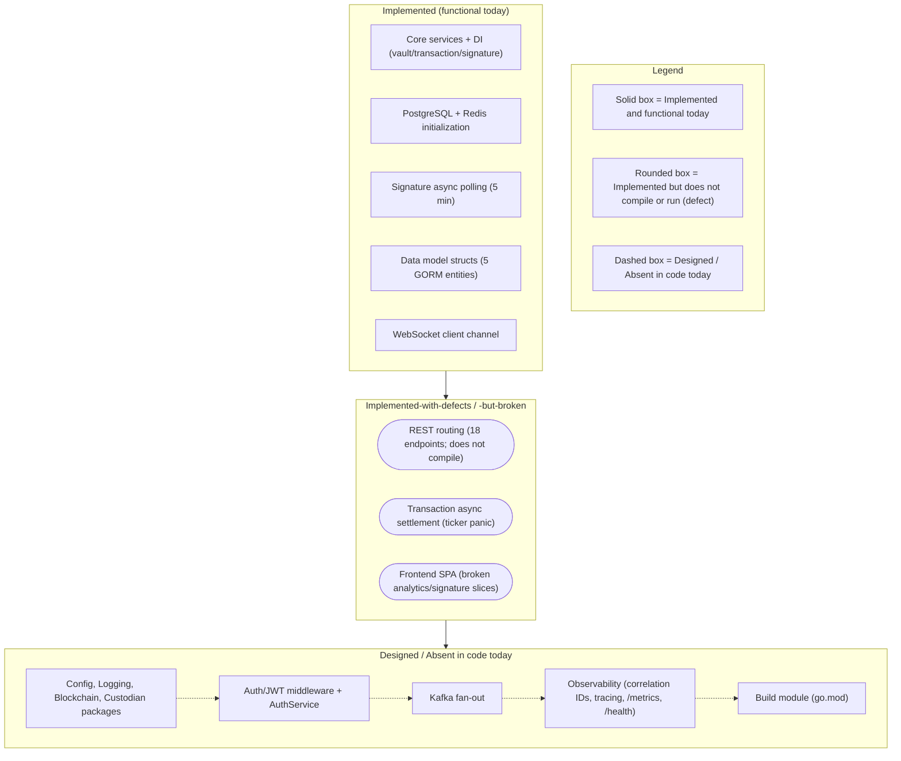

# Scaffold vs. Design Reconciliation

This repository pairs a rich, aspirational design corpus (`documentation/*.md` and the root `README.md`) with an early-stage code scaffold, and the two do not yet agree. This page is the honesty backbone of the documentation set: it states the accurate current state of the system as it exists on disk, labels every capability with an explicit maturity level, and enumerates the full catalog of known defects so that engineers can reconcile the scaffold against its intended target without surprises. Nothing here is aspirational — every row is grounded in a cited source location, and every gap is documented rather than hidden. Consistent with the maturity narrative used throughout the Technical Specification and the sibling architecture pages, each capability is tagged **Implemented**, **Provisioned**, or **Designed** (with the qualifiers *-with-defects* and *-but-broken* applied where a capability is present in code but does not compile or run). `Source: documentation/Technical Specifications.md:§SYSTEM OVERVIEW`, `Source: backend/cmd/server/main.go:L17-L62`.

This reconciliation is the consolidated matrix that both [`overview.md`](overview.md) and [`data-model.md`](data-model.md) point to as the single source of truth for maturity and defects; it is referenced from across the documentation set for exactly that purpose.

## Maturity Legend

Every capability named on this page is tagged with the project-wide maturity discipline, consistent with the labeling used across the documentation set:

- **Implemented** — present and functional in the code as-declared today.
- **Provisioned** — scaffolding or configuration exists, but the capability is not yet fully wired to run.
- **Designed** — specified in the design corpus (`documentation/*.md`), not yet present in code.

Two composite qualifiers are used where a capability straddles these states:

- **Implemented-with-defects** — the code is present and substantially written, but a compile-blocking defect prevents the containing module from building.
- **Implemented-but-broken** — the code is present and compiles in isolation, but a runtime defect (for example, a startup panic) prevents it from operating.

## Visual Anchors — Fig A1 and Fig A2

The before/after architecture pair that anchors this reconciliation is authored once, in [`overview.md`](overview.md), and referenced here by name rather than redrawn. Read this page alongside them:

- **Fig A1 — Current Implemented Scaffold** ([`overview.md#fig-a1--current-implemented-scaffold-backend`](overview.md#fig-a1--current-implemented-scaffold-backend)) renders the backend exactly as it is wired today, deliberately showing the absent packages and mismatched signatures as dashed, broken edges. It is the visual companion to the Defect Catalog below. `Source: backend/cmd/server/main.go:L17-L62`, `Source: backend/internal/api/routes.go:L9-L54`.
- **Fig A2 — Designed Target Architecture** ([`overview.md#fig-a2--designed-target-architecture`](overview.md#fig-a2--designed-target-architecture)) renders the same backend once the design corpus is fully realized: the absent packages are present, the router and ticker wiring is corrected, external systems sit behind explicit ports, and the settlement path publishes to a Kafka fan-out. It is the visual companion to the Maturity Matrix rows tagged **Designed**. `Source: documentation/Technical Specifications.md:§HIGH-LEVEL ARCHITECTURE DIAGRAM`.

Because this documentation depicts a change of architectural state, **both** states are shown in **Fig A1** and **Fig A2**; the target is never presented alone. The reconciliation narrative in the [From Scaffold to Target](#from-scaffold-to-target) section below walks the path between the two figures by name.

**Fig SD1 — Maturity Distribution at a Glance** is a small summary diagram, local to this page, that groups the platform's capabilities into their current maturity buckets. It complements — and does not replace — **Fig A1** and **Fig A2**; consult those figures for the authoritative wiring detail.

**Figure SD1 — Maturity Distribution at a Glance (capabilities grouped by current maturity)**

As **Fig SD1 — Maturity Distribution at a Glance** shows, the request-handling core and persistence layer are genuinely **Implemented**, a middle band of capabilities is present in code but blocked by defects, and an outer band of integration, observability, and build capabilities is **Designed** but absent. The Maturity Matrix and Defect Catalog that follow give the cited, row-by-row detail behind each bucket.

## Maturity Matrix

The following matrix reconciles every major capability of the platform against its current maturity. It is the consolidated view that the sibling pages defer to; the deeper wiring, model, and frontend detail behind individual rows lives in [`backend.md`](backend.md), [`data-model.md`](data-model.md), [`data-flow.md`](data-flow.md), and [`frontend.md`](frontend.md). Every row carries a source citation; the defect qualifiers used below are expanded, item by item, in the [Defect Catalog](#defect-catalog).

| Capability | Maturity | Evidence (Source) |
|------------|----------|-------------------|
| REST routing (18 endpoints defined across auth/vault/transaction/signature) | **Implemented-with-defects** (defined but does not compile) | `Source: backend/internal/api/routes.go:L9-L54` |
| Core services + dependency injection (vault, transaction, signature) | **Implemented** | `Source: backend/internal/core/vault/service.go`, `Source: backend/internal/core/transaction/service.go`, `Source: backend/internal/core/signature/service.go` |
| Data model (5 GORM entities: Organization, User, Vault, Transaction, Signature) | **Implemented** (structs) / **Provisioned** (no migrations) | `Source: backend/internal/db/schema.go:L11-L68` |
| PostgreSQL + Redis initialization | **Implemented** | `Source: backend/internal/db/postgres.go:L12-L33`, `Source: backend/internal/db/redis.go` |
| Transaction async settlement (ticker-driven processor) | **Implemented-but-broken** (uninitialized ticker panic) | `Source: backend/internal/tasks/transaction_processor.go:L13-L16` |
| Signature async polling (5-minute interval) | **Implemented** | `Source: backend/internal/tasks/signature_processor.go:L13` |
| Blockchain adapters (XRP Ledger, Ethereum) | **Designed** (`internal/blockchain` absent) | `Source: backend/cmd/server/main.go:L8` |
| Custodian adapter (Utxo Custodian) | **Designed** (`internal/custodian` absent) | `Source: backend/cmd/server/main.go:L9` |
| Configuration management | **Designed** (`internal/config` absent) | `Source: backend/cmd/server/main.go:L6` |
| Structured logging (`pkg/logger`) | **Designed** (absent; `gin.Logger()` reused today) | `Source: backend/cmd/server/main.go:L10`, `Source: backend/internal/api/routes.go:L13` |
| Auth/JWT middleware + AuthService | **Designed** (`internal/api/middleware`, `internal/core/auth` absent) | `Source: backend/cmd/server/main.go:L12`, `Source: backend/internal/api/handlers/auth.go:L5` |
| Kafka fan-out on the settlement path | **Designed** | `Source: documentation/Technical Specifications.md:§DATA-FLOW DIAGRAM` |
| Analytics | **Designed** / broken frontend slice | `Source: frontend/src/pages/Analytics.tsx:L7`, `Source: frontend/src/store/index.ts:L8-L12` |
| Frontend SPA (5 pages, 8 components, 3 slices) | **Implemented-with-defects** (broken slice references) | `Source: frontend/src/app.tsx`, `Source: frontend/src/store/index.ts:L8-L12` |
| WebSocket realtime channel | **Implemented** (client) / **Designed** (server) | `Source: frontend/src/services/websocket.ts` |
| Observability (correlation IDs, tracing, `/metrics`, `/health`, `/ready`) | **Designed** | see [`../operations/observability.md`](../operations/observability.md) |
| Build / module manifest (`go.mod`) | **Absent (Designed)** | repository-wide (no `go.mod`/`go.sum`) |

Read together, the matrix makes the reconciliation concrete: the router, core services, database initialization, the data-model structs, and the signature poller are **Implemented**; the REST routing, transaction settlement, and frontend SPA are present but carry defects that block compilation or runtime; and the external integrations, centralized configuration, logging, auth middleware, Kafka fan-out, observability stack, and the Go module manifest are **Designed** but not yet in code.

## Defect Catalog

The following catalog enumerates every known defect that separates the current scaffold from its designed target. Each defect was verified first-hand against the code at the cited locator, and each is **documented, not fixed** — this documentation deliverable modifies no source, infrastructure, test, or CI code. The **Impact** column classifies each defect as one of *compile-blocking* (prevents the module from building), *runtime-crash* (builds in isolation but fails at runtime), *behavioral-divergence* (compiles and runs, but two parts of the system disagree on a contract), or *documentation-accuracy* (a published document contradicts the code).

| # | Defect | Type | Impact | Source |
|---|--------|------|--------|--------|
| 1 | Router-signature mismatch: the composition root calls `api.SetupRouter(router, dbConn, blockchainClients, custodianClient)` with four arguments, but the router declares `func SetupRouter() *gin.Engine` with none | Signature mismatch | compile-blocking | `Source: backend/cmd/server/main.go:L52`, `Source: backend/internal/api/routes.go:L9` |
| 2 | Uninitialized ticker panic: `var transactionCheckInterval time.Duration` is never assigned (zero value), so `time.NewTicker(transactionCheckInterval)` is `time.NewTicker(0)` and panics at startup; contrast the correct `const signatureCheckInterval = 5 * time.Minute` | Uninitialized value | runtime-crash | `Source: backend/internal/tasks/transaction_processor.go:L13-L16`, `Source: backend/internal/tasks/signature_processor.go:L13` |
| 3 | Processor signature mismatch: `StartTransactionProcessor(ctx, redisClient, txService)` and `StartSignatureProcessor(ctx, redisClient, sigService)` are invoked with `(dbConn, blockchainClients, custodianClient)` | Signature mismatch | compile-blocking | `Source: backend/internal/tasks/transaction_processor.go:L15`, `Source: backend/internal/tasks/signature_processor.go:L15`, `Source: backend/cmd/server/main.go:L55-L56` |
| 4 | Database initialization mismatch and mixed persistence: `db.InitDB(cfg.DatabaseURL)` (one argument, two returns) plus `dbConn.Close()` versus `func InitDB() error` (no arguments, one return); the `db` package connects via `sqlx` while `schema.go` declares GORM models | Signature mismatch + mixed persistence | compile-blocking | `Source: backend/cmd/server/main.go:L31`, `Source: backend/cmd/server/main.go:L35`, `Source: backend/internal/db/postgres.go:L10-L18`, `Source: backend/internal/db/schema.go:L1-L9` |
| 5 | Absent-but-imported packages and missing module manifest: `internal/config`, `pkg/logger`, `internal/blockchain`, `internal/custodian`, `internal/api/middleware`, `pkg/utils`, and `internal/core/auth` are imported but their directories do not exist, and there is no `go.mod`/`go.sum` anywhere | Missing packages / no module | compile-blocking | `Source: backend/cmd/server/main.go:L6-L12` |
| 6 | Absent `db` package symbols: `db.Repository`, `db.TransactionStatusPending`, `db.TransactionStatusProcessed`, `db.GetPendingTransactions`, `db.UpdateTransaction`, `db.GetPendingSignatures`, and `db.UpdateSignature` are referenced but undefined (the `db` package defines only `InitDB`/`CloseDB`/`InitRedis`/`CloseRedis`) | Undefined references | compile-blocking | `Source: backend/internal/core/transaction/service.go:L13`, `Source: backend/internal/core/transaction/service.go:L46`, `Source: backend/internal/tasks/transaction_processor.go:L35`, `Source: backend/internal/tasks/transaction_processor.go:L48` |
| 7 | Handler-to-route and handler-to-service mismatches: routes reference `handlers.VaultHandler`/`TransactionHandler`/`SignatureHandler` as package variables though they are struct types; `signature.go` defines `GetRawSignature`/`CheckSignatureStatus` while routes reference `CreateSignature`/`ListSignatures`/`GetSignature`/`UpdateSignature`/`DeleteSignature`; the transaction handler calls `service.CreateTransaction(req)` (one argument) versus the four-argument service method; the transaction service builds a `db.Transaction` with `ToAddress` and `RawTx` fields that are absent from `schema.go` | Type / signature mismatch | compile-blocking | `Source: backend/internal/api/routes.go:L27-L51`, `Source: backend/internal/api/handlers/signature.go:L20-L45`, `Source: backend/internal/api/handlers/transaction.go:L20-L34`, `Source: backend/internal/core/transaction/service.go:L40-L48` |
| 8 | Dual-identifier GORM inconsistency: every entity embeds `gorm.Model` (which supplies `ID uint`, `CreatedAt`, `UpdatedAt`, `DeletedAt`) and also redeclares `ID uuid.UUID`, `CreatedAt`, and `UpdatedAt`, creating conflicting primary-key semantics and duplicate timestamps | Schema modeling conflict | behavioral-divergence | `Source: backend/internal/db/schema.go:L11-L18` (Organization is representative; all five entities share the pattern) |
| 9 | API path disagreement (three-way): backend routes are singular and unprefixed (`/vault/create`, `/vault/list`, `/vault/:id`); the frontend calls plural (`/vaults`, `/transactions`, `/signatures/:id`); and the Technical Specification documents `/api/v1/...` | Contract divergence | behavioral-divergence | `Source: backend/internal/api/routes.go:L25-L31`, `Source: frontend/src/services/api.ts:L32-L46`, `Source: documentation/Technical Specifications.md:§API DESIGN` |
| 10 | Transaction status vocabulary mismatch: the frontend Zod enum validates `['Pending','Completed','Failed']` while the backend uses `Pending`/`Processed` (via `db.TransactionStatusPending` and `db.TransactionStatusProcessed`) | Contract divergence | behavioral-divergence | `Source: frontend/src/schema/transaction.ts:L10`, `Source: backend/internal/core/transaction/service.go:L46`, `Source: backend/internal/core/transaction/service.go:L81` |
| 11 | Broken `analyticsSlice` (and related `signatureSlice`): `Analytics.tsx` imports `fetchAnalyticsData` from `@/store/analyticsSlice` and reads `state.analytics.data`, but the store registers only `vault`/`transaction`/`user`; `SignatureRequest.tsx` similarly imports from an absent `@/store/signatureSlice` | Missing module reference | compile-blocking (frontend build) | `Source: frontend/src/pages/Analytics.tsx:L7`, `Source: frontend/src/store/index.ts:L8-L12`, `Source: frontend/src/components/SignatureRequest.tsx:L3` |
| 12 | Documentation-accuracy defects (context): the root `README.md` describes a Node/Express/MongoDB stack and links to nonexistent files, and `Technical Specifications.md` previously claimed a Tailwind CSS frontend though `frontend/package.json` declares none; these are corrected elsewhere in this deliverable (root `README.md` and `documentation/Technical Specifications.md`) | Documentation accuracy | documentation-accuracy | `Source: frontend/package.json` |

Defects 1 through 7 and 11 prevent the code from building or starting as-is; defects 8, 9, and 10 compile and run but reflect contracts that two parts of the system disagree on; defect 12 is a documentation-accuracy issue corrected by other files in this same deliverable. None of these defects is altered by this page.

## From Scaffold to Target

The transition from **Fig A1 — Current Implemented Scaffold** to **Fig A2 — Designed Target Architecture** is additive and corrective rather than a rewrite. As **Fig A1** shows, the router, core services, and database layer already work; as **Fig A2** shows, the target simply supplies what is missing and repairs what is mis-wired. Concretely, the path from scaffold to target comprises the following moves, each mapped back to a Maturity Matrix row and a Defect Catalog entry:

- **Supply the absent packages behind ports.** Add `internal/config`, `pkg/logger`, `internal/blockchain`, and `internal/custodian`, with the blockchain and custodian integrations sitting behind the `BlockchainClient` and `CustodianClient` ports so the core services depend on interfaces rather than concrete clients (Defect 5). `Source: backend/cmd/server/main.go:L6-L12`.
- **Fix the router and ticker wiring.** Reconcile the `SetupRouter` signature between the composition root and the router (Defect 1), align the two background-processor call sites with their declared signatures (Defect 3), and initialize the transaction ticker with a real interval so the settlement processor stops panicking at startup (Defect 2). `Source: backend/cmd/server/main.go:L52`, `Source: backend/internal/tasks/transaction_processor.go:L13-L16`.
- **Define the missing `db` surface and settle on one ORM.** Introduce the `db.Repository` type, the transaction/signature status constants, and the pending-query and update helpers, and resolve the `sqlx`-versus-GORM split so persistence is coherent (Defects 4 and 6). `Source: backend/internal/db/postgres.go:L10-L18`, `Source: backend/internal/db/schema.go:L1-L9`.
- **Introduce the Kafka fan-out and analytics.** Add the designed Kafka fan-out on the asynchronous settlement path and the frontend `analyticsSlice`/`signatureSlice` that pages and components already import (Defects 11; Kafka row). `Source: documentation/Technical Specifications.md:§DATA-FLOW DIAGRAM`, `Source: frontend/src/store/index.ts:L8-L12`.
- **Reconcile the API paths and status vocabularies.** Converge the singular/plural/`/api/v1` path disagreement and the `Processed`-versus-`Completed`/`Failed` transaction status vocabulary on a single contract (Defects 9 and 10). `Source: backend/internal/api/routes.go:L25-L31`, `Source: frontend/src/schema/transaction.ts:L10`.
- **Author the module manifest.** Add `go.mod`/`go.sum` so the backend is a buildable Go module and the dual-identifier GORM modeling can be corrected against a real schema (Defect 8; build row). `Source: backend/internal/db/schema.go:L11-L18`.

This is the intended architectural evolution described by **Fig A2**; **none of it is implemented by this documentation deliverable**. The figures and this narrative describe the target so that engineers can reconcile the scaffold against it, and the code itself is left unmodified.

## Related Documentation

This reconciliation is the map; the following sibling pages hold the detailed treatment of each area and the fixes that a future engineering effort would apply:

- [`overview.md`](overview.md) — the authoritative home of **Fig A1** and **Fig A2**, the before/after pair this page reconciles against.
- [`backend.md`](backend.md) — the composition-root wiring, dependency injection, and the wiring-gap callouts behind Defects 1 through 6.
- [`frontend.md`](frontend.md) — the React/Redux architecture and the broken `analyticsSlice`/`signatureSlice` references (Defect 11).
- [`data-model.md`](data-model.md) — the five entities and the dual-identifier GORM inconsistency (Defect 8), documented in its [Gap Notes](data-model.md#gap-notes).
- [`data-flow.md`](data-flow.md) — the settlement sequence that surfaces the ticker panic (Defect 2) and the Kafka publish shown as **Designed** in **Fig B3**.
- [`../api-reference/overview.md`](../api-reference/overview.md) — the public HTTP contract and the resolution of the `/api/v1` path-prefix disagreement (Defect 9).
- [`../operations/runbook.md`](../operations/runbook.md) — the operational failure modes, including the ticker-panic startup crash and settlement retries.
- [`../operations/observability.md`](../operations/observability.md) — the reused-versus-added observability posture behind the **Designed** observability row.

