# Scaffold vs. Design Reconciliation

This repository pairs a rich, aspirational design corpus (`documentation/*.md`) with an early-stage code scaffold, and the two do not yet agree. (The root `README.md` was previously part of that divergence — describing a Node/Express/MongoDB stack — but has since been corrected in this documentation set to match the real Go/Gin/PostgreSQL/Redis code; see Defect 12.) This page is the honesty backbone of the documentation set: it states the accurate current state of the system as it exists on disk, labels every capability with an explicit maturity level, and enumerates the catalog of known defects — exhaustive for the compile-blocking, runtime, and contract divergences verified against the code — so that engineers can reconcile the scaffold against its intended target without surprises. The single most important fact to carry into every row below is that **the codebase does not build today**: the backend is not a Go module (there is no `go.mod`/`go.sum` anywhere in the repository) and every backend package additionally carries compile-blocking defects, while the frontend single-page application does not compile either. Consequently, **no capability on this page is independently functional or running today** — each is either *source-present but non-buildable* or *designed and absent from code*. Nothing here is aspirational: every row is grounded in a cited source location, and every gap is documented rather than hidden. Consistent with the maturity narrative used throughout the Technical Specification and the sibling architecture pages, each capability is tagged with the shared base vocabulary — **Implemented**, **Provisioned**, or **Designed** — refined by two composite qualifiers: *-with-defects*, where code is present but a compile-blocking defect prevents its module from building, and *-but-broken*, reserved for code that would compile in isolation but fails at runtime. This is the single **operational-truth vocabulary** used across the **entire** documentation set, not only on this page: because nothing builds today, every source-present capability is labeled **Implemented-with-defects (source-present, non-buildable)** — never the unqualified **Implemented** — on this page and on every sibling architecture page alike, so that no page can read as claiming a capability functions when it does not. `Source: backend/cmd/server/main.go:L6-L12`, `Source: documentation/Technical Specifications.md:§SYSTEM OVERVIEW`.

This reconciliation is the consolidated matrix that both [`overview.md`](overview.md) and [`data-model.md`](data-model.md) point to as the single source of truth for maturity and defects; it is referenced from across the documentation set for exactly that purpose.

## Maturity Legend

Every capability named on this page is tagged with the project-wide maturity discipline, consistent with the labeling used across the documentation set:

- **Implemented** — present in code, building, and functional today. This label is reserved for genuinely working capability; at this checkpoint **nothing qualifies for it** (see the note that follows the composite qualifiers).
- **Provisioned** — scaffolding or configuration exists, but the capability is not yet fully wired to run. (For infrastructure, note that the Terraform is *declared-but-invalid* and applies no resources; see [`../guides/deployment.md`](../guides/deployment.md).)
- **Designed** — specified in the design corpus (`documentation/*.md`), not yet present in code.

Two composite qualifiers are used where a capability straddles these states:

- **Implemented-with-defects** — the code is present and substantially written, but a compile-blocking defect prevents the containing module from building.
- **Implemented-but-broken** — the code is present and compiles in isolation, but a runtime defect (for example, a startup panic) prevents it from operating.

At this checkpoint, **no capability currently qualifies for the unqualified `Implemented` label**: because the backend has no Go module and each package carries compile-blocking defects (and the frontend does not build), every source-present backend and frontend capability is **Implemented-with-defects (source-present, non-buildable)**, and the remaining capabilities are **Designed**. The unqualified `Implemented` and the `Implemented-but-broken` labels are defined here for completeness and for the target state, but neither is instantiated by any row in the matrix below. This same operational-truth vocabulary is **authoritative for every sibling architecture page** ([`overview.md`](overview.md), [`backend.md`](backend.md), [`frontend.md`](frontend.md), [`data-flow.md`](data-flow.md), and [`data-model.md`](data-model.md)): those pages label source-present code **Implemented-with-defects (source-present, non-buildable)** — the same qualifier used here — and must **never** tag a non-buildable capability with the unqualified **Implemented**. A page may add adjacent prose and gap notes for further detail, but relabeling non-buildable source to a bare **Implemented** is not permitted anywhere in the documentation set. `Source: backend/cmd/server/main.go:L6-L12`.

## Visual Anchors — Fig A1 and Fig A2

The before/after architecture pair that anchors this reconciliation is authored once, in [`overview.md`](overview.md), and referenced here by name rather than redrawn. Read this page alongside them:

- **Fig A1 — Current Implemented Scaffold** ([`overview.md#fig-a1--current-implemented-scaffold-backend`](overview.md#fig-a1--current-implemented-scaffold-backend)) renders the backend exactly as it is wired today, deliberately showing the absent packages and mismatched signatures as dashed, broken edges. It is the visual companion to the Defect Catalog below. `Source: backend/cmd/server/main.go:L17-L62`, `Source: backend/internal/api/routes.go:L9-L54`.
- **Fig A2 — Designed Target Architecture** ([`overview.md#fig-a2--designed-target-architecture`](overview.md#fig-a2--designed-target-architecture)) renders the same backend once the design corpus is fully realized: the absent packages are present, the router and ticker wiring is corrected, external systems sit behind explicit ports, and the settlement path publishes to a Kafka fan-out. It is the visual companion to the Maturity Matrix rows tagged **Designed**. `Source: documentation/Technical Specifications.md:§HIGH-LEVEL ARCHITECTURE DIAGRAM`.

Because this documentation depicts a change of architectural state, **both** states are shown in **Fig A1** and **Fig A2**; the target is never presented alone. The reconciliation narrative in the [From Scaffold to Target](#from-scaffold-to-target) section below walks the path between the two figures by name.

**Fig SD1 — Maturity Distribution at a Glance** is a small summary diagram, local to this page, that groups the platform's capabilities into their current maturity buckets. It complements — and does not replace — **Fig A1** and **Fig A2**; consult those figures for the authoritative wiring detail.

**Figure SD1 — Maturity Distribution at a Glance (capabilities grouped by current maturity)**

```mermaid
flowchart TB
    %% Cluster-caption budget: Mermaid wraps a subgraph caption on its own internal
    %% ~200px band (the inner div carries max-width:200px) which flowchart.wrappingWidth
    %% does NOT widen, and it reserves only ONE caption line before the first child row.
    %% Measured in Mermaid 11.4.0: clearance = 13.5 - 24 x (lines - 1) user units, so a
    %% two-line caption already paints over the first node. Browser-measured on a 20px
    %% sans ramp as well: a 17-character caption stays on one line, 21 characters wrap.
    %% Keep every caption to ONE line -- at most ~17 characters and no em dash. The
    %% detail these captions used to carry is stated in the legend keys and in the
    %% cited prose around this figure.
    subgraph Legend_SD1["Legend"]
        LG0["Note = current build reality"]
        LG1(["Rounded box = source-present but does NOT compile (compile-blocking defect)"])
        LG2["Dashed box = Designed / Absent in code today"]
    end

    NOTE["Build reality: no go.mod / go.sum anywhere; every backend package has compile-blocking defects; the frontend SPA does not build — nothing is functional or running today"]

    subgraph NB["Source-present"]
        N1(["REST routing — 18 endpoints (api package)"])
        N2(["Core services + DI (vault / transaction / signature)"])
        N3(["PostgreSQL + Redis initialization (db package)"])
        N4(["Data-model structs — 5 GORM entities (gorm.JSONMap undefined)"])
        N5(["API handlers (auth / vault / transaction / signature)"])
        N6(["Transaction settlement worker (+ latent ticker panic)"])
        N7(["Signature polling worker"])
        N8(["Frontend SPA — 5 pages / 8 components / 3 slices"])
        N9(["WebSocket client channel (imports absent utils/auth)"])
    end

    subgraph DES["Designed / Absent"]
        D1["Config, Logging (pkg/logger), pkg/utils packages"]
        D2["Blockchain + Custodian adapters"]
        D3["Auth / JWT middleware + AuthService"]
        D4["Kafka fan-out on the settlement path"]
        D5["Observability (correlation IDs, tracing, /metrics, /health, /ready)"]
        D6["Analytics + signature Redux slices; backend WebSocket route"]
        D7["Build module (go.mod / go.sum)"]
    end

    NOTE --> NB
    NB -.->|"supply absent packages + module; repair wiring"| DES
    class NOTE,LG0 noteStyle
    class D1,D2,D3,D4,D5,D6,D7,LG2 designedStyle
    classDef noteStyle fill:#fff3cd,stroke:#8a6d3b,color:#333333
    classDef designedStyle stroke-dasharray: 5 5,stroke:#999999,color:#333333
    %% Legend: note = build reality; rounded = source-present but non-buildable; dashed = Designed / Absent
```

As **Fig SD1 — Maturity Distribution at a Glance** shows, there is no band of genuinely functional capability today: the request-handling router, core services, persistence layer, data-model structs, async workers, and frontend SPA are all *source-present but non-buildable* — the backend has no Go module and every package carries a compile-blocking defect — while an outer band of integration, configuration, logging, observability, and build capabilities is *Designed* but absent from code. The Maturity Matrix and Defect Catalog that follow give the cited, row-by-row detail behind each bucket. `Source: backend/cmd/server/main.go:L6-L12`.

## Maturity Matrix

The following matrix reconciles every major capability of the platform against its current maturity. It is the consolidated view that the sibling pages defer to; the deeper wiring, model, and frontend detail behind individual rows lives in [`backend.md`](backend.md), [`data-model.md`](data-model.md), [`data-flow.md`](data-flow.md), and [`frontend.md`](frontend.md). Every row carries a source citation; the defect qualifiers used below are expanded, item by item, in the [Defect Catalog](#defect-catalog).

| Capability | Maturity | Evidence (Source) |
|------------|----------|-------------------|
| REST routing (18 endpoints defined across auth/vault/transaction/signature) | **Implemented-with-defects** (routes declared, but the `api` package does not compile: handler struct types are referenced as package values and several referenced handler methods do not exist) | `Source: backend/internal/api/routes.go:L9-L54` |
| Core services + dependency injection (vault, transaction, signature) | **Implemented-with-defects** (constructors and methods authored, but each package imports the absent `internal/blockchain`, `internal/custodian`, and `pkg/utils` and references the undefined `db.Repository` type, so none compiles) | `Source: backend/internal/core/vault/service.go:L10-L20`, `Source: backend/internal/core/transaction/service.go:L12-L24`, `Source: backend/internal/core/signature/service.go:L10-L20` |
| Data model (5 GORM entities: Organization, User, Vault, Transaction, Signature) | **Implemented-with-defects** (structs authored, but `Metadata gorm.JSONMap` is an undefined type in `gorm.io/gorm`, so `schema.go` does not compile; no migrations exist) | `Source: backend/internal/db/schema.go:L11-L68` (`gorm.JSONMap` at L39, L53, L65) |
| PostgreSQL + Redis initialization | **Implemented-with-defects** (`InitDB`/`InitRedis` authored, but both import the absent `internal/config` package, so the `db` package does not compile) | `Source: backend/internal/db/postgres.go:L7,L12-L33`, `Source: backend/internal/db/redis.go:L6,L11-L27` |
| Transaction async settlement (ticker-driven processor) | **Implemented-with-defects** (worker authored, but imports the absent `pkg/logger`, references the undefined `db.GetPendingTransactions`/`db.UpdateTransaction`, and calls `ProcessTransaction` with a mismatched signature; a latent uninitialized-ticker panic would also occur at runtime once it compiled) | `Source: backend/internal/tasks/transaction_processor.go:L10,L13-L16,L35,L41,L48` |
| Signature async polling (5-minute interval) | **Implemented-with-defects** (the interval constant is correctly initialized, but the worker imports the absent `pkg/logger`, references the undefined `db.GetPendingSignatures`/`db.UpdateSignature` and the undefined `signature.StatusReady`/`signature.StatusFailed`, and calls `CheckSignatureStatus` with a mismatched signature) | `Source: backend/internal/tasks/signature_processor.go:L10,L13,L34,L40,L46-L47,L55` |
| Blockchain adapters (XRP Ledger, Ethereum) | **Designed** (`internal/blockchain` absent, though imported) | `Source: backend/cmd/server/main.go:L8`, `Source: backend/internal/core/vault/service.go:L6` |
| Custodian adapter (Utxo Custodian) | **Designed** (`internal/custodian` absent, though imported) | `Source: backend/cmd/server/main.go:L9`, `Source: backend/internal/core/transaction/service.go:L8` |
| Configuration management | **Designed** (`internal/config` absent, though imported by `main.go`, `postgres.go`, and `redis.go`) | `Source: backend/cmd/server/main.go:L6`, `Source: backend/internal/db/postgres.go:L7` |
| Structured logging (`pkg/logger`) | **Designed** (absent, though imported by `main.go` and both workers; the `gin.Logger()` call site is **source-present (non-buildable)** and emits nothing today, because the `api` package does not compile) | `Source: backend/cmd/server/main.go:L10`, `Source: backend/internal/tasks/transaction_processor.go:L10`, `Source: backend/internal/api/routes.go:L13` |
| Auth/JWT middleware + AuthService | **Designed** (`internal/api/middleware` and `internal/core/auth` absent, though imported) | `Source: backend/cmd/server/main.go:L12`, `Source: backend/internal/api/handlers/auth.go:L5` |
| Kafka fan-out on the settlement path | **Designed** | `Source: documentation/Technical Specifications.md:§DATA-FLOW DIAGRAM` |
| Analytics | **Designed** (no `analyticsSlice`/reducer; referenced by a non-buildable `Analytics.tsx`) | `Source: frontend/src/pages/Analytics.tsx:L7,L15`, `Source: frontend/src/store/index.ts:L8-L12` |
| Frontend SPA (5 pages, 8 components, 3 slices) | **Implemented-with-defects** (source-present but does not build: named/default export mismatches, absent `useAppSelector`/`useAppDispatch` store hooks, absent `analyticsSlice`/`signatureSlice`, an unresolved `utils/auth` import, and **seven** undeclared dependencies — `@reduxjs/toolkit`, `axios`, `chart.js`, `date-fns`, `react-chartjs-2`, `react-redux`, `zod`) | `Source: frontend/src/app.tsx:L4-L12`, `Source: frontend/src/store/index.ts:L1-L22` |
| Client-side validation (3 Zod schemas: transaction, user, vault) | **Implemented-with-defects** (all three schema modules are source-present but import the undeclared `zod`; none is imported by any page, component, or service, so no validation runs; `VaultSchema` is additionally declared without `export`, and the `role` enum omits the documented `API User`) | `Source: frontend/src/schema/transaction.ts:L1-L16`, `Source: frontend/src/schema/user.ts:L3,L11`, `Source: frontend/src/schema/vault.ts:L3`, `Source: frontend/package.json:L5-L19` |
| Frontend HTML shell (`public/index.html`) | **Implemented-with-defects** (a CRA-compatible shell is present, but it carries another product's title and `description` and links an absent `favicon.ico`) | `Source: frontend/public/index.html:L7-L9` |
| WebSocket realtime channel | **Implemented-with-defects** (client) / **Designed** (server) (the client class is authored but imports the absent `../utils/auth`; no backend WebSocket route exists) | `Source: frontend/src/services/websocket.ts:L1-L11` |
| Observability (correlation IDs, tracing, `/metrics`, `/health`, `/ready`) | **Designed** | see [`../operations/observability.md`](../operations/observability.md) |
| Build / module manifest (`go.mod`) | **Absent (Designed)** | repository-wide (no `go.mod`/`go.sum`) |

Read together, the matrix makes the reconciliation concrete: the router, core services, database initialization, the data-model structs, the two async workers, the frontend SPA, its HTML shell, and the three client-side Zod schemas are all **Implemented-with-defects** — their source is present and substantially written, but the backend has no Go module and each package carries a compile-blocking defect, and the frontend does not build, so none is functional or running today. The external integrations (blockchain and custodian adapters), centralized configuration, structured logging, the auth middleware and AuthService, the Kafka fan-out, the observability stack, the analytics/signature Redux slices, the backend WebSocket route, and the Go module manifest are **Designed** but not yet in code.

## Defect Catalog

The following catalog enumerates every known defect that separates the current scaffold from its designed target. Each defect was verified first-hand against the code at the cited locator, and each is **documented, not fixed** — this documentation deliverable modifies no source, infrastructure, test, or CI code. The **Impact** column classifies each defect as one of *compile-blocking* (prevents the module from building), *runtime-crash* (a runtime failure such as a startup panic — here *latent*, reachable only once the compile-blocking defects are resolved), *behavioral-divergence* (not compile-blocking in itself, but two parts of the system disagree on a contract and would diverge at runtime once the code builds — or, as with the served static shell in Defect 13, already diverges in what the browser receives today), or *documentation-accuracy* (a published document contradicts the code).

| # | Defect | Type | Impact | Source |
|---|--------|------|--------|--------|
| 1 | Router-signature mismatch **and a two-engine wiring fault**: the composition root calls `api.SetupRouter(router, dbConn, blockchainClients, custodianClient)` with four arguments, but the router declares `func SetupRouter() *gin.Engine` with none. Beneath the arity error, each file builds its **own** `gin.Engine` and the wrong one is served: `SetupRouter` creates a local `gin.New()`, registers **all 18 routes** on it, and returns it — but `main.go` uses the call as a bare statement and **discards the return value**, then serves its own package-level engine, which has **no routes at all**, via `router.Run(cfg.ServerAddress)`. Correcting the argument count alone would therefore *not* make any route reachable; the returned engine must be captured (or `SetupRouter` must accept and mutate the caller's engine). The same split makes the auth wiring self-contradictory: `main.go` applies `middleware.AuthMiddleware()` **engine-wide** with no exemption for `/auth/login` or `/auth/register` (so an unauthenticated caller could never obtain a token), while on the **routed** engine those two routes carry no middleware at all and only `/auth/logout` plus the three resource groups opt in — which is why the API reference's `Public` labels are accurate for the router's contract but not for the composition root's stated intent. Both consequences are latent: the package does not compile | Signature mismatch + discarded return + contradictory middleware scope | compile-blocking | `Source: backend/cmd/server/main.go:L15,L50-L52,L60,L65-L77`, `Source: backend/internal/api/routes.go:L9-L14,L17-L22,L25,L35,L45` |
| 2 | Uninitialized ticker panic: `var transactionCheckInterval time.Duration` is never assigned (zero value), so `time.NewTicker(transactionCheckInterval)` is `time.NewTicker(0)` and would panic at startup; contrast the correctly initialized `const signatureCheckInterval = 5 * time.Minute`. This is a *latent* runtime crash: the worker package does not compile (see Defects 3, 5, 6), so the panic is only reachable once those compile-blocking defects are resolved | Uninitialized value | runtime-crash (latent) | `Source: backend/internal/tasks/transaction_processor.go:L13,L16`, `Source: backend/internal/tasks/signature_processor.go:L13` |
| 3 | Processor call-site and internal-call mismatches: at the call site, `StartTransactionProcessor(ctx, redisClient, txService)` and `StartSignatureProcessor(ctx, redisClient, sigService)` are invoked with `(dbConn, blockchainClients, custodianClient)`; internally, `processTransactions` calls `txService.ProcessTransaction(ctx, tx)` (two arguments) and reads `result.Status` although the service declares `ProcessTransaction(uuid.UUID) error` (one argument, no result value), and `processSignatures` calls `sigService.CheckSignatureStatus(ctx, sig.ID)` (two arguments) although the service declares `CheckSignatureStatus(uuid.UUID)` (one argument) and references the undefined `signature.StatusReady`/`signature.StatusFailed` | Signature / type mismatch | compile-blocking | `Source: backend/cmd/server/main.go:L55-L56`, `Source: backend/internal/tasks/transaction_processor.go:L15,L41`, `Source: backend/internal/core/transaction/service.go:L65`, `Source: backend/internal/tasks/signature_processor.go:L15,L40,L46,L55`, `Source: backend/internal/core/signature/service.go:L55` |
| 4 | `db` package does not compile — init mismatch, mixed persistence, absent config, and an undefined type: `db.InitDB(cfg.DatabaseURL)` (one argument, two returns) plus `dbConn.Close()` versus `func InitDB() error` (no arguments, one return); the `db` package connects via `sqlx` while `schema.go` declares GORM models; `postgres.go` and `redis.go` import the absent `internal/config`; and `schema.go` declares `Metadata gorm.JSONMap`, an undefined type in `gorm.io/gorm` | Signature mismatch + mixed persistence + undefined type | compile-blocking | `Source: backend/cmd/server/main.go:L31,L35`, `Source: backend/internal/db/postgres.go:L7,L12-L18`, `Source: backend/internal/db/redis.go:L6`, `Source: backend/internal/db/schema.go:L39,L53,L65` |
| 5 | Absent-but-imported packages and missing module manifest: `internal/config`, `pkg/logger`, `internal/blockchain`, `internal/custodian`, and `internal/api/middleware` are imported by `main.go`; `pkg/utils` is imported by every handler and every core service; and `internal/core/auth` is imported by `handlers/auth.go` — none of these directories exists, and there is no `go.mod`/`go.sum` anywhere, so the backend is not a Go module | Missing packages / no module | compile-blocking | `Source: backend/cmd/server/main.go:L6-L12`, `Source: backend/internal/api/handlers/auth.go:L5-L6`, `Source: backend/internal/core/vault/service.go:L6-L7` |
| 6 | Absent `db` package symbols: `db.Repository`, `db.TransactionStatusPending`, `db.TransactionStatusProcessed`, `db.GetPendingTransactions`, `db.UpdateTransaction`, `db.GetPendingSignatures`, `db.UpdateSignature`, and the repository methods `CreateVault`/`GetVaultByID`/`GetVaultsByOrganizationID`/`CreateTransaction`/`GetTransactionByID`/`UpdateTransaction`/`CreateSignature`/`GetSignatureByID`/`UpdateSignature` are referenced but undefined (the `db` package defines only `InitDB`/`CloseDB`/`InitRedis`/`CloseRedis`) | Undefined references | compile-blocking | `Source: backend/internal/core/vault/service.go:L11,L38,L47,L51`, `Source: backend/internal/core/transaction/service.go:L13,L46`, `Source: backend/internal/tasks/transaction_processor.go:L35,L48`, `Source: backend/internal/tasks/signature_processor.go:L34,L47` |
| 7 | Route/handler/service/schema mismatches: routes reference `handlers.AuthHandler`/`VaultHandler`/`TransactionHandler`/`SignatureHandler` as if package values although they are struct types with pointer-receiver methods; routes reference handler methods that do not exist (`AuthHandler.Register`; `VaultHandler.ListVaults`/`GetVault`/`UpdateVault`/`DeleteVault`; `TransactionHandler.ListTransactions`/`GetTransaction`/`UpdateTransaction`/`DeleteTransaction`; `SignatureHandler.CreateSignature`/`ListSignatures`/`GetSignature`/`UpdateSignature`/`DeleteSignature`); handlers reference the undefined types `transaction.CreateTransactionRequest` and `vault.CreateVaultRequest` and the undefined service methods `GetAllVaults`, `GetTransactionStatus`, and `GetRawSignature`, and call `CreateTransaction(req)` (one argument), `CreateVault(orgID, req)` (two arguments), and `CheckSignatureStatus(string)` against services declaring four-, three-, and `uuid.UUID`-argument signatures respectively; and the services build `db.Transaction{ToAddress, RawTx}` and `db.Signature{DataToSign}` with fields absent from `schema.go` | Type / signature mismatch | compile-blocking | `Source: backend/internal/api/routes.go:L19-L51`, `Source: backend/internal/api/handlers/vault.go:L26,L38,L50`, `Source: backend/internal/api/handlers/transaction.go:L22,L28,L44`, `Source: backend/internal/api/handlers/signature.go:L31,L49`, `Source: backend/internal/core/transaction/service.go:L44,L47`, `Source: backend/internal/core/signature/service.go:L29` |
| 8 | Dual-identifier GORM inconsistency: every entity embeds `gorm.Model` (which supplies `ID uint`, `CreatedAt`, `UpdatedAt`, `DeletedAt`) and also redeclares `ID uuid.UUID`, `CreatedAt`, and `UpdatedAt`, creating conflicting primary-key semantics and duplicate timestamps. This is a modeling conflict, not itself compile-blocking, but it cannot be exercised today because `schema.go` does not compile (Defect 4) | Schema modeling conflict | behavioral-divergence | `Source: backend/internal/db/schema.go:L11-L18` (Organization is representative; all five entities share the pattern) |
| 9 | API path disagreement (three-way, plus a create sub-path gap): backend routes are singular and unprefixed for vaults (`/vault/create`, `/vault/list`, `/vault/:id`) and plural for transactions/signatures (`/transactions`, `/signatures`); and the Technical Specification documents `/api/v1/...` on all three resources. Of the frontend client's **three** calls, exactly **two** diverge from the router — `GET /vaults` (plural, mismatching `/vault/list`) and `POST /transactions` (omitting the `/create` sub-path the backend declares) — while the third, `GET /signatures/:id`, **agrees** with the registered backend path and is *not* a path divergence (it is unreachable only because the `GetSignature` handler is absent, Defect 7). This is a contract divergence, not itself compile-blocking, but neither side builds today | Contract divergence | behavioral-divergence | `Source: backend/internal/api/routes.go:L25-L31,L35,L37,L45`, `Source: frontend/src/services/api.ts:L34,L40,L46`, `Source: documentation/Technical Specifications.md:§API DESIGN` |
| 10 | Transaction status vocabulary mismatch: the frontend Zod enum validates `['Pending','Completed','Failed']` while the backend uses `Pending`/`Processed` (via `db.TransactionStatusPending` and `db.TransactionStatusProcessed`). This is a contract divergence, not itself compile-blocking | Contract divergence | behavioral-divergence | `Source: frontend/src/schema/transaction.ts:L10`, `Source: backend/internal/core/transaction/service.go:L46,L81` |
| 11 | Broad frontend build blockers: `Analytics.tsx` imports `fetchAnalyticsData` from the absent `@/store/analyticsSlice` and reads `state.analytics.data`, and `SignatureRequest.tsx` imports from the absent `@/store/signatureSlice`, but the store registers only `vault`/`transaction`/`user`; both files import `useAppSelector`/`useAppDispatch` from `@/store`, which exports only `store`/`RootState`/`AppDispatch`; pages and components are imported with **named** imports although the target modules use `export default` — **22 such sites across 7 files** (`app.tsx` 7, `TransactionProcessing.tsx` 4, `Dashboard.tsx` 3, `SignatureManagement.tsx` 3, `Analytics.tsx` 2, `VaultManagement.tsx` 2, `VaultDetails.tsx` 1), plus **2 further `Chart` sites** where the default export is named `ChartComponent` (a name-and-kind mismatch) and the **3 reducer imports** in `store/index.ts` (Defect 17); only `VaultList` and `VaultDetails` are genuinely named exports, so those four import sites are correct; `SignatureRequest.tsx` re-declares a local `checkSignatureStatus` that shadows the imported thunk; `api.ts` and `websocket.ts` import the absent module `utils/auth`, and `api.ts` references the undefined ambient types `Vault`/`Transaction`/`TransactionRequest`/`SignatureStatus`; and **seven** packages are used but undeclared in `frontend/package.json` — `@reduxjs/toolkit`, `axios`, `chart.js`, `date-fns`, `react-chartjs-2`, `react-redux`, and `zod` (the `@/` path alias is also unsupported by react-scripts) | Missing modules / export / dependency mismatches | compile-blocking (frontend build) | `Source: frontend/src/pages/Analytics.tsx:L2-L7,L15`, `Source: frontend/src/components/SignatureRequest.tsx:L2-L4,L34`, `Source: frontend/src/store/index.ts:L2-L4,L8-L12,L19-L22`, `Source: frontend/src/app.tsx:L4-L12`, `Source: frontend/src/pages/TransactionProcessing.tsx:L2-L5`, `Source: frontend/src/pages/Dashboard.tsx:L2-L6`, `Source: frontend/src/pages/SignatureManagement.tsx:L2-L4`, `Source: frontend/src/pages/VaultManagement.tsx:L2-L5`, `Source: frontend/src/components/VaultDetails.tsx:L3`, `Source: frontend/src/components/Chart.tsx:L22`, `Source: frontend/src/utils/formatters.ts:L1`, `Source: frontend/src/services/api.ts:L1-L2,L32-L46`, `Source: frontend/src/services/websocket.ts:L1`, `Source: frontend/package.json:L5-L19` |
| 12 | Documentation-accuracy reconciliation (current state): the point corrections this deliverable committed are **applied** — `Technical Specifications.md` no longer claims a Tailwind CSS frontend (`frontend/package.json` declares none) and its AI-artifact text is removed, and the root `README.md` now documents the real Go/Gin/PostgreSQL/Redis stack (it previously described a Node/Express/MongoDB stack and linked to nonexistent files). `docs/index.md`, `CONTRIBUTING.md`, `CHANGELOG.md`, and `LICENSE` are likewise **delivered** in this documentation set. The residual documentation-accuracy caveat is that the **design corpus** — `Software Requirements Specifications (SRS).md`, `Software Project Proposal.md`, and the design-level sections of `Technical Specifications.md` — is retained as authoritative REFERENCE and intentionally describes the *aspirational target*, so it still diverges from the on-disk scaffold and must be read as design intent (**Designed**), not current state; this maturity page is the reconciliation of record | Documentation accuracy | documentation-accuracy | `Source: frontend/package.json:L5-L19`, `Source: README.md`, `Source: documentation/Technical Specifications.md` |
| 13 | Stale product identity and absent public assets in the served shell: `frontend/public/index.html` sets the document title to `Collaborative Task Manager` and the `description` meta tag to `Collaborative Task Management Application` — an unrelated product, neither naming this platform — and that shell is what the CRA dev server returns on every route, so it is the identity shown in the browser tab, in the document metadata, and to any crawler or link preview that reads the `description`. The same directory holds **only** `index.html`: the `%PUBLIC_URL%/favicon.ico` the shell links to, plus `manifest.json`, `robots.txt`, and the `logo*.png` images a Create React App shell normally references, are all absent. Because the dev server answers unknown paths with the SPA history fallback, `GET /favicon.ico` returns **HTTP 200 with `Content-Type: text/html`** and the shell bytes — an `ETag` identical to `GET /` — rather than an icon or a 404. Create React App copies `public/` through verbatim, so neither issue blocks the build | Stale content / absent assets | behavioral-divergence (runtime-visible in the served shell) | `Source: frontend/public/index.html:L7,L9`, `Source: frontend/public/index.html:L8`, `Source: frontend/public/ (single file: index.html)` |
| 14 | Role enumeration divergence (three-way): the frontend `UserSchema` validates `role` against `['Admin','Manager','Operator','Auditor']` — four values, omitting the documented `API User`; the design corpus defines five roles; and the backend stores `Role` as a plain unconstrained `string` with no enumeration, check constraint, or middleware enforcement. A user whose role is `API User` would fail client validation while remaining valid server-side. **Separately and more consequentially, the one role comparison in the UI is case-mismatched:** `Sidebar` gates the Admin navigation link on `user.role === 'admin'` (lowercase) while the schema permits only the capitalized `'Admin'`, and string `===` is case-sensitive — so **no schema-valid role value can ever satisfy the guard** and the `/admin` `NavLink` is unreachable through the UI for every user, including genuine administrators. Latent rather than active today, because RBAC enforcement lives in the absent `internal/api/middleware` and neither layer builds | Contract divergence | behavioral-divergence | `Source: frontend/src/schema/user.ts:L11`, `Source: frontend/src/components/Sidebar.tsx:L29`, `Source: documentation/Technical Specifications.md:L634-L638`, `Source: backend/internal/db/schema.go:L27`, `Source: backend/cmd/server/main.go:L12` |
| 15 | `VaultSchema` is declared without `export`: `schema/vault.ts` declares `class VaultSchema` while its siblings declare `export class TransactionSchema` and `export class UserSchema`, so the vault validation contract is module-private and unimportable by any consumer; because the class is also never referenced inside its own module and `frontend/tsconfig.json` sets `noUnusedLocals: true`, the declaration is additionally reported as an unused local during type-checking. None of the three schemas is imported anywhere under `frontend/src`, so no client-side Zod validation runs even where the export is correct | Missing export / unused declaration | compile-blocking (type-check) | `Source: frontend/src/schema/vault.ts:L3`, `Source: frontend/src/schema/transaction.ts:L3`, `Source: frontend/src/schema/user.ts:L3`, `Source: frontend/tsconfig.json:L15` |
| 16 | **No CI job declares a working directory.** Neither workflow sets a step-level `working-directory`, a job-level `defaults.run.working-directory`, or a `cd`, so all six jobs execute at the repository root — where there is no `package.json` and no `go.mod`. The three frontend jobs consequently abort on their very first command: `npm ci` runs at a location holding neither a `package.json` nor a `package-lock.json`. *Which* of the two missing files npm names depends on the npm major, and the two majors order the checks in opposite ways — the workflow pins `node-version: '14.x'`, provisioning **npm 6.14.18**, which reads the manifest first and aborts `npm ERR! code ENOENT` on the absent `package.json` with exit code **254**; a modern npm (7 and later, measured on 11.18.0) validates the lockfile first and aborts `npm error code EUSAGE` naming `package-lock.json` with exit code **1**, emitting the same diagnostic whether or not a manifest is present (the two runs' stderr differs only in the timestamped debug-log path npm appends). Under either major the root step fails before any dependency is fetched. The three backend jobs likewise invoke `go build`, `go test`, and `golangci-lint run` where no module manifest exists at any path. Committing a lockfile and authoring a module manifest are therefore necessary but **not sufficient**: both manifests belong one directory below the root — `frontend/package.json` already sits there, and the implied `backend/go.mod` would too, since every backend import is rooted at the `backend` module path — so each step must additionally be pointed at that directory | CI pipeline misconfiguration | pipeline-blocking | `Source: .github/workflows/frontend-ci.yml:L14-L17,L25-L28,L36-L39` (the three `node-version: '14.x'` pins), `Source: .github/workflows/frontend-ci.yml:L18-L19,L29-L30,L40-L41`, `Source: .github/workflows/backend-ci.yml:L18-L19,L29-L30,L40-L43`, `Source: frontend/package.json`, `Source: backend/cmd/server/main.go:L5-L12` |
| 17 | Store reducer imports are named, but every slice exports its reducer as a default: `store/index.ts` imports `{ vaultReducer }`, `{ transactionReducer }`, and `{ userReducer }` as **named** bindings, while `vaultSlice`/`transactionSlice`/`userSlice` each publish only `export default <slice>.reducer` plus their thunks and action creators, and define no `*Reducer` symbol at all. All three imports therefore resolve to `undefined`, so `configureStore` fails on every key and **no reducer is registered even in principle** — this is the first compile failure inside `store/index.ts`, upstream of the absent-hook and absent-selector defects | Export-kind mismatch | compile-blocking (frontend build) | `Source: frontend/src/store/index.ts:L2-L4,L8-L12`, `Source: frontend/src/store/vaultSlice.ts:L55-L56`, `Source: frontend/src/store/transactionSlice.ts:L54-L55`, `Source: frontend/src/store/userSlice.ts:L64-L65` |
| 18 | Five slice symbols are imported from slices that exist but never export them: `fetchTransactions` (from `transactionSlice`, which exports `createTransaction`/`addTransaction`/default), `createVault` (from `vaultSlice`, which exports `fetchVaults`/`setVaults`/default), and the three selectors `selectVaults`, `selectTransactions`, and `selectUser` — **no slice in the tree defines any selector at all**, so the entire memoized-selector layer is absent. Distinct from the two absent *slices* (`analyticsSlice`, `signatureSlice`) in Defect 11 | Undefined references | compile-blocking (frontend build) | `Source: frontend/src/pages/Dashboard.tsx:L10,L26`, `Source: frontend/src/pages/TransactionProcessing.tsx:L8,L32`, `Source: frontend/src/pages/VaultManagement.tsx:L8,L44`, `Source: frontend/src/components/VaultList.tsx:L3,L8`, `Source: frontend/src/components/TransactionList.tsx:L3,L11`, `Source: frontend/src/components/Header.tsx:L4,L7`, `Source: frontend/src/components/Sidebar.tsx:L4,L7` |
| 19 | Namespace imports of modules that export no namespace: seven modules import `{ api }` from `services/api.ts`, which exports only the three named functions `getVaults`/`createTransaction`/`getSignatureStatus`, and `userSlice` imports `{ auth }` from `services/auth.ts`, which exports only `login`/`logout`/`isAuthenticated` — **8 broken bindings**, five using the `@/services/api` alias and three using an unresolvable bare `frontend/src/...` specifier. The `auth` binding carries a second, independent mismatch: `userSlice` calls `auth.login(credentials)` with one object argument while `auth.ts` declares `login(username: string, password: string)` — two positional strings | Missing export / arity mismatch | compile-blocking (frontend build) | `Source: frontend/src/pages/Dashboard.tsx:L7`, `Source: frontend/src/pages/VaultManagement.tsx:L6`, `Source: frontend/src/pages/TransactionProcessing.tsx:L6`, `Source: frontend/src/pages/SignatureManagement.tsx:L5`, `Source: frontend/src/pages/Analytics.tsx:L5`, `Source: frontend/src/store/vaultSlice.ts:L2`, `Source: frontend/src/store/transactionSlice.ts:L2`, `Source: frontend/src/store/userSlice.ts:L2,L24`, `Source: frontend/src/services/api.ts:L32,L38,L44`, `Source: frontend/src/services/auth.ts:L4,L19,L27` |
| 20 | Component prop contracts do not match their call sites: `VaultList` is typed `React.FC` with **no props interface**, yet is invoked with `vaults` (Dashboard) and with `vaults`/`onSelectVault`/`onCreateVault` (VaultManagement) — so the `onCreateVault` handler is inert and no create affordance is reachable; `TransactionList`, `TransactionForm`, and `SignatureRequest` each declare a **required** `vaultId` prop that no caller passes, and are instead invoked with undeclared `transactions`/`isLoading`/`onSubmit` props; and `Chart` declares required `data`/`options`/`type` (backed by two empty interfaces) but is invoked with `data` alone | Prop contract mismatch | compile-blocking (frontend build) | `Source: frontend/src/components/VaultList.tsx:L6`, `Source: frontend/src/components/TransactionList.tsx:L6-L8`, `Source: frontend/src/components/TransactionForm.tsx:L6-L8`, `Source: frontend/src/components/SignatureRequest.tsx:L6-L8`, `Source: frontend/src/components/Chart.tsx:L1-L22`, `Source: frontend/src/pages/Dashboard.tsx:L43-L45`, `Source: frontend/src/pages/VaultManagement.tsx:L65-L69`, `Source: frontend/src/pages/TransactionProcessing.tsx:L55-L56`, `Source: frontend/src/pages/SignatureManagement.tsx:L52`, `Source: frontend/src/components/VaultDetails.tsx:L23`, `Source: frontend/src/pages/Analytics.tsx:L40` |
| 21 | `websocket.ts` carries a non-nullable-field-assigned-null type error and a guaranteed null dereference, and is **never imported by any module in the tree**: `socket` is declared `private socket: WebSocket` (non-nullable) yet `disconnect()` assigns `this.socket = null`, which the project's `strict: true` configuration rejects; and `connect()` reads `this.socket.url` inside the very branch taken when `socket` is null, which would raise `TypeError: Cannot read properties of null (reading 'url')`. Because no module imports `WebSocketService`, the class is dead code and both defects are unreachable today — the realtime channel is effectively **Designed** on both sides (the backend declares no WebSocket route either) | Type error / null dereference / dead code | compile-blocking (type-check); runtime-crash (latent) | `Source: frontend/src/services/websocket.ts:L4`, `Source: frontend/src/services/websocket.ts:L39-L43`, `Source: frontend/src/services/websocket.ts:L49`, `Source: frontend/tsconfig.json:L14`, `Source: backend/internal/api/routes.go:L9-L54` |
| 22 | Selector reads a slice key and a state field that do not exist, and formatter helpers are called with too few arguments: `TransactionProcessing` selects `state.transactions.transactions` and `state.transactions.isLoading`, but the store mounts the reducer under the **singular** key `transaction` and `TransactionState` declares only `transactions`/`status`/`error` — no `isLoading` — so both selectors dereference `undefined`; separately, `formatCurrency(amount, currency)` and `truncateAddress(address, length)` both declare two required parameters, yet **five call sites** pass only one (`formatCurrency` at `TransactionList.tsx:L36` and `VaultDetails.tsx:L20`; `truncateAddress` at `SignatureRequest.tsx:L65,L66` and `VaultDetails.tsx:L19`) | Undefined state / arity mismatch | compile-blocking (frontend build) | `Source: frontend/src/pages/TransactionProcessing.tsx:L28-L29`, `Source: frontend/src/store/index.ts:L8-L12`, `Source: frontend/src/store/transactionSlice.ts:L18-L22`, `Source: frontend/src/utils/formatters.ts:L3,L20`, `Source: frontend/src/components/TransactionList.tsx:L36`, `Source: frontend/src/components/VaultDetails.tsx:L19-L20`, `Source: frontend/src/components/SignatureRequest.tsx:L65-L66` |
| 23 | Application shell is composed twice and mounted with a legacy React 18 API, and the header renders an undefined user field: `app.tsx` renders the shared `Header`/`Sidebar` around the route outlet and **all five pages render their own `Header`/`Sidebar` again**, so every route would paint duplicate chrome with duplicate store subscriptions; `Provider` and `AuthProvider` are nested twice (once in `index.tsx`, again in `app.tsx`); `index.tsx` mounts via the deprecated `ReactDOM.render` from `react-dom` instead of `createRoot` from `react-dom/client`, which under `react-dom@^18.2.0` logs a warning and silently disables concurrent features; and `Header` prints `{user.name}`, a field no schema or entity defines, on a `User` interface that `userSlice` declares **empty** (as it does `LoginCredentials`) | Duplicate composition / deprecated API / undefined field | behavioral-divergence; compile-blocking (type-check) | `Source: frontend/src/app.tsx:L16-L17,L20,L22`, `Source: frontend/src/index.tsx:L2,L16,L18-L19`, `Source: frontend/package.json:L10`, `Source: frontend/src/pages/Dashboard.tsx:L35,L37`, `Source: frontend/src/pages/Analytics.tsx:L30,L32`, `Source: frontend/src/pages/VaultManagement.tsx:L56,L58`, `Source: frontend/src/pages/TransactionProcessing.tsx:L50,L52`, `Source: frontend/src/pages/SignatureManagement.tsx:L47,L49`, `Source: frontend/src/components/Header.tsx:L25`, `Source: frontend/src/store/userSlice.ts:L4-L6,L8-L10`, `Source: frontend/src/schema/user.ts:L8-L12` |
| 24 | Transaction-create payload field-name divergence: the only client that builds a create-transaction body sends the destination address as **`recipientAddress`** and the amount as a JSON **number**, while the server reads **`toAddress`** and an arbitrary-precision decimal **string**. `TransactionForm` holds the destination in a `recipientAddress` state variable and dispatches `createTransaction({ vaultId, amount: parseFloat(amount), recipientAddress })`, the thunk forwards that object unchanged, and `api.createTransaction` POSTs it verbatim. The divergence would **fail silently rather than loudly**: the handler binds with `c.ShouldBindJSON`, the backend never enables `DisallowUnknownFields`, and the whole repository declares exactly two `binding:"required"` tags (both on the login body), so the unrecognized key is ignored and the destination is left at its zero value — the request passes binding and reaches the service with an empty destination instead of returning `400 Bad Request`. `toAddress` is authoritative (it is the service parameter, the value passed to the blockchain client, and the field assigned on the persisted record), so the client key is the side that must change. Distinct from the *path* divergence (Defect 9) and the *status-vocabulary* divergence (Defect 10), and compounded by `ToAddress` being absent from the `Transaction` entity altogether (Defect 7). Latent today: neither layer builds, and `transaction.CreateTransactionRequest` is referenced by the handler but declared nowhere in the readable source | Contract divergence | behavioral-divergence | `Source: frontend/src/components/TransactionForm.tsx:L13,L34`, `Source: frontend/src/store/transactionSlice.ts:L10`, `Source: frontend/src/services/api.ts:L38-L42`, `Source: backend/internal/core/transaction/service.go:L29,L35,L44`, `Source: backend/internal/api/handlers/transaction.go:L22-L26`, `Source: backend/internal/api/handlers/auth.go:L23-L24`, `Source: backend/internal/db/schema.go:L44-L56` |
| 25 | Unused import in the `db` package: `postgres.go` opens its import block with `"database/sql"`, but the file never references the `sql` identifier anywhere in its 40 lines — the connection is opened with `sqlx.Connect`, the package-level handle is declared `var db *sqlx.DB`, and every method invoked on it (`SetMaxOpenConns`, `SetMaxIdleConns`, `SetConnMaxLifetime`, `Ping`, `Close`) is promoted through `sqlx` from the embedded `*sql.DB` rather than named through the `sql` package. Go rejects an unused import as a hard compile error (`"database/sql" imported and not used`), so this is a *second, independent* reason the `db` package does not build, distinct from the init-signature, mixed-persistence, absent-config, and undefined-type faults collected in Defect 4. Contrast the correct blank import `_ "github.com/lib/pq"` on the following line, which is imported solely for its driver-registration side effect and is therefore legal | Unused import | compile-blocking | `Source: backend/internal/db/postgres.go:L4`, `Source: backend/internal/db/postgres.go:L5-L6,L10,L18,L23-L25,L27,L37` |
| 26 | Unused variable in the signature service: `RequestSignature` assigns `custodianResp, err := s.custodianClient.RequestSignature(signature.ID, userID, vaultID, dataToSign)`, but only `err` is ever consumed — the guard immediately below returns on error, the line that would fold the custodian response into the persisted record is left as a `TODO` comment, and the function returns the locally constructed `signature` rather than anything derived from `custodianResp`. Go rejects an unused local as a hard compile error (`declared and not used: custodianResp`), so this is a *second, independent* reason the `signature` package does not build, distinct from the `CheckSignatureStatus` arity and undefined-status-constant faults in Defect 3 and the `db.Signature{DataToSign}` absent-field fault in Defect 7. The `TODO` markers are the source's own, are retained verbatim, and are documented rather than fixed | Unused variable | compile-blocking | `Source: backend/internal/core/signature/service.go:L38`, `Source: backend/internal/core/signature/service.go:L39-L42,L44,L46` |

Defects 1 through 7, 11, 15, 17 through 22, 25, and 26 are compile-blocking: the backend has no `go.mod` and every package fails to compile, and the frontend does not build (or type-check), so the codebase cannot be built or started as-is. Defects 17 through 23 localize the frontend failure that Defect 11 summarizes — reducer imports that never bind (17), absent slice symbols and the wholly absent selector layer (18), namespace imports of modules that export no namespace (19), prop contracts that no call site satisfies (20), the dead and internally inconsistent WebSocket service (21), a selector reading a slice key and field that do not exist together with five under-applied formatter calls (22), and a shell composed twice and mounted through a deprecated React 18 entry point (23) — and are the reason the SPA has **no** working store, **no** working component boundary, and **no** working session binding rather than a single isolated fault. Defects 8, 9, 10, 14, 23, and 24 are contract, modeling, and composition divergences that are not (or not only) compile-blocking, but — because the surrounding modules do not build — they cannot be exercised at runtime today; they would remain to be reconciled once the compile-blocking defects are resolved. Three of them form a single cross-layer seam on the transaction resource, and are best read together: the client and server disagree on the **path** (Defect 9), on the **request field name and amount type** (Defect 24), and on the **status vocabulary** the response carries back (Defect 10) — so every leg of a create-then-poll round trip diverges independently. Defect 12 is a documentation-accuracy reconciliation: the `Technical Specifications.md` and `README.md` point corrections are **applied** by this deliverable (and `docs/index.md`, `CONTRIBUTING.md`, `CHANGELOG.md`, and `LICENSE` are delivered), leaving as the residual caveat only that the design corpus is retained as REFERENCE and still describes the aspirational target rather than the scaffold. Defect 13 is a served-shell divergence that is visible today even though nothing compiles: the CRA dev server returns `frontend/public/index.html` verbatim, so the stale `Collaborative Task Manager` identity reaches the browser tab on every route, and the absent public assets are answered by the SPA history fallback with HTTP 200 and HTML rather than the requested icon. Defect 16 sits upstream of all of the above in CI terms: it is pipeline-blocking rather than compile-blocking, and because it makes every job fail at its first command it is the defect CI actually reports first — resolving the compile-blocking defects without also declaring a working directory would leave both pipelines failing exactly as they do today. Defects 25 and 26 form a small class of their own that the earlier entries did not cover: Go's two *unused-declaration* compile errors, `imported and not used` in the `db` package and `declared and not used` in the `signature` package. They are catalogued separately rather than folded into Defects 4 and 3 because each is a distinct, independently sufficient compile failure in a package whose other faults are signature and type mismatches — an engineer who repaired only the mismatches would still not obtain a building package. Their practical significance is that the `db` and `signature` packages each carry an unused-declaration fault **in addition to** the signature and type faults already catalogued against them, so neither package reduces to a single repair — which is part of why the Maturity Matrix labels the backend *Implemented-with-defects* rather than merely mis-wired. None of the code, test, or workflow defects (Defects 1 through 11 and 13 through 26) is altered by this page — each is documented, not fixed.

## From Scaffold to Target

The transition from **Fig A1 — Current Implemented Scaffold** to **Fig A2 — Designed Target Architecture** is additive and corrective rather than a rewrite. As **Fig A1** shows, the router, core services, and database layer are present in source but do not build today — there is no `go.mod`, and each package carries compile-blocking defects; as **Fig A2** shows, the target supplies the absent packages and module manifest and repairs the mis-wired signatures so that the same source can compile and run. Concretely, the path from scaffold to target comprises the following moves, each mapped back to a Maturity Matrix row and a Defect Catalog entry:

- **Supply the absent packages behind ports.** Add `internal/config`, `pkg/logger`, `internal/blockchain`, `internal/custodian`, `internal/api/middleware`, `pkg/utils`, and `internal/core/auth`, with the blockchain and custodian integrations sitting behind the `BlockchainClient` and `CustodianClient` ports so the core services depend on interfaces rather than concrete clients (Defect 5). `Source: backend/cmd/server/main.go:L6-L12`, `Source: backend/internal/api/handlers/auth.go:L5-L6`.
- **Fix the router and ticker wiring.** Reconcile the `SetupRouter` signature between the composition root and the router (Defect 1), align the two background-processor call sites with their declared signatures (Defect 3), and initialize the transaction ticker with a real interval so the settlement processor stops panicking at startup (Defect 2). `Source: backend/cmd/server/main.go:L52`, `Source: backend/internal/tasks/transaction_processor.go:L13-L16`.
- **Define the missing `db` surface and settle on one ORM.** Introduce the `db.Repository` type, the transaction/signature status constants, and the pending-query and update helpers, and resolve the `sqlx`-versus-GORM split so persistence is coherent (Defects 4 and 6). Declare, too, the three fields the services already write but no entity carries — `Transaction.ToAddress`, `Transaction.RawTx`, and `Signature.DataToSign` — without which the command path cannot record a destination and neither the settlement loop nor the signature loop has persisted input to resume from (Defect 7; see [`data-model.md`](data-model.md#gap-notes)). `Source: backend/internal/db/postgres.go:L10-L18`, `Source: backend/internal/db/schema.go:L1-L9`, `Source: backend/internal/core/transaction/service.go:L44,L47`, `Source: backend/internal/core/signature/service.go:L29`.
- **Introduce the Kafka fan-out and repair the frontend build.** Add the designed Kafka fan-out on the asynchronous settlement path (Kafka row), and repair the non-buildable SPA (Defects 11 and 17 through 23): supply the `analyticsSlice`/`signatureSlice` and the `useAppSelector`/`useAppDispatch` store hooks that pages and components already import, bind the three reducers as default imports so `configureStore` actually registers them (Defect 17), add the absent thunks and the entire selector layer — `fetchTransactions`, `createVault`, `selectVaults`, `selectTransactions`, `selectUser` (Defect 18), publish the `api`/`auth` namespaces the eight call sites destructure and reconcile `auth.login`'s arity (Defect 19), align every component's prop contract with its call sites (Defect 20), give `WebSocketService` a `WebSocket | null` field and a retained endpoint URL and then actually import it (Defect 21), correct the `state.transaction` slice key and supply the second argument at the five formatter call sites (Defect 22), collapse the duplicated shell and migrate the mount to `createRoot` (Defect 23), reconcile the named-versus-default component and page exports, resolve the absent `utils/auth` module, and declare all **seven** undeclared dependencies — `@reduxjs/toolkit`, `axios`, `chart.js`, `date-fns`, `react-chartjs-2`, `react-redux`, and `zod`. `Source: documentation/Technical Specifications.md:§DATA-FLOW DIAGRAM`, `Source: frontend/src/store/index.ts:L2-L4,L8-L12,L19-L22`, `Source: frontend/package.json:L5-L13`.
- **Wire up client-side validation.** Export `VaultSchema` so the vault contract is importable, and consume all three Zod schemas from the forms and services that currently validate nothing or validate by hand (Defect 15). `Source: frontend/src/schema/vault.ts:L3`, `Source: frontend/src/components/TransactionForm.tsx:L4,L23-L28`.
- **Rebrand the application shell.** Replace the leftover `Collaborative Task Manager` title and `Collaborative Task Management Application` description in the CRA HTML shell with this platform's own, and add the `favicon.ico` the shell already links (Defect 13). `Source: frontend/public/index.html:L7,L8,L9`.
- **Reconcile the API paths, request fields, status vocabularies, and role enumeration.** Converge the singular/plural/`/api/v1` path disagreement, the `recipientAddress`-versus-`toAddress` request field name and its number-versus-decimal-string amount type, the `Processed`-versus-`Completed`/`Failed` transaction status vocabulary, and the four-versus-five role enumeration on a single contract, enforced on the server rather than only on the client (Defects 9, 24, 10, and 14). Enforcement matters as much as naming here: with `DisallowUnknownFields` off and only two `binding:"required"` tags in the repository, a renamed or omitted field is currently accepted silently instead of rejected. `Source: backend/internal/api/routes.go:L25-L31`, `Source: frontend/src/components/TransactionForm.tsx:L34`, `Source: frontend/src/schema/transaction.ts:L10`, `Source: frontend/src/schema/user.ts:L11`, `Source: backend/internal/db/schema.go:L27`.
- **Author the module manifest.** Add `go.mod`/`go.sum` so the backend is a buildable Go module and the dual-identifier GORM modeling can be corrected against a real schema (Defect 8; build row). `Source: backend/internal/db/schema.go:L11-L18`.

This is the intended architectural evolution described by **Fig A2**; **none of it is implemented by this documentation deliverable**. The figures and this narrative describe the target so that engineers can reconcile the scaffold against it, and the code itself is left unmodified.

## Related Documentation

This reconciliation is the map; the following sibling pages hold the detailed treatment of each area and the fixes that a future engineering effort would apply:

- [`overview.md`](overview.md) — the authoritative home of **Fig A1** and **Fig A2**, the before/after pair this page reconciles against.
- [`backend.md`](backend.md) — the composition-root wiring, dependency injection, and the wiring-gap callouts behind Defects 1 through 6.
- [`frontend.md`](frontend.md) — the React/Redux architecture, the broken `analyticsSlice`/`signatureSlice` references (Defect 11), the three client-side Zod schemas (Defects 14 and 15), and the mis-branded CRA HTML shell (Defect 13).
- [`data-model.md`](data-model.md) — the five entities and the dual-identifier GORM inconsistency (Defect 8), documented in its [Gap Notes](data-model.md#gap-notes).
- [`data-flow.md`](data-flow.md) — the settlement sequence that surfaces the ticker panic (Defect 2) and the Kafka publish shown as **Designed** in **Fig B3**.
- [`../api-reference/overview.md`](../api-reference/overview.md) — the public HTTP contract and the resolution of the `/api/v1` path-prefix disagreement (Defect 9).
- [`../operations/runbook.md`](../operations/runbook.md) — the operational failure modes, including the ticker-panic startup crash and settlement retries.
- [`../operations/observability.md`](../operations/observability.md) — the reused-versus-added observability posture behind the **Designed** observability row.
