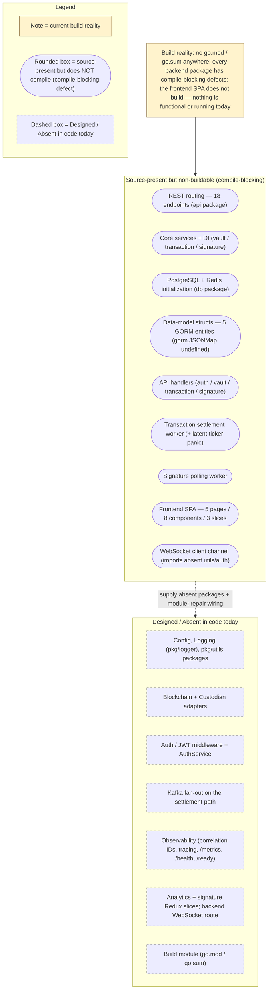

# Scaffold vs. Design Reconciliation

This repository pairs a rich, aspirational design corpus (`documentation/*.md` and the root `README.md`) with an early-stage code scaffold, and the two do not yet agree. This page is the honesty backbone of the documentation set: it states the accurate current state of the system as it exists on disk, labels every capability with an explicit maturity level, and enumerates the catalog of known defects — exhaustive for the compile-blocking, runtime, and contract divergences verified against the code — so that engineers can reconcile the scaffold against its intended target without surprises. The single most important fact to carry into every row below is that **the codebase does not build today**: the backend is not a Go module (there is no `go.mod`/`go.sum` anywhere in the repository) and every backend package additionally carries compile-blocking defects, while the frontend single-page application does not compile either. Consequently, **no capability on this page is independently functional or running today** — each is either *source-present but non-buildable* or *designed and absent from code*. Nothing here is aspirational: every row is grounded in a cited source location, and every gap is documented rather than hidden. Consistent with the maturity narrative used throughout the Technical Specification and the sibling architecture pages, each capability is tagged with the shared base vocabulary — **Implemented**, **Provisioned**, or **Designed** — refined by two composite qualifiers: *-with-defects*, where code is present but a compile-blocking defect prevents its module from building, and *-but-broken*, reserved for code that would compile in isolation but fails at runtime. This is the single **operational-truth vocabulary** used across the **entire** documentation set, not only on this page: because nothing builds today, every source-present capability is labeled **Implemented-with-defects (source-present, non-buildable)** — never the unqualified **Implemented** — on this page and on every sibling architecture page alike, so that no page can read as claiming a capability functions when it does not. `Source: backend/cmd/server/main.go:L6-L12`, `Source: documentation/Technical Specifications.md:§SYSTEM OVERVIEW`.

This reconciliation is the consolidated matrix that both [`overview.md`](overview.md) and [`data-model.md`](data-model.md) point to as the single source of truth for maturity and defects; it is referenced from across the documentation set for exactly that purpose.

## Maturity Legend

Every capability named on this page is tagged with the project-wide maturity discipline, consistent with the labeling used across the documentation set:

- **Implemented** — present in code, building, and functional today. This label is reserved for genuinely working capability; at this checkpoint **nothing qualifies for it** (see the note that follows the composite qualifiers).
- **Provisioned** — scaffolding or configuration exists, but the capability is not yet fully wired to run. (For infrastructure, note that the Terraform is *declared-but-invalid* and applies no resources; see [`../guides/deployment.md`](../guides/deployment.md).)
- **Designed** — specified in the design corpus (`documentation/*.md`), not yet present in code.

Two composite qualifiers are used where a capability straddles these states:

- **Implemented-with-defects** — the code is present and substantially written, but a compile-blocking defect prevents the containing module from building.
- **Implemented-but-broken** — the code is present and compiles in isolation, but a runtime defect (for example, a startup panic) prevents it from operating.

At this checkpoint, **no capability currently qualifies for the unqualified `Implemented` label**: because the backend has no Go module and each package carries compile-blocking defects (and the frontend does not build), every source-present backend and frontend capability is **Implemented-with-defects (source-present, non-buildable)**, and the remaining capabilities are **Designed**. The unqualified `Implemented` and the `Implemented-but-broken` labels are defined here for completeness and for the target state, but neither is instantiated by any row in the matrix below. This same operational-truth vocabulary is **authoritative for every sibling architecture page** ([`overview.md`](overview.md), [`backend.md`](backend.md), [`frontend.md`](frontend.md), [`data-flow.md`](data-flow.md), and [`data-model.md`](data-model.md)): those pages label source-present code **Implemented-with-defects (source-present, non-buildable)** — the same qualifier used here — and must **never** tag a non-buildable capability with the unqualified **Implemented**. A page may add adjacent prose and gap notes for further detail, but relabeling non-buildable source to a bare **Implemented** is not permitted anywhere in the documentation set. `Source: backend/cmd/server/main.go:L6-L12`.

## Visual Anchors — Fig A1 and Fig A2

The before/after architecture pair that anchors this reconciliation is authored once, in [`overview.md`](overview.md), and referenced here by name rather than redrawn. Read this page alongside them:

- **Fig A1 — Current Implemented Scaffold** ([`overview.md#fig-a1--current-implemented-scaffold-backend`](overview.md#fig-a1--current-implemented-scaffold-backend)) renders the backend exactly as it is wired today, deliberately showing the absent packages and mismatched signatures as dashed, broken edges. It is the visual companion to the Defect Catalog below. `Source: backend/cmd/server/main.go:L17-L62`, `Source: backend/internal/api/routes.go:L9-L54`.
- **Fig A2 — Designed Target Architecture** ([`overview.md#fig-a2--designed-target-architecture`](overview.md#fig-a2--designed-target-architecture)) renders the same backend once the design corpus is fully realized: the absent packages are present, the router and ticker wiring is corrected, external systems sit behind explicit ports, and the settlement path publishes to a Kafka fan-out. It is the visual companion to the Maturity Matrix rows tagged **Designed**. `Source: documentation/Technical Specifications.md:§HIGH-LEVEL ARCHITECTURE DIAGRAM`.

Because this documentation depicts a change of architectural state, **both** states are shown in **Fig A1** and **Fig A2**; the target is never presented alone. The reconciliation narrative in the [From Scaffold to Target](#from-scaffold-to-target) section below walks the path between the two figures by name.

**Fig SD1 — Maturity Distribution at a Glance** is a small summary diagram, local to this page, that groups the platform's capabilities into their current maturity buckets. It complements — and does not replace — **Fig A1** and **Fig A2**; consult those figures for the authoritative wiring detail.

**Figure SD1 — Maturity Distribution at a Glance (capabilities grouped by current maturity)**

As **Fig SD1 — Maturity Distribution at a Glance** shows, there is no band of genuinely functional capability today: the request-handling router, core services, persistence layer, data-model structs, async workers, and frontend SPA are all *source-present but non-buildable* — the backend has no Go module and every package carries a compile-blocking defect — while an outer band of integration, configuration, logging, observability, and build capabilities is *Designed* but absent from code. The Maturity Matrix and Defect Catalog that follow give the cited, row-by-row detail behind each bucket. `Source: backend/cmd/server/main.go:L6-L12`.

## Maturity Matrix

The following matrix reconciles every major capability of the platform against its current maturity. It is the consolidated view that the sibling pages defer to; the deeper wiring, model, and frontend detail behind individual rows lives in [`backend.md`](backend.md), [`data-model.md`](data-model.md), [`data-flow.md`](data-flow.md), and [`frontend.md`](frontend.md). Every row carries a source citation; the defect qualifiers used below are expanded, item by item, in the [Defect Catalog](#defect-catalog).

| Capability | Maturity | Evidence (Source) |
|------------|----------|-------------------|
| REST routing (18 endpoints defined across auth/vault/transaction/signature) | **Implemented-with-defects** (routes declared, but the `api` package does not compile: handler struct types are referenced as package values and several referenced handler methods do not exist) | `Source: backend/internal/api/routes.go:L9-L54` |
| Core services + dependency injection (vault, transaction, signature) | **Implemented-with-defects** (constructors and methods authored, but each package imports the absent `internal/blockchain`, `internal/custodian`, and `pkg/utils` and references the undefined `db.Repository` type, so none compiles) | `Source: backend/internal/core/vault/service.go:L10-L20`, `Source: backend/internal/core/transaction/service.go:L12-L24`, `Source: backend/internal/core/signature/service.go:L10-L20` |
| Data model (5 GORM entities: Organization, User, Vault, Transaction, Signature) | **Implemented-with-defects** (structs authored, but `Metadata gorm.JSONMap` is an undefined type in `gorm.io/gorm`, so `schema.go` does not compile; no migrations exist) | `Source: backend/internal/db/schema.go:L11-L68` (`gorm.JSONMap` at L39, L53, L65) |
| PostgreSQL + Redis initialization | **Implemented-with-defects** (`InitDB`/`InitRedis` authored, but both import the absent `internal/config` package, so the `db` package does not compile) | `Source: backend/internal/db/postgres.go:L7,L12-L33`, `Source: backend/internal/db/redis.go:L6,L11-L27` |
| Transaction async settlement (ticker-driven processor) | **Implemented-with-defects** (worker authored, but imports the absent `pkg/logger`, references the undefined `db.GetPendingTransactions`/`db.UpdateTransaction`, and calls `ProcessTransaction` with a mismatched signature; a latent uninitialized-ticker panic would also occur at runtime once it compiled) | `Source: backend/internal/tasks/transaction_processor.go:L10,L13-L16,L35,L41,L48` |
| Signature async polling (5-minute interval) | **Implemented-with-defects** (the interval constant is correctly initialized, but the worker imports the absent `pkg/logger`, references the undefined `db.GetPendingSignatures`/`db.UpdateSignature` and the undefined `signature.StatusReady`/`signature.StatusFailed`, and calls `CheckSignatureStatus` with a mismatched signature) | `Source: backend/internal/tasks/signature_processor.go:L10,L13,L34,L40,L46-L47,L55` |
| Blockchain adapters (XRP Ledger, Ethereum) | **Designed** (`internal/blockchain` absent, though imported) | `Source: backend/cmd/server/main.go:L8`, `Source: backend/internal/core/vault/service.go:L6` |
| Custodian adapter (Utxo Custodian) | **Designed** (`internal/custodian` absent, though imported) | `Source: backend/cmd/server/main.go:L9`, `Source: backend/internal/core/transaction/service.go:L8` |
| Configuration management | **Designed** (`internal/config` absent, though imported by `main.go`, `postgres.go`, and `redis.go`) | `Source: backend/cmd/server/main.go:L6`, `Source: backend/internal/db/postgres.go:L7` |
| Structured logging (`pkg/logger`) | **Designed** (absent, though imported by `main.go` and both workers; `gin.Logger()` is reused today) | `Source: backend/cmd/server/main.go:L10`, `Source: backend/internal/tasks/transaction_processor.go:L10`, `Source: backend/internal/api/routes.go:L13` |
| Auth/JWT middleware + AuthService | **Designed** (`internal/api/middleware` and `internal/core/auth` absent, though imported) | `Source: backend/cmd/server/main.go:L12`, `Source: backend/internal/api/handlers/auth.go:L5` |
| Kafka fan-out on the settlement path | **Designed** | `Source: documentation/Technical Specifications.md:§DATA-FLOW DIAGRAM` |
| Analytics | **Designed** (no `analyticsSlice`/reducer; referenced by a non-buildable `Analytics.tsx`) | `Source: frontend/src/pages/Analytics.tsx:L7,L15`, `Source: frontend/src/store/index.ts:L8-L12` |
| Frontend SPA (5 pages, 8 components, 3 slices) | **Implemented-with-defects** (source-present but does not build: named/default export mismatches, absent `useAppSelector`/`useAppDispatch` store hooks, absent `analyticsSlice`/`signatureSlice`, an unresolved `utils/auth` import, and undeclared `axios`/`zod`/`@reduxjs/toolkit`/`react-redux` dependencies) | `Source: frontend/src/app.tsx:L4-L12`, `Source: frontend/src/store/index.ts:L1-L22` |
| WebSocket realtime channel | **Implemented-with-defects** (client) / **Designed** (server) (the client class is authored but imports the absent `../utils/auth`; no backend WebSocket route exists) | `Source: frontend/src/services/websocket.ts:L1-L11` |
| Observability (correlation IDs, tracing, `/metrics`, `/health`, `/ready`) | **Designed** | see [`../operations/observability.md`](../operations/observability.md) |
| Build / module manifest (`go.mod`) | **Absent (Designed)** | repository-wide (no `go.mod`/`go.sum`) |

Read together, the matrix makes the reconciliation concrete: the router, core services, database initialization, the data-model structs, the two async workers, and the frontend SPA are all **Implemented-with-defects** — their source is present and substantially written, but the backend has no Go module and each package carries a compile-blocking defect, and the frontend does not build, so none is functional or running today. The external integrations (blockchain and custodian adapters), centralized configuration, structured logging, the auth middleware and AuthService, the Kafka fan-out, the observability stack, the analytics/signature Redux slices, the backend WebSocket route, and the Go module manifest are **Designed** but not yet in code.

## Defect Catalog

The following catalog enumerates every known defect that separates the current scaffold from its designed target. Each defect was verified first-hand against the code at the cited locator, and each is **documented, not fixed** — this documentation deliverable modifies no source, infrastructure, test, or CI code. The **Impact** column classifies each defect as one of *compile-blocking* (prevents the module from building), *runtime-crash* (a runtime failure such as a startup panic — here *latent*, reachable only once the compile-blocking defects are resolved), *behavioral-divergence* (not compile-blocking in itself, but two parts of the system disagree on a contract and would diverge at runtime once the code builds), or *documentation-accuracy* (a published document contradicts the code).

| # | Defect | Type | Impact | Source |
|---|--------|------|--------|--------|
| 1 | Router-signature mismatch: the composition root calls `api.SetupRouter(router, dbConn, blockchainClients, custodianClient)` with four arguments, but the router declares `func SetupRouter() *gin.Engine` with none | Signature mismatch | compile-blocking | `Source: backend/cmd/server/main.go:L52`, `Source: backend/internal/api/routes.go:L9` |
| 2 | Uninitialized ticker panic: `var transactionCheckInterval time.Duration` is never assigned (zero value), so `time.NewTicker(transactionCheckInterval)` is `time.NewTicker(0)` and would panic at startup; contrast the correctly initialized `const signatureCheckInterval = 5 * time.Minute`. This is a *latent* runtime crash: the worker package does not compile (see Defects 3, 5, 6), so the panic is only reachable once those compile-blocking defects are resolved | Uninitialized value | runtime-crash (latent) | `Source: backend/internal/tasks/transaction_processor.go:L13,L16`, `Source: backend/internal/tasks/signature_processor.go:L13` |
| 3 | Processor call-site and internal-call mismatches: at the call site, `StartTransactionProcessor(ctx, redisClient, txService)` and `StartSignatureProcessor(ctx, redisClient, sigService)` are invoked with `(dbConn, blockchainClients, custodianClient)`; internally, `processTransactions` calls `txService.ProcessTransaction(ctx, tx)` (two arguments) and reads `result.Status` although the service declares `ProcessTransaction(uuid.UUID) error` (one argument, no result value), and `processSignatures` calls `sigService.CheckSignatureStatus(ctx, sig.ID)` (two arguments) although the service declares `CheckSignatureStatus(uuid.UUID)` (one argument) and references the undefined `signature.StatusReady`/`signature.StatusFailed` | Signature / type mismatch | compile-blocking | `Source: backend/cmd/server/main.go:L55-L56`, `Source: backend/internal/tasks/transaction_processor.go:L15,L41`, `Source: backend/internal/core/transaction/service.go:L65`, `Source: backend/internal/tasks/signature_processor.go:L15,L40,L46,L55`, `Source: backend/internal/core/signature/service.go:L55` |
| 4 | `db` package does not compile — init mismatch, mixed persistence, absent config, and an undefined type: `db.InitDB(cfg.DatabaseURL)` (one argument, two returns) plus `dbConn.Close()` versus `func InitDB() error` (no arguments, one return); the `db` package connects via `sqlx` while `schema.go` declares GORM models; `postgres.go` and `redis.go` import the absent `internal/config`; and `schema.go` declares `Metadata gorm.JSONMap`, an undefined type in `gorm.io/gorm` | Signature mismatch + mixed persistence + undefined type | compile-blocking | `Source: backend/cmd/server/main.go:L31,L35`, `Source: backend/internal/db/postgres.go:L7,L12-L18`, `Source: backend/internal/db/redis.go:L6`, `Source: backend/internal/db/schema.go:L39,L53,L65` |
| 5 | Absent-but-imported packages and missing module manifest: `internal/config`, `pkg/logger`, `internal/blockchain`, `internal/custodian`, and `internal/api/middleware` are imported by `main.go`; `pkg/utils` is imported by every handler and every core service; and `internal/core/auth` is imported by `handlers/auth.go` — none of these directories exists, and there is no `go.mod`/`go.sum` anywhere, so the backend is not a Go module | Missing packages / no module | compile-blocking | `Source: backend/cmd/server/main.go:L6-L12`, `Source: backend/internal/api/handlers/auth.go:L5-L6`, `Source: backend/internal/core/vault/service.go:L6-L7` |
| 6 | Absent `db` package symbols: `db.Repository`, `db.TransactionStatusPending`, `db.TransactionStatusProcessed`, `db.GetPendingTransactions`, `db.UpdateTransaction`, `db.GetPendingSignatures`, `db.UpdateSignature`, and the repository methods `CreateVault`/`GetVaultByID`/`GetVaultsByOrganizationID`/`CreateTransaction`/`GetTransactionByID`/`UpdateTransaction`/`CreateSignature`/`GetSignatureByID`/`UpdateSignature` are referenced but undefined (the `db` package defines only `InitDB`/`CloseDB`/`InitRedis`/`CloseRedis`) | Undefined references | compile-blocking | `Source: backend/internal/core/vault/service.go:L11,L38,L47,L51`, `Source: backend/internal/core/transaction/service.go:L13,L46`, `Source: backend/internal/tasks/transaction_processor.go:L35,L48`, `Source: backend/internal/tasks/signature_processor.go:L34,L47` |
| 7 | Route/handler/service/schema mismatches: routes reference `handlers.AuthHandler`/`VaultHandler`/`TransactionHandler`/`SignatureHandler` as if package values although they are struct types with pointer-receiver methods; routes reference handler methods that do not exist (`AuthHandler.Register`; `VaultHandler.ListVaults`/`GetVault`/`UpdateVault`/`DeleteVault`; `TransactionHandler.ListTransactions`/`GetTransaction`/`UpdateTransaction`/`DeleteTransaction`; `SignatureHandler.CreateSignature`/`ListSignatures`/`GetSignature`/`UpdateSignature`/`DeleteSignature`); handlers reference the undefined types `transaction.CreateTransactionRequest` and `vault.CreateVaultRequest` and the undefined service methods `GetAllVaults`, `GetTransactionStatus`, and `GetRawSignature`, and call `CreateTransaction(req)` (one argument), `CreateVault(orgID, req)` (two arguments), and `CheckSignatureStatus(string)` against services declaring four-, three-, and `uuid.UUID`-argument signatures respectively; and the services build `db.Transaction{ToAddress, RawTx}` and `db.Signature{DataToSign}` with fields absent from `schema.go` | Type / signature mismatch | compile-blocking | `Source: backend/internal/api/routes.go:L19-L51`, `Source: backend/internal/api/handlers/vault.go:L26,L38,L50`, `Source: backend/internal/api/handlers/transaction.go:L22,L28,L44`, `Source: backend/internal/api/handlers/signature.go:L31,L49`, `Source: backend/internal/core/transaction/service.go:L44,L47`, `Source: backend/internal/core/signature/service.go:L29` |
| 8 | Dual-identifier GORM inconsistency: every entity embeds `gorm.Model` (which supplies `ID uint`, `CreatedAt`, `UpdatedAt`, `DeletedAt`) and also redeclares `ID uuid.UUID`, `CreatedAt`, and `UpdatedAt`, creating conflicting primary-key semantics and duplicate timestamps. This is a modeling conflict, not itself compile-blocking, but it cannot be exercised today because `schema.go` does not compile (Defect 4) | Schema modeling conflict | behavioral-divergence | `Source: backend/internal/db/schema.go:L11-L18` (Organization is representative; all five entities share the pattern) |
| 9 | API path disagreement (three-way, plus a create sub-path gap): backend routes are singular and unprefixed for vaults (`/vault/create`, `/vault/list`, `/vault/:id`) and plural for transactions/signatures (`/transactions`, `/signatures`); the frontend client calls `/vaults` (plural, mismatching `/vault`), `POST /transactions` (missing the `/create` sub-path the backend declares), and `GET /signatures/:id`; and the Technical Specification documents `/api/v1/...`. This is a contract divergence, not itself compile-blocking, but neither side builds today | Contract divergence | behavioral-divergence | `Source: backend/internal/api/routes.go:L25-L31,L35,L37,L45`, `Source: frontend/src/services/api.ts:L34,L40,L46`, `Source: documentation/Technical Specifications.md:§API DESIGN` |
| 10 | Transaction status vocabulary mismatch: the frontend Zod enum validates `['Pending','Completed','Failed']` while the backend uses `Pending`/`Processed` (via `db.TransactionStatusPending` and `db.TransactionStatusProcessed`). This is a contract divergence, not itself compile-blocking | Contract divergence | behavioral-divergence | `Source: frontend/src/schema/transaction.ts:L10`, `Source: backend/internal/core/transaction/service.go:L46,L81` |
| 11 | Broad frontend build blockers: `Analytics.tsx` imports `fetchAnalyticsData` from the absent `@/store/analyticsSlice` and reads `state.analytics.data`, and `SignatureRequest.tsx` imports from the absent `@/store/signatureSlice`, but the store registers only `vault`/`transaction`/`user`; both files import `useAppSelector`/`useAppDispatch` from `@/store`, which exports only `store`/`RootState`/`AppDispatch`; `app.tsx` and `Analytics.tsx` import pages and components with **named** imports although every page/component uses `export default` (and `Chart.tsx` default-exports `ChartComponent`, a name-and-kind mismatch); `SignatureRequest.tsx` re-declares a local `checkSignatureStatus` that shadows the imported thunk; `api.ts` and `websocket.ts` import the absent module `utils/auth`, and `api.ts` references the undefined ambient types `Vault`/`Transaction`/`TransactionRequest`/`SignatureStatus`; and `axios`, `zod`, `@reduxjs/toolkit`, and `react-redux` are used but undeclared in `frontend/package.json` (the `@/` path alias is also unsupported by react-scripts) | Missing modules / export / dependency mismatches | compile-blocking (frontend build) | `Source: frontend/src/pages/Analytics.tsx:L2-L7,L15`, `Source: frontend/src/components/SignatureRequest.tsx:L2-L4,L34`, `Source: frontend/src/store/index.ts:L8-L12,L19-L22`, `Source: frontend/src/app.tsx:L3-L12`, `Source: frontend/src/services/api.ts:L1-L2,L32-L46`, `Source: frontend/src/services/websocket.ts:L1`, `Source: frontend/package.json:L5-L19` |
| 12 | Documentation-accuracy defects (context): `Technical Specifications.md` previously claimed a Tailwind CSS frontend though `frontend/package.json` declares none — this is corrected in this deliverable's `documentation/Technical Specifications.md` update. The root `README.md` still describes a Node/Express/MongoDB stack and links to nonexistent files; its correction is a **planned (Designed)** deliverable that is **not yet applied** — `README.md` remains unchanged at this checkpoint | Documentation accuracy | documentation-accuracy | `Source: frontend/package.json:L5-L19` |

Defects 1 through 7 and 11 are compile-blocking: the backend has no `go.mod` and every package fails to compile, and the frontend does not build, so the codebase cannot be built or started as-is. Defects 8, 9, and 10 are contract and modeling divergences that are not themselves compile-blocking, but — because the surrounding modules do not build — they cannot be exercised at runtime today; they would remain to be reconciled once the compile-blocking defects are resolved. Defect 12 is a documentation-accuracy issue: its Technical Specification portion is corrected by this deliverable, while the `README.md` correction is planned and not yet applied. None of these defects is altered by this page.

## From Scaffold to Target

The transition from **Fig A1 — Current Implemented Scaffold** to **Fig A2 — Designed Target Architecture** is additive and corrective rather than a rewrite. As **Fig A1** shows, the router, core services, and database layer are present in source but do not build today — there is no `go.mod`, and each package carries compile-blocking defects; as **Fig A2** shows, the target supplies the absent packages and module manifest and repairs the mis-wired signatures so that the same source can compile and run. Concretely, the path from scaffold to target comprises the following moves, each mapped back to a Maturity Matrix row and a Defect Catalog entry:

- **Supply the absent packages behind ports.** Add `internal/config`, `pkg/logger`, `internal/blockchain`, `internal/custodian`, `internal/api/middleware`, `pkg/utils`, and `internal/core/auth`, with the blockchain and custodian integrations sitting behind the `BlockchainClient` and `CustodianClient` ports so the core services depend on interfaces rather than concrete clients (Defect 5). `Source: backend/cmd/server/main.go:L6-L12`, `Source: backend/internal/api/handlers/auth.go:L5-L6`.
- **Fix the router and ticker wiring.** Reconcile the `SetupRouter` signature between the composition root and the router (Defect 1), align the two background-processor call sites with their declared signatures (Defect 3), and initialize the transaction ticker with a real interval so the settlement processor stops panicking at startup (Defect 2). `Source: backend/cmd/server/main.go:L52`, `Source: backend/internal/tasks/transaction_processor.go:L13-L16`.
- **Define the missing `db` surface and settle on one ORM.** Introduce the `db.Repository` type, the transaction/signature status constants, and the pending-query and update helpers, and resolve the `sqlx`-versus-GORM split so persistence is coherent (Defects 4 and 6). `Source: backend/internal/db/postgres.go:L10-L18`, `Source: backend/internal/db/schema.go:L1-L9`.
- **Introduce the Kafka fan-out and repair the frontend build.** Add the designed Kafka fan-out on the asynchronous settlement path (Kafka row), and repair the non-buildable SPA (Defect 11): supply the `analyticsSlice`/`signatureSlice` and the `useAppSelector`/`useAppDispatch` store hooks that pages and components already import, reconcile the named-versus-default component and page exports, resolve the absent `utils/auth` module, and declare the `axios`/`zod`/`@reduxjs/toolkit`/`react-redux` dependencies. `Source: documentation/Technical Specifications.md:§DATA-FLOW DIAGRAM`, `Source: frontend/src/store/index.ts:L8-L12,L19-L22`.
- **Reconcile the API paths and status vocabularies.** Converge the singular/plural/`/api/v1` path disagreement and the `Processed`-versus-`Completed`/`Failed` transaction status vocabulary on a single contract (Defects 9 and 10). `Source: backend/internal/api/routes.go:L25-L31`, `Source: frontend/src/schema/transaction.ts:L10`.
- **Author the module manifest.** Add `go.mod`/`go.sum` so the backend is a buildable Go module and the dual-identifier GORM modeling can be corrected against a real schema (Defect 8; build row). `Source: backend/internal/db/schema.go:L11-L18`.

This is the intended architectural evolution described by **Fig A2**; **none of it is implemented by this documentation deliverable**. The figures and this narrative describe the target so that engineers can reconcile the scaffold against it, and the code itself is left unmodified.

## Related Documentation

This reconciliation is the map; the following sibling pages hold the detailed treatment of each area and the fixes that a future engineering effort would apply:

- [`overview.md`](overview.md) — the authoritative home of **Fig A1** and **Fig A2**, the before/after pair this page reconciles against.
- [`backend.md`](backend.md) — the composition-root wiring, dependency injection, and the wiring-gap callouts behind Defects 1 through 6.
- [`frontend.md`](frontend.md) — the React/Redux architecture and the broken `analyticsSlice`/`signatureSlice` references (Defect 11).
- [`data-model.md`](data-model.md) — the five entities and the dual-identifier GORM inconsistency (Defect 8), documented in its [Gap Notes](data-model.md#gap-notes).
- [`data-flow.md`](data-flow.md) — the settlement sequence that surfaces the ticker panic (Defect 2) and the Kafka publish shown as **Designed** in **Fig B3**.
- [`../api-reference/overview.md`](../api-reference/overview.md) — the public HTTP contract and the resolution of the `/api/v1` path-prefix disagreement (Defect 9).
- [`../operations/runbook.md`](../operations/runbook.md) — the operational failure modes, including the ticker-panic startup crash and settlement retries.
- [`../operations/observability.md`](../operations/observability.md) — the reused-versus-added observability posture behind the **Designed** observability row.
