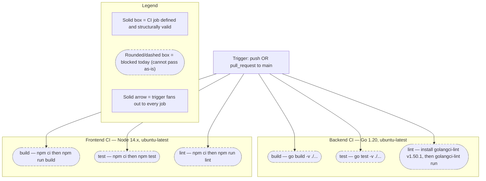

# Contributing — Development Workflow & CI

This page is the contribution-workflow and continuous-integration (CI) reference for the Blockchain Integration Service and Dashboard. It is the detailed companion to the root [`CONTRIBUTING.md`](../../CONTRIBUTING.md): where that file gives the brief governance summary, this page expands on the two GitHub Actions pipelines — one for the Go/Gin backend and one for the React 18 + TypeScript frontend — job by job and step by step, with an exact source citation for every command and pinned version. Consistent with the rest of the documentation set, it is deliberately honest about the current state — the workflow files exist, but neither pipeline can pass against the repository as-is — and every such caveat is cited and maturity-labeled below.

## Maturity Legend

Every capability named on this page is tagged with the project-wide maturity discipline, identical to the vocabulary used across the documentation set (see the [documentation index](../index.md) and the reconciliation page's [Maturity Legend](../architecture/scaffold-vs-design.md#maturity-legend)):

- **Implemented** — present and functional in the code as-declared today.
- **Provisioned** — configuration or scaffolding exists, but the capability is not yet fully wired or exercised.
- **Designed** — specified in the design corpus (`documentation/*.md`) or referenced by configuration, but not yet present and runnable in code.

The two GitHub Actions workflow files are themselves **Provisioned**: they are committed and structurally valid, but the pipelines they define are currently **non-functional against the scaffold** because the backend has no Go module and the frontend has no committed lockfile. Those facts are stated plainly, with citations, in [Known Limitations](#known-limitations); the full Implemented/Provisioned/Designed reconciliation for the whole system lives in [`../architecture/scaffold-vs-design.md`](../architecture/scaffold-vs-design.md) and is not duplicated here.

## Contribution Workflow

Development targets the `main` branch. Both CI workflows run automatically on every `push` and `pull_request` that targets `main`, so the intended model is to branch from `main`, open a pull request back against `main`, and let CI validate the change. `Source: .github/workflows/backend-ci.yml:L3-L7`, `Source: .github/workflows/frontend-ci.yml:L3-L7`. **Maturity: Provisioned** — the workflows are defined, but the repository is an early-stage scaffold and the pipelines do not yet pass.

Before opening a pull request, set up the two stacks locally: use [`../getting-started/installation.md`](../getting-started/installation.md) for prerequisites and the per-stack install tracks, and follow the day-to-day build/run/test loop in [`../getting-started/local-development.md`](../getting-started/local-development.md). This page does not duplicate those setup steps.

The merge expectation is **green CI**: the `build`, `test`, and `lint` jobs should pass for both the backend and the frontend before a change is merged. As the [Known Limitations](#known-limitations) explain, that bar cannot be met against the repository as-is — a Go module and a frontend lockfile must first be supplied — so the expectation is documented here as the intended gate rather than a currently achievable one.

## Continuous Integration Reference

Two independent GitHub Actions workflows implement CI, one per application tier. Both trigger on `push` and `pull_request` to `main`. `Source: .github/workflows/backend-ci.yml:L3-L7`, `Source: .github/workflows/frontend-ci.yml:L3-L7`. Each workflow defines three independent jobs — `build`, `test`, and `lint` — and every job runs on the `ubuntu-latest` runner. `Source: .github/workflows/backend-ci.yml:L11,L22,L33`, `Source: .github/workflows/frontend-ci.yml:L11,L22,L33`. The per-job command detail follows in the two subsections below; the flow is summarized first in **Figure C1**.

### Figure C1 — CI Trigger & Job Flow

**Figure C1 — CI Trigger & Job Flow** maps the single trigger condition to the six CI jobs (three per stack) that fan out from it, and marks — via the legend — that every job is blocked against the repository as-is. It is referenced by name from the subsections that follow.



As **Figure C1** shows, one trigger condition (`push` or `pull_request` to `main`) fans out to three backend jobs and three frontend jobs. Every job is drawn as a rounded/dashed box per the legend, because — as documented in [Known Limitations](#known-limitations) — the backend jobs cannot resolve a Go module and the frontend jobs cannot satisfy `npm ci` without a committed lockfile.

### Backend CI

The backend workflow is named **"Backend CI"**. `Source: .github/workflows/backend-ci.yml:L1`. Each of its three jobs checks out the repository with `actions/checkout@v3` and installs Go with `actions/setup-go@v4`, pinned to Go `1.20`. `Source: .github/workflows/backend-ci.yml:L13-L15,L17`. The same Go pin is repeated in the `test` and `lint` jobs. `Source: .github/workflows/backend-ci.yml:L28,L39`.

| Job | Steps | Command | Source |
|-----|-------|---------|--------|
| `build` | `actions/checkout@v3`; `actions/setup-go@v4` (Go `1.20`); compile all packages | `go build -v ./...` | `.github/workflows/backend-ci.yml:L19` |
| `test` | `actions/checkout@v3`; `actions/setup-go@v4` (Go `1.20`); run the test suite | `go test -v ./...` | `.github/workflows/backend-ci.yml:L30` |
| `lint` | `actions/checkout@v3`; `actions/setup-go@v4` (Go `1.20`); install `golangci-lint` `v1.50.1`; run the linter | `golangci-lint run` | `.github/workflows/backend-ci.yml:L41-L43` |

The `build` job body spans L10-L19, the `test` job L21-L30, and the `lint` job L32-L43. `Source: .github/workflows/backend-ci.yml:L10-L43`. The `lint` job installs `golangci-lint` at version `v1.50.1` via the official curl install script before running it. `Source: .github/workflows/backend-ci.yml:L41`. **Maturity: Provisioned** — all three jobs are defined and structurally valid, but none can complete against the scaffold (see [Known Limitations](#known-limitations)).

### Frontend CI

The frontend workflow is named **"Frontend CI"**. `Source: .github/workflows/frontend-ci.yml:L1`. Each of its three jobs checks out the repository with `actions/checkout@v2` and installs Node with `actions/setup-node@v2`, pinned to Node `14.x`. `Source: .github/workflows/frontend-ci.yml:L13-L15,L17`. The same Node pin is repeated in the `test` and `lint` jobs. `Source: .github/workflows/frontend-ci.yml:L28,L39`. Every job first runs `npm ci` to install dependencies.

| Job | Steps | Command | Source |
|-----|-------|---------|--------|
| `build` | `actions/checkout@v2`; `actions/setup-node@v2` (Node `14.x`); `npm ci`; build the production bundle | `npm ci` then `npm run build` | `.github/workflows/frontend-ci.yml:L18-L19` |
| `test` | `actions/checkout@v2`; `actions/setup-node@v2` (Node `14.x`); `npm ci`; run the test runner | `npm ci` then `npm test` | `.github/workflows/frontend-ci.yml:L29-L30` |
| `lint` | `actions/checkout@v2`; `actions/setup-node@v2` (Node `14.x`); `npm ci`; run ESLint | `npm ci` then `npm run lint` | `.github/workflows/frontend-ci.yml:L40-L41` |

The `build` job body spans L10-L19, the `test` job L21-L30, and the `lint` job L32-L41. `Source: .github/workflows/frontend-ci.yml:L10-L41`. The `npm run build`, `npm test`, and `npm run lint` commands delegate to the `build`, `test`, and `lint` scripts declared in the frontend package manifest. `Source: frontend/package.json:L22-L23,L25`. **Maturity: Provisioned** — all three jobs are defined, but each fails at its `npm ci` step because no lockfile is committed (see [Known Limitations](#known-limitations)).

## Coding Standards

### Go

Backend Go code is expected to pass `golangci-lint`, the aggregating linter the CI `lint` job installs at version `v1.50.1` and then runs. `Source: .github/workflows/backend-ci.yml:L41-L43`. There is **no committed `.golangci.yml`** anywhere in the repository, so `golangci-lint` applies its **default** set of enabled linters rather than a project-specific selection. `Source: repository root (no .golangci.yml present)`. Run the same check locally from the `backend/` directory:

```bash
# static analysis — mirrors the CI lint job
golangci-lint run
```

**Maturity: Provisioned** — the linter is pinned in CI, but with no module and no config file it neither runs against the scaffold today nor enforces a curated rule set.

### Frontend (ESLint and Prettier)

Frontend code style is enforced with ESLint and formatted with Prettier, both wired through the package manifest scripts. The `lint` script runs `eslint src` and the `format` script runs `prettier --write src`. `Source: frontend/package.json:L25-L26`. ESLint's configuration extends the Create React App presets `react-app` and `react-app/jest`. `Source: frontend/package.json:L28-L33`. The relevant dev dependencies are `eslint` (`^8.40.0`), `eslint-config-react-app` (`^7.0.1`), and `prettier` (`^2.8.8`). `Source: frontend/package.json:L16-L18`. Run both from the `frontend/` directory:

```bash
npm run lint      # eslint src
npm run format    # prettier --write src
```

**Maturity: Implemented** — the ESLint and Prettier tooling is declared and wired through the manifest scripts, so it is functional once dependencies are installed (which, in CI, is blocked by the missing lockfile noted below).

## Known Limitations

The two CI workflow files are committed and valid, but neither pipeline can pass against the repository as-is. The table below is the CI-focused set of reasons, each cited and maturity-labeled. It deliberately does not restate the full system reconciliation; the authoritative Implemented/Provisioned/Designed matrix and complete defect catalog live in [`../architecture/scaffold-vs-design.md`](../architecture/scaffold-vs-design.md#defect-catalog), and the local build workarounds are in [`../getting-started/local-development.md`](../getting-started/local-development.md#build-caveats).

| # | Limitation | Impact on CI | Maturity | Source |
|---|-----------|--------------|----------|--------|
| 1 | No `go.mod`/`go.sum` anywhere in the repository | The backend has no module context, so `go build -v ./...` and `go test -v ./...` cannot resolve imports or compile; `golangci-lint run` likewise has nothing buildable to analyze | **Designed** (build module absent) | repository root (no `go.mod`/`go.sum` present); `.github/workflows/backend-ci.yml:L19,L30` |
| 2 | No committed frontend lockfile (`package-lock.json`/`yarn.lock`) | Every frontend job begins with `npm ci`, which installs strictly from an existing lockfile and therefore fails at that step on a clean checkout | **Provisioned** (dependencies declared, lockfile absent) | `frontend/` (no lockfile present); `.github/workflows/frontend-ci.yml:L18,L29,L40` |
| 3 | GitHub Actions version drift between the two workflows | The backend pins `actions/checkout@v3` and `actions/setup-go@v4`, while the frontend pins the older `actions/checkout@v2` and `actions/setup-node@v2`; the action versions are inconsistent across the pipelines | **Provisioned** (both defined, versions divergent) | `.github/workflows/backend-ci.yml:L13-L15`, `.github/workflows/frontend-ci.yml:L13-L15` |
| 4 | Node version versus the CRA toolchain | CI pins Node `14.x`, but the frontend builds with `react-scripts` `5.0.1` (Create React App 5), which expects a newer Node; the build and test jobs may not run cleanly under Node `14.x` | **Provisioned** (both pinned, versions mismatched) | `.github/workflows/frontend-ci.yml:L17`, `frontend/package.json:L12` |

A further Go toolchain discrepancy — CI pins Go `1.20` while the backend Docker image is based on `golang:1.17-alpine` — is documented in the local development guide rather than repeated here. `Source: .github/workflows/backend-ci.yml:L17`. See [`../getting-started/local-development.md`](../getting-started/local-development.md#build-caveats) for that caveat and its workaround.

## Testing

The full test strategy, framework inventory, and coverage targets are documented separately in [`./testing.md`](./testing.md); in summary, the backend uses Testify with `go test` (test files present but not runnable without a Go module) and the frontend uses Create React App's Jest runner with React Testing Library (tooling present, no test files yet). This page does not duplicate that content.

## Related Documentation

- [`../../CONTRIBUTING.md`](../../CONTRIBUTING.md) — repository-level contribution guidelines (the brief companion this page expands on).
- [`../index.md`](../index.md) — documentation index and audience map, including the shared maturity legend.
- [`./testing.md`](./testing.md) — test strategy, framework inventory, and coverage targets.
- [`../getting-started/local-development.md`](../getting-started/local-development.md) — the day-to-day development loop and the full build-caveat treatment.
- [`../getting-started/installation.md`](../getting-started/installation.md) — prerequisites and the per-stack install tracks.
- [`../architecture/scaffold-vs-design.md`](../architecture/scaffold-vs-design.md) — authoritative Implemented/Provisioned/Designed matrix and full defect catalog.
