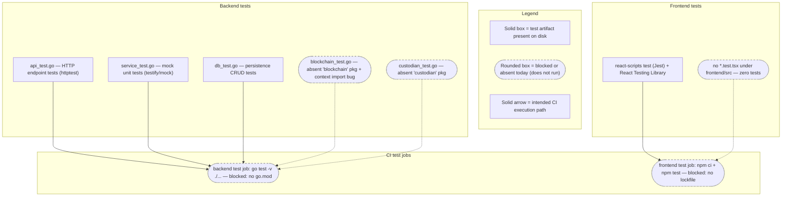

# Contributing — Testing Strategy & Coverage

This page is the test strategy and coverage-targets reference for the Blockchain Integration Service and Dashboard. The backend uses [Testify](https://github.com/stretchr/testify) as its Go test framework, and the frontend uses Create React App's `react-scripts test` (Jest) together with React Testing Library; this document inventories the existing test scaffold, describes how the tests are intended to run in local development and in CI, and records coverage targets that are **documented but not enforced**. It is the companion to the contribution workflow in [`development.md`](development.md) and the root [`CONTRIBUTING.md`](../../CONTRIBUTING.md), and it should be read alongside the local development loop in [`../getting-started/local-development.md`](../getting-started/local-development.md).

Consistent with the rest of the documentation set, this page is deliberately honest about the current state: the test **files** exist on disk, but the backend suite does **not** compile or run as-is, and the frontend has testing tooling declared but **no test files**. Those facts are stated plainly in every section below, each with a source citation, rather than being omitted. The full Implemented/Provisioned/Designed reconciliation and the complete defect catalog live in [`../architecture/scaffold-vs-design.md`](../architecture/scaffold-vs-design.md); this page does not duplicate that matrix, it applies the same discipline to the test layer specifically.

## Maturity Legend

Every capability named on this page is tagged with the project-wide maturity discipline, identical to the vocabulary used across the documentation set (see the [documentation index](../index.md) and the reconciliation page's [Maturity Legend](../architecture/scaffold-vs-design.md#maturity-legend)):

- **Implemented** — present in the repository AND compiles/runs AND passes today. This bar is reserved, and **no test suite on this page meets it**: the backend suite does not compile (no Go module) and the frontend has no test files, so no test is confirmed to execute-and-pass at this checkpoint.
- **Source-present (non-buildable)** — a test file (or tooling declaration) exists on disk but does not compile/run today, so no execution result may be asserted from it.
- **Provisioned** — scaffolding or configuration (for example a declared dependency or workflow) exists and is valid, but the capability is not yet wired to run.
- **Designed** — specified in the design corpus (`documentation/*.md`) or intended by a test/scaffold, but not yet present and runnable in code.

This vocabulary is identical to the reconciliation page's [Maturity Legend](../architecture/scaffold-vs-design.md#maturity-legend). Because the backend has no Go module and each test file references packages that are absent or shaped differently from `backend/internal/**`, the test **files** are **Source-present (non-buildable)** (the `.go` files are present and authored but do not compile), while the **executable test capability** they represent is **Designed** — it cannot run against the repository as-is. Where a referenced production package is itself absent (the `blockchain` and `custodian` packages), that package is labeled **Designed**. The finer composite qualifiers used on the reconciliation page are not repeated here; this page uses the base labels and links out for the detailed defect reconciliation.

## Test Frameworks at a Glance

The project defines two independent test stacks, one per application tier. Both frameworks are declared and available; neither runs cleanly against the repository as-is (see [Known Limitations](#known-limitations)).

| Tier | Framework | Runner | Key libraries | Maturity | Source |
|------|-----------|--------|---------------|----------|--------|
| Backend (Go) | Testify | `go test` | `github.com/stretchr/testify/assert`, `github.com/stretchr/testify/mock` | Test files **Source-present (non-buildable)**; executable suite **Designed** (no `go.mod`) | `backend/tests/service_test.go:L6-L7` |
| Frontend (React/TS) | Create React App + React Testing Library | `react-scripts test` (Jest) | `@testing-library/react`, `@testing-library/jest-dom`, `@testing-library/user-event` | Runner/libraries **declared (Provisioned)**; jest-dom matcher wiring **Designed** (no `setupTests`); test coverage **Designed** (no test files) | `frontend/package.json:L6-L8,L23` |

Testify is the design-intended Go test framework recorded in the Technical Specification technology-stack table. `Source: documentation/Technical Specifications.md` (TECHNOLOGY STACK). Create React App's built-in Jest runner and React Testing Library are declared as frontend dependencies and wired through the `test` script. `Source: frontend/package.json:L6-L8,L23`.

> **The frontend test runner is part of a deprecated toolchain.** The frontend runner is Create React App's `react-scripts test`, and CRA was deprecated by the React team on 2025-02-14 (no active maintainers; maintenance mode). `Source: React Blog, "Sunsetting Create React App" — react.dev/blog/2025/02/14/sunsetting-create-react-app`. The test tooling still functions against the pinned `react-scripts` 5.0.1, but a migration to a maintained runner (for example Vitest, or Jest configured directly) is **Designed**, not present in the tree today.

### Figure T1 — Test Types & CI Execution

The diagram below, **Figure T1 — Test Types & CI Execution**, maps the test artifacts on disk to the two continuous-integration test jobs that are meant to run them, and marks — with the legend — which paths are blocked today. It is referenced by name from the sections that follow.



As **Figure T1** shows, the three structurally complete backend artifacts (`api_test.go`, `service_test.go`, `db_test.go`) and the two adapter tests (`blockchain_test.go`, `custodian_test.go`) all feed the single backend CI test job, while the frontend RTL tooling feeds the frontend CI test job — but every CI path is blocked today because the backend has no Go module and the frontend has no committed lockfile or test files. The blocked paths are drawn as rounded/dashed boxes per the legend.

## Backend Test Inventory

The backend test suite comprises five files under `backend/tests/`, all declared in `package tests` and all written in the Testify style. The table below inventories each file; the **Maturity** column reflects that the file exists as an artifact but that its executable capability (and, for the adapter tests, the referenced production package) is not present and runnable today.

| Test File | Scope | Framework | Key packages referenced (placeholder) | Maturity | Source |
|-----------|-------|-----------|----------------------------------------|----------|--------|
| `api_test.go` | HTTP endpoint tests for auth, vault, transaction, and signature routes via an in-process server | Testify `assert` + `net/http/httptest` + Gin | `github.com/your-username/your-project/backend/api`, `.../backend/models` | File **Source-present (non-buildable)**; suite **Designed** (does not compile) | `backend/tests/api_test.go:L10-L20` |
| `blockchain_test.go` | Ethereum + XRP client connection tests, plus two commented-out raw-transaction/broadcast stubs | Testify `assert` | `github.com/your-project/blockchain` (**absent**) | **Designed** (package absent; also a compile bug) | `backend/tests/blockchain_test.go:L3-L7,L15` |
| `custodian_test.go` | Custodian connect/disconnect, request-signature, and signature-status polling tests | Testify `assert` | `github.com/your-org/your-project/custodian` (**absent**) | **Designed** (package absent) | `backend/tests/custodian_test.go:L3-L9` |
| `db_test.go` | Database connect and vault/transaction CRUD tests against a simplified persistence API | Testify `assert` | `github.com/your-username/your-project/db` | File **Source-present (non-buildable)**; suite **Designed** (shape diverges from GORM schema) | `backend/tests/db_test.go:L3-L7` |
| `service_test.go` | Mock-based unit tests for the vault, transaction, and signature services | Testify `assert` + `mock` | `your-project/backend/service`, `your-project/backend/repository` | File **Source-present (non-buildable)**; suite **Designed** (does not compile) | `backend/tests/service_test.go:L3-L11` |

### Testify patterns in use

All five files use Testify's assertion package for their checks: `assert.NoError`, `assert.Equal`, `assert.NotNil`, `assert.NotEmpty`, `assert.Len`, `assert.Greater`, `assert.True`, and `assert.Error` appear across the suite. `Source: backend/tests/api_test.go:L35,L47`, `Source: backend/tests/db_test.go:L59-L60`, `Source: backend/tests/blockchain_test.go:L16-L17`. Two further Testify patterns are used:

- **Mock-based unit tests** — `service_test.go` imports `github.com/stretchr/testify/mock` and drives `MockVaultRepository`, `MockTransactionRepository`, and `MockSignatureRepository` through `mockRepo.On(...).Return(...)` expectations verified with `mockRepo.AssertExpectations(t)`. The services under test are constructed with `NewVaultService`, `NewTransactionService`, and `NewSignatureService`, and each test groups its cases with `t.Run` subtests (`CreateVault`/`GetVault`, `CreateTransaction`/`GetTransaction`, `CreateSignature`/`VerifySignature`). `Source: backend/tests/service_test.go:L7,L13-L40`. **Maturity: Designed** (the `service` and `repository` packages are placeholders that do not correspond to `backend/internal/**`).
- **HTTP handler tests** — `api_test.go` builds an in-process Gin engine in a `setupRouter()` helper and exercises it with `net/http/httptest` (`httptest.NewRecorder()` + `router.ServeHTTP(w, req)`), asserting on the recorded status code. `Source: backend/tests/api_test.go:L16-L20,L33-L35`. **Maturity: Designed** (the helper calls a router entry point that does not exist — see below).

The `api_test.go` handler tests additionally carry three `// HUMAN ASSISTANCE NEEDED` markers noting that authentication middleware for the protected vault, transaction, and signature routes is not implemented, so those tests assume an authenticated user that the scaffold cannot provide. `Source: backend/tests/api_test.go:L54-L56,L80-L82,L108-L110`. Similar `// HUMAN ASSISTANCE NEEDED` markers appear in `custodian_test.go` (a real-time `time.Sleep(5 * time.Second)` reliability caveat), `db_test.go` (missing setup/teardown), and `service_test.go` (service/repository shapes to be confirmed). `Source: backend/tests/custodian_test.go:L53-L56`, `Source: backend/tests/db_test.go:L98-L100`, `Source: backend/tests/service_test.go:L100-L102`.

### Documentable divergences

The test scaffold diverges from the real code in three ways that a contributor will encounter immediately. These are documented here and reconciled centrally, not resolved on this page:

- **API paths (a three-way disagreement).** The handler tests call an `/api/`-prefixed, **plural** path set — `/api/auth/register` and `/api/auth/login`, `/api/vaults`, `/api/transactions`, `/api/signatures`. `Source: backend/tests/api_test.go:L32,L44,L63,L91,L119`. These match **neither** the backend router, which registers **unprefixed, singular** paths (`/vault/...`), `Source: backend/internal/api/routes.go:L25-L31`, **nor** the Technical Specification's documented **versioned** `/api/v1/vaults` scheme. The frontend Axios client introduces yet a fourth variant (`/vaults`, plural, unprefixed). The full comparison and the resolution are catalogued in the API reference under [Path Conventions and the Prefix/Pluralization Discrepancy](../api-reference/overview.md#path-conventions-and-the-prefixpluralization-discrepancy) and in [`../architecture/scaffold-vs-design.md`](../architecture/scaffold-vs-design.md#defect-catalog).
- **Router entry point.** `api_test.go` calls `api.SetupRoutes(r)`, passing a `*gin.Engine` into a mutator-style function. `Source: backend/tests/api_test.go:L18`. The real router entry point is `SetupRouter()`, which takes no arguments and returns a freshly constructed `*gin.Engine`. `Source: backend/internal/api/routes.go:L9`. The two signatures are incompatible.
- **Persistence and model shapes.** `db_test.go` exercises a simplified API — `db.Vault{Name, UserID}` where `UserID` is a `string`, and `db.Transaction{VaultID (string), Amount (float64), Description}`. `Source: backend/tests/db_test.go:L20-L28,L67-L76`. The real GORM schema instead uses `uuid.UUID` identifiers, a `decimal.Decimal` amount, an `OrganizationID`, and no `Description` field. `Source: backend/internal/db/schema.go:L11-L68`. Likewise, `api_test.go` constructs `models.Transaction{VaultID: 1 (int), Amount: 100.0, Type: "deposit"}`, `Source: backend/tests/api_test.go:L85-L89`, a shape that does not match the GORM `Transaction` entity either. These `db.*` and `models.*` shapes are placeholder abstractions that predate the current schema; the authoritative entity definitions live in [`../architecture/data-model.md`](../architecture/data-model.md).

## Frontend Testing

The frontend is a Create React App project, and its test runner is CRA's `react-scripts test`, which wraps Jest with the CRA preset. The `test` script is defined as `react-scripts test`. `Source: frontend/package.json:L23`. The React Testing Library toolchain is declared in the dependencies: `@testing-library/jest-dom` (`^5.16.5`), `@testing-library/react` (`^13.4.0`), and `@testing-library/user-event` (`^13.5.0`). `Source: frontend/package.json:L6-L8`. The project's ESLint configuration extends both `react-app` and `react-app/jest`, which enables the Jest and Testing Library lint rules for test files. `Source: frontend/package.json:L28-L33`.

- **Runner and libraries — declared (Provisioned), not verified.** The `react-scripts test` runner and the React Testing Library packages are declared as dependencies and the `test` script and ESLint config reference them. `Source: frontend/package.json:L6-L8,L23,L28-L33`. They are labeled Provisioned rather than Implemented because nothing here is confirmed to install-and-run: CI's `npm ci` cannot install them without a committed lockfile, and no lockfile-verified install has been performed.
- **`@testing-library/jest-dom` matcher wiring — Designed (absent).** The `@testing-library/jest-dom` package is *declared* (`^5.16.5`, `Source: frontend/package.json:L6`), but its custom matchers (`toBeInTheDocument`, `toHaveTextContent`, …) are **not** auto-registered: Create React App runs `src/setupTests.{js,ts}` before the test suite **only if that file exists**, and it does not import jest-dom for you. `Source: Create React App docs, "Adding a Testing Library" / setupTests — create-react-app.dev/docs/running-tests`. There is **no `src/setupTests.*` file** anywhere under `frontend/src`. `Source: frontend/src/ (no setupTests file present)`. Consequently the jest-dom matchers would be unavailable until a contributor adds `src/setupTests.ts` containing `import '@testing-library/jest-dom';` — that setup step is **Designed**, not present today.
- **Test coverage — Designed (absent), and the run currently fails rather than "reports no tests".** There are **no test files** in `frontend/src` — no `*.test.tsx`, `*.test.ts`, `*.spec.tsx`, or `*.spec.ts` files exist. `Source: frontend/src/ (no test files present)`. When there are no tests, Jest **exits with a non-zero status** ("No tests found") unless `--passWithNoTests` is supplied; under `CI=true` (or `--watchAll=false`) `react-scripts test` therefore **fails** rather than passing benignly. `Source: Jest CLI docs, "--passWithNoTests" — jestjs.io/docs/cli#--passwithnotests`. Authoring component and page tests with React Testing Library is a **Designed** target, not current coverage.

The recommended pattern when tests are added is React Testing Library's user-centric approach — rendering a component with `render(...)`, querying by accessible role or text, and simulating interaction with `@testing-library/user-event`. To use the `@testing-library/jest-dom` matchers (`toBeInTheDocument`, `toHaveTextContent`, and similar), a contributor must **first create `src/setupTests.ts`** containing `import '@testing-library/jest-dom';` — Create React App automatically executes `src/setupTests.{js,ts}` before the suite when that file is present, but it does **not** register jest-dom on its own and no such file exists here. `Source: Create React App docs, "Adding a Testing Library" — create-react-app.dev/docs/running-tests`; `Source: frontend/src/ (no setupTests file present)`. The pages and components that such tests would cover are catalogued in [`../architecture/frontend.md`](../architecture/frontend.md).

## Running Tests Locally

The commands below mirror the two continuous-integration test jobs; each is accompanied by the caveat that prevents it from succeeding against the repository as-is. Environment prerequisites (Go, Node, PostgreSQL, Redis) and the broader development loop are covered in [`../getting-started/local-development.md`](../getting-started/local-development.md); this section covers only the test invocations.

### Backend

Run the Go test suite from the `backend/` directory. This is the same command the backend CI test job runs. `Source: .github/workflows/backend-ci.yml:L30`.

```bash
# from backend/ — mirrors CI (.github/workflows/backend-ci.yml:L30)
go test -v ./...
```

**Caveat (Designed).** This command cannot resolve or compile the suite today: there is no `go.mod`/`go.sum` in the repository, so Go has no module context, and the five test files import four distinct **placeholder** module paths and two **absent** packages (`blockchain`, `custodian`). A `go.mod` must first be authored and every placeholder import path re-pointed at the real `backend/internal/**` packages (and the `blockchain`/`custodian` packages supplied) before `go test` will build. **Supply-chain note:** because there is no `go.sum`, the backend dependency graph is neither pinned nor checksum-verified — builds are not reproducible and `go mod verify`/`govulncheck` cannot audit it; author the module in an isolated environment, pin explicit versions, and commit the generated `go.sum` before trusting any resolved set. See [Known Limitations](#known-limitations) and the [Defect Catalog](../architecture/scaffold-vs-design.md#defect-catalog).

### Frontend

Run the Create React App test runner from the `frontend/` directory. Setting `CI=true` forces a single non-interactive run; omitting it starts Jest in CRA's interactive watch mode. `Source: Create React App docs, "Running Tests" (Continuous Integration / CI variable) — create-react-app.dev/docs/running-tests`.

```bash
# from frontend/
npm install          # generates the lockfile CI's `npm ci` requires
CI=true npm test     # single run (omit CI=true for CRA watch mode)
```

**Caveat (Designed/Provisioned).** The frontend CI test job runs `npm ci` followed by `npm test`, `Source: .github/workflows/frontend-ci.yml:L29-L30`, but `npm ci` requires a committed lockfile (`package-lock.json`), and none exists in the repository — so a local `npm install` must be run first to generate one. **Even after install, the run fails rather than "reports no tests":** because there are no test files (see [Frontend Testing](#frontend-testing)), Jest exits with a **non-zero** status ("No tests found") under `CI=true`/`--watchAll=false` unless `--passWithNoTests` is passed, so the frontend test job does not pass on a clean checkout. `Source: Jest CLI docs, "--passWithNoTests" — jestjs.io/docs/cli#--passwithnotests`. **Supply-chain note:** with no committed `package-lock.json`, each `npm install` may resolve different transitive versions within the declared ranges (`Source: frontend/package.json:L9-L19`), so installs are not reproducible and `npm ci`/`npm audit` cannot verify integrity against a locked baseline — install in an isolated environment and commit the generated lockfile (and run `npm audit`) before trusting the dependency set.

## Coverage Targets

Coverage on this project is **documented, not enforced**. There is **no coverage gate in CI**: the backend test job runs `go test -v ./...` with no `-cover` flag or threshold, `Source: .github/workflows/backend-ci.yml:L30`, and the frontend test job runs `npm test` with no `--coverage` flag and no coverage upload step. `Source: .github/workflows/frontend-ci.yml:L30`. No pipeline step fails a build for insufficient coverage, and no coverage report is collected or published.

The Software Project Proposal's scope of work commits to unit, integration, performance, and security testing. `Source: documentation/Software Project Proposal.md` (SCOPE OF WORK). The proposal does **not** specify any numeric coverage percentage, so the table below records the committed testing *categories* as **Designed** aspirations against which the current scaffold is measured — it deliberately does not assert a measured or enforced percentage, because none exists.

| Test category | Aspirational target | Enforced in CI? | Current state | Basis |
|---------------|---------------------|-----------------|---------------|-------|
| Unit | Cover each core service method and repository behavior | No | Designed — mock-based scaffold in `service_test.go`, non-compiling | `documentation/Software Project Proposal.md` (SCOPE OF WORK); `backend/tests/service_test.go:L13-L40` |
| Integration | Exercise the HTTP contract and persistence layer end-to-end | No | Designed — `api_test.go`/`db_test.go` scaffolds diverge from code | `documentation/Software Project Proposal.md` (SCOPE OF WORK); `backend/tests/api_test.go:L22-L48` |
| Performance | Validate throughput/latency of the transaction and signature paths | No | Designed — no performance tests exist | `documentation/Software Project Proposal.md` (SCOPE OF WORK) |
| Security | Validate authentication, authorization, and input handling | No | Designed — auth middleware absent; noted in `api_test.go` markers | `documentation/Software Project Proposal.md` (SCOPE OF WORK); `backend/tests/api_test.go:L54-L56` |
| Frontend (component/UI) | Cover pages and shared components with React Testing Library | No | Designed — tooling present, no test files | `frontend/package.json:L6-L8`; `frontend/src/` (no test files) |

Every figure and state in the table above is an **aspirational/Designed** target, not a measured value; the "Enforced in CI?" column is uniformly **No**, matching the CI definitions cited above.

### Measuring coverage locally (documentation only)

Although CI enforces no gate, contributors can measure coverage locally once the [Known Limitations](#known-limitations) are resolved. For the backend, Go's built-in coverage reporting is:

```bash
# from backend/ — after a go.mod exists and imports resolve
go test -cover ./...
```

For the frontend, Create React App exposes Jest's coverage collection through the `test` script:

```bash
# from frontend/ — after a lockfile and test files exist
npm test -- --coverage --watchAll=false
```

Both commands are provided for documentation only; neither is wired into CI, and both depend on the caveats in the next section being addressed first.

## Test-Execution Results, Security Audit, and Training Materials

The Software Project Proposal's scope of work commits to a testing programme (unit, integration, performance, security) and to user manuals and training materials. `Source: documentation/Software Project Proposal.md` (SCOPE OF WORK, DELIVERABLES). To keep this page honest, the state of each committed item is recorded plainly rather than implied to exist.

- **Executable test results — unavailable at this checkpoint.** Because the backend suite does not compile (no Go module; see [Known Limitations](#known-limitations)) and the frontend has no test files (so its runner exits non-zero rather than executing), **no test-execution report, pass/fail summary, or coverage measurement can be produced from this repository today**. No such figures are asserted anywhere on this page; any number would be fabricated. The testing programme is therefore **Designed** — specified by the proposal but not yet evidenced by an executable result. `Source: repository root (no go.mod/go.sum); frontend/src/ (no test files)`.
- **Security testing and audit — documented, not verified.** The proposal's **security** testing category is **Designed**: the authentication middleware the protected-route tests assume is absent (`Source: backend/tests/api_test.go:L54-L56`), so no executable security test runs, and no automated security scan (SAST or dependency audit such as `govulncheck`/`npm audit`) can execute against a non-building tree with no committed dependency locks. The security *model* — RBAC, JWT intent, encryption intent — is documented in [`../security/security-model.md`](../security/security-model.md), and the infrastructure security and data-loss gaps are catalogued in the [deployment guide](../guides/deployment.md#terraform-security-and-data-loss-gaps); both describe the intended posture, which is **not** verified by any executed audit here.
- **User manuals and training materials.** The proposal's **user-manual** commitment (Deliverable 6) is met by the per-feature end-user guides — [vault management](../guides/vault-management.md), [transaction processing](../guides/transaction-processing.md), and [signature management](../guides/signature-management.md) — together with the [monitoring and analytics](../operations/observability.md#monitoring--analytics-ma-001) guide and the consolidated [System Administration Guide](../operations/system-administration.md) (the proposal's *system administration guide* item). `Source: documentation/Software Project Proposal.md:L401-L402` The [documentation index](../index.md) is the manual's table of contents. The proposal's **training-materials** commitment (Deliverable 10) is met for its *written guides for common operations* by the role-based [Training Materials](../training/training-materials.md) course, which includes operator/dashboard depth; the deliverable's *video tutorials* remain **Designed** — video artifacts cannot be produced within this documentation-only work. `Source: documentation/Software Project Proposal.md:L419-L421` This item is recorded so the proposal's documentation deliverables are neither overstated nor silently omitted. Both of those two pages sit outside the plan's §0.5.1 file-transformation map; each records that provenance in its own opening section and in the [documentation index](../index.md#navigation).

## Known Limitations

The test scaffold is present but **non-functional today**. The limitations below are the complete set of reasons the suites do not compile or run as-is; each is cited and maturity-labeled. They are listed by the layer they break rather than by the order CI encounters them: **Limitation 11 is what both test jobs hit first**, because neither job declares a working directory and therefore starts at the repository root. The full Implemented/Provisioned/Designed reconciliation for the whole system is maintained in [`../architecture/scaffold-vs-design.md`](../architecture/scaffold-vs-design.md#defect-catalog), which this list defers to rather than duplicates.

| # | Limitation | Impact | Maturity | Source |
|---|-----------|--------|----------|--------|
| 1 | No `go.mod`/`go.sum` anywhere in the repository | Go has no module context, so `go test ./...` cannot resolve imports or compile the backend suite | **Designed** (build module absent) | repository root (no `go.mod`/`go.sum` present) |
| 2 | Four distinct **placeholder** module import roots across the five test files | Even with a module, the imports point at non-existent paths and will not resolve | **Designed** | `backend/tests/api_test.go:L12-L13`, `backend/tests/blockchain_test.go:L6`, `backend/tests/custodian_test.go:L8`, `backend/tests/db_test.go:L6`, `backend/tests/service_test.go:L9-L10` |
| 3 | `blockchain` package imported but **absent** from the scaffold | `blockchain_test.go` cannot compile against a package that does not exist | **Designed** | `backend/tests/blockchain_test.go:L6` |
| 4 | `custodian` package imported but **absent** from the scaffold | `custodian_test.go` cannot compile against a package that does not exist | **Designed** | `backend/tests/custodian_test.go:L8` |
| 5 | Compile bug in `blockchain_test.go`: `context.Background()` used without importing `context` | The file fails to compile even setting the absent package aside | **Source-present (non-buildable)** — file present, compile-blocking defect | `backend/tests/blockchain_test.go:L15` (imports at `L3-L7` omit `context`) |
| 6 | Router entry-point mismatch: tests call `api.SetupRoutes(r)`; code defines `SetupRouter()` | `api_test.go` cannot bind to the real router | **Designed** | `backend/tests/api_test.go:L18` vs `backend/internal/api/routes.go:L9` |
| 7 | `db.*`/`models.*` test shapes diverge from the GORM schema (string IDs and `float64` amounts vs `uuid.UUID`/`decimal.Decimal`) | Persistence and model tests do not match the real entities | **Designed** | `backend/tests/db_test.go:L20-L28,L67-L76` vs `backend/internal/db/schema.go:L11-L68` |
| 8 | No committed frontend lockfile (`package-lock.json`) | CI's `npm ci` fails; a local `npm install` is required first | **Provisioned** (dependencies declared, lockfile absent) | `frontend/` (no lockfile); `.github/workflows/frontend-ci.yml:L29` |
| 9 | No frontend test files under `frontend/src` | With no tests present, `CI=true npm test` exits **non-zero** ("No tests found") unless `--passWithNoTests` is passed, so the frontend test job **fails** (it does not pass benignly) | **Designed** (coverage absent) | `frontend/src/` (no `*.test.tsx`/`*.spec.tsx`); Jest CLI: jestjs.io/docs/cli#--passwithnotests |
| 10 | No `src/setupTests.*` file to register `@testing-library/jest-dom` | Even once tests exist, jest-dom matchers are unavailable until `src/setupTests.ts` imports the library; CRA does not auto-register it | **Designed** (setup absent) | `frontend/src/` (no `setupTests` file); `frontend/package.json:L6` |
| 11 | **Neither test job declares a working directory**, so both run at the repository root | No step-level `working-directory`, job-level `defaults.run.working-directory`, or `cd` appears in either workflow, so the backend `test` job runs `go test -v ./...` at the root (no module manifest at any path) and the frontend `test` job runs `npm ci` at the root, where **neither** a `package.json` **nor** the lockfile of Limitation 8 exists. *Which* of the two missing files npm names depends on the npm major, and the two majors check them in opposite order: the workflow's `node-version: '14.x'` pin provisions **npm 6.14.18**, which reads the manifest first and aborts `npm ERR! code ENOENT` on the absent `package.json` with exit code **254**; a modern npm (7 and later, measured on 11.18.0) validates the lockfile first and aborts `npm error code EUSAGE` naming `package-lock.json` with exit code **1**, emitting the same diagnostic whether or not a manifest is present (the two runs' stderr differs only in the timestamped debug-log path npm appends). Under either major the step fails at the root, which is why committing `frontend/package-lock.json` alone does not make the frontend test job reach Jest at all | **Designed** (a working directory is required but declared nowhere) | `.github/workflows/backend-ci.yml:L29-L30`, `.github/workflows/frontend-ci.yml:L29-L30` (no `working-directory` and no `defaults` key in either file); `.github/workflows/frontend-ci.yml:L25-L28` (the test job's `node-version: '14.x'` pin); `frontend/package.json` (the only Node manifest, one level below the root); npm exit codes and messages measured under npm 6.14.18 and npm 11.18.0 on 2026-08-01 |
| 12 | `blockchain_test.go` targets **live public mainnet endpoints** and asserts on real network responses | `TestEthereumClientConnection` constructs its client against the Ethereum **mainnet** Infura URL `https://mainnet.infura.io/v3/YOUR-PROJECT-ID` and then calls `client.BlockNumber(...)`, asserting the height is greater than zero; `TestXRPClientConnection` connects to `wss://s1.ripple.com` — Ripple's **public mainnet** cluster — and asserts `serverInfo.BuildVersion` is non-empty. These are therefore network-dependent integration tests masquerading as unit tests: they cannot pass offline or in a sandboxed CI runner, they are non-deterministic (a live block height and a live server build string), and they send traffic to third-party production infrastructure from anyone's `go test` run. The Infura URL also embeds a literal `YOUR-PROJECT-ID` placeholder, so it is unauthenticated as written; substituting a real project ID would put a live API credential into a committed test file | **Designed** (testnet/fixture rework required) | `backend/tests/blockchain_test.go:L10,L15,L17` (Ethereum), `backend/tests/blockchain_test.go:L21,L26,L28` (XRPL) |

Limitation 12 is a safety and determinism concern rather than only a build blocker, and it should be corrected as part of the same rework that supplies the absent `blockchain` package (limitation 3). Two changes are needed. First, point these tests at **testnets** rather than production — for XRPL, the public altnet cluster (`wss://s.altnet.rippletest.net:51233`) instead of `s1.ripple.com`; for Ethereum, a testnet endpoint such as Sepolia instead of `mainnet`. Second, and preferably, split the concerns: keep client *construction* as an offline unit test with no dial-out, and move any assertion that requires a real chain response into a separately-tagged integration suite (for example a `//go:build integration` tag) that CI runs deliberately, with endpoints and credentials supplied by environment variables rather than hard-coded literals. That keeps `go test ./...` hermetic and offline-safe while preserving the ability to exercise a real ledger on demand. Note that neither test can run today regardless — the `blockchain` package is absent (limitation 3) and the `context` import is missing (limitation 5) — so this is a defect to fix *before* the suite first executes, not one currently sending traffic anywhere. It is documented here, not fixed: this deliverable does not modify test code.

Taken together, limitation 11 means **neither** test job gets as far as the tooling it is meant to invoke; limitations 1–7 mean the **backend** suite would still not build once it did; limitations 8–10 mean the **frontend** test job would still not pass — at the root `npm ci` aborts because *both* manifests are missing (as `ENOENT`/254 under the pinned npm 6.14.18, which checks the manifest first, or as `EUSAGE`/1 naming `package-lock.json` under a modern npm, which checks the lockfile first), from inside `frontend/` it would then abort for want of a lockfile under either major, and even past both Jest exits non-zero because no tests exist; and limitation 12 means one backend file additionally needs a correctness and safety rework before it should be allowed to run at all. Resolving them — declaring `working-directory: backend` / `working-directory: frontend` (or a job-level `defaults.run.working-directory`), authoring a `go.mod`, re-pointing the placeholder imports at `backend/internal/**`, supplying the `blockchain` and `custodian` packages, fixing the `context` import, aligning the router and schema shapes, moving the live-mainnet blockchain checks onto testnets or behind an integration build tag, committing a lockfile, adding a `src/setupTests.ts`, and adding React Testing Library tests — is **Designed** work tracked centrally in [`../architecture/scaffold-vs-design.md`](../architecture/scaffold-vs-design.md). This deliverable documents these limitations; it modifies no workflow, manifest, or test file.

## Related Documentation

- [`development.md`](development.md) — contribution workflow and CI walkthrough (companion to this page).
- [`../../CONTRIBUTING.md`](../../CONTRIBUTING.md) — repository-level contribution guidelines.
- [`../index.md`](../index.md) — documentation index and audience map, including the shared maturity legend.
- [`../architecture/scaffold-vs-design.md`](../architecture/scaffold-vs-design.md) — authoritative Implemented/Provisioned/Designed matrix and full defect catalog.
- [`../getting-started/local-development.md`](../getting-started/local-development.md) — environment setup and the local development loop, including build caveats.
- [`../api-reference/overview.md`](../api-reference/overview.md) — the API contract and the path prefix/pluralization reconciliation referenced above.
