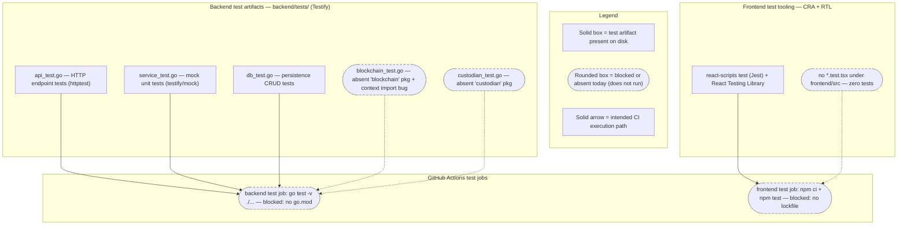

# Contributing — Testing Strategy & Coverage

This page is the test strategy and coverage-targets reference for the Blockchain Integration Service and Dashboard. The backend uses [Testify](https://github.com/stretchr/testify) as its Go test framework, and the frontend uses Create React App's `react-scripts test` (Jest) together with React Testing Library; this document inventories the existing test scaffold, describes how the tests are intended to run in local development and in CI, and records coverage targets that are **documented but not enforced**. It is the companion to the contribution workflow in [`development.md`](development.md) and the root [`CONTRIBUTING.md`](../../CONTRIBUTING.md), and it should be read alongside the local development loop in [`../getting-started/local-development.md`](../getting-started/local-development.md).

Consistent with the rest of the documentation set, this page is deliberately honest about the current state: the test **files** exist on disk, but the backend suite does **not** compile or run as-is, and the frontend has testing tooling declared but **no test files**. Those facts are stated plainly in every section below, each with a source citation, rather than being omitted. The full Implemented/Provisioned/Designed reconciliation and the complete defect catalog live in [`../architecture/scaffold-vs-design.md`](../architecture/scaffold-vs-design.md); this page does not duplicate that matrix, it applies the same discipline to the test layer specifically.

## Maturity Legend

Every capability named on this page is tagged with the project-wide maturity discipline, identical to the vocabulary used across the documentation set (see the [documentation index](../index.md) and the reconciliation page's [Maturity Legend](../architecture/scaffold-vs-design.md#maturity-legend)):

- **Implemented** — present and functional in the code as-declared today.
- **Provisioned** — scaffolding or configuration exists, but the capability is not yet fully wired to run.
- **Designed** — specified in the design corpus (`documentation/*.md`) or wired in a test/scaffold, but not yet present and runnable in code.

Because the backend has no Go module and each test file references packages that are absent or shaped differently from `backend/internal/**`, the test **artifacts** are **Implemented** (the `.go` files are present and authored), while the **executable test capability** they represent is **Designed** — it cannot run against the repository as-is. Where a referenced production package is itself absent (the `blockchain` and `custodian` packages), that package is labeled **Designed**. The finer composite qualifiers used on the reconciliation page (for example, *Implemented-with-defects*) are not repeated here; this page uses the three base labels and links out for the detailed defect reconciliation.

## Test Frameworks at a Glance

The project defines two independent test stacks, one per application tier. Both frameworks are declared and available; neither runs cleanly against the repository as-is (see [Known Limitations](#known-limitations)).

| Tier | Framework | Runner | Key libraries | Maturity | Source |
|------|-----------|--------|---------------|----------|--------|
| Backend (Go) | Testify | `go test` | `github.com/stretchr/testify/assert`, `github.com/stretchr/testify/mock` | Test files **Implemented**; executable suite **Designed** (no `go.mod`) | `backend/tests/service_test.go:L6-L7` |
| Frontend (React/TS) | Create React App + React Testing Library | `react-scripts test` (Jest) | `@testing-library/react`, `@testing-library/jest-dom`, `@testing-library/user-event` | Tooling **Implemented**; test coverage **Designed** (no test files) | `frontend/package.json:L6-L8,L23` |

Testify is the design-intended Go test framework recorded in the Technical Specification technology-stack table. `Source: documentation/Technical Specifications.md` (TECHNOLOGY STACK). Create React App's built-in Jest runner and React Testing Library are declared as frontend dependencies and wired through the `test` script. `Source: frontend/package.json:L6-L8,L23`.

### Figure T1 — Test Types & CI Execution

The diagram below, **Figure T1 — Test Types & CI Execution**, maps the test artifacts on disk to the two continuous-integration test jobs that are meant to run them, and marks — with the legend — which paths are blocked today. It is referenced by name from the sections that follow.



As **Figure T1** shows, the three structurally complete backend artifacts (`api_test.go`, `service_test.go`, `db_test.go`) and the two adapter tests (`blockchain_test.go`, `custodian_test.go`) all feed the single backend CI test job, while the frontend RTL tooling feeds the frontend CI test job — but every CI path is blocked today because the backend has no Go module and the frontend has no committed lockfile or test files. The blocked paths are drawn as rounded/dashed boxes per the legend.

## Backend Test Inventory

The backend test suite comprises five files under `backend/tests/`, all declared in `package tests` and all written in the Testify style. The table below inventories each file; the **Maturity** column reflects that the file exists as an artifact but that its executable capability (and, for the adapter tests, the referenced production package) is not present and runnable today.

| Test File | Scope | Framework | Key packages referenced (placeholder) | Maturity | Source |
|-----------|-------|-----------|----------------------------------------|----------|--------|
| `api_test.go` | HTTP endpoint tests for auth, vault, transaction, and signature routes via an in-process server | Testify `assert` + `net/http/httptest` + Gin | `github.com/your-username/your-project/backend/api`, `.../backend/models` | Artifact **Implemented**; suite **Designed** (does not compile) | `backend/tests/api_test.go:L10-L20` |
| `blockchain_test.go` | Ethereum + XRP client connection tests, plus two commented-out raw-transaction/broadcast stubs | Testify `assert` | `github.com/your-project/blockchain` (**absent**) | **Designed** (package absent; also a compile bug) | `backend/tests/blockchain_test.go:L3-L7,L15` |
| `custodian_test.go` | Custodian connect/disconnect, request-signature, and signature-status polling tests | Testify `assert` | `github.com/your-org/your-project/custodian` (**absent**) | **Designed** (package absent) | `backend/tests/custodian_test.go:L3-L9` |
| `db_test.go` | Database connect and vault/transaction CRUD tests against a simplified persistence API | Testify `assert` | `github.com/your-username/your-project/db` | Artifact **Implemented**; suite **Designed** (shape diverges from GORM schema) | `backend/tests/db_test.go:L3-L7` |
| `service_test.go` | Mock-based unit tests for the vault, transaction, and signature services | Testify `assert` + `mock` | `your-project/backend/service`, `your-project/backend/repository` | Artifact **Implemented**; suite **Designed** (does not compile) | `backend/tests/service_test.go:L3-L11` |

### Testify patterns in use

All five files use Testify's assertion package for their checks: `assert.NoError`, `assert.Equal`, `assert.NotNil`, `assert.NotEmpty`, `assert.Len`, `assert.Greater`, `assert.True`, and `assert.Error` appear across the suite. `Source: backend/tests/api_test.go:L35,L47`, `Source: backend/tests/db_test.go:L59-L60`, `Source: backend/tests/blockchain_test.go:L16-L17`. Two further Testify patterns are used:

- **Mock-based unit tests** — `service_test.go` imports `github.com/stretchr/testify/mock` and drives `MockVaultRepository`, `MockTransactionRepository`, and `MockSignatureRepository` through `mockRepo.On(...).Return(...)` expectations verified with `mockRepo.AssertExpectations(t)`. The services under test are constructed with `NewVaultService`, `NewTransactionService`, and `NewSignatureService`, and each test groups its cases with `t.Run` subtests (`CreateVault`/`GetVault`, `CreateTransaction`/`GetTransaction`, `CreateSignature`/`VerifySignature`). `Source: backend/tests/service_test.go:L7,L13-L40`. **Maturity: Designed** (the `service` and `repository` packages are placeholders that do not correspond to `backend/internal/**`).
- **HTTP handler tests** — `api_test.go` builds an in-process Gin engine in a `setupRouter()` helper and exercises it with `net/http/httptest` (`httptest.NewRecorder()` + `router.ServeHTTP(w, req)`), asserting on the recorded status code. `Source: backend/tests/api_test.go:L16-L20,L33-L35`. **Maturity: Designed** (the helper calls a router entry point that does not exist — see below).

The `api_test.go` handler tests additionally carry three `// HUMAN ASSISTANCE NEEDED` markers noting that authentication middleware for the protected vault, transaction, and signature routes is not implemented, so those tests assume an authenticated user that the scaffold cannot provide. `Source: backend/tests/api_test.go:L54-L56,L80-L82,L108-L110`. Similar `// HUMAN ASSISTANCE NEEDED` markers appear in `custodian_test.go` (a real-time `time.Sleep(5 * time.Second)` reliability caveat), `db_test.go` (missing setup/teardown), and `service_test.go` (service/repository shapes to be confirmed). `Source: backend/tests/custodian_test.go:L53-L56`, `Source: backend/tests/db_test.go:L98-L100`, `Source: backend/tests/service_test.go:L100-L102`.

### Documentable divergences

The test scaffold diverges from the real code in three ways that a contributor will encounter immediately. These are documented here and reconciled centrally, not resolved on this page:

- **API paths (a three-way disagreement).** The handler tests call an `/api/`-prefixed, **plural** path set — `/api/auth/register` and `/api/auth/login`, `/api/vaults`, `/api/transactions`, `/api/signatures`. `Source: backend/tests/api_test.go:L32,L44,L63,L91,L119`. These match **neither** the backend router, which registers **unprefixed, singular** paths (`/vault/...`), `Source: backend/internal/api/routes.go:L25-L31`, **nor** the Technical Specification's documented **versioned** `/api/v1/vaults` scheme. The frontend Axios client introduces yet a fourth variant (`/vaults`, plural, unprefixed). The full comparison and the resolution are catalogued in the API reference under [Path Conventions and the Prefix/Pluralization Discrepancy](../api-reference/overview.md#path-conventions-and-the-prefixpluralization-discrepancy) and in [`../architecture/scaffold-vs-design.md`](../architecture/scaffold-vs-design.md#defect-catalog).
- **Router entry point.** `api_test.go` calls `api.SetupRoutes(r)`, passing a `*gin.Engine` into a mutator-style function. `Source: backend/tests/api_test.go:L18`. The real router entry point is `SetupRouter()`, which takes no arguments and returns a freshly constructed `*gin.Engine`. `Source: backend/internal/api/routes.go:L9`. The two signatures are incompatible.
- **Persistence and model shapes.** `db_test.go` exercises a simplified API — `db.Vault{Name, UserID}` where `UserID` is a `string`, and `db.Transaction{VaultID (string), Amount (float64), Description}`. `Source: backend/tests/db_test.go:L20-L28,L67-L76`. The real GORM schema instead uses `uuid.UUID` identifiers, a `decimal.Decimal` amount, an `OrganizationID`, and no `Description` field. `Source: backend/internal/db/schema.go:L11-L68`. Likewise, `api_test.go` constructs `models.Transaction{VaultID: 1 (int), Amount: 100.0, Type: "deposit"}`, `Source: backend/tests/api_test.go:L85-L89`, a shape that does not match the GORM `Transaction` entity either. These `db.*` and `models.*` shapes are placeholder abstractions that predate the current schema; the authoritative entity definitions live in [`../architecture/data-model.md`](../architecture/data-model.md).

## Frontend Testing

The frontend is a Create React App project, and its test runner is CRA's `react-scripts test`, which wraps Jest with the CRA preset. The `test` script is defined as `react-scripts test`. `Source: frontend/package.json:L23`. The React Testing Library toolchain is declared in the dependencies: `@testing-library/jest-dom` (`^5.16.5`), `@testing-library/react` (`^13.4.0`), and `@testing-library/user-event` (`^13.5.0`). `Source: frontend/package.json:L6-L8`. The project's ESLint configuration extends both `react-app` and `react-app/jest`, which enables the Jest and Testing Library lint rules for test files. `Source: frontend/package.json:L28-L33`.

- **Tooling — Implemented.** The runner and the React Testing Library libraries are declared and wired through the `test` script and the ESLint config, so the framework itself is ready to execute. `Source: frontend/package.json:L6-L8,L23,L28-L33`.
- **Test coverage — Designed (absent).** There are currently **no test files** in `frontend/src` — no `*.test.tsx`, `*.test.ts`, `*.spec.tsx`, or `*.spec.ts` files exist — so running the test command finds and executes zero tests. `Source: frontend/src/` (no test files present). Authoring component and page tests with React Testing Library is therefore a **Designed** target, not current coverage.

The recommended pattern when tests are added is React Testing Library's user-centric approach — rendering a component with `render(...)`, querying by accessible role or text, and simulating interaction with `@testing-library/user-event` — with the `@testing-library/jest-dom` matchers (`toBeInTheDocument`, `toHaveTextContent`, and similar) available because the CRA preset wires its setup automatically. The pages and components that such tests would cover are catalogued in [`../architecture/frontend.md`](../architecture/frontend.md).

## Running Tests Locally

The commands below mirror the two continuous-integration test jobs; each is accompanied by the caveat that prevents it from succeeding against the repository as-is. Environment prerequisites (Go, Node, PostgreSQL, Redis) and the broader development loop are covered in [`../getting-started/local-development.md`](../getting-started/local-development.md); this section covers only the test invocations.

### Backend

Run the Go test suite from the `backend/` directory. This is the same command the backend CI test job runs. `Source: .github/workflows/backend-ci.yml:L30`.

```bash
# from backend/ — mirrors CI (.github/workflows/backend-ci.yml:L30)
go test -v ./...
```

**Caveat (Designed).** This command cannot resolve or compile the suite today: there is no `go.mod`/`go.sum` in the repository, so Go has no module context, and the five test files import four distinct **placeholder** module paths and two **absent** packages (`blockchain`, `custodian`). A `go.mod` must first be authored and every placeholder import path re-pointed at the real `backend/internal/**` packages (and the `blockchain`/`custodian` packages supplied) before `go test` will build. See [Known Limitations](#known-limitations) and the [Defect Catalog](../architecture/scaffold-vs-design.md#defect-catalog).

### Frontend

Run the Create React App test runner from the `frontend/` directory. Setting `CI=true` forces a single non-interactive run; omitting it starts Jest in CRA's interactive watch mode.

```bash
# from frontend/
npm install          # generates the lockfile CI's `npm ci` requires
CI=true npm test     # single run (omit CI=true for CRA watch mode)
```

**Caveat (Designed/Provisioned).** The frontend CI test job runs `npm ci` followed by `npm test`, `Source: .github/workflows/frontend-ci.yml:L29-L30`, but `npm ci` requires a committed lockfile (`package-lock.json`), and none exists in the repository — so a local `npm install` must be run first to generate one. Even after install, `npm test` currently discovers **zero** test files (see [Frontend Testing](#frontend-testing)), so the run reports no tests rather than failing.

## Coverage Targets

Coverage on this project is **documented, not enforced**. There is **no coverage gate in CI**: the backend test job runs `go test -v ./...` with no `-cover` flag or threshold, `Source: .github/workflows/backend-ci.yml:L30`, and the frontend test job runs `npm test` with no `--coverage` flag and no coverage upload step. `Source: .github/workflows/frontend-ci.yml:L30`. No pipeline step fails a build for insufficient coverage, and no coverage report is collected or published.

The Software Project Proposal's scope of work commits to unit, integration, performance, and security testing. `Source: documentation/Software Project Proposal.md` (SCOPE OF WORK). The proposal does **not** specify any numeric coverage percentage, so the table below records the committed testing *categories* as **Designed** aspirations against which the current scaffold is measured — it deliberately does not assert a measured or enforced percentage, because none exists.

| Test category | Aspirational target | Enforced in CI? | Current state | Basis |
|---------------|---------------------|-----------------|---------------|-------|
| Unit | Cover each core service method and repository behavior | No | Designed — mock-based scaffold in `service_test.go`, non-compiling | `documentation/Software Project Proposal.md` (SCOPE OF WORK); `backend/tests/service_test.go:L13-L40` |
| Integration | Exercise the HTTP contract and persistence layer end-to-end | No | Designed — `api_test.go`/`db_test.go` scaffolds diverge from code | `documentation/Software Project Proposal.md` (SCOPE OF WORK); `backend/tests/api_test.go:L22-L48` |
| Performance | Validate throughput/latency of the transaction and signature paths | No | Designed — no performance tests exist | `documentation/Software Project Proposal.md` (SCOPE OF WORK) |
| Security | Validate authentication, authorization, and input handling | No | Designed — auth middleware absent; noted in `api_test.go` markers | `documentation/Software Project Proposal.md` (SCOPE OF WORK); `backend/tests/api_test.go:L54-L56` |
| Frontend (component/UI) | Cover pages and shared components with React Testing Library | No | Designed — tooling present, no test files | `frontend/package.json:L6-L8`; `frontend/src/` (no test files) |

Every figure and state in the table above is an **aspirational/Designed** target, not a measured value; the "Enforced in CI?" column is uniformly **No**, matching the CI definitions cited above.

### Measuring coverage locally (documentation only)

Although CI enforces no gate, contributors can measure coverage locally once the [Known Limitations](#known-limitations) are resolved. For the backend, Go's built-in coverage reporting is:

```bash
# from backend/ — after a go.mod exists and imports resolve
go test -cover ./...
```

For the frontend, Create React App exposes Jest's coverage collection through the `test` script:

```bash
# from frontend/ — after a lockfile and test files exist
npm test -- --coverage --watchAll=false
```

Both commands are provided for documentation only; neither is wired into CI, and both depend on the caveats in the next section being addressed first.

## Known Limitations

The test scaffold is present but **non-functional today**. The limitations below are the complete set of reasons the suites do not compile or run as-is; each is cited and maturity-labeled. The full Implemented/Provisioned/Designed reconciliation for the whole system is maintained in [`../architecture/scaffold-vs-design.md`](../architecture/scaffold-vs-design.md#defect-catalog), which this list defers to rather than duplicates.

| # | Limitation | Impact | Maturity | Source |
|---|-----------|--------|----------|--------|
| 1 | No `go.mod`/`go.sum` anywhere in the repository | Go has no module context, so `go test ./...` cannot resolve imports or compile the backend suite | **Designed** (build module absent) | repository root (no `go.mod`/`go.sum` present) |
| 2 | Four distinct **placeholder** module import roots across the five test files | Even with a module, the imports point at non-existent paths and will not resolve | **Designed** | `backend/tests/api_test.go:L12-L13`, `backend/tests/blockchain_test.go:L6`, `backend/tests/custodian_test.go:L8`, `backend/tests/db_test.go:L6`, `backend/tests/service_test.go:L9-L10` |
| 3 | `blockchain` package imported but **absent** from the scaffold | `blockchain_test.go` cannot compile against a package that does not exist | **Designed** | `backend/tests/blockchain_test.go:L6` |
| 4 | `custodian` package imported but **absent** from the scaffold | `custodian_test.go` cannot compile against a package that does not exist | **Designed** | `backend/tests/custodian_test.go:L8` |
| 5 | Compile bug in `blockchain_test.go`: `context.Background()` used without importing `context` | The file fails to compile even setting the absent package aside | **Implemented** file with a compile-blocking defect | `backend/tests/blockchain_test.go:L15` (imports at `L3-L7` omit `context`) |
| 6 | Router entry-point mismatch: tests call `api.SetupRoutes(r)`; code defines `SetupRouter()` | `api_test.go` cannot bind to the real router | **Designed** | `backend/tests/api_test.go:L18` vs `backend/internal/api/routes.go:L9` |
| 7 | `db.*`/`models.*` test shapes diverge from the GORM schema (string IDs and `float64` amounts vs `uuid.UUID`/`decimal.Decimal`) | Persistence and model tests do not match the real entities | **Designed** | `backend/tests/db_test.go:L20-L28,L67-L76` vs `backend/internal/db/schema.go:L11-L68` |
| 8 | No committed frontend lockfile (`package-lock.json`) | CI's `npm ci` fails; a local `npm install` is required first | **Provisioned** (dependencies declared, lockfile absent) | `frontend/` (no lockfile); `.github/workflows/frontend-ci.yml:L29` |
| 9 | No frontend test files under `frontend/src` | `npm test` discovers and runs zero tests | **Designed** (coverage absent) | `frontend/src/` (no `*.test.tsx`/`*.spec.tsx`) |

Taken together, limitations 1–7 mean the **backend** suite does not build, and limitations 8–9 mean the **frontend** suite runs no tests. Resolving them — authoring a `go.mod`, re-pointing the placeholder imports at `backend/internal/**`, supplying the `blockchain` and `custodian` packages, fixing the `context` import, aligning the router and schema shapes, committing a lockfile, and adding React Testing Library tests — is **Designed** work tracked centrally in [`../architecture/scaffold-vs-design.md`](../architecture/scaffold-vs-design.md).

## Related Documentation

- [`development.md`](development.md) — contribution workflow and CI walkthrough (companion to this page).
- [`../../CONTRIBUTING.md`](../../CONTRIBUTING.md) — repository-level contribution guidelines.
- [`../index.md`](../index.md) — documentation index and audience map, including the shared maturity legend.
- [`../architecture/scaffold-vs-design.md`](../architecture/scaffold-vs-design.md) — authoritative Implemented/Provisioned/Designed matrix and full defect catalog.
- [`../getting-started/local-development.md`](../getting-started/local-development.md) — environment setup and the local development loop, including build caveats.
- [`../api-reference/overview.md`](../api-reference/overview.md) — the API contract and the path prefix/pluralization reconciliation referenced above.
