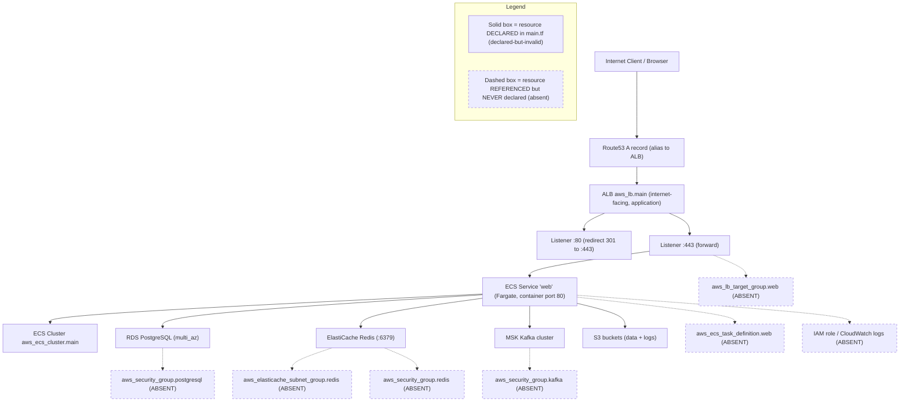

# Deployment Guide

This guide documents how the **Blockchain Integration Service and Dashboard** is deployed to AWS: the container images, the Terraform-provisioned topology (**ECS Fargate + ALB + RDS PostgreSQL + ElastiCache Redis**), and the `scripts/deploy.sh` build-and-release workflow. It reconciles the placeholder values in the deploy script with the actual Terraform resources and records the topology's known gaps.

The deployment topology is drawn as `Fig O2 - Deployment Topology` below. For observability of the running service, see the [Observability guide](../operations/observability.md) (`Fig O1 - Observability Current vs Designed`) and the container health-check gap in the [Runbook](../operations/runbook.md). Environment variables are documented in [Configuration](../getting-started/configuration.md). This guide is linked from the [project README](../../README.md).

> Maturity legend (identical to [Scaffold vs Design](../architecture/scaffold-vs-design.md)): **Implemented** = present in the repository AND compiles/validates AND runs today; reserved, and nothing here qualifies at this checkpoint. **Source-present (non-buildable)** = code or configuration exists but does not build/validate today, so no runtime behavior may be asserted. **Provisioned** = configuration exists AND would validly apply (passes `terraform validate`) but is not yet wired to a running deployment. **Designed** = specified in the corpus but absent, or declared-but-invalid, so it cannot apply today. Because the Terraform configuration fails `terraform validate` (17 errors, see Troubleshooting), the infrastructure below is **declared-but-invalid** and is therefore labeled **Designed**, not Provisioned.

## Overview

The target runtime is a single AWS region hosting a VPC with public and private subnets `Source: infrastructure/terraform/main.tf:L9-L40`, an internet-facing Application Load Balancer `Source: infrastructure/terraform/main.tf:L168-L174`, an ECS cluster running the application on Fargate `Source: infrastructure/terraform/main.tf:L143-L165`, and managed data services: RDS PostgreSQL `Source: infrastructure/terraform/main.tf:L91-L105`, ElastiCache Redis `Source: infrastructure/terraform/main.tf:L108-L117`, an MSK Kafka cluster `Source: infrastructure/terraform/main.tf:L120-L131`, and S3 buckets for data and logs `Source: infrastructure/terraform/main.tf:L134-L140`. The core resources are declared in Terraform, but the configuration does **not** pass `terraform validate` (17 errors), because `main.tf` references undeclared input variables and undeclared resources/data sources, and `outputs.tf` reads from an entirely disconnected module layer. Declared-but-invalid configuration cannot apply, so the topology is **Designed** (not Provisioned) until the configuration is reconciled (see Troubleshooting). Beyond the validation failures, the declared resources also carry several security and data-loss gaps catalogued under [Terraform security and data-loss gaps](#terraform-security-and-data-loss-gaps).

**Design-versus-scaffold nuance.** The Technical Specification's reference topology places an **Amazon API Gateway** in front of the Golang backend `Source: documentation/Technical Specifications.md:§INFRASTRUCTURE DIAGRAM`, whereas the Terraform code provisions an internet-facing **Application Load Balancer** instead `Source: infrastructure/terraform/main.tf:L168-L174`. The documentation below reflects the code (ALB) and flags the API Gateway as **Designed**.

## Deployment topology

**Figure O2 - Deployment Topology (AWS ECS Fargate).** The flowchart shows request flow from the internet through Route53 and the ALB to the Fargate service and its backing data stores. The legend is split into two declaration states and a validity caveat: solid boxes are resources **declared** in `main.tf`; dashed boxes are resources **referenced but never declared** in `main.tf` `Source: infrastructure/terraform/main.tf:L217-L227`. Declaration is not validity - every solid resource still fails `terraform validate` because it depends on undeclared variables and undeclared resources (see Troubleshooting), so no box in this diagram, solid or dashed, is Provisioned or Implemented today; the whole topology is **Designed**.



As shown in `Fig O2 - Deployment Topology`, the request path (Route53 -> ALB -> Fargate service -> data stores) is **partially declared but wholly invalid**, not deployable: even the request-path resources depend on undeclared input variables (for example `var.project_name` and `var.acm_certificate_arn` `Source: infrastructure/terraform/main.tf:L15,L196`) and on the undefined `aws_lb_target_group.web` (referenced at L161 and L200) and `aws_ecs_task_definition.web` (referenced at L151) `Source: infrastructure/terraform/main.tf:L151,L161,L200`. Consequently `terraform validate` fails with 17 errors (see Troubleshooting), so neither `terraform plan` nor `terraform apply` can run until the undeclared variables, the target group, the task definition, the security groups, and the IAM/CloudWatch wiring are supplied. The topology is therefore **Designed**, not Provisioned.

## Setup

**Prerequisites (Designed target).** An AWS account with permissions for VPC, ALB, ECS/Fargate, RDS, ElastiCache, MSK, S3, and Route53; the AWS CLI; Docker; and Terraform. The RDS instance is declared for high availability with `multi_az = true` `Source: infrastructure/terraform/main.tf:L103`, and its placement is written as `subnet_id = aws_subnet.private[0].id` `Source: infrastructure/terraform/main.tf:L102` - which is itself invalid for `aws_db_instance` (see [Terraform security and data-loss gaps](#terraform-security-and-data-loss-gaps)). Redis declares the `default.redis6.x` parameter group on port 6379 `Source: infrastructure/terraform/main.tf:L113-L114`. Because the configuration does not validate, these are Designed settings, not a Provisioned environment.

**Network and security groups (Designed; over-permissive as written).** The ALB security group permits ingress on ports 80 and 443 from any address `Source: infrastructure/terraform/main.tf:L43-L68` (port 80 at L49, port 443 at L56), which is expected for an internet-facing ALB. The ECS security group, however, accepts **all TCP ports (0-65535)** from the ALB security group `Source: infrastructure/terraform/main.tf:L76-L77` and allows **unrestricted egress** to `0.0.0.0/0` `Source: infrastructure/terraform/main.tf:L82-L87`; both are over-permissive and are catalogued under [Terraform security and data-loss gaps](#terraform-security-and-data-loss-gaps). These groups are Designed (the configuration does not validate).

**Container images (source-present Dockerfiles; broken build inputs).** The backend Dockerfile is written to build from `golang:1.17-alpine` and expose port 8080 `Source: infrastructure/docker/Dockerfile.backend:L2,L20`; the frontend Dockerfile is written to build from `node:14`, serve via `nginx:alpine`, and expose port 80 `Source: infrastructure/docker/Dockerfile.frontend:L2,L20,L26`. Both Dockerfiles copy dependency lockfiles that are absent from the repository - the backend copies `go.mod`/`go.sum` `Source: infrastructure/docker/Dockerfile.backend:L8` and the frontend copies `package-lock.json` and runs `npm ci` `Source: infrastructure/docker/Dockerfile.frontend:L8,L11`, so the images will not build as-is (**Designed** build wiring). Note this lockfile failure only occurs when the real Dockerfiles are built explicitly with `-f infrastructure/docker/Dockerfile.{backend,frontend}`; `scripts/deploy.sh` fails even earlier for a different reason (see Troubleshooting: "Deploy script build context").

## Usage

**Build and release (source-present script; placeholder values; does not build as-is).** The `scripts/deploy.sh` script *attempts to* build two images, `myapp-frontend` `Source: scripts/deploy.sh:L8` and `myapp-backend` `Source: scripts/deploy.sh:L16`, tag and push them to an ECR repository placeholder `your-ecr-repo-url` `Source: scripts/deploy.sh:L9,L17`, then trigger rolling updates. In practice the first `docker build` aborts the script before any push or deployment (see Troubleshooting: "Deploy script build context"). The intended flow is:

```bash
# CAUTION: these are LIVE, MUTATING commands against a real ECS cluster - not a dry run.
# --force-new-deployment immediately starts a rolling replacement of EVERY running task
# in the named service, even when the image tag is unchanged. Substitute the real cluster
# and service names first, and run only against the environment you intend to redeploy.
aws ecs update-service --cluster your-cluster-name --service frontend-service --force-new-deployment
aws ecs update-service --cluster your-cluster-name --service backend-service --force-new-deployment
```

These commands target `your-cluster-name` with two services, `frontend-service` and `backend-service`, using `--force-new-deployment` `Source: scripts/deploy.sh:L23-L24`.

**What `--force-new-deployment` actually does (and why it needs care).** The flag exists because ECS will not otherwise redeploy when the task definition is unchanged; forcing it makes the service start a **new deployment that replaces every running task** so tasks pick up a newly pushed image behind the same tag - here `myapp-frontend:latest` and `myapp-backend:latest` `Source: scripts/deploy.sh:L8-L10,L16-L18`. Three consequences follow. First, it is not idempotent in effect: each invocation cycles the whole service's tasks, so a stray re-run is a real production event, not a no-op. Second, availability during the roll depends entirely on the service's deployment configuration and health checks - and neither Dockerfile declares a `HEALTHCHECK` (see "No container health check" below), so the orchestrator has no image-level signal that a replacement task is actually serving. Third, because both images are pushed as `:latest`, the tag alone does not identify what is deployed and there is no distinct tag to roll back to; pushing an immutable, uniquely-tagged image per release is the **Designed** remediation. Note also that these two commands are the tail of `scripts/deploy.sh`, which never reaches them - it aborts at the first `docker build` (see "Deploy script build context") - so running them by hand deploys whatever image the registry currently holds under `:latest`, which may not be the code you just built.

**Placeholder reconciliation (Designed).** Before use, replace `your-ecr-repo-url` with the real ECR registry URI and `your-cluster-name` with the ECS cluster name defined by Terraform (`aws_ecs_cluster.main`) `Source: infrastructure/terraform/main.tf:L143`. Note the topology mismatch below: the script assumes two services, but Terraform declares one.

**Script invocation (`bash scripts/deploy.sh`, never `./scripts/deploy.sh`).** `scripts/deploy.sh` is committed with mode `100644` rather than `100755`, so the executable bit is absent from the git index itself and is therefore missing in every fresh clone - this is not a local permissions artifact `Source: scripts/deploy.sh (git index mode 100644)`. Invoking it directly fails before any line executes: `./scripts/deploy.sh` exits **126** with `bash: ./scripts/deploy.sh: Permission denied`, so no build, push, or `update-service` call is attempted. The file does carry a `#!/bin/bash` shebang `Source: scripts/deploy.sh:L1` and is syntactically valid (`bash -n scripts/deploy.sh` exits **0**), so passing it to an interpreter as `bash scripts/deploy.sh` runs it correctly; only the `./` form is blocked. The same applies to `scripts/setup.sh`, as documented in [installation.md](../getting-started/installation.md#corrected-setup-replacing-scriptssetupsh). Restoring the bit (`chmod +x`, or `git update-index --chmod=+x`) is **Designed** - this deliverable does not modify the scripts or their modes. Note that a successful invocation still aborts at the first `docker build` for the separate reason documented under Troubleshooting ("Deploy script build context"), so `bash` invocation fixes *how* the script is launched, not whether it completes.

## Troubleshooting

**Terraform configuration does not validate (`terraform validate` fails with 17 errors).** The configuration cannot be planned or applied as-is: running `terraform validate` against `infrastructure/terraform/` returns **17 errors** (exit 1), in three categories documented below. All are **Designed** gaps - documented here, not fixed.

Reproduce this yourself with the three **read-only** commands below. They inspect the configuration without contacting AWS, without creating or modifying state, and without touching a single resource.

```bash
cd infrastructure/terraform
terraform fmt -check                 # exit 3, prints "outputs.tf" - formatting drift, changes nothing
terraform init -backend=false        # exit 0 - downloads the AWS provider only; skips backend/state setup
terraform validate                   # exit 1 - prints the 17 errors broken down below
```

> **CAUTION - never run `terraform apply` or `terraform plan` against this configuration.** The three commands above are deliberately the read-only subset. `terraform plan` requires real AWS credentials and would begin resolving the data sources; `terraform apply` would attempt to create billable infrastructure and, because `skip_final_snapshot = true` is declared on the RDS instance (gap TF-6), sets up a destroy path with no final backup. The configuration does not validate in any case, so neither command can complete - but do not use it as a smoke test.

Two notes on what these commands leave behind. First, `-backend=false` is what keeps the run stateless: it tells Terraform to skip backend initialization, so **no `terraform.tfstate` is written** (confirmed: absent after the run). Omit that flag and Terraform initializes the default *local* backend instead - see gap TF-11. Second, `terraform init` writes two untracked artifacts into `infrastructure/terraform/`: `.terraform.lock.hcl` and a `.terraform/` provider cache that is roughly **840 MB** for the AWS provider. Because the repository ships no `.gitignore`, both land in `git status` as untracked - delete them or stage by explicit path, as described in [installation.md](../getting-started/installation.md#generated-artifacts-and-the-absent-gitignore).

The three error categories, and the exact counts `terraform validate` reports, are: **10** x `Reference to undeclared module`, **4** x `Reference to undeclared input variable`, and **3** x `Reference to undeclared resource` - 17 in total, detailed in turn below.

*(1) Undeclared resources and a data source.* `main.tf` references a target group, task definition, several security groups, an ElastiCache subnet group, IAM/CloudWatch resources, and an availability-zones data source that are never defined `Source: infrastructure/terraform/main.tf:L217-L227` - including `aws_lb_target_group.web` (referenced at L161 and L200), `aws_ecs_task_definition.web` (referenced at L151), `aws_security_group.postgresql` (referenced at L101), `aws_elasticache_subnet_group.redis` (referenced at L115), `aws_security_group.redis` (referenced at L116), `aws_security_group.kafka` (referenced at L129), and the data source `data.aws_availability_zones.available` (referenced at L24 and L35, with no `data "aws_availability_zones"` block declared) `Source: infrastructure/terraform/main.tf:L24,L35,L101,L115,L116`. `terraform validate` surfaces three of these directly (`aws_security_group.postgresql` at L101, `aws_elasticache_subnet_group.redis` at L115, `aws_security_group.redis` at L116); the remainder become visible once earlier errors are resolved. These are marked HUMAN ASSISTANCE NEEDED and must be authored before apply.

*(2) Undeclared input variables (`variables.tf` naming divergence).* `main.tf` references 14 input variables that `variables.tf` never declares - `var.project_name`, `var.postgres_version`, `var.postgres_instance_class`, `var.postgres_allocated_storage`, `var.postgres_username`, `var.postgres_password`, `var.postgres_db_name`, `var.redis_num_cache_nodes`, `var.kafka_broker_nodes`, `var.kafka_ebs_volume_size`, `var.acm_certificate_arn`, `var.route53_zone_id`, `var.domain_name`, and `var.web_service_desired_count` `Source: infrastructure/terraform/main.tf:L15,L94-L100,L112,L123,L127,L152,L196,L206-L207`. Instead, `variables.tf` declares a divergent set (`rds_instance_type`, `rds_engine`, `rds_engine_version`, `rds_database_name`, `rds_username`, `rds_password`, `redis_engine_version`, `kafka_number_of_broker_nodes`, plus `environment` and `ec2_instance_type`) `Source: infrastructure/terraform/variables.tf:L7,L30,L36-L98`, leaving **10 declared-but-unused** variables. `terraform validate` reports four `Reference to undeclared input variable` errors (all `var.project_name`, at L15, L135, L139, and L144); the remaining undeclared-variable references are masked behind the resource errors above. The variable names must be reconciled before the configuration will validate.

*(3) Disconnected `outputs.tf` (module-versus-direct-resource mismatch).* `outputs.tf` is written against a **module-based** design and reads from eight modules that `main.tf` does not implement - `module.vpc`, `module.rds`, `module.elasticache`, `module.msk`, `module.s3_bucket_raw_data`, `module.s3_bucket_processed`, `module.s3_bucket_analytics`, and `module.alb` `Source: infrastructure/terraform/outputs.tf:L3-L42`. `main.tf` instead declares **direct resources** and defines no modules `Source: infrastructure/terraform/main.tf:L1-L227`, so all ten output references fail with `Reference to undeclared module` - the **largest** category (10 of the 17 `terraform validate` errors). The output layer must be rewritten against the direct resources (or `main.tf` refactored into modules) before outputs resolve. `terraform fmt -check` additionally flags formatting drift in `outputs.tf`.

**Service-count mismatch (deploy script versus Terraform).** The deploy script updates two ECS services, `frontend-service` and `backend-service` `Source: scripts/deploy.sh:L23-L24`, but Terraform declares a single Fargate service `aws_ecs_service.web` with a container port of 80 `Source: infrastructure/terraform/main.tf:L148-L165` (Fargate launch type at L153, container port at L163). Either split the Terraform service into two, or change the script to update the single `web` service. Documented, not fixed.

**Deploy script build context (`docker build` fails before any push).** `scripts/deploy.sh` runs `cd frontend` then `docker build -t myapp-frontend:latest .`, and `cd backend` then `docker build -t myapp-backend:latest .` `Source: scripts/deploy.sh:L7-L8,L15-L16`, using each service directory as the build context with the **default** `Dockerfile` name. Neither `frontend/` nor `backend/` contains a `Dockerfile` - the Dockerfiles live under `infrastructure/docker/` `Source: infrastructure/docker/Dockerfile.backend:L1`, `Source: infrastructure/docker/Dockerfile.frontend:L1` - so the very first `docker build` fails immediately with `failed to read dockerfile: open Dockerfile: no such file or directory`. Because the script sets `set -e` `Source: scripts/deploy.sh:L3`, it aborts at this point and never reaches `docker push` or `aws ecs update-service`. This build-context failure **precedes** the missing-lockfile problem noted under Setup (which only appears when the real Dockerfiles are built explicitly with `-f`). To build, `deploy.sh` must run from the `infrastructure/docker` context or pass `-f infrastructure/docker/Dockerfile.backend` / `-f infrastructure/docker/Dockerfile.frontend` (**Designed**; documented, not fixed).

**No container health check.** Neither Dockerfile declares a `HEALTHCHECK` instruction `Source: infrastructure/docker/Dockerfile.backend:L20`, `Source: infrastructure/docker/Dockerfile.frontend:L26`, so orchestrators cannot detect an unhealthy container from the image alone (**Designed**). This gap is tracked as failure mode FM-5 in the [Runbook](../operations/runbook.md), and the `/health` and `/ready` endpoints it should probe are **Designed** in the [Observability guide](../operations/observability.md).

**Backend Go version and runtime currency.** The backend image pins `golang:1.17-alpine` `Source: infrastructure/docker/Dockerfile.backend:L2`, older than the Go 1.20 line used by CI; align these before building to avoid toolchain drift. Both container base pins - Go 1.17 (backend) and Node 14 (frontend) `Source: infrastructure/docker/Dockerfile.frontend:L2` - are also well past their upstream support windows and should be upgraded to currently-supported releases before a production build.

**Base images are referenced by mutable tags, never by digest (builds are not reproducible).** All three `FROM` instructions in the repository name a tag only, and **zero** of them carry a `sha256:` digest `Source: infrastructure/docker/Dockerfile.backend:L2`, `Source: infrastructure/docker/Dockerfile.frontend:L2,L20`. Tags are mutable pointers that the upstream publisher can re-point at a new image at any time, so two builds of the same Dockerfile on different days can resolve different base layers - and therefore different OS packages and CVE exposure - with no change to the repository. The three references differ in how much they leave floating:

| `FROM` reference | Where | What is pinned | What still floats |
|------------------|-------|----------------|-------------------|
| `golang:1.17-alpine` | `infrastructure/docker/Dockerfile.backend:L2` | Go minor line (1.17) and the Alpine base flavor | The patch release and the underlying Alpine version, plus every OS package in the layer |
| `node:14 AS build` | `infrastructure/docker/Dockerfile.frontend:L2` | Node major line (14) only | Minor and patch releases and the entire base distribution |
| `nginx:alpine` | `infrastructure/docker/Dockerfile.frontend:L20` | nothing version-related - **fully floating** | The complete nginx version and the Alpine base; this tag tracks whatever nginx currently ships as its Alpine build |

`nginx:alpine` is the weakest of the three: it constrains no version at all, so the runtime web server in the frontend image is whatever upstream published most recently at build time. Pinning each base image by immutable digest (`FROM nginx:alpine@sha256:...`), with a documented refresh process so digests are updated deliberately rather than drifting silently, is the **Designed** remediation - documented here, not applied, since this deliverable does not modify the Dockerfiles. The same mutable-reference problem affects the CI workflows' `@vN` action tags and the `master`-branch golangci-lint installer, recorded as limitation 3 in [`../contributing/development.md`](../contributing/development.md#known-limitations) and in the [prerequisites](../getting-started/installation.md#prerequisites).

**API Gateway is not provisioned.** The Technical Specification topology shows an Amazon API Gateway `Source: documentation/Technical Specifications.md:§INFRASTRUCTURE DIAGRAM`, but the code exposes the service through the ALB instead `Source: infrastructure/terraform/main.tf:L168-L174`; treat API Gateway as **Designed**, not deployed.

## Terraform security and data-loss gaps

Beyond the 17 `terraform validate` errors, the declared resources - even once made valid - encode several security and data-loss weaknesses. This catalog is the authoritative source referenced by the [Security model](../security/security-model.md); every item is **Designed** remediation (documented here, not fixed). All citations are to `infrastructure/terraform/main.tf`.

| # | Gap | Evidence | Risk | Remediation (Designed) |
|---|-----|----------|------|------------------------|
| TF-1 | ECS security group opens **all TCP ports (0-65535)** from the ALB group | ingress `from_port = 0`, `to_port = 65535` `Source: infrastructure/terraform/main.tf:L76-L77` | Any compromised ALB-reachable path can reach every task port, not just the app port | Restrict ingress to the container port (80/8080) only |
| TF-2 | **Unrestricted egress** on both the ALB and ECS security groups | egress `protocol = "-1"`, `cidr_blocks = ["0.0.0.0/0"]` `Source: infrastructure/terraform/main.tf:L63-L66,L82-L87` | Exfiltration path; no outbound allow-listing | Constrain egress to required destinations (RDS, ElastiCache, MSK, AWS endpoints) |
| TF-3 | **RDS not encrypted at rest** | `storage_type = "gp2"` with no `storage_encrypted`/`kms_key_id` `Source: infrastructure/terraform/main.tf:L91-L105` (storage at L97) | Database volume and snapshots stored in plaintext | Set `storage_encrypted = true` with a KMS CMK |
| TF-4 | **RDS master password from a plaintext variable** | `password = var.postgres_password` `Source: infrastructure/terraform/main.tf:L99` | Secret is passed through Terraform state/vars rather than a secret store | Source the password from AWS Secrets Manager / SSM SecureString |
| TF-5 | **Invalid RDS subnet attribute** (also a validity defect) | `subnet_id = aws_subnet.private[0].id` `Source: infrastructure/terraform/main.tf:L102` | `aws_db_instance` has no `subnet_id`; it requires a `db_subnet_group_name`, so placement is undefined | Replace with an `aws_db_subnet_group` and `db_subnet_group_name` |
| TF-6 | **RDS `skip_final_snapshot = true`** (data-loss) | `skip_final_snapshot = true` `Source: infrastructure/terraform/main.tf:L104` | Destroying the instance leaves no final snapshot; data is unrecoverable | Set `skip_final_snapshot = false` and set `final_snapshot_identifier` |
| TF-7 | **ElastiCache Redis has no encryption** | no `at_rest_encryption_enabled`/`transit_encryption_enabled` `Source: infrastructure/terraform/main.tf:L108-L117` | Cache data and in-transit traffic are unencrypted | Enable at-rest and in-transit encryption (and an auth token) |
| TF-8 | **S3 buckets declared bare** (no SSE, versioning, or public-access block) | `aws_s3_bucket.data`/`.logs` with no encryption or access-block resources `Source: infrastructure/terraform/main.tf:L134-L140` | Objects unencrypted; no accidental-public-exposure guard; no version recovery | Add SSE (SSE-KMS), `aws_s3_bucket_public_access_block`, and versioning |
| TF-9 | **No KMS, Secrets Manager, or HSM anywhere** | no such resources in `main.tf` `Source: infrastructure/terraform/main.tf:L1-L227` | Encryption keys and secrets are unmanaged | Introduce KMS CMKs and a secret store as the encryption/secret backbone |
| TF-10 | **Legacy TLS policy on the HTTPS listener** | `ssl_policy = "ELBSecurityPolicy-2016-08"` `Source: infrastructure/terraform/main.tf:L195` | Permits TLS 1.0/1.1, below current baselines | Adopt a TLS 1.2+ policy (for example `ELBSecurityPolicy-TLS13-1-2-2021-06`) |
| TF-11 | **No state backend declared**, so state defaults to a local, unencrypted, unlocked `terraform.tfstate` | zero `backend` blocks in any file `Source: infrastructure/terraform/main.tf (no backend block present)`, `Source: infrastructure/terraform/outputs.tf (no backend block present)`, `Source: infrastructure/terraform/variables.tf (no backend block present)` | **Amplifies TF-4.** Terraform records every resource attribute in state, so the RDS master password supplied through `var.postgres_password` is written into that plaintext file on the operator's disk - and, with no `.gitignore` in the repository, it sits untracked next to the configuration where a bulk `git add` can commit it. No locking also means two concurrent operators can corrupt state | Declare a remote backend with encryption and locking (for example S3 with SSE-KMS plus DynamoDB or S3 native locking), and source the password from Secrets Manager rather than a variable |
| TF-12 | **No Terraform or provider version constraints** | zero `terraform {}` blocks anywhere, therefore no `required_version` and no `required_providers` `Source: infrastructure/terraform/ (no terraform{} block in main.tf, outputs.tf, or variables.tf)`; the provider is declared bare as `provider "aws" { region = var.aws_region }` `Source: infrastructure/terraform/main.tf:L4-L6`, and `.terraform.lock.hcl` is **not committed** `Source: infrastructure/terraform/ (tracked files: main.tf, outputs.tf, variables.tf only)` | Nothing in the repository pins either the CLI or the provider, so `terraform init` resolves whatever AWS provider is newest at that moment - a fresh init here selected **hashicorp/aws v6.56.0**. Two engineers initializing on different days can land on different provider majors and get divergent plans from identical code, and a new major can introduce breaking changes with no code change | Add a `terraform {}` block with `required_version` and a `required_providers` constraint on `hashicorp/aws` (for example `~> 6.0`), and commit `.terraform.lock.hcl` so provider selection is reproducible and checksum-verified |

**Application data amplifies these gaps.** Two gaps above are especially consequential given what the application is designed to place in these stores. The unencrypted ElastiCache (TF-7) is the cache into which the settlement processor is coded to write the full `Signature` record — including the **sensitive** `RawSignature` — under `signature:<id>` for 24 hours `Source: backend/internal/tasks/signature_processor.go:L46-L52`, `Source: backend/internal/db/schema.go:L64`, so enabling at-rest and in-transit encryption (and minimizing that TTL) is required to protect cryptographic material, not merely a hardening nicety. Likewise, the absent Secrets Manager/KMS backbone (TF-9) is where the per-tenant API key — a **secret** that `Organization.APIKey` currently holds as a plaintext `string` `Source: backend/internal/db/schema.go:L15` — and the RDS master password (TF-4) must be stored and encrypted. The application-level handling contracts for these fields (hash/verifier and reveal-once for API keys; minimize, encrypt, and never-log for raw signatures) are defined in the [Security model](../security/security-model.md#secrets-and-key-management) and [`../architecture/data-model.md`](../architecture/data-model.md#sensitive--secret-fields); the Terraform gaps above are their infrastructure counterpart.

The one control that is correctly declared is HTTP-to-HTTPS redirection: the `:80` listener issues an `HTTP_301` redirect to `:443` `Source: infrastructure/terraform/main.tf:L176-L189`, and a `:443` HTTPS listener is declared `Source: infrastructure/terraform/main.tf:L191-L203` - though it inherits gap TF-10 (legacy `ssl_policy`) and forwards to the undeclared `aws_lb_target_group.web`. None of these controls apply today because the configuration does not validate; they are documented as **Designed** remediations for the encryption, secret-management, and network controls whose absence is described in the [Security model](../security/security-model.md).

## Related documentation

- [Observability guide](../operations/observability.md) - `Fig O1 - Observability Current vs Designed`, `/health` and `/ready` endpoints.
- [Runbook](../operations/runbook.md) - FM-5 (container health-check gap).
- [Configuration](../getting-started/configuration.md) - environment variables, DB DSN, Redis.
- [Security model](../security/security-model.md) - the security controls whose Terraform-side gaps are catalogued above.
- [Project README](../../README.md).
