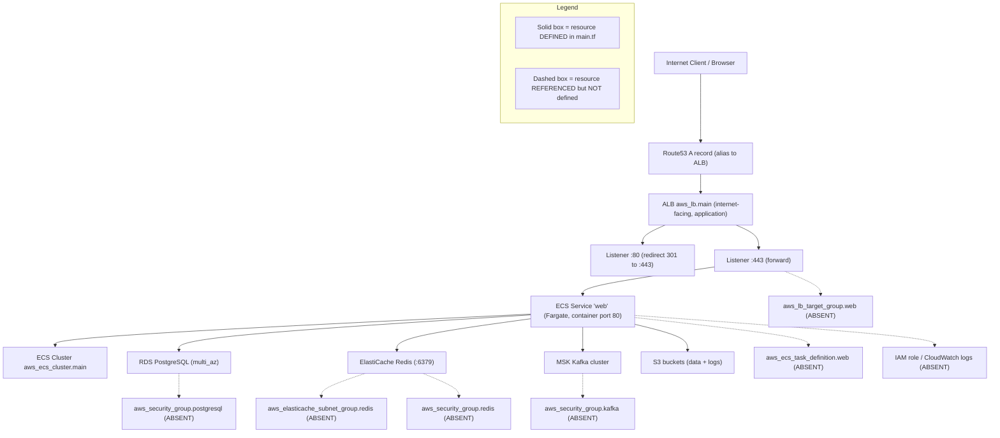

# Deployment Guide

This guide documents how the **Blockchain Integration Service and Dashboard** is deployed to AWS: the container images, the Terraform-provisioned topology (**ECS Fargate + ALB + RDS PostgreSQL + ElastiCache Redis**), and the `scripts/deploy.sh` build-and-release workflow. It reconciles the placeholder values in the deploy script with the actual Terraform resources and records the topology's known gaps.

The deployment topology is drawn as `Fig O2 - Deployment Topology` below. For observability of the running service, see the [Observability guide](../operations/observability.md) (`Fig O1 - Observability Current vs Designed`) and the container health-check gap in the [Runbook](../operations/runbook.md). Environment variables are documented in [Configuration](../getting-started/configuration.md). This guide is linked from the [documentation index](../index.md).

> Maturity legend: **Implemented** = present and working in the code today; **Provisioned** = infrastructure is declared but incompletely wired; **Designed** = specified but absent from the code today.

## Overview

The target runtime is a single AWS region hosting a VPC with public and private subnets `Source: infrastructure/terraform/main.tf:L9-L40`, an internet-facing Application Load Balancer `Source: infrastructure/terraform/main.tf:L168-L174`, an ECS cluster running the application on Fargate `Source: infrastructure/terraform/main.tf:L143-L165`, and managed data services: RDS PostgreSQL `Source: infrastructure/terraform/main.tf:L91-L105`, ElastiCache Redis `Source: infrastructure/terraform/main.tf:L108-L117`, an MSK Kafka cluster `Source: infrastructure/terraform/main.tf:L120-L131`, and S3 buckets for data and logs `Source: infrastructure/terraform/main.tf:L134-L140`. The whole topology is **Provisioned** (declared in Terraform) with **Designed** gaps, because several referenced resources are never defined (see Troubleshooting).

**Design-versus-scaffold nuance.** The Technical Specification's reference topology places an **Amazon API Gateway** in front of the Golang backend `Source: documentation/Technical Specifications.md:§INFRASTRUCTURE DIAGRAM`, whereas the Terraform code provisions an internet-facing **Application Load Balancer** instead `Source: infrastructure/terraform/main.tf:L168-L174`. The documentation below reflects the code (ALB) and flags the API Gateway as **Designed**.

## Deployment topology

**Figure O2 - Deployment Topology (AWS ECS Fargate).** The flowchart shows request flow from the internet through Route53 and the ALB to the Fargate service and its backing data stores. Per the legend, solid boxes are resources **defined** in `main.tf`; dashed boxes are resources **referenced but not defined** in `main.tf` `Source: infrastructure/terraform/main.tf:L217-L227`.



As shown in `Fig O2 - Deployment Topology`, the request path (Route53 -> ALB -> Fargate service -> data stores) is fully declared, while the target group, task definition, service groups, and IAM/CloudWatch wiring are referenced but undefined and must be supplied before `terraform apply` can succeed.

## Setup

**Prerequisites (Provisioned).** An AWS account with permissions for VPC, ALB, ECS/Fargate, RDS, ElastiCache, MSK, S3, and Route53; the AWS CLI; Docker; and Terraform. The RDS instance is configured for high availability with `multi_az = true` `Source: infrastructure/terraform/main.tf:L103`, placed in a private subnet `Source: infrastructure/terraform/main.tf:L102`. Redis uses the `default.redis6.x` parameter group on port 6379 `Source: infrastructure/terraform/main.tf:L113-L114`.

**Network and security groups (Provisioned).** The ALB security group permits ingress on ports 80 and 443 `Source: infrastructure/terraform/main.tf:L43-L68` (port 80 at L48, port 443 at L55), and the ECS security group accepts traffic from the ALB `Source: infrastructure/terraform/main.tf:L70-L88` (ALB source at L79).

**Container images (Implemented artifacts; broken build inputs).** The backend image builds from `golang:1.17-alpine` and exposes port 8080 `Source: infrastructure/docker/Dockerfile.backend:L2,L20`; the frontend image builds from `node:14`, serves via `nginx:alpine`, and exposes port 80 `Source: infrastructure/docker/Dockerfile.frontend:L2,L20,L26`. Both Dockerfiles copy dependency lockfiles that are absent from the repository - the backend copies `go.mod`/`go.sum` `Source: infrastructure/docker/Dockerfile.backend:L8` and the frontend runs `npm ci` expecting `package-lock.json` `Source: infrastructure/docker/Dockerfile.frontend:L8`, so the images will not build as-is (**Designed** build wiring).

## Usage

**Build and release (Implemented script; placeholder values).** The `scripts/deploy.sh` script builds two images, `myapp-frontend` `Source: scripts/deploy.sh:L8` and `myapp-backend` `Source: scripts/deploy.sh:L16`, tags and pushes them to an ECR repository placeholder `your-ecr-repo-url` `Source: scripts/deploy.sh:L9,L17`, then triggers rolling updates:

```bash
aws ecs update-service --cluster your-cluster-name --service frontend-service --force-new-deployment
aws ecs update-service --cluster your-cluster-name --service backend-service --force-new-deployment
```

These commands target `your-cluster-name` with two services, `frontend-service` and `backend-service`, using `--force-new-deployment` `Source: scripts/deploy.sh:L23-L24`.

**Placeholder reconciliation (Designed).** Before use, replace `your-ecr-repo-url` with the real ECR registry URI and `your-cluster-name` with the ECS cluster name defined by Terraform (`aws_ecs_cluster.main`) `Source: infrastructure/terraform/main.tf:L143`. Note the topology mismatch below: the script assumes two services, but Terraform declares one.

## Troubleshooting

**Terraform apply fails on undefined resources.** The configuration references a target group, task definition, several security groups, an ElastiCache subnet group, and IAM/CloudWatch resources that are never defined `Source: infrastructure/terraform/main.tf:L217-L227` - including `aws_lb_target_group.web` (referenced at L161 and L200), `aws_ecs_task_definition.web` (referenced at L151), `aws_security_group.postgresql` (referenced at L101), `aws_elasticache_subnet_group.redis` (referenced at L115), `aws_security_group.redis` (referenced at L116), and `aws_security_group.kafka` (referenced at L129). These are marked HUMAN ASSISTANCE NEEDED and must be authored before apply (**Designed**).

**Service-count mismatch (deploy script versus Terraform).** The deploy script updates two ECS services, `frontend-service` and `backend-service` `Source: scripts/deploy.sh:L23-L24`, but Terraform declares a single Fargate service `aws_ecs_service.web` with a container port of 80 `Source: infrastructure/terraform/main.tf:L148-L165` (Fargate launch type at L153, container port at L163). Either split the Terraform service into two, or change the script to update the single `web` service. Documented, not fixed.

**No container health check.** Neither Dockerfile declares a `HEALTHCHECK` instruction `Source: infrastructure/docker/Dockerfile.backend:L20`, `Source: infrastructure/docker/Dockerfile.frontend:L26`, so orchestrators cannot detect an unhealthy container from the image alone (**Designed**). This gap is tracked as failure mode FM-5 in the [Runbook](../operations/runbook.md), and the `/health` and `/ready` endpoints it should probe are **Designed** in the [Observability guide](../operations/observability.md).

**Backend Go version.** The backend image pins `golang:1.17-alpine` `Source: infrastructure/docker/Dockerfile.backend:L2`, older than the Go 1.20 line used by CI; align these before building to avoid toolchain drift.

**API Gateway is not provisioned.** The Technical Specification topology shows an Amazon API Gateway `Source: documentation/Technical Specifications.md:§INFRASTRUCTURE DIAGRAM`, but the code exposes the service through the ALB instead `Source: infrastructure/terraform/main.tf:L168-L174`; treat API Gateway as **Designed**, not deployed.

## Related documentation

- [Observability guide](../operations/observability.md) - `Fig O1 - Observability Current vs Designed`, `/health` and `/ready` endpoints.
- [Runbook](../operations/runbook.md) - FM-5 (container health-check gap).
- [Configuration](../getting-started/configuration.md) - environment variables, DB DSN, Redis.
- [Documentation index](../index.md).
