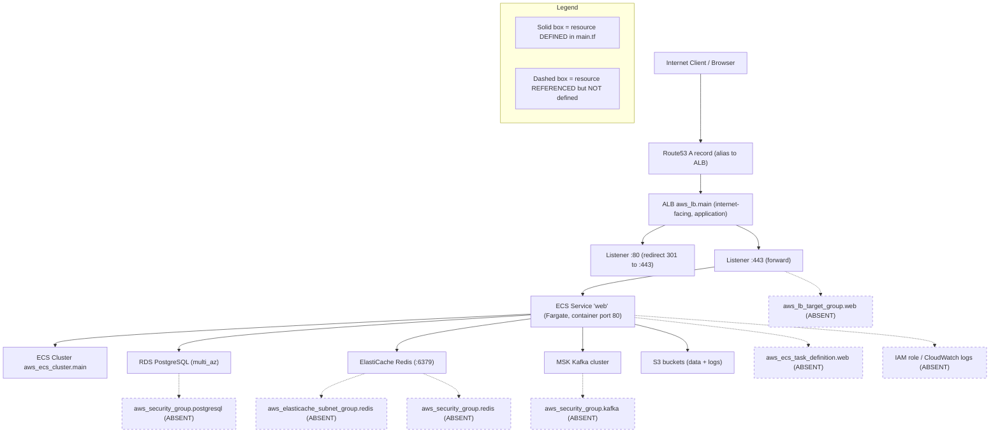

# Deployment Guide

This guide documents how the **Blockchain Integration Service and Dashboard** is deployed to AWS: the container images, the Terraform-provisioned topology (**ECS Fargate + ALB + RDS PostgreSQL + ElastiCache Redis**), and the `scripts/deploy.sh` build-and-release workflow. It reconciles the placeholder values in the deploy script with the actual Terraform resources and records the topology's known gaps.

The deployment topology is drawn as `Fig O2 - Deployment Topology` below. For observability of the running service, see the [Observability guide](../operations/observability.md) (`Fig O1 - Observability Current vs Designed`) and the container health-check gap in the [Runbook](../operations/runbook.md). Environment variables are documented in [Configuration](../getting-started/configuration.md). This guide is linked from the [project README](../../README.md).

> Maturity legend: **Implemented** = present and working in the code today; **Provisioned** = infrastructure is declared but incompletely wired; **Designed** = specified but absent from the code today.

## Overview

The target runtime is a single AWS region hosting a VPC with public and private subnets `Source: infrastructure/terraform/main.tf:L9-L40`, an internet-facing Application Load Balancer `Source: infrastructure/terraform/main.tf:L168-L174`, an ECS cluster running the application on Fargate `Source: infrastructure/terraform/main.tf:L143-L165`, and managed data services: RDS PostgreSQL `Source: infrastructure/terraform/main.tf:L91-L105`, ElastiCache Redis `Source: infrastructure/terraform/main.tf:L108-L117`, an MSK Kafka cluster `Source: infrastructure/terraform/main.tf:L120-L131`, and S3 buckets for data and logs `Source: infrastructure/terraform/main.tf:L134-L140`. The core resources are declared in Terraform, so the topology is **partially Provisioned**; however, it does **not** currently pass `terraform validate` (17 errors), because `main.tf` references undeclared input variables and undeclared resources/data sources, and `outputs.tf` reads from an entirely disconnected module layer. The affected pieces therefore remain **Designed** until the configuration is reconciled (see Troubleshooting).

**Design-versus-scaffold nuance.** The Technical Specification's reference topology places an **Amazon API Gateway** in front of the Golang backend `Source: documentation/Technical Specifications.md:§INFRASTRUCTURE DIAGRAM`, whereas the Terraform code provisions an internet-facing **Application Load Balancer** instead `Source: infrastructure/terraform/main.tf:L168-L174`. The documentation below reflects the code (ALB) and flags the API Gateway as **Designed**.

## Deployment topology

**Figure O2 - Deployment Topology (AWS ECS Fargate).** The flowchart shows request flow from the internet through Route53 and the ALB to the Fargate service and its backing data stores. Per the legend, solid boxes are resources **defined** in `main.tf`; dashed boxes are resources **referenced but not defined** in `main.tf` `Source: infrastructure/terraform/main.tf:L217-L227`.



As shown in `Fig O2 - Deployment Topology`, the request path (Route53 -> ALB -> Fargate service -> data stores) is **partially declared/provisioned**, not fully declared: even the request-path resources depend on undeclared input variables (for example `var.project_name` and `var.acm_certificate_arn` `Source: infrastructure/terraform/main.tf:L15,L196`) and on the undefined `aws_lb_target_group.web` (referenced at L161 and L200) and `aws_ecs_task_definition.web` (referenced at L151) `Source: infrastructure/terraform/main.tf:L151,L161,L200`. Consequently `terraform validate` fails with 17 errors (see Troubleshooting), so neither `terraform plan` nor `terraform apply` can run until the undeclared variables, the target group, the task definition, the security groups, and the IAM/CloudWatch wiring are supplied.

## Setup

**Prerequisites (Provisioned).** An AWS account with permissions for VPC, ALB, ECS/Fargate, RDS, ElastiCache, MSK, S3, and Route53; the AWS CLI; Docker; and Terraform. The RDS instance is configured for high availability with `multi_az = true` `Source: infrastructure/terraform/main.tf:L103`, placed in a private subnet `Source: infrastructure/terraform/main.tf:L102`. Redis uses the `default.redis6.x` parameter group on port 6379 `Source: infrastructure/terraform/main.tf:L113-L114`.

**Network and security groups (Provisioned).** The ALB security group permits ingress on ports 80 and 443 `Source: infrastructure/terraform/main.tf:L43-L68` (port 80 at L48, port 443 at L55), and the ECS security group accepts traffic from the ALB `Source: infrastructure/terraform/main.tf:L70-L88` (ALB source at L79).

**Container images (Implemented artifacts; broken build inputs).** The backend image builds from `golang:1.17-alpine` and exposes port 8080 `Source: infrastructure/docker/Dockerfile.backend:L2,L20`; the frontend image builds from `node:14`, serves via `nginx:alpine`, and exposes port 80 `Source: infrastructure/docker/Dockerfile.frontend:L2,L20,L26`. Both Dockerfiles copy dependency lockfiles that are absent from the repository - the backend copies `go.mod`/`go.sum` `Source: infrastructure/docker/Dockerfile.backend:L8` and the frontend copies `package-lock.json` and runs `npm ci` `Source: infrastructure/docker/Dockerfile.frontend:L8,L11`, so the images will not build as-is (**Designed** build wiring). Note this lockfile failure only occurs when the real Dockerfiles are built explicitly with `-f infrastructure/docker/Dockerfile.{backend,frontend}`; `scripts/deploy.sh` fails even earlier for a different reason (see Troubleshooting: "Deploy script build context").

## Usage

**Build and release (Implemented script; placeholder values; does not build as-is).** The `scripts/deploy.sh` script *attempts to* build two images, `myapp-frontend` `Source: scripts/deploy.sh:L8` and `myapp-backend` `Source: scripts/deploy.sh:L16`, tag and push them to an ECR repository placeholder `your-ecr-repo-url` `Source: scripts/deploy.sh:L9,L17`, then trigger rolling updates. In practice the first `docker build` aborts the script before any push or deployment (see Troubleshooting: "Deploy script build context"). The intended flow is:

```bash
aws ecs update-service --cluster your-cluster-name --service frontend-service --force-new-deployment
aws ecs update-service --cluster your-cluster-name --service backend-service --force-new-deployment
```

These commands target `your-cluster-name` with two services, `frontend-service` and `backend-service`, using `--force-new-deployment` `Source: scripts/deploy.sh:L23-L24`.

**Placeholder reconciliation (Designed).** Before use, replace `your-ecr-repo-url` with the real ECR registry URI and `your-cluster-name` with the ECS cluster name defined by Terraform (`aws_ecs_cluster.main`) `Source: infrastructure/terraform/main.tf:L143`. Note the topology mismatch below: the script assumes two services, but Terraform declares one.

## Troubleshooting

**Terraform configuration does not validate (`terraform validate` fails with 17 errors).** The configuration cannot be planned or applied as-is: running `terraform validate` against `infrastructure/terraform/` returns **17 errors** (exit 1), in three categories documented below. All are **Designed** gaps - documented here, not fixed.

*(1) Undeclared resources and a data source.* `main.tf` references a target group, task definition, several security groups, an ElastiCache subnet group, IAM/CloudWatch resources, and an availability-zones data source that are never defined `Source: infrastructure/terraform/main.tf:L217-L227` - including `aws_lb_target_group.web` (referenced at L161 and L200), `aws_ecs_task_definition.web` (referenced at L151), `aws_security_group.postgresql` (referenced at L101), `aws_elasticache_subnet_group.redis` (referenced at L115), `aws_security_group.redis` (referenced at L116), `aws_security_group.kafka` (referenced at L129), and the data source `data.aws_availability_zones.available` (referenced at L24 and L35, with no `data "aws_availability_zones"` block declared) `Source: infrastructure/terraform/main.tf:L24,L35,L101,L115,L116`. `terraform validate` surfaces three of these directly (`aws_security_group.postgresql` at L101, `aws_elasticache_subnet_group.redis` at L115, `aws_security_group.redis` at L116); the remainder become visible once earlier errors are resolved. These are marked HUMAN ASSISTANCE NEEDED and must be authored before apply.

*(2) Undeclared input variables (`variables.tf` naming divergence).* `main.tf` references 14 input variables that `variables.tf` never declares - `var.project_name`, `var.postgres_version`, `var.postgres_instance_class`, `var.postgres_allocated_storage`, `var.postgres_username`, `var.postgres_password`, `var.postgres_db_name`, `var.redis_num_cache_nodes`, `var.kafka_broker_nodes`, `var.kafka_ebs_volume_size`, `var.acm_certificate_arn`, `var.route53_zone_id`, `var.domain_name`, and `var.web_service_desired_count` `Source: infrastructure/terraform/main.tf:L15,L94-L100,L112,L123,L127,L152,L196,L206-L207`. Instead, `variables.tf` declares a divergent set (`rds_instance_type`, `rds_engine`, `rds_engine_version`, `rds_database_name`, `rds_username`, `rds_password`, `redis_engine_version`, `kafka_number_of_broker_nodes`, plus `environment` and `ec2_instance_type`) `Source: infrastructure/terraform/variables.tf:L7,L30,L36-L98`, leaving **10 declared-but-unused** variables. `terraform validate` reports four `Reference to undeclared input variable` errors (all `var.project_name`, at L15, L135, L139, and L144); the remaining undeclared-variable references are masked behind the resource errors above. The variable names must be reconciled before the configuration will validate.

*(3) Disconnected `outputs.tf` (module-versus-direct-resource mismatch).* `outputs.tf` is written against a **module-based** design and reads from eight modules that `main.tf` does not implement - `module.vpc`, `module.rds`, `module.elasticache`, `module.msk`, `module.s3_bucket_raw_data`, `module.s3_bucket_processed`, `module.s3_bucket_analytics`, and `module.alb` `Source: infrastructure/terraform/outputs.tf:L3-L42`. `main.tf` instead declares **direct resources** and defines no modules `Source: infrastructure/terraform/main.tf:L1-L227`, so all ten output references fail with `Reference to undeclared module` - the **largest** category (10 of the 17 `terraform validate` errors). The output layer must be rewritten against the direct resources (or `main.tf` refactored into modules) before outputs resolve. `terraform fmt -check` additionally flags formatting drift in `outputs.tf`.

**Service-count mismatch (deploy script versus Terraform).** The deploy script updates two ECS services, `frontend-service` and `backend-service` `Source: scripts/deploy.sh:L23-L24`, but Terraform declares a single Fargate service `aws_ecs_service.web` with a container port of 80 `Source: infrastructure/terraform/main.tf:L148-L165` (Fargate launch type at L153, container port at L163). Either split the Terraform service into two, or change the script to update the single `web` service. Documented, not fixed.

**Deploy script build context (`docker build` fails before any push).** `scripts/deploy.sh` runs `cd frontend` then `docker build -t myapp-frontend:latest .`, and `cd backend` then `docker build -t myapp-backend:latest .` `Source: scripts/deploy.sh:L7-L8,L15-L16`, using each service directory as the build context with the **default** `Dockerfile` name. Neither `frontend/` nor `backend/` contains a `Dockerfile` - the Dockerfiles live under `infrastructure/docker/` `Source: infrastructure/docker/Dockerfile.backend:L1`, `Source: infrastructure/docker/Dockerfile.frontend:L1` - so the very first `docker build` fails immediately with `failed to read dockerfile: open Dockerfile: no such file or directory`. Because the script sets `set -e` `Source: scripts/deploy.sh:L3`, it aborts at this point and never reaches `docker push` or `aws ecs update-service`. This build-context failure **precedes** the missing-lockfile problem noted under Setup (which only appears when the real Dockerfiles are built explicitly with `-f`). To build, `deploy.sh` must run from the `infrastructure/docker` context or pass `-f infrastructure/docker/Dockerfile.backend` / `-f infrastructure/docker/Dockerfile.frontend` (**Designed**; documented, not fixed).

**No container health check.** Neither Dockerfile declares a `HEALTHCHECK` instruction `Source: infrastructure/docker/Dockerfile.backend:L20`, `Source: infrastructure/docker/Dockerfile.frontend:L26`, so orchestrators cannot detect an unhealthy container from the image alone (**Designed**). This gap is tracked as failure mode FM-5 in the [Runbook](../operations/runbook.md), and the `/health` and `/ready` endpoints it should probe are **Designed** in the [Observability guide](../operations/observability.md).

**Backend Go version and runtime currency.** The backend image pins `golang:1.17-alpine` `Source: infrastructure/docker/Dockerfile.backend:L2`, older than the Go 1.20 line used by CI; align these before building to avoid toolchain drift. Both container base pins - Go 1.17 (backend) and Node 14 (frontend) `Source: infrastructure/docker/Dockerfile.frontend:L2` - are also well past their upstream support windows and should be upgraded to currently-supported releases before a production build.

**API Gateway is not provisioned.** The Technical Specification topology shows an Amazon API Gateway `Source: documentation/Technical Specifications.md:§INFRASTRUCTURE DIAGRAM`, but the code exposes the service through the ALB instead `Source: infrastructure/terraform/main.tf:L168-L174`; treat API Gateway as **Designed**, not deployed.

## Related documentation

- [Observability guide](../operations/observability.md) - `Fig O1 - Observability Current vs Designed`, `/health` and `/ready` endpoints.
- [Runbook](../operations/runbook.md) - FM-5 (container health-check gap).
- [Configuration](../getting-started/configuration.md) - environment variables, DB DSN, Redis.
- [Project README](../../README.md).
