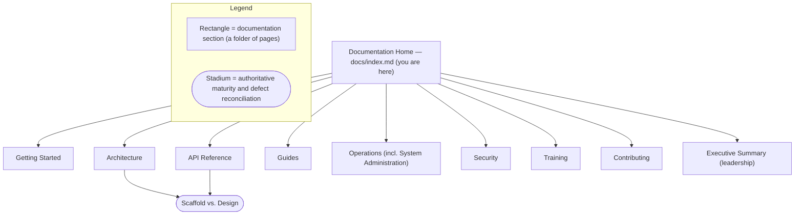

# Blockchain Integration Service and Dashboard — Documentation

This `docs/` tree is the developer-, operator-, and reviewer-facing documentation for the Blockchain Integration Service and Dashboard **as the system actually exists on disk today** — an early-stage Go/React scaffold — and it reconciles that reality against the aspirational design corpus under [`documentation/`](#design-references). The documented subject is a **custodial blockchain platform** whose domain is **vaults, signatures, and transactions**, served over **18 REST endpoints** by a **Go/Gin backend** that is **Designed** to persist to **PostgreSQL and Redis** (the persistence code is source-present but non-buildable). `Source: backend/internal/api/routes.go:L9-L54` The domain is modelled as five entities — `Organization`, `User`, `Vault`, `Transaction`, and `Signature`. `Source: backend/internal/db/schema.go:L11-L68` The dashboard is a **React 18 + TypeScript** single-page application built with Create React App; its state layer uses Redux Toolkit, which is imported in source but **not declared** in `package.json` (an undeclared dependency). `Source: frontend/src/store/index.ts:L1`, `Source: frontend/package.json`

> **Design corpus vs. as-built.** The three documents under `documentation/` — the [Software Project Proposal](<../documentation/Software Project Proposal.md>), the [Software Requirements Specification (SRS)](<../documentation/Software Requirements Specifications (SRS).md>), and the [Technical Specifications](<../documentation/Technical Specifications.md>) — remain the authoritative **design** references (what the system is intended to become). This `docs/` tree documents the **as-built** system (what is present in code now) and labels every capability's maturity so the two are never confused. Where they diverge, the code is authoritative and the divergence is documented, not hidden.

## Maturity Legend

Every capability across this documentation set is tagged with a project-wide maturity discipline so readers can distinguish what is present in code from what is only specified:

- **Implemented** — present and working in the code today. At this checkpoint this label is **reserved**: nothing currently qualifies for the unqualified `Implemented` because the backend has no committed `go.mod` (`Source: repository root (no go.mod present)`) and does not build end-to-end — for example the composition root calls `SetupRouter` with four arguments against a zero-argument definition (`Source: backend/cmd/server/main.go:L52`, `Source: backend/internal/api/routes.go:L9`).
- **Provisioned** — infrastructure or configuration exists in source, but the capability is not yet fully wired or exercised.
- **Designed** — specified in the design corpus (`documentation/*.md`), but not yet built (absent from code).

The **authoritative, full vocabulary** — including the composite qualifiers *Implemented-with-defects (source-present, non-buildable)* and *Implemented-but-broken*, together with the consolidated maturity matrix and the complete defect catalog — lives in the reconciliation page's [Maturity Legend](architecture/scaffold-vs-design.md#maturity-legend). Sibling pages defer to it.

> **Known code defects are documented honestly, not fixed.** The scaffold contains concrete, verified gaps — an uninitialized ticker interval that panics at startup `Source: backend/internal/tasks/transaction_processor.go:L13-L16`, a router-signature mismatch between the composition root's four-argument call and the router's zero-argument definition `Source: backend/cmd/server/main.go:L52`, `Source: backend/internal/api/routes.go:L9`, backend packages that are imported (`Source: backend/cmd/server/main.go:L6-L12`) but absent from the tree, and no committed `go.mod` (`Source: repository root (no go.mod present)`). These are catalogued in full in [`architecture/scaffold-vs-design.md`](architecture/scaffold-vs-design.md) rather than silently omitted.

## Documentation Map

The tree is organized into eight sections plus a leadership-facing executive summary, as shown in **Figure IX1**. Start from your audience row in the [Audiences](#audiences) table below, then use the [Navigation](#navigation) section for the full page list.

**Figure IX1 — Documentation Map (sections of the `docs/` tree and their entry points)**

As **Figure IX1** shows, both the Architecture and API Reference sections point at the *Scaffold vs. Design* reconciliation as the single source of truth for maturity and defects.

## Audiences

Pick your starting point by role. Every path below resolves within this tree except the executive summary, which lives beside it under `blitzy-deck/`.

| Audience | Start here |
|----------|------------|
| New developers | [Installation](getting-started/installation.md), then [Local Development](getting-started/local-development.md) |
| New team members / trainees | [Training Materials](training/training-materials.md) — the role-based onboarding course |
| Backend / API engineers | [Backend Architecture](architecture/backend.md) and [API Reference — Overview](api-reference/overview.md) |
| Frontend engineers | [Frontend Architecture](architecture/frontend.md) |
| Operators / SRE | [Observability](operations/observability.md) and [Operations Runbook](operations/runbook.md) |
| System administrators / DevOps | [System Administration Guide](operations/system-administration.md) |
| Security reviewers | [Security Model](security/security-model.md) |
| Contributors | [Development Workflow](contributing/development.md) and [Testing Strategy](contributing/testing.md) |
| Non-technical leadership / executives | [Executive Summary](../blitzy-deck/executive-summary.html) (self-contained presentation) |

## Navigation

Every link below points to a page produced as part of this documentation set. All paths are relative to this file (`docs/index.md`).

### Getting Started

- [`getting-started/installation.md`](getting-started/installation.md) — Prerequisites (Go, Node, PostgreSQL, Redis) and install steps; corrects the stale `mysql`/`.env.example` errors carried by `scripts/setup.sh`.
- [`getting-started/configuration.md`](getting-started/configuration.md) — Environment variables, the PostgreSQL DSN and `sslmode`, Redis connection settings, and JWT configuration.
- [`getting-started/local-development.md`](getting-started/local-development.md) — Local development workflow and build caveats (no committed `go.mod`, no frontend lockfile, tsconfig/CRA notes).

### Architecture

- [`architecture/overview.md`](architecture/overview.md) — System overview with the before/after pair **Fig A1** (current-implemented scaffold) and **Fig A2** (designed target).
- [`architecture/backend.md`](architecture/backend.md) — The Go/Gin layered modular monolith, dependency injection, and composition-root wiring-gap callouts.
- [`architecture/frontend.md`](architecture/frontend.md) — The React 18 + Redux Toolkit component and state architecture (**Fig A3**).
- [`architecture/data-flow.md`](architecture/data-flow.md) — Authentication, transaction-settlement, and signature sequences (**Fig B1/B2/B3**) plus the end-to-end data flow (**Fig DF1**).
- [`architecture/data-model.md`](architecture/data-model.md) — The five GORM entities, field tables, the ERD (**Fig M1**), and the dual-identifier gap note. `Source: backend/internal/db/schema.go:L11-L68`
- [`architecture/scaffold-vs-design.md`](architecture/scaffold-vs-design.md) — The authoritative Implemented/Provisioned/Designed matrix and the full defect catalog reconciling the design corpus against the on-disk scaffold.

### API Reference

The backend exposes **18 REST endpoints** with no `/api/v1` prefix and a singular `/vault` path. `Source: backend/internal/api/routes.go:L9-L54`

- [`api-reference/overview.md`](api-reference/overview.md) — OpenAPI introduction, the `swag init` workflow, the full endpoint index, and the path-prefix/pluralization discrepancy.
- [`api-reference/authentication.md`](api-reference/authentication.md) — The three `/auth` endpoints (login, register, logout) with request/response examples.
- [`api-reference/vaults.md`](api-reference/vaults.md) — The five `/vault` endpoints; includes the `/vault` (backend) vs `/vaults` (frontend) note.
- [`api-reference/transactions.md`](api-reference/transactions.md) — The five `/transactions` endpoints; includes the transaction status-vocabulary note.
- [`api-reference/signatures.md`](api-reference/signatures.md) — The five `/signatures` endpoints; includes the **Designed** Kafka publish step.
- [`api-reference/openapi.yaml`](api-reference/openapi.yaml) — The machine-readable OpenAPI 3.0 contract for all 18 endpoints.

### Guides

- [`guides/vault-management.md`](guides/vault-management.md) — End-user guide for Vault Management (VM-001): setup, usage, and troubleshooting.
- [`guides/transaction-processing.md`](guides/transaction-processing.md) — End-user guide for Transaction Processing (TP-001) and the asynchronous settlement model.
- [`guides/signature-management.md`](guides/signature-management.md) — End-user guide for Signature Generation & Management (SG-001).
- [`guides/deployment.md`](guides/deployment.md) — Deployment topology (**Designed**: ECS Fargate + ALB + RDS + ElastiCache) and the ECR/ECS reconciliation.

### Operations

- [`operations/observability.md`](operations/observability.md) — Structured logging with correlation IDs, distributed tracing, a `/metrics` endpoint, and health/readiness checks, stating precisely what is **reused** (Gin access logging and worker structured logging — both **emission-only** and **source-present (non-buildable)**, so they do not run today) versus **added** (**Designed** correlation IDs, tracing, metrics, health endpoints).
- [`operations/system-administration.md`](operations/system-administration.md) — The consolidated system-administration guide: configuration, deployment, database and cache administration, backup and recovery, monitoring, user and role administration, security administration, and incident response.
- [`operations/runbook.md`](operations/runbook.md) — Alerts and failure modes, including the startup ticker panic and settlement-retry behavior.
- [`operations/dashboard-template.json`](operations/dashboard-template.json) — The observability dashboard template (metric, log, and health panels).

### Security

- [`security/security-model.md`](security/security-model.md) — Role-based access control (Admin/Manager/Operator/Auditor/API User), JWT with refresh tokens, multi-factor authentication, and encryption.

### Training

- [`training/training-materials.md`](training/training-materials.md) — The role-based onboarding and training course, delivering the proposal's written guides for common operations (with operator/dashboard depth) and labeling the video tutorials as **Designed**.

### Contributing

- [`contributing/development.md`](contributing/development.md) — Contribution workflow and CI overview.
- [`contributing/testing.md`](contributing/testing.md) — Test strategy and coverage targets.

## Project & Governance Links

These files live at the repository root, one level above this tree:

- [`../README.md`](../README.md) — Repository entry point and stack summary (this documentation is its home).
- [`../CONTRIBUTING.md`](../CONTRIBUTING.md) — Contribution guidelines.
- [`../CHANGELOG.md`](../CHANGELOG.md) — Project changelog.
- [`../LICENSE`](../LICENSE) — License terms.
- [`../blitzy-deck/executive-summary.html`](../blitzy-deck/executive-summary.html) — Self-contained executive presentation for non-technical leadership.

## Design References

The authoritative **design** corpus (intended target; not the as-built state) lives under `../documentation/`:

- [Software Project Proposal](<../documentation/Software Project Proposal.md>) — project scope and committed deliverables.
- [Software Requirements Specification (SRS)](<../documentation/Software Requirements Specifications (SRS).md>) — the five product features (VM-001, SG-001, TP-001, UA-001, MA-001), non-functional requirements, and the glossary that anchors terminology across this tree.
- [Technical Specifications](<../documentation/Technical Specifications.md>) — system architecture, database design, API design, technology stack, and security.

## Known Divergences

Three divergences between the code, the frontend, and the design corpus are load-bearing enough to call out here; each is detailed on the linked page rather than duplicated:

- **Resource path disagreement.** The backend router registers a singular, unprefixed `/vault` group, while the frontend client calls the plural `/vaults`, and the Technical Specification documents `/api/v1/vaults`. `Source: backend/internal/api/routes.go:L25-L31`, `Source: frontend/src/services/api.ts:L32-L34` See [`api-reference/overview.md`](api-reference/overview.md).
- **Transaction status vocabulary.** The frontend and backend use different status vocabularies for transactions; the reconciliation is documented on [`api-reference/transactions.md`](api-reference/transactions.md) and in [`architecture/scaffold-vs-design.md`](architecture/scaffold-vs-design.md).
- **Design vs. scaffold maturity.** The broader set of design-versus-code gaps (absent packages, the ticker panic, the router-signature mismatch, the dual-identifier GORM inconsistency) is enumerated in [`architecture/scaffold-vs-design.md`](architecture/scaffold-vs-design.md).

## Maintaining This Documentation

This tree **aims** to attach an inline `Source: <path>:<locator>` citation to every technical claim so it can be re-verified against the code, and to label every capability with its maturity (**Implemented**, **Source-present (non-buildable)**, **Provisioned**, or **Designed**). Treat this as the maintenance standard rather than a guarantee that every line already meets it: where a citation or label is found to be missing, imprecise, or stale, correct it against the source. When a source file changes, update the pages that cite it and re-check their maturity labels against the authoritative [Maturity Legend](architecture/scaffold-vs-design.md#maturity-legend).
