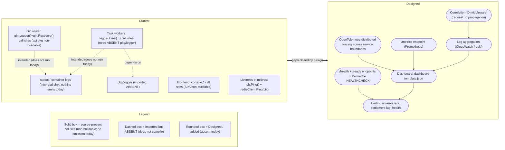

# Observability

This guide documents observability for the **Blockchain Integration Service and Dashboard** across the five required pillars: structured logging with correlation IDs, distributed tracing, a metrics endpoint, health/readiness checks, and a dashboard template. It satisfies the mandatory Observability rule.

Following the rule's discipline, each pillar first states **what source-present signal it reuses** (labeled **Source-present (non-buildable)** — the call site exists in the repository but does not compile today) and then **what is added** (labeled **Designed** where the capability is absent today). Every technical claim carries a `Source:` citation. `Fig O1 — Observability Current vs Designed` shows both states so the gap is explicit.

> Maturity legend (identical to [`../architecture/scaffold-vs-design.md`](../architecture/scaffold-vs-design.md)): **Implemented** = present in the repository AND compiles AND runs today; this label is **reserved** and nothing in this repository qualifies at this checkpoint, so it is not used below. **Source-present (non-buildable)** = the code for the signal exists in the repository but does not compile today (no `go.mod`; `pkg/logger` and other packages are imported but absent), so no runtime emission, format, or destination may be asserted. **Provisioned** = configuration/scaffold exists and would validly apply but is not wired into a running system. **Designed** = specified in the corpus but absent from the code today.

## Fig O1 — Observability Current vs Designed

`Fig O1` is a before/after pair. The **Current (source-present, non-buildable)** subgraph shows only the logging *call sites* that exist in the source today — none of which emit at runtime, because the backend does not compile; the **Designed (target)** subgraph shows the added correlation IDs, tracing, metrics, health/readiness, aggregation, and alerting. The dashed node marks the compile-blocking caveat that `pkg/logger` is imported but absent.

**Figure O1 — Observability Current vs Designed (before/after pair)**

**Figure O1 legend.** Solid boxes are source-present logging call sites — they exist in the source but emit nothing today because the backend does not compile (dashed intended-emission arrows carry the "does not run today" qualifier); the dashed box (`pkg/logger`) is imported but absent, so even the source-present worker logging cannot compile; rounded boxes are Designed additions absent today. The heavy arrow marks the transition from the current source-present (non-buildable) state to the designed target.

Sources for `Fig O1`: `Source: backend/internal/api/routes.go:L13-L14` (Gin logging/recovery), `Source: backend/internal/tasks/transaction_processor.go:L26,L44,L50,L57` and `Source: backend/internal/tasks/signature_processor.go:L25,L42,L48,L53,L57` (worker logs), `Source: backend/cmd/server/main.go:L10` (`pkg/logger` imported but absent), `Source: backend/internal/db/postgres.go:L27` and `Source: backend/internal/db/redis.go:L21` (liveness primitives).

## Pillar 1 — Structured logging with correlation IDs

**Reused (source-present, non-buildable).** The Gin router contains `gin.Logger()` and `gin.Recovery()` middleware *call sites* `Source: backend/internal/api/routes.go:L13-L14`. These would emit an access log line per request and recover from panics *if the code ran*, but the `api` package does not compile today — it imports the absent `internal/api/middleware` package `Source: backend/internal/api/routes.go:L6` and references handler methods that are not defined — so no access log is emitted and the on-disk log format and destination cannot be verified. Both background processors likewise contain `logger.Error(...)` call sites on their error paths only `Source: backend/internal/tasks/transaction_processor.go:L26,L44,L50,L57`, `Source: backend/internal/tasks/signature_processor.go:L25,L42,L48,L53,L57`; these call the **absent** `backend/pkg/logger` package `Source: backend/internal/tasks/transaction_processor.go:L10`, so they do not compile and emit nothing today, and there is no success/heartbeat log on the non-error path. The frontend contains `console.*` call sites rather than a structured logger — for example the login failure path logs through `console.error` `Source: frontend/src/services/auth.ts:L14` — but the SPA also does not build, so nothing reaches the browser console either; the build blockers are enumerated in [Monitoring & Analytics (MA-001)](#monitoring--analytics-ma-001) below. The design intent for a structured backend logger is Logrus `Source: documentation/Technical Specifications.md:§FRAMEWORKS AND LIBRARIES`. In short: the logging *call sites* are source-present, but no log line — structured or otherwise — is emitted to stdout or anywhere else at this checkpoint.

**Added (Designed).** Correlation-ID propagation does not exist today: no middleware assigns or forwards a `request_id`/`X-Request-ID`, so logs cannot be correlated across the router and workers. **Caveat:** `pkg/logger` is imported by the composition root and both processors but the package directory is absent `Source: backend/cmd/server/main.go:L10`, so even the source-present worker logging cannot compile until the package exists. The design adds a correlation-ID middleware and a shared structured logger.

**Local verification (static only today).** Because the backend does not compile (see [`runbook.md`](runbook.md) FM-4), there is no running API to exercise and no stdout log line to observe at this checkpoint; runtime verification is gated on resolving those compile blockers. What is verifiable statically today: `grep -n "gin.Logger()\|gin.Recovery()" backend/internal/api/routes.go` confirms the middleware call sites exist in source, and `grep -rn "logger.Error" backend/internal/tasks` confirms the worker call sites exist in source. `grep -rn "\"backend/pkg/logger\"" backend` shows the import while `ls backend/pkg/logger` returns no such directory, confirming the logging package is absent. Once the compile blockers are resolved, the runtime check is: start the API, issue a request, and observe the access line on stdout.

### Logging allowlist and redaction contract (Designed)

The application logs nothing today — the backend does not compile and the SPA does not build — so this is a **Designed** contract to enforce when structured logging ships, not a runtime guarantee. It is stated here so the logger, the dashboard log panel, and any log aggregation are built to it from the start.

**Allowlist — fields that MAY be logged.** Timestamp, level, message, correlation/request ID (`request_id` / `X-Request-ID`), HTTP method, route *template* (not the raw URL with its query string), status code, latency, error class/category, and non-secret resource identifiers (`txID`, `signatureID`, `vaultId`, `userId`, `organizationId`).

**Denylist — MUST NEVER be logged (redact or drop before emission).** `Authorization` headers and bearer tokens; issued JWTs; `Cookie` / `Set-Cookie` values; passwords and password hashes; API keys (`Organization.APIKey` — `Source: backend/internal/db/schema.go:L15`); raw signature material (`Signature.RawSignature` — `Source: backend/internal/db/schema.go:L64`); and full request or response bodies (which can carry any of the above). Query strings must be stripped or redacted because they can transport tokens.

**Current source-present concerns (documented, not fixed).** Two call sites log an entire error object, which can transitively include secret-bearing request data and would violate the contract once the code runs:

- Backend workers call `logger.Error("...", "error", err, ...)`, logging the whole `err` value. `Source: backend/internal/tasks/signature_processor.go:L42`, `Source: backend/internal/tasks/transaction_processor.go:L44`.
- The frontend logs the full Axios error on a failed login — `console.error('Login failed:', error)` — where `error` typically carries `config.data` (the submitted `{ username, password }`), so the plaintext password can be written to the browser console. `Source: frontend/src/services/auth.ts:L14`.

Per the AAP these are **documented, not fixed** (no source code is modified); the contract above is the target behavior the structured logger must implement — emit an error class and sanitized message, never the raw error object, headers, or request body. This contract governs the worker-error log panel in [`dashboard-template.json`](dashboard-template.json), which must project only the allowlisted fields and never render raw messages or bodies.

## Pillar 2 — Distributed tracing

**Reused (source-present).** None. There is no tracing instrumentation anywhere in the codebase today, and the absence is visible at every layer that would have to carry a span: the router installs only `gin.Logger()` and `gin.Recovery()` and registers no tracing middleware, exporter, or propagator across any of its 18 routes `Source: backend/internal/api/routes.go:L9-L54`; the composition root's import block declares no tracing or OpenTelemetry package `Source: backend/cmd/server/main.go:L3-L13`; and the frontend declares no tracing, RUM, or error-reporting dependency `Source: frontend/package.json:L1-L45`.

**Added (Designed).** OpenTelemetry tracing spanning the HTTP handler, the core service, and the custodian/blockchain adapters, so a transaction or signature can be followed across service boundaries. Two of those boundaries do not exist yet either — `internal/blockchain` and `internal/custodian` are imported by the composition root but absent from the tree `Source: backend/cmd/server/main.go:L8-L9` — so the outbound spans have no adapter to instrument until those packages ship. Trace error rate is surfaced by a Designed panel in [`dashboard-template.json`](dashboard-template.json).

**Local verification.** `grep -rn "otel\|opentelemetry\|trace" backend` returns no matches today, confirming tracing is absent (Designed) `Source: backend/internal/api/routes.go:L9-L54`. `grep -inE "otel|opentelemetry|sentry|datadog|rum" frontend/package.json` likewise returns nothing, confirming the browser side is uninstrumented `Source: frontend/package.json:L1-L45`.

## Pillar 3 — Metrics endpoint

**Reused (source-present).** None. The router registers only the `/auth`, `/vault`, `/transactions`, and `/signatures` groups and defines no `/metrics` route `Source: backend/internal/api/routes.go:L9-L54`.

**Added (Designed).** A Prometheus `/metrics` endpoint exporting request counters, request-duration histograms (for p95 latency), and worker/settlement gauges. CloudWatch is the design's monitoring backend `Source: documentation/Technical Specifications.md:§THIRD-PARTY SERVICES`. The capacity target the metrics validate is ~10,000 req/s `Source: documentation/Technical Specifications.md:§SYSTEM OVERVIEW`.

**Local verification.** `grep -n "metrics" backend/internal/api/routes.go` returns nothing, confirming no metrics route (Designed).

## Pillar 4 — Health and readiness checks

**Reused (source-present).** No `/health` or `/ready` HTTP routes exist `Source: backend/internal/api/routes.go:L9-L54`. However, source-present liveness primitives exist to build on: PostgreSQL connectivity is checked in source with `db.Ping()` `Source: backend/internal/db/postgres.go:L27`, and Redis connectivity with `redisClient.Ping(ctx)` `Source: backend/internal/db/redis.go:L21`. These run inside the connection initializers rather than an HTTP probe and, like the rest of the backend, do not execute today because the module does not compile.

**Added (Designed).** A liveness `/health` endpoint and a readiness `/ready` endpoint that composes the PostgreSQL and Redis pings, plus a container-level `HEALTHCHECK`. The backend Dockerfile only exposes a port and defines no `HEALTHCHECK` `Source: infrastructure/docker/Dockerfile.backend:L20`; the frontend Dockerfile has the same gap `Source: infrastructure/docker/Dockerfile.frontend:L26`.

**Added (Designed) — graceful shutdown and traffic drain.** A readiness endpoint only drains traffic if it flips to *not ready* **before** the process stops accepting work, so `/ready` must be paired with signal-aware shutdown. The designed sequence is: on `SIGTERM`, fail `/ready` first so the load balancer deregisters the task; stop accepting new connections; then let in-flight HTTP requests and the background processors' current iteration finish (`http.Server.Shutdown` with a bounded timeout, and cancellation of the context the processors poll on) before exiting. Neither half exists today — the composition root installs no signal handler and calls no `Shutdown`, and the repository records the gap in its own marker: `// HUMAN ASSISTANCE NEEDED` / `// The following code may need additional error handling and graceful shutdown mechanisms` `Source: backend/cmd/server/main.go:L18-L19`. This matters operationally because shipping `/health`, `/ready`, and the `HEALTHCHECK` **without** drain semantics still drops in-flight requests on every ECS/ALB deployment: a readiness probe that never turns negative gives the target group no window to deregister. Per the documentation-only scope this is documented, not fixed; it is carried as part of failure mode FM-5 in [`runbook.md`](runbook.md).

**Local verification.** `grep -n "health\|ready" backend/internal/api/routes.go` returns nothing (Designed). `grep -n "HEALTHCHECK" infrastructure/docker/Dockerfile.backend infrastructure/docker/Dockerfile.frontend` returns nothing, confirming the container health-check gap. `grep -n "Shutdown\|signal.Notify\|SIGTERM" backend/cmd/server/main.go` also returns nothing, confirming the graceful-shutdown gap, while `grep -n -A2 "HUMAN ASSISTANCE NEEDED" backend/cmd/server/main.go` prints the marker that calls for it `Source: backend/cmd/server/main.go:L18-L19`.

## Pillar 5 — Dashboard template

**Reused (source-present).** None committed. Nothing in the repository queries, exports, or renders a metric today: the router exposes no `/metrics`, `/health`, or `/ready` route for a dashboard to read `Source: backend/internal/api/routes.go:L9-L54`, and the Terraform stack declares no CloudWatch dashboard, metric filter, or alarm resource — its own trailing comment lists "CloudWatch log groups and metrics" among the pieces still to be added `Source: infrastructure/terraform/main.tf:L226`.

**Added (Designed).** A Grafana-compatible dashboard template ships with this documentation at [`dashboard-template.json`](dashboard-template.json). It contains **12** panels: a datasource-free "Read me first" explainer, three row headers, health/readiness stat panels, request-rate and p95-latency time series, a worker-error log panel (bound to the source-present `logger.Error(...)` call sites, which depend on the absent `pkg/logger` and therefore emit nothing today — non-buildable, not a live signal) `Source: backend/cmd/server/main.go:L10`, a settlement-lag time series, a signature-poll-interval stat, and a trace-error-rate panel. Every panel is maturity-labeled and cited in its own `description` field (hover the **i** icon in a panel header to read it); because the backend does not compile and no exporter exists, **no panel binds to a signal that is emitted today** `Source: backend/internal/api/routes.go:L9-L54` — each data panel is either **Designed** (absent capability) or bound to a **source-present (non-buildable)** call site. What a reader actually sees on import depends on whether Grafana has the two required datasources; the next subsection distinguishes the possible outcomes precisely, because they are easy to confuse and only one of them says anything about this application. The worker-error log panel is additionally governed by the [logging allowlist and redaction contract](#logging-allowlist-and-redaction-contract-designed): it must project only sanitized, allowlisted fields and never render raw messages, headers, tokens, or request/response bodies.

### Datasource prerequisites and what an import actually looks like

**The template needs two datasources, and it will not tell you so by itself.** The eight data panels do not name a datasource directly; each binds through one of two dashboard variables of type `datasource` — `datasource_metrics` (query `prometheus`, 7 panels) and `datasource_logs` (query `loki`, 1 panel). `Source: docs/operations/dashboard-template.json (templating.list)`. Grafana resolves those variables against the datasources **already configured on the instance**. On a fresh Grafana with none, both resolve to the **empty string** and every data panel fails before a query is ever built.

| Prerequisite | Required for | If absent |
|---|---|---|
| A **Prometheus** datasource | 7 panels (health, readiness, request rate, p95 latency, settlement lag, poll interval, trace error rate) | Those 7 panels enter an error state |
| A **Loki** datasource | 1 panel (worker errors) | That panel enters an error state |
| Selecting each in the pickers at the top of the dashboard | binding the two variables | Variables stay empty; the picker label shows a red warning triangle reading `No data sources found` |

**Import-time mapping.** Create the two datasources *before* importing, then select them in the two pickers at the top of the dashboard; the selection is also URL-addressable as `?var-datasource_metrics=<uid>&var-datasource_logs=<uid>`, which is the reliable way to share or bookmark a bound view. The template declares its dependencies in a `__requires` block (Grafana ≥ 11.0.0, the `prometheus` and `loki` datasource plugins, and the `stat`/`timeseries`/`logs`/`text`/`row` panel plugins) so the import screen can surface them. It deliberately does **not** use Grafana's `__inputs` datasource-prompt mechanism: `__inputs` requires panels to reference `${DS_*}` placeholders instead of variables, which would remove the ability to switch datasource at view time. Panel 12 — a **datasource-free** `text` panel titled "Read me first — datasource prerequisites" — carries the same guidance inside the dashboard itself, so it renders correctly in precisely the state where every other panel cannot explain itself.

**Three outcomes that look identical and are not.** Every data panel's body reads `No data` in **all three** cases, so **the body text alone is not diagnostic** — this is the single most common way to misread this dashboard:

| # | Outcome | What it means | How to recognize it |
|---|---------|---------------|---------------------|
| 1 | **Datasource not resolved** | A **Grafana setup gap**. Says nothing whatsoever about this application. | Picker value is **blank**, its label carries a red triangle reading `No data sources found`; **every** data-panel header shows a red warning-triangle badge (`data-testid="data-testid Panel status error"`) whose tooltip reads `Datasource was not found`; Grafana issues **zero** `POST /api/ds/query` requests; the browser console repeats `PanelQueryRunner Error` with payload `{"message":"Datasource  was not found"}`. |
| 2 | **Query valid, result empty** | The datasource is healthy and the query is correct; nothing matches it. | Pickers show datasource names; **no** header badges anywhere; `POST /api/ds/query` returns HTTP `200` with `results.A.status = 200`, one frame, and zero fields/values. |
| 3 | **Application emits no telemetry** | The reason outcome 2 is empty *here*, and the only outcome that is a statement about this repository. | Same signals as outcome 2. The backend exposes no `/metrics`, `/health`, or `/ready` route and does not compile, so no series has ever been written. `Source: backend/internal/api/routes.go:L9-L54`. |

Outcome 1 is what a fresh import produces, and it is **not** the state this template is documenting. Outcome 3 is. Reaching outcome 3 requires satisfying the prerequisites above first; only then does an empty panel legitimately reflect the application's absent telemetry.

> **A stat panel's `No data` is rendered in large green text.** That is the `stat` panel's base threshold colour, not a health reading. Three panels are affected (liveness, readiness, poll interval), and green-on-a-health-panel is easy to misread as passing.

**Local verification.** Four checks, in increasing order of strength:

1. **Valid JSON and panel count.** `python3 -c "import json; d=json.load(open('docs/operations/dashboard-template.json')); print(len(d['panels']))"` prints `12`.
2. **Reproduce outcome 1 deliberately.** Import into a Grafana with no datasources (`docker run -d -p 3300:3000 grafana/grafana:11.6.0`, then import the file). Confirm the two pickers are blank and that hovering a data panel's header badge reads `Datasource was not found`. Confirm the "Read me first" panel still renders its full markdown — it is the only panel that does. `Source: verified against Grafana 11.6.0 (commit d2fdff9ee4), 8 of 8 data panels badged, 0 datasource queries issued`.
3. **Reach outcome 2/3.** Add a Prometheus and a Loki datasource, select them in the pickers, and confirm every header badge disappears and `POST /api/ds/query` now returns `200`. `Source: verified against Prometheus v2.54.1 and Loki 2.9.10 — all 8 panels reported dataState "Done" with errors null, and every /api/ds/query returned HTTP 200 with zero series`.
4. **Confirm the emptiness is the application's.** Run a panel's expression directly against Prometheus: `curl -s 'http://localhost:9090/api/v1/query?query=up{job="blockchain-backend"}'` returns `"status":"success"` with an empty `result` array — a valid query with no data, which is exactly outcome 3.

## Monitoring & Analytics (MA-001)

This is the canonical end-user guide for **MA-001 — the Monitoring & Analytics Dashboard**, covering setup, usage, and troubleshooting. The frontend-side capability summary and delivery surfaces are cross-referenced from the *Monitoring & Analytics (MA-001)* section of [`../architecture/frontend.md`](../architecture/frontend.md); the observability pillars above supply the signals this dashboard is designed to consume.

**Current status (honest maturity).** No part of MA-001 renders today. The single-page application does not build: the `Dashboard` and `Analytics` pages import `useAppSelector`/`useAppDispatch` from `@/store`, but the store exports neither hook `Source: frontend/src/store/index.ts:L19-L22`; the `Analytics` page imports `fetchAnalyticsData` from `@/store/analyticsSlice`, a module that does not exist, and reads `state.analytics.data`, for which no reducer is registered `Source: frontend/src/pages/Analytics.tsx:L7,L15` (the store registers only `vault`, `transaction`, and `user` reducers `Source: frontend/src/store/index.ts:L8-L12`); and both pages consume the shared `Chart`, whose default export, empty prop interfaces, and required `options`/`type` props are not satisfied by the pages' `<Chart data={...} />` usage `Source: frontend/src/components/Chart.tsx:L13-L22`, `Source: frontend/src/pages/Dashboard.tsx:L45`. The backend signals the dashboard would visualize (`/metrics`, `/health`, `/ready`, tracing) are all **Designed** and absent (see Pillars 2–4). Every MA-001 subrequirement below is therefore either **Source-present (non-buildable)** or **Designed** — none is Implemented.

### MA-001 capability and status matrix

| MA-001 subrequirement | SRS intent | Delivery surface (today) | Status | Source / Reference |
|-----------------------|-----------|--------------------------|--------|--------------------|
| MA-001-1 System Health Monitoring | Real-time status of all system components | `Dashboard` page shell; needs `/health`, `/ready`, `/metrics` | Designed (backend health/metrics absent; Pillars 3–4) | `Source: documentation/Software Requirements Specifications (SRS).md:§5 (MA-001-1)`; `Source: backend/internal/api/routes.go:L9-L54` |
| MA-001-2 Transaction Analytics | Analytics on transaction volumes, types, and trends | `Analytics` page + `Chart` | Source-present (non-buildable); `analyticsSlice` absent | `Source: frontend/src/pages/Analytics.tsx:L7,L15` |
| MA-001-3 Performance Metrics | KPIs such as response times and throughput | needs `/metrics` (Prometheus) | Designed (no `/metrics` route) | `Source: backend/internal/api/routes.go:L9-L54`; Pillar 3 |
| MA-001-4 Custom Reports | Generate custom reports from available data | — | Designed (not present in code) | `Source: documentation/Software Requirements Specifications (SRS).md:§5 (MA-001-4)` |
| MA-001-5 Alerts and Notifications | Manage alerts for critical system events | alert catalog only (documented) | Designed (no implementation) | [`runbook.md`](runbook.md) |
| MA-001-6 Data Visualization | Charts and graphs for data | `Chart` component (`react-chartjs-2`) | Source-present (non-buildable); empty interfaces, import/prop mismatch, undeclared deps | `Source: frontend/src/components/Chart.tsx:L1-L22` |

### End-user workflow (setup, usage, troubleshooting)

**Setup.** In the designed target, an operator opens the SPA, authenticates (UA-001; see [`../api-reference/authentication.md`](../api-reference/authentication.md)), and navigates to the **Dashboard** for the vault/transaction summary or to **Analytics** for transaction trends. Prerequisites for the SPA to compile — **seven** undeclared dependencies in total, of which these two surfaces need `@reduxjs/toolkit`, `chart.js`, `react-chartjs-2` and, on the Dashboard specifically, `date-fns` (reached transitively through `TransactionList` and `VaultDetails`, which import `utils/formatters`); the `@/` path alias; and the absent slices — are enumerated in [`../getting-started/local-development.md`](../getting-started/local-development.md). **Today those prerequisites are unmet, so no operator workflow above is reachable.** Precisely: `npm start` *does* bring up the Create React App dev server (it answers `GET http://localhost:3000/` with HTTP 200 and the static shell), but the bundle fails to compile — the browser shows the dev-server overlay `Compiled with problems:` with four `Module not found` errors from `src/index.tsx`, `
` stays empty, and **no Dashboard, Analytics, chart, or health panel renders**; the SPA never issues a single request to the backend. `Source: frontend/src/index.tsx:L3-L6`, `Source: frontend/public/index.html:L1-L15`, `Source: frontend/src/store/index.ts:L8-L12`. A served shell is not a running dashboard, so every surface in the table above remains **Source-present (non-buildable)** or **Designed**, never Implemented.

**Usage (as designed).** The Dashboard renders a vault list, a transaction list, and a summary `Chart` `Source: frontend/src/pages/Dashboard.tsx:L43-L45`; the Analytics page renders transaction-trend visualizations from an `analytics` store slice `Source: frontend/src/pages/Analytics.tsx:L38-L41`; and system-health and performance panels read from the Designed `/health`, `/ready`, and `/metrics` endpoints previewed by [`dashboard-template.json`](dashboard-template.json). None of these panels display data at this checkpoint.

**Troubleshooting.**
- *Build fails on `useAppSelector`/`useAppDispatch`*: the typed hooks are not exported by the store; this is a Designed export, not a runtime bug `Source: frontend/src/store/index.ts:L19-L22`.
- *`Analytics` fails to compile on `analyticsSlice`*: the slice does not exist and no `analytics` reducer is registered, so the reference is broken `Source: frontend/src/pages/Analytics.tsx:L7,L15`, `Source: frontend/src/store/index.ts:L8-L12`.
- *Charts do not render*: `Chart` is a default export with empty `ChartData`/`ChartOptions` interfaces and required `options`/`type` props the pages do not pass, and `chart.js`/`react-chartjs-2` are not declared dependencies `Source: frontend/src/components/Chart.tsx:L1-L22`.
- *No live metrics or health*: the `/metrics`, `/health`, and `/ready` endpoints are Designed and absent (Pillars 3–4); until they exist the corresponding dashboard panels stay empty.

Because these are documented scaffold gaps, this deliverable changes no source code; the remediations above are Designed targets, tracked in [`../architecture/scaffold-vs-design.md`](../architecture/scaffold-vs-design.md).

## Related documentation

- [`runbook.md`](runbook.md) — alerts and failure modes (ticker panic, settlement retry behavior, signature poll, processor wiring mismatch, HEALTHCHECK gap).
- [`../architecture/scaffold-vs-design.md`](../architecture/scaffold-vs-design.md) — the Implemented/Provisioned/Designed maturity matrix for the whole system.
- [`../architecture/data-flow.md`](../architecture/data-flow.md) — transaction and signature data-flow sequences the observability signals track.
- [`../architecture/backend.md`](../architecture/backend.md) — backend composition and the wiring gaps referenced above.
- [`../index.md`](../index.md) — documentation landing page.
- `Fig O1` is re-expressed in the executive presentation at `../../blitzy-deck/executive-summary.html`.
