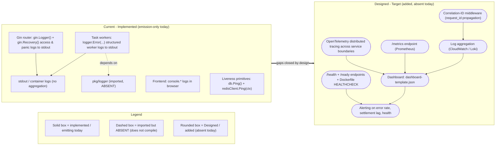

# Observability

This guide documents observability for the **Blockchain Integration Service and Dashboard** across the five required pillars: structured logging with correlation IDs, distributed tracing, a metrics endpoint, health/readiness checks, and a dashboard template. It satisfies the mandatory Observability rule.

Following the rule's discipline, each pillar first states **what already exists and is reused** (labeled **Implemented**) and then **what is added** (labeled **Designed** where the capability is absent today). Every technical claim carries a `Source:` citation. `Fig O1 — Observability Current vs Designed` shows both states so the gap is explicit.

> Maturity legend: **Implemented** = present and emitting in the code today; **Provisioned** = infrastructure exists but is not wired; **Designed** = specified but absent from the code today.

## Fig O1 — Observability Current vs Designed

`Fig O1` is a before/after pair. The **Current (implemented, emission-only)** subgraph shows only the signals the code emits today; the **Designed (target)** subgraph shows the added correlation IDs, tracing, metrics, health/readiness, aggregation, and alerting. The dashed node marks the compile-blocking caveat that `pkg/logger` is imported but absent.

**Figure O1 legend.** Solid boxes are implemented and emitting today; the dashed box (`pkg/logger`) is imported but absent, so even reused worker logging cannot compile; rounded boxes are Designed additions absent today. The heavy arrow marks the transition from the current emission-only state to the designed target.

Sources for `Fig O1`: `Source: backend/internal/api/routes.go:L13-L14` (Gin logging/recovery), `Source: backend/internal/tasks/transaction_processor.go:L26,L44,L50,L57` and `Source: backend/internal/tasks/signature_processor.go:L25,L42,L48,L53,L57` (worker logs), `Source: backend/cmd/server/main.go:L10` (`pkg/logger` imported but absent), `Source: backend/internal/db/postgres.go:L27` and `Source: backend/internal/db/redis.go:L21` (liveness primitives).

## Pillar 1 — Structured logging with correlation IDs

**Reused (Implemented).** The Gin router installs access logging and panic capture middleware, emitting one access log line per request and recovering from panics to stdout `Source: backend/internal/api/routes.go:L13-L14`. Background workers emit structured error logs through `logger.Error(...)` `Source: backend/internal/tasks/transaction_processor.go:L26,L44,L50,L57`, `Source: backend/internal/tasks/signature_processor.go:L25,L42,L48,L53,L57`. The frontend logs to the browser console via `console.*` (no structured logger). The design intent for a structured backend logger is Logrus `Source: documentation/Technical Specifications.md:§FRAMEWORKS AND LIBRARIES`.

**Added (Designed).** Correlation-ID propagation does not exist today: no middleware assigns or forwards a `request_id`/`X-Request-ID`, so logs cannot be correlated across the router and workers. **Caveat:** `pkg/logger` is imported by the composition root and both processors but the package directory is absent `Source: backend/cmd/server/main.go:L10`, so even the reused worker logging cannot compile until the package exists. The design adds a correlation-ID middleware and a shared structured logger.

**Local verification.** Start the API and issue a request; observe the Gin access line on stdout. `grep -n "gin.Logger()\|gin.Recovery()" backend/internal/api/routes.go` confirms the reused middleware. `grep -rn "logger.Error" backend/internal/tasks` confirms worker emission points.

## Pillar 2 — Distributed tracing

**Reused (Implemented).** None. There is no tracing instrumentation in the codebase today.

**Added (Designed).** OpenTelemetry tracing spanning the HTTP handler, the core service, and the custodian/blockchain adapters, so a transaction or signature can be followed across service boundaries. Trace error rate is surfaced by a Designed panel in `dashboard-template.json`.

**Local verification.** `grep -rn "otel\|opentelemetry\|trace" backend` returns no matches today, confirming tracing is absent (Designed).

## Pillar 3 — Metrics endpoint

**Reused (Implemented).** None. The router registers only the `/auth`, `/vault`, `/transactions`, and `/signatures` groups and defines no `/metrics` route `Source: backend/internal/api/routes.go:L9-L54`.

**Added (Designed).** A Prometheus `/metrics` endpoint exporting request counters, request-duration histograms (for p95 latency), and worker/settlement gauges. CloudWatch is the design's monitoring backend `Source: documentation/Technical Specifications.md:§THIRD-PARTY SERVICES`. The capacity target the metrics validate is ~10,000 req/s `Source: documentation/Technical Specifications.md:§SYSTEM OVERVIEW`.

**Local verification.** `grep -n "metrics" backend/internal/api/routes.go` returns nothing, confirming no metrics route (Designed).

## Pillar 4 — Health and readiness checks

**Reused (Implemented).** No `/health` or `/ready` HTTP routes exist `Source: backend/internal/api/routes.go:L9-L54`. However, liveness primitives exist to build on: PostgreSQL connectivity is verified with `db.Ping()` `Source: backend/internal/db/postgres.go:L27`, and Redis connectivity with `redisClient.Ping(ctx)` `Source: backend/internal/db/redis.go:L21`.

**Added (Designed).** A liveness `/health` endpoint and a readiness `/ready` endpoint that composes the PostgreSQL and Redis pings, plus a container-level `HEALTHCHECK`. The backend Dockerfile only exposes a port and defines no `HEALTHCHECK` `Source: infrastructure/docker/Dockerfile.backend:L20`; the frontend Dockerfile has the same gap `Source: infrastructure/docker/Dockerfile.frontend:L26`.

**Local verification.** `grep -n "health\|ready" backend/internal/api/routes.go` returns nothing (Designed). `grep -n "HEALTHCHECK" infrastructure/docker/Dockerfile.backend infrastructure/docker/Dockerfile.frontend` returns nothing, confirming the container health-check gap.

## Pillar 5 — Dashboard template

**Reused (Implemented).** None committed.

**Added (Designed).** A Grafana-compatible dashboard template ships with this documentation at [`dashboard-template.json`](dashboard-template.json). It contains health/readiness stat panels, request-rate and p95-latency time series, a worker-error log panel (Implemented, reused), a settlement-lag time series, a signature-poll-interval stat, and a trace-error-rate panel. Every panel is maturity-labeled and cited; panels bound to absent capabilities are labeled **Designed**.

**Local verification.** `python3 -c "import json; d=json.load(open('docs/operations/dashboard-template.json')); print(len(d['panels']))"` prints `11` and confirms the template is valid JSON.

## Related documentation

- [`runbook.md`](runbook.md) — alerts and failure modes (ticker panic, settlement retry behavior, signature poll, processor wiring mismatch, HEALTHCHECK gap).
- [`../architecture/scaffold-vs-design.md`](../architecture/scaffold-vs-design.md) — the Implemented/Provisioned/Designed maturity matrix for the whole system.
- [`../architecture/data-flow.md`](../architecture/data-flow.md) — transaction and signature data-flow sequences the observability signals track.
- [`../architecture/backend.md`](../architecture/backend.md) — backend composition and the wiring gaps referenced above.
- [`../index.md`](../index.md) — documentation landing page.
- `Fig O1` is re-expressed in the executive presentation at `../../blitzy-deck/executive-summary.html`.
