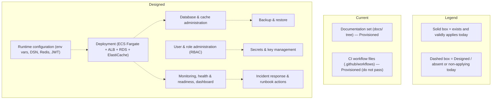

# System Administration Guide

This guide is the consolidated **system-administration manual** for the Blockchain
Integration Service and Dashboard. It fulfills the Software Project Proposal's
User-Manuals deliverable, which lists a *System administration guide* as an
explicit artifact. `Source: documentation/Software Project Proposal.md:L401-L402` (DELIVERABLES, item 6 — "System administration guide").

**Provenance (documentation-set bookkeeping).** This page is mandated by the Agent
Action Plan's requirement to fulfill the project's own committed documentation
deliverables — which restates the Proposal's user-manuals commitment (AAP §0.1.1,
§0.11.2) — and it falls inside the in-scope path `docs/operations/**/*` (AAP §0.8.1).
It is nonetheless **not enumerated as a row** in the AAP §0.5.1 file-transformation
map, so a plan-versus-delivered path diff reports it as an extra. That is a map
omission in the frozen plan rather than an unplanned addition here, so the
traceability is recorded at the artifact instead. The companion
[Training Materials](../training/training-materials.md) page carries the same
provenance against DELIVERABLES item 10.

It is written for the operators, DevOps engineers, and system administrators the
SRS names as a primary audience. `Source: documentation/Software Requirements Specifications (SRS).md:L21` It gathers the operational surface of the platform — configuration,
deployment, database and cache administration, backup and recovery, monitoring,
user and role administration, security administration, and incident response —
into a single entry point and links to the authoritative page for each topic
rather than duplicating it.

## Maturity Legend

This guide follows the project-wide maturity discipline defined in the
reconciliation page's [Maturity Legend](../architecture/scaffold-vs-design.md#maturity-legend);
sibling pages defer to it. In brief:

- **Implemented** — present, building, and functional today. At this checkpoint
  this label is **reserved**: nothing qualifies because the backend has no
  committed `go.mod` and does not build end-to-end.
- **Implemented-with-defects (source-present, non-buildable)** — code exists but
  its package does not compile.
- **Provisioned** — scaffolding or configuration exists in source and validly
  applies, but is not fully wired.
- **Designed** — specified in the design corpus (`documentation/*.md`), absent
  from the code or from a validly-applying infrastructure definition today.

> **Administration is Designed today.** Because the application does not build,
> run, authenticate, or deploy from this repository as-is, the operational
> procedures below describe the **intended** administration of the running
> system and are **Designed** unless labeled otherwise. They become executable
> once the build and infrastructure defects catalogued in
> [`../architecture/scaffold-vs-design.md`](../architecture/scaffold-vs-design.md#defect-catalog)
> are resolved. The few items that exist and validly apply today (for example the
> committed CI workflow files) are labeled **Provisioned** where they appear.

## Administration Surface — Current vs Designed

Rule 1 (Visual Architecture) requires that a change of state be shown as a
before/after pair. **Figure SA1** contrasts what an administrator can actually
operate today against the Designed administration surface.

**Figure SA1 — System Administration Surface (Current vs Designed)**

As **Figure SA1** shows, only the documentation set and the CI workflow files
exist and validly apply today; every operational capability an administrator
would exercise against a running system is **Designed**.

## 1. System Components

The platform an administrator operates is a two-tier application with backing
data stores and AWS infrastructure. The component inventory and its architecture
are documented in the architecture set; the summary below orients administration
tasks to the components they touch.

| Component | Role | Maturity | Authoritative page |
|-----------|------|----------|--------------------|
| Go/Gin backend | HTTP API over 18 REST endpoints | Implemented-with-defects (source-present, non-buildable) | [`../architecture/backend.md`](../architecture/backend.md) `Source: backend/internal/api/routes.go:L9-L54` |
| PostgreSQL | Primary datastore (Designed system of record) | Designed (no compiling schema/migrations) | [`../architecture/data-model.md`](../architecture/data-model.md) `Source: backend/internal/db/postgres.go:L15-L18` |
| Redis | Cache and async status store | Designed (no wired client) | [`observability.md`](observability.md) `Source: backend/internal/db/redis.go:L14-L18` |
| React 18 dashboard | Operator/end-user UI | Implemented-with-defects (source-present, non-buildable) | [`../architecture/frontend.md`](../architecture/frontend.md) `Source: frontend/package.json` |
| Terraform (AWS ECS topology) | Infrastructure definition | Declared-but-invalid / Designed (does not validate or apply) | [`../guides/deployment.md`](../guides/deployment.md) `Source: infrastructure/terraform/main.tf` |
| Docker images | Backend/frontend container builds | Declared-but-invalid (build depends on absent module/lock files) | [`../guides/deployment.md`](../guides/deployment.md) `Source: infrastructure/docker/Dockerfile.backend` |
| GitHub Actions CI | Build/test/lint pipelines | Provisioned (committed, structurally valid, do not pass) | [`../contributing/development.md`](../contributing/development.md) `Source: .github/workflows/backend-ci.yml` |

## 2. Configuration Management

All runtime configuration is **Designed** to be supplied through environment
variables read by the backend — a PostgreSQL DSN (host, port, user, password,
database, `sslmode`), Redis connection settings, and JWT secrets. The complete,
authoritative reference is the configuration guide; administer configuration
from there rather than from this page.

- Authoritative reference: [`../getting-started/configuration.md`](../getting-started/configuration.md).
- No sample environment template (`.env.example`) is committed to the repository
  today, so there is no example file to copy into place (**Designed**).
  `Source: docs/getting-started/configuration.md`
- The PostgreSQL connection uses `sslmode=disable` in source, which an
  administrator must override for any non-local deployment. `Source: backend/internal/db/postgres.go:L15-L18`

## 3. Deployment and Release Administration

Deployment is **Designed** onto an AWS ECS Fargate topology (VPC, ALB, RDS
PostgreSQL, ElastiCache Redis) fronted by an Application Load Balancer. The
authoritative procedure, the Terraform reconciliation, and the full catalogue of
infrastructure security and data-loss gaps live in the deployment guide.

- Authoritative reference: [`../guides/deployment.md`](../guides/deployment.md).
- The Terraform configuration is **Declared-but-invalid**: it does not validate
  or apply as-is (for example it references an undeclared `var.postgres_password`
  where the declared variable is `rds_password`). Treat all "infrastructure
  provisioned" expectations as Designed until Terraform validates.
  `Source: docs/guides/deployment.md` (Terraform security and data-loss gaps)
- Container images do not build as-is because they depend on absent module and
  lock files, and they define no `HEALTHCHECK`. `Source: docs/guides/deployment.md`

## 4. Database and Cache Administration

- **PostgreSQL.** The Designed system of record for the five entities
  (`Organization`, `User`, `Vault`, `Transaction`, `Signature`). There is no
  compiling schema, repository, or migration in the tree today, so schema
  administration (creation, migration, indexing) is **Designed**. `Source: backend/internal/db/schema.go:L11-L68` The data model, field tables, and the ERD are documented in
  [`../architecture/data-model.md`](../architecture/data-model.md).
- **Redis.** The Designed cache and async status store. Note that the signature
  settlement path is Designed to cache signature material under a 24-hour TTL;
  because that material is sensitive, the cache must be encrypted in transit and
  at rest and its retention minimized — see
  [Security Administration](#7-security-administration) and the raw-signature
  classification in [`../guides/signature-management.md`](../guides/signature-management.md).
  `Source: backend/internal/db/redis.go:L14-L18`

## 5. Backup and Recovery

Backup and recovery are **Designed**. The Terraform RDS definition currently sets
`skip_final_snapshot = true`, which would discard the final snapshot on database
deletion and cause data loss; an administrator must change this and establish a
snapshot/point-in-time-recovery policy before production use. The specific
gap and its remediation are catalogued in the deployment guide.

- Authoritative reference: [`../guides/deployment.md`](../guides/deployment.md)
  (Terraform security and data-loss gaps, item TF-6). `Source: docs/guides/deployment.md`

## 6. Monitoring, Health, and Readiness

Observability is documented as a shipped capability with an explicit
reused-versus-added split. Administer monitoring from the observability guide and
its dashboard template.

- Authoritative references: [`observability.md`](observability.md),
  [`dashboard-template.json`](dashboard-template.json), and the alerting and
  failure-mode [`runbook.md`](runbook.md).
- **Reused today (emission-only):** Gin access logging and panic recovery, and
  worker structured error logging — all **Implemented-with-defects
  (source-present, non-buildable)** because the packages do not compile.
  `Source: docs/operations/observability.md`
- **Added (Designed):** correlation-ID propagation, distributed tracing, a
  `/metrics` endpoint, and `/health` and `/ready` endpoints. There is no health
  or readiness endpoint and no container `HEALTHCHECK` today, so liveness
  administration is Designed. `Source: docs/operations/observability.md`

## 7. Security Administration

Security administration — authentication, role administration, secrets, and
encryption — is documented in the security model and is **Designed** end-to-end;
no enforcement runs today because the `AuthService`, the authentication
middleware, and the config package are absent.

- Authoritative reference: [`../security/security-model.md`](../security/security-model.md).
- **User and role administration (RBAC).** Five roles are Designed over the plain
  `User.Role` string field with no database constraint and no enforcing
  middleware: Admin, Manager, Operator, Auditor, and API User. `Source: docs/security/security-model.md`, `Source: backend/internal/db/schema.go:L27`
- **API keys are secrets.** Organization API keys must be stored as a hash or
  verifier (never the raw key), revealed exactly once at creation, kept out of
  normal read responses, and redacted from logs. This is Designed; the schema
  currently carries a plaintext `APIKey` string. `Source: backend/internal/db/schema.go:L11-L68`
- **Raw signatures are sensitive cryptographic material.** Minimize their
  retention (the Designed 24-hour Redis cache is a retention concern), encrypt
  them in transit and at rest, and never log them. `Source: docs/guides/signature-management.md`
- **Secrets and key management.** No KMS, AWS Secrets Manager, or HSM is wired in
  the Terraform today; secret administration is Designed. `Source: docs/guides/deployment.md`

## 8. User and Access Administration

User provisioning, role assignment, multi-factor authentication, session
management, and access logging map to functional requirement UA-001 and are
**Designed**. `Source: documentation/Software Requirements Specifications (SRS).md:L428-L433` Until the authentication path builds, administrators cannot create users,
assign roles, or enforce MFA against a running system; use the security model as
the specification of the intended controls.

- Authoritative reference: [`../security/security-model.md`](../security/security-model.md).
- Operator-facing procedures for day-to-day use of each feature are in the
  [Training Materials](../training/training-materials.md) course.

## 9. Incident Response

Incident response is **Designed** and grounded in the operations runbook, which
separates the build failure, the latent zero-interval ticker panic, and the
settlement failure modes honestly.

- Authoritative reference: [`runbook.md`](runbook.md).
- Two failure modes an administrator must know: the transaction processor's
  ticker interval is uninitialized and would panic at startup once the service
  runs, and the composition-root/router signature mismatch prevents the service
  from wiring at all today. `Source: backend/internal/tasks/transaction_processor.go:L13-L16`, `Source: backend/cmd/server/main.go:L52`, `Source: backend/internal/api/routes.go:L9`

## 10. Administration Readiness Summary

| Administration area | Maturity | Authoritative page |
|---------------------|----------|--------------------|
| Configuration | Designed (no `.env.example`; `sslmode=disable` in source) | [configuration.md](../getting-started/configuration.md) |
| Deployment / release | Declared-but-invalid / Designed | [deployment.md](../guides/deployment.md) |
| Database / cache | Designed | [data-model.md](../architecture/data-model.md), [observability.md](observability.md) |
| Backup / recovery | Designed (TF-6 data-loss gap) | [deployment.md](../guides/deployment.md) |
| Monitoring / health | Reused emission-only (non-buildable) + Designed additions | [observability.md](observability.md), [runbook.md](runbook.md) |
| Security / secrets | Designed | [security-model.md](../security/security-model.md) |
| User / role administration | Designed | [security-model.md](../security/security-model.md) |
| Incident response | Designed | [runbook.md](runbook.md) |
| CI pipelines | Provisioned (do not pass) | [development.md](../contributing/development.md) |

The single authoritative Implemented / Provisioned / Designed matrix and the full
defect catalog are maintained in
[`../architecture/scaffold-vs-design.md`](../architecture/scaffold-vs-design.md);
this guide defers to it for the canonical maturity of every capability above.

## Related Documentation

- [Training Materials](../training/training-materials.md) — role-based onboarding
  and written guides for common operations.
- [Observability](observability.md), [Runbook](runbook.md), and the
  [dashboard template](dashboard-template.json) — the monitoring surface.
- [Deployment guide](../guides/deployment.md) — topology, Terraform
  reconciliation, and infrastructure security gaps.
- [Security model](../security/security-model.md) — authentication, RBAC, secrets,
  and encryption.
- [Configuration](../getting-started/configuration.md) — environment variables and
  connection settings.
