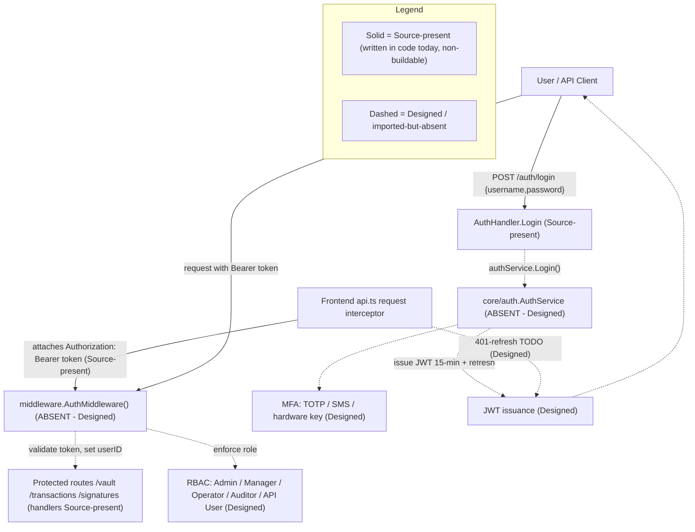

# Security Model

The Blockchain Integration Service and Dashboard is a custodial blockchain platform, and its security model spans authentication via JSON Web Token (JWT) bearer credentials, authorization through Role-Based Access Control (RBAC) mapped onto the `User.Role` field, multi-factor authentication (MFA), a password policy, session and token handling, and encryption of data at rest and in transit. `Source: backend/internal/db/schema.go:L27`. The login handler that anchors the authentication flow is **source-present but non-buildable**: it is written to return a signed token on success, but token issuance is delegated to the absent `internal/core/auth` service and the `api` package does not compile, so **no token is issued at runtime today** — JWT issuance is **Designed**. The other components that make the platform genuinely secure are likewise specified in the design corpus but not yet built. `Source: backend/internal/api/handlers/auth.go:L21-L39`, `Source: backend/internal/api/handlers/auth.go:L5`. This page documents the as-built controls against the designed target, applying a strict maturity discipline so that what runs today is never conflated with what is merely specified. The designed controls are grounded conceptually in the platform Technical Specification §6.4 (Security Architecture), while every hard claim below cites a concrete repository source.

## Maturity Legend

Every control on this page is tagged with the project-wide maturity discipline used across the documentation set:

- **Implemented** — present in code, building, and functional today. Per the single operational-truth vocabulary in [`../architecture/scaffold-vs-design.md`](../architecture/scaffold-vs-design.md), this label is **reserved** and **nothing qualifies for it** at this checkpoint (the backend has no `go.mod` and the `api` package imports absent packages; the frontend build is broken), so it is not applied to any control on this page.
- **Source-present (non-buildable)** — the code is written in source, but its containing package does not compile, so no runtime behavior may be asserted. Equivalent to *Implemented-with-defects* on the architecture pages.
- **Provisioned** — infrastructure or configuration exists and validly applies, but the capability is not yet fully wired to run.
- **Designed** — specified in the design corpus (`documentation/*.md`), absent from the code (or from validly-applicable infrastructure) today.

Read this page with one fact in front of mind: **most authentication and authorization controls are currently `Designed`.** The router references an authentication middleware package and the login handler depends on an authentication service package, but **both packages are imported and never defined** — so token validation, JWT issuance, and RBAC enforcement do not run today. `Source: backend/internal/api/routes.go:L6`, `Source: backend/internal/api/handlers/auth.go:L5`. The consolidated defect catalog that reconciles the design corpus against the on-disk scaffold is maintained in [`../architecture/scaffold-vs-design.md`](../architecture/scaffold-vs-design.md).

**Referenced from.** This page is linked from the documentation home ([`../index.md`](../index.md)) and the root project README ([`../../README.md`](../../README.md)) — both present in the repository, each listing this security model in its navigation — and it complements the authentication endpoint reference ([`../api-reference/authentication.md`](../api-reference/authentication.md)) and the architecture documentation.

The end-to-end authentication and authorization flow — contrasting the current source scaffold with the designed target — is shown in **Fig S1 — Authentication & Authorization Flow (Current Implemented vs Designed)**.

## Fig S1 — Authentication & Authorization Flow (Current Implemented vs Designed)

**Fig S1 — Authentication & Authorization Flow (Current Implemented vs Designed)**



**Legend.** As restated in the `Legend_S1` subgraph, solid nodes and edges denote controls that are **Source-present (non-buildable)** — written in code today but not compiling: the `AuthHandler.Login` and `Logout` handlers, the frontend request interceptor that attaches the `Authorization: Bearer` header, and the protected-route handlers. `Source: backend/internal/api/handlers/auth.go:L21-L55`, `Source: frontend/src/services/api.ts:L11-L23`. Dashed nodes and edges denote controls that are **Designed** or imported-but-absent: the `core/auth.AuthService`, JWT issuance, MFA, the `middleware.AuthMiddleware()` token validation, RBAC enforcement, and the frontend 401-refresh flow. `Source: backend/internal/api/handlers/auth.go:L5`, `Source: backend/internal/api/routes.go:L6`. As shown in **Fig S1**, only the request-shaping edge of the system exists today; everything that authenticates, authorizes, or refreshes a session is specified but not wired.

## Authentication

Authentication follows a bearer-token model. A client authenticates by sending `POST /auth/login` with a JSON body containing `username` and `password` (both bound with `binding:"required"`); on success the handler returns `200` with a `{ "token": <jwt> }` body, and clients then present that token as an `Authorization: Bearer <token>` header on every secured request. `Source: backend/internal/api/handlers/auth.go:L21-L39`. The `POST /auth/logout` route reads the caller's `userID` from the request context and invalidates the session, and it would be token-protected by the authentication middleware — but that middleware is **Designed** (imported but absent today), so no such protection runs at runtime; `POST /auth/register` is routed but **Designed**, because no `Register` method is defined on the handler. `Source: backend/internal/api/handlers/auth.go:L41-L55`, `Source: backend/internal/api/routes.go:L17-L22`, `Source: backend/internal/api/handlers/auth.go` (no `Register`). The full request/response reference — fields, status codes, and examples for all three endpoints — lives in the [authentication API reference](../api-reference/authentication.md) and is not duplicated here.

The **login and logout handlers are Source-present (non-buildable)**, and the token they would hand out is **Designed**: both delegate to `authService`, an instance of `auth.AuthService` imported from `backend/internal/core/auth`, a package that is **imported but absent from the codebase** — so the `api` package does not compile. Actual JWT issuance is therefore **Designed**. `Source: backend/internal/api/handlers/auth.go:L5`, `Source: backend/internal/api/handlers/auth.go:L32`.

### JSON Web Tokens and Session Handling

The design corpus specifies JWTs for user sessions with a **short access-token expiration of 15 minutes backed by a refresh-token mechanism**. This is **Designed**: no token generation, signing, expiry, or refresh logic is present in the readable code, since it belongs to the absent `core/auth` package. `Source: documentation/Technical Specifications.md:L480-L482`, `Source: backend/internal/api/handlers/auth.go:L5`. Session management — including inactivity timeout and forced logout under feature UA-001-4 — is likewise **Designed**. `Source: documentation/Software Requirements Specifications (SRS).md:L431`.

### Frontend Token Handling

On the client, the Axios **request interceptor is written to attach the bearer credential** whenever a token is available, so the browser would transparently authenticate each call — this code is **Source-present (non-buildable)** (the frontend build is broken, so it does not run as shipped). `Source: frontend/src/services/api.ts:L11-L23`.

```ts
const token = await getAuthToken();
if (token) config.headers['Authorization'] = `Bearer ${token}`;
```

The paired **response interceptor is a stub**: it carries a documented `HUMAN ASSISTANCE NEEDED` note to add token refresh on `401` errors, but no refresh flow is present, so a **401 auto-refresh is Designed**. `Source: frontend/src/services/api.ts:L11-L23`. Until that flow exists, an expired 15-minute access token would surface to the user as an unhandled `401` rather than a silent re-authentication.

Two further **client-side session defects** in `frontend/src/services/auth.ts` weaken the session model; both are documented, not fixed (see the fuller treatment in the [authentication reference](../api-reference/authentication.md)):

- **Logout is local-only.** `logout()` only calls `removeItem('jwt_token')` to drop the token from client storage; it **never calls `POST /auth/logout`**, so no server-side session invalidation or token revocation is triggered from the UI, and a `HUMAN ASSISTANCE NEEDED` comment notes that application-state clearing is also unfinished. `Source: frontend/src/services/auth.ts:L19-L25`.
- **Token expiry is not checked.** `isAuthenticated()` returns `true` whenever a token *string is present*; the JWT `exp`-claim verification is commented out (`HUMAN ASSISTANCE NEEDED`), so an **expired token is treated as valid** on the client. `Source: frontend/src/services/auth.ts:L27-L43`.

### API Key Authentication

For programmatic (non-interactive) access, the design corpus specifies **API-key authentication with regular rotation every 30 days** — **Designed**. `Source: documentation/Technical Specifications.md:L484-L486`. The data model anticipates this control: the `Organization` entity carries an `APIKey` field on which a per-tenant key would be stored and rotated. `Source: backend/internal/db/schema.go:L15`.

**API keys are secrets — handling contract (Designed).** An API key is a bearer credential and must be treated as a secret. The intended contract is to persist only a one-way **hash or verifier** of the key (never the raw key), **reveal the raw key exactly once** at creation or rotation and never again, **never** return it in read responses or DTOs, and **redact** it from all logs. **Security defect (documented, not fixed):** today `Organization.APIKey` is declared as a **plaintext `string` with no `json:"-"` tag** `Source: backend/internal/db/schema.go:L15`, so — exactly like the untagged `PasswordHash` discussed under [Secrets and Key Management](#secrets-and-key-management) — if any handler marshaled an `Organization` struct directly, the raw key would be exposed in the response body. The contract above is therefore **Designed**, not enforced by the current schema; it is mirrored in [`../architecture/data-model.md`](../architecture/data-model.md#sensitive--secret-fields) and the [OpenAPI `Organization` schema](../api-reference/openapi.yaml), where `apiKey` has been removed from the response DTO.

### Login Hardening Gap

The `Login` handler carries an explicit `HUMAN ASSISTANCE NEEDED` note stating that it needs additional error handling and input validation before it is production-ready; this hardening is a known gap and is documented, not fixed, by this deliverable. `Source: backend/internal/api/handlers/auth.go:L19-L20`.


## Authorization (RBAC)

Authorization is designed as Role-Based Access Control (RBAC) mapped onto the `User.Role` field of the user entity. `Source: backend/internal/db/schema.go:L27`. Two facts make the entire RBAC control **Designed** rather than Implemented. First, `Role` is declared as a plain `string` with no enumeration or database constraint, so the five-role vocabulary below is defined in the design corpus, not enforced by the schema. `Source: backend/internal/db/schema.go:L20-L30`. Second, role enforcement would occur inside `middleware.AuthMiddleware()`, which guards the protected route groups but belongs to the absent `middleware` package — so no role check runs today. `Source: backend/internal/api/routes.go:L25`.

The five roles and their permissions, reproduced from the design corpus, are enumerated below; each maps to a value of `User.Role` and cross-references functional requirement UA-001-2 (Role-based Access). `Source: documentation/Technical Specifications.md:L490-L498`, `Source: documentation/Software Requirements Specifications (SRS).md:L429`.

| Role | Permissions | Maturity |
|------|-------------|----------|
| Admin | Full access to all system functions. | Designed |
| Manager | Access to vault management, transaction processing, and analytics. | Designed |
| Operator | Access to transaction processing and basic analytics. | Designed |
| Auditor | Read-only access to all data for auditing purposes. | Designed |
| API User | Programmatic access to specific API endpoints. | Designed |

`Source: documentation/Technical Specifications.md:L490-L498`.

Two divergences qualify the five-role model above.

**1. Vocabulary — four client values versus five designed roles versus an unconstrained column.** The frontend's client-side `UserSchema` validates `role` against only four values — `Admin`, `Manager`, `Operator`, `Auditor` — omitting `API User`, while the backend stores `Role` as a plain unconstrained `string` with no enumeration or check constraint. `Source: frontend/src/schema/user.ts:L11`, `Source: backend/internal/db/schema.go:L27`. A caller holding the `API User` role would therefore fail client-side validation while remaining valid server-side.

**2. Letter case — the one role check that exists in code can never match.** The single role comparison anywhere in the codebase is the `Sidebar` guard on the administrator navigation link, written as `user.role === 'admin'` in **lowercase**, whereas the schema admits only the capitalized `'Admin'`. `Source: frontend/src/components/Sidebar.tsx:L29`, `Source: frontend/src/schema/user.ts:L11`. JavaScript `===` on strings is case-sensitive, so **no schema-valid role value can ever satisfy the guard** and the `/admin` route link is unreachable through the UI for every user, genuine administrators included. `Source: frontend/src/components/Sidebar.tsx:L29-L34`. This is a *fail-closed* defect — it denies rather than grants access, so it is not an authorization bypass — but it means the only place the product currently expresses a role decision expresses it incorrectly, and it must be corrected together with a server-side check rather than instead of one. Note also that `Role` appears exactly **once** in the entire backend (its declaration on the `User` entity): there is no role comparison, guard, or middleware check on the server at all, so the UI guard is not a redundant second line of defence — it is the *only* role logic in the system. `Source: backend/internal/db/schema.go:L27`.

Because enforcement on both sides is **Designed** — the auth middleware is absent and neither layer builds — both divergences are latent rather than active today; they are cataloged together as Defect 14 in [`../architecture/scaffold-vs-design.md`](../architecture/scaffold-vs-design.md#defect-catalog) and detailed in [`../architecture/frontend.md`](../architecture/frontend.md).

Authorization is additionally scoped by tenant: the `User` entity carries an `OrganizationID`, so a fully wired authorization layer would constrain each role's reach to the caller's own organization in addition to the role check above. `Source: backend/internal/db/schema.go:L23`. The `User` entity that carries both `Role` and `OrganizationID` is defined in [`../architecture/data-model.md`](../architecture/data-model.md) (see **Fig M1 — Data Model ERD**).


## Multi-Factor Authentication and Password Policy

Both of the controls in this section are **Designed**: they are specified in the design corpus and the non-functional requirements, but no supporting code is present in the scaffold (the `core/auth` package that would implement them is absent). `Source: backend/internal/api/handlers/auth.go:L5`.

### Multi-Factor Authentication

Multi-factor authentication (MFA) is required for dashboard access and would be satisfied by any one of three second factors: a Time-based One-Time Password (TOTP), SMS-based verification, or a hardware security key (for example, a YubiKey) — **Designed**. `Source: documentation/Technical Specifications.md:L468-L472`, `Source: documentation/Software Requirements Specifications (SRS).md:L493`. This maps to functional requirement UA-001-3 (Multi-factor Authentication). `Source: documentation/Software Requirements Specifications (SRS).md:L430`.

### Password Policy

The designed password policy maps to functional requirement UA-001-5 (Password Policies) and comprises the rules below — **Designed**. `Source: documentation/Technical Specifications.md:L474-L478`, `Source: documentation/Software Requirements Specifications (SRS).md:L432`.

| Rule | Requirement | Maturity |
|------|-------------|----------|
| Minimum length | 12 characters. | Designed |
| Complexity | Must include uppercase, lowercase, numbers, and special characters. | Designed |
| History | Prevent reuse of the last 5 passwords. | Designed |
| Maximum age | 90 days. | Designed |

`Source: documentation/Technical Specifications.md:L474-L478`.


## Encryption and Key Management

The encryption controls are **Designed**. From the application's own perspective there is no encryption or Transport Layer Security (TLS) termination in the Go code today. Critically, the Terraform under `infrastructure/terraform/` does **not** provide a realization path either, for two independent reasons, so these controls are **not** "Provisioned via infrastructure once applied":

1. **The encryption mechanisms are absent from the Terraform.** The RDS instance declares no `storage_encrypted`, the S3 buckets declare no server-side-encryption configuration, the ElastiCache cluster declares no `at_rest_encryption_enabled`/`transit_encryption_enabled`, and there is **no AWS Secrets Manager, KMS, or HSM resource anywhere** in the configuration. `Source: infrastructure/terraform/main.tf:L91-L117,L133-L140`.
2. **The configuration cannot validly apply.** `aws_db_instance.postgresql` uses an invalid `subnet_id` argument (RDS requires a `db_subnet_group_name`) and sets `skip_final_snapshot = true` (a data-loss risk), and the file references several resources that are never defined — `aws_security_group.{postgresql,redis,kafka}`, `aws_elasticache_subnet_group.redis`, `aws_lb_target_group.web`, `aws_ecs_task_definition.web`, and `data.aws_availability_zones.available` (the file's own `HUMAN ASSISTANCE NEEDED` block lists these as still to be added). `terraform validate`/`plan` therefore fails. `Source: infrastructure/terraform/main.tf:L102,L104,L101,L116,L129,L216-L227`.

Each control below is consequently presented as **Designed**, with the specific infrastructure gap called out. The broader Terraform security and data-loss gaps are catalogued in the [deployment guide](../guides/deployment.md).

### Encryption at Rest

All sensitive data — including user credentials and transaction details — is specified to be encrypted at rest using AES-256. `Source: documentation/Software Requirements Specifications (SRS).md:L497`. The design corpus locates this at the storage tier: RDS PostgreSQL encrypted with AWS-managed keys, S3 buckets using server-side encryption with AWS KMS, and ElastiCache for Redis with encryption enabled. This is **Designed**: none of it is realized in the Terraform — the `aws_db_instance` has no `storage_encrypted = true` (RDS defaults to unencrypted), the `aws_s3_bucket` resources declare no `aws_s3_bucket_server_side_encryption_configuration`, and the `aws_elasticache_cluster` sets no `at_rest_encryption_enabled`. `Source: documentation/Technical Specifications.md:L517-L519`, `Source: infrastructure/terraform/main.tf:L91-L105,L108-L117,L133-L140`.

### Encryption in Transit

All API communications are specified to use HTTPS with TLS 1.2 or higher. `Source: documentation/Software Requirements Specifications (SRS).md:L499`, `Source: documentation/Technical Specifications.md:L522-L523`. The Go service does not terminate TLS itself; in the designed topology this is provided by the load balancer. The Terraform *does* declare an ALB HTTPS listener plus an HTTP→HTTPS redirect, which is closer to realization than the at-rest controls — but two gaps keep it **Designed**: the listener pins `ssl_policy = "ELBSecurityPolicy-2016-08"`, a **legacy policy that permits TLS 1.0/1.1** rather than enforcing TLS 1.2+; and, as noted above, the overall configuration does not validly apply. `Source: infrastructure/terraform/main.tf:L178-L203`, `Source: documentation/Technical Specifications.md:L522-L523`.

### Secrets and Key Management

Credentials and API keys are specified to be stored and managed with AWS Secrets Manager, backed by AWS Key Management Service (KMS) for encryption keys and Hardware Security Modules (HSMs) for cryptographic key storage — **Designed**. Nothing realizes this today: there is **no `aws_secretsmanager_*`, `aws_kms_*`, or HSM/CloudHSM resource** anywhere in the Terraform, and the RDS master password is instead passed as a plain `var.postgres_password` variable. Worse, that variable is **undeclared**: `main.tf` references `var.postgres_password` `Source: infrastructure/terraform/main.tf:L99`, but `variables.tf` declares the (sensitive) master-password variable under the different name `rds_password` `Source: infrastructure/terraform/variables.tf:L64`, so the reference resolves to no declared variable — an additional reason the configuration is **Declared-but-invalid** and cannot validly apply (catalogued with the other Terraform gaps in the [deployment guide](../guides/deployment.md)). `Source: documentation/Software Requirements Specifications (SRS).md:L501`, `Source: documentation/Technical Specifications.md:L526-L528`.

The `User` entity persists a `PasswordHash` field, which stores the hashed credential and **must never be serialized over the API** in any request or response body. `Source: backend/internal/db/schema.go:L26`. **Security defect (documented, not fixed):** the `PasswordHash` field carries **no `json:"-"` tag**, so if any handler marshaled a `User` struct directly (the structs are untagged and serialize every exported field) the hash **would be exposed** in the response body. The "never serialized" rule above is therefore a **Designed** contract, not a guarantee the current code enforces — it is the field-exposure gap cross-referenced from the [OpenAPI `User` schema](../api-reference/openapi.yaml). `Source: backend/internal/db/schema.go:L20-L30` (specifically L26, which lacks a `json:"-"` tag). The authentication endpoints accept a password only on login and never echo any credential material back to the client; see the [authentication API reference](../api-reference/authentication.md) for the exact response bodies.

**Application-level secrets and sensitive material (Designed contracts).** Beyond the password hash above, two data-model fields are security-sensitive and require explicit handling that no code enforces today:

- **`Organization.APIKey` — secret.** Handled per the [API Key Authentication](#api-key-authentication) contract: store only a hash/verifier, reveal once, never return it in DTOs, and redact it from logs. It is currently a plaintext, untagged `string`. `Source: backend/internal/db/schema.go:L15`.
- **`Signature.RawSignature` — sensitive cryptographic material.** Classify it explicitly as sensitive; **minimize retention** — the settlement processor caches the full signature object (including `RawSignature`) under `signature:<id>` in Redis for **24 hours** `Source: backend/internal/tasks/signature_processor.go:L46-L58`, a retention/exposure concern amplified because the designed ElastiCache declares **no** `at_rest_encryption_enabled`/`transit_encryption_enabled` (see [Encryption at Rest](#encryption-at-rest)); **encrypt** it in transit and at rest; and **never** log it. `Source: backend/internal/db/schema.go:L64`.

Both are **Designed** contracts, consistent with the classifications in [`../architecture/data-model.md`](../architecture/data-model.md#sensitive--secret-fields), the [signatures API reference](../api-reference/signatures.md), and the [signature-management guide](../guides/signature-management.md).


## Application and API Security

The design corpus commits to two whole families of control that have **no counterpart in the current code**: *Application Security* — input validation and sanitization, output encoding, and prepared statements — and *API Security* — rate limiting, API versioning, and OAuth 2.0. `Source: documentation/Technical Specifications.md:L551-L555,L557-L560`. Both families also appear as nodes on the design corpus's own security diagram. `Source: documentation/Technical Specifications.md:L592-L595,L596-L597`. Two of the commitments are additionally restated as numbered security non-functional requirements in the SRS — rate limiting and input validation `Source: documentation/Software Requirements Specifications (SRS).md:L507,L509` — and the corpus names OWASP practices as the governing external reference. `Source: documentation/Software Requirements Specifications (SRS).md:L920`.

Every control in this section is **Designed**. The table states what the corpus requires against what the code measurably contains; the notes that follow give the evidence.

| Control (committed by the corpus) | Requirement | Measured state in code | Maturity |
|-----------------------------------|-------------|------------------------|----------|
| Input validation & sanitization (injection prevention) | All user inputs validated and sanitized. `Source: documentation/Software Requirements Specifications (SRS).md:L509` | 4 handlers bind a JSON body; only **2** `binding:"required"` tags exist repo-wide (both on the login body); no `validate:` tags; no `DisallowUnknownFields`; the 3 Zod schemas have **zero** consumers | **Designed** |
| Output encoding (XSS prevention) | Output encoding to prevent XSS attacks. `Source: documentation/Technical Specifications.md:L553` | No explicit encoding control; backend renders no HTML (no template loader, no `c.HTML`); SPA relies solely on React's default JSX escaping | **Designed** |
| Prepared statements (SQL-injection prevention) | Use of prepared statements to prevent SQL injection. `Source: documentation/Technical Specifications.md:L554` | **No SQL statement exists anywhere.** The `db` package contains exactly one database call — `sqlx.Connect` — and the `db.Repository` every service targets is undefined | **Designed** |
| Rate limiting (abuse / DDoS prevention) | API endpoints shall implement rate limiting. `Source: documentation/Software Requirements Specifications (SRS).md:L507` | Zero occurrences of any limiter, throttle, WAF, or Shield resource in the backend, the SPA, or the Terraform configuration | **Designed** |
| API versioning | API versioning to maintain backward compatibility. `Source: documentation/Technical Specifications.md:L559` | The router registers **no** version prefix; the corpus documents `/api/v1/...` | **Designed** |
| OAuth 2.0 authorization | OAuth 2.0 for secure API authorization. `Source: documentation/Technical Specifications.md:L560` | No OAuth flow, client registry, scope, or provider integration in code; the scheme in source is a bearer JWT plus a designed API key | **Designed** |

### Input validation and sanitization (Designed)

Four handlers bind a JSON request body with `c.ShouldBindJSON` — transaction, signature, vault, and auth. `Source: backend/internal/api/handlers/transaction.go:L23`, `Source: backend/internal/api/handlers/signature.go:L26`, `Source: backend/internal/api/handlers/vault.go:L39`, `Source: backend/internal/api/handlers/auth.go:L27`. Against those four bind sites the entire backend declares exactly **two** validation constraints — `binding:"required"` on the login body's `Username` and `Password` — and no `validate:` tags at all. `Source: backend/internal/api/handlers/auth.go:L23-L24`. Three of the four bound bodies therefore enforce **nothing**: a request may omit every field and still bind successfully. Nor is `DisallowUnknownFields` ever enabled, so an unexpected or misspelled key is silently discarded instead of rejected — the mechanism that makes the transaction destination-field drift fail quietly rather than loudly (see [`../api-reference/transactions.md`](../api-reference/transactions.md#post-transactionscreate)).

On the client, three Zod schemas are declared but **no module under `frontend/src` imports any of them**, so no schema validation executes; one of the three is not even exported (Defect 15). `Source: frontend/src/schema/transaction.ts:L3`, `Source: frontend/src/schema/user.ts:L3`, `Source: frontend/src/schema/vault.ts:L3`. The only validation that the SPA source actually invokes is a pair of hand-rolled regular-expression helpers applied at a **single** call site — the transaction destination address — while a third helper, `isValidEmail`, is never called at all. `Source: frontend/src/utils/validators.ts:L3,L8,L16`, `Source: frontend/src/components/TransactionForm.tsx:L4,L28`. **Sanitization**, as distinct from validation, appears nowhere in either layer: no escaping, stripping, or normalization routine exists.

### Output encoding and XSS (Designed)

No explicit output-encoding control exists on either side of the system. The backend renders no HTML at all — it registers no template loader and makes no `c.HTML` call, and every handler responds through `c.JSON`. `Source: backend/internal/api/handlers/transaction.go:L24,L34,L50`. The SPA relies solely on React's default JSX text escaping. That default is a genuine mitigation, and the tree currently contains **zero** `dangerouslySetInnerHTML` uses and **zero** direct `innerHTML` assignments, so no escape hatch is open today. `Source: frontend/src/components/Header.tsx:L25`. But it is an inherited framework behaviour rather than the encoding discipline the corpus commits to, and it does not extend to non-HTML sinks such as URL, attribute, or style contexts — so the control is recorded as **Designed**, with the current absence of unsafe sinks noted as the reason no XSS vector is presently known.

### Prepared statements and SQL injection (Designed)

There is no data-access layer to audit. The `db` package holds a single package-level handle and exactly one database call — `sqlx.Connect` — with no `Query`, `Exec`, `Prepare`, or raw-SQL string anywhere in the package. `Source: backend/internal/db/postgres.go:L10,L18`. The `db.Repository` type that every core service method targets is undefined, so **no SQL statement exists in the repository at all**, parameterized or otherwise. `Source: backend/internal/core/vault/service.go:L11`, `Source: backend/internal/core/transaction/service.go:L13`. The chosen driver stack (`sqlx` over `lib/pq`) supports bound parameters natively, so the committed control is reachable — but at this checkpoint it is *unexercised* rather than implemented, and there is no query to inspect for injection risk. One caution for whoever builds that layer: `schema.go` declares GORM models while `postgres.go` connects via `sqlx`, so the parameterization discipline has to be carried by whichever persistence path is settled on (Defect 4). `Source: backend/internal/db/schema.go:L1-L9`.

### Rate limiting (Designed)

No rate limiter exists at any layer. The router applies exactly two pieces of middleware to the engine — `gin.Logger()` and `gin.Recovery()` — and no limiting middleware on any route or group. `Source: backend/internal/api/routes.go:L13-L14`. No limiting library is referenced anywhere in the backend, and the Terraform configuration declares sixteen resources — VPC, subnets, security groups, RDS, ElastiCache, MSK, two S3 buckets, ECS cluster and service, the load balancer, both listeners, and a Route 53 record — **none** of which is a WAF web ACL, a Shield protection, or a throttling rule. `Source: infrastructure/terraform/main.tf:L9-L226`, `Source: infrastructure/terraform/main.tf:L168-L203`. Redis is provisioned and would be the natural shared counter store for a distributed limiter, but nothing uses it for that purpose — its only source-present uses are the two worker caches. `Source: backend/internal/tasks/transaction_processor.go:L55`, `Source: backend/internal/tasks/signature_processor.go:L52`. Because the ALB terminates traffic with no rate control in front of the application and none inside it, an abuse or volumetric-attack scenario has **no mitigating control at any tier** today.

### Cross-site request forgery (not committed by the corpus)

Recorded for completeness rather than as a gap against a commitment: the design corpus names **no** CSRF control, and the session scheme in source does not require a cookie-based one. The frontend attaches credentials as an `Authorization: Bearer <token>` header from a request interceptor rather than relying on an ambient cookie, so the browser does not authenticate cross-site requests automatically. `Source: frontend/src/services/api.ts:L11-L17`. This is a structural property of the chosen scheme, not an implemented defence — and it would stop holding if the **Designed** refresh-token flow were later delivered through a cookie, at which point a CSRF control would become necessary. No such control is currently specified anywhere in the corpus.

## Compliance and Audit

The design corpus commits the platform to substantial regulatory and audit obligations, none of which are realized in the current scaffold — the entire compliance surface is **Designed**. This boundary is stated explicitly so the documentation never implies a compliance posture the code does not provide.

- **Regulatory frameworks (Designed).** The SRS enumerates GDPR, PCI DSS (where card data is handled), SOC 2 Type II, and jurisdictional blockchain/cryptocurrency compliance. No corresponding controls, data-subject workflows, or attestations exist in the code. `Source: documentation/Software Requirements Specifications (SRS).md:L548,L552,L554,L556`.
- **KYC/AML checks (Designed).** The SRS requires Know Your Customer (KYC) and Anti-Money Laundering (AML) checks as mandated by the applicable financial regulations, and repeats the obligation as a project constraint. `Source: documentation/Software Requirements Specifications (SRS).md:L550`, `Source: documentation/Software Requirements Specifications (SRS).md:L184`. Nothing in the code performs identity verification, sanctions/watchlist screening, or transaction monitoring: the only persisted party is `User` (username, email, `Role`, password hash) with no identity-document, verification-status, or risk-score field, and no screening call exists on the vault-creation or transaction-submission paths. `Source: backend/internal/db/schema.go:L20-L30`, `Source: backend/internal/core/vault/service.go:L24-L46`, `Source: backend/internal/core/transaction/service.go:L40-L48`. KYC/AML is therefore **Designed** in full, including the customer-onboarding workflow, the screening integration, and the suspicious-activity reporting it would require.
- **Data retention policies (Designed).** The SRS requires retention policies that comply with applicable law and states the target periods — transaction data 7 years, signature data 1 year, user activity logs 2 years, system logs 90 days. `Source: documentation/Software Requirements Specifications (SRS).md:L558`, `Source: documentation/Software Requirements Specifications (SRS).md:L646-L650`. No retention policy is implemented or provisioned: the Terraform declares no S3 lifecycle rule, no bucket versioning, and no RDS `backup_retention_period` — retention appears only as an unimplemented suggestion in a comment. `Source: infrastructure/terraform/main.tf:L134-L140`, `Source: infrastructure/terraform/variables.tf:L104`. The only retention-adjacent behavior written in source is Redis caching, and it does not implement the policy either: settled signatures are cached with a 24-hour TTL while transaction results are cached with a TTL of `0`, meaning **no expiry at all**. `Source: backend/internal/tasks/signature_processor.go:L52`, `Source: backend/internal/tasks/transaction_processor.go:L55`. Both worker packages are source-present (non-buildable), so neither behavior runs today.
- **Audit trails and audit logging (Designed).** The SRS requires comprehensive audit trails of all user actions and system events, retained for a minimum of one year, to satisfy financial-audit requirements. The application persists **no audit-trail entity and emits no audit events**: the only logging wired in source is Gin access logging and worker error logs (both Source-present, non-buildable), and there is no audit sink, no tamper-evident store, and no AWS CloudTrail provisioning (the Terraform declares none). `Source: documentation/Software Requirements Specifications (SRS).md:L503,L560`, `Source: documentation/Technical Specifications.md:L429`.
- **Compliance reporting (Designed).** The requirement to generate reports demonstrating regulatory compliance has no supporting code or data pipeline. `Source: documentation/Software Requirements Specifications (SRS).md:L562`.

Because no audit evidence is produced and no compliance control executes, this deliverable makes **no assertion of compliance readiness**; the audit-evidence and control-attestation artifacts a compliance program would require are absent and remain Designed work.


## Documentation Toolchain Supply Chain and Advisory Posture

**Scope of this section.** Everything above describes the *application's* security controls. This section covers a different surface: the third-party dependencies that **this documentation deliverable itself** introduces — the CDN libraries the [executive presentation](../../blitzy-deck/executive-summary.html) loads when someone opens it, and the command-line tools used to validate the documentation. It is recorded here because it is the only place in the repository where a reviewer can find the deliverable's own dependency inventory, and because the honesty discipline this documentation set applies to code defects applies equally to the versions it pins: a known advisory that is disclosed and reasoned about is a managed risk, while an undisclosed one is a hidden one. The application's own dependency posture is separate and weaker — the backend has no `go.mod`/`go.sum`, so its dependencies are neither pinned nor auditable — and it is documented in [`../getting-started/local-development.md`](../getting-started/local-development.md#1-no-committed-go-module-gomod--gosum) and [`../getting-started/installation.md`](../getting-started/installation.md#prerequisites). This deliverable is documentation-only, so **no application dependency is added, upgraded, or pinned by it**. `Source: Agent Action Plan §0.8.2 (application dependency changes out of scope)`.

### Inventory

| Component | Version | Where it is used | Open advisories affecting this version | Maturity |
|-----------|---------|------------------|----------------------------------------|----------|
| reveal.js | 5.1.0 | Presentation framework the executive deck loads from `cdn.jsdelivr.net` | **0** | **Implemented** — version-pinned URL plus a `sha384` Subresource Integrity (SRI) digest |
| Lucide | 0.460.0 | SVG icon set in the executive deck | **0** | **Implemented** — pinned plus SRI |
| Mermaid | 11.4.0 | Diagram renderer inside the executive deck (browser runtime) | **6** (6 moderate) | **Implemented** — pinned plus SRI; the version itself is **mandated**, not chosen. `Source: Agent Action Plan §0.10.2 (CDN versions pinned exactly)` |
| DOMPurify — **bundled inside Mermaid 11.4.0** | 3.1.6 | Sanitizer Mermaid resolves transitively as an ES-module sub-chunk; never referenced directly by this repository | **19** (15 moderate, 4 low) | **Implemented** — reached transitively, so no direct dependency declaration exists to pin it |
| `@mermaid-js/mermaid-cli` (`mmdc`) | 11.16.0 | Local validation — renders every Mermaid block in `docs/**` to catch syntax errors | **0** | **Implemented** — validation tooling only; never shipped to a reader |
| `@redocly/cli` | 2.43.2 | Local validation — OpenAPI 3.0 lint of [`../api-reference/openapi.yaml`](../api-reference/openapi.yaml) | **0** direct **and 0 transitive** — the 2.x line self-bundles, so a clean install resolves exactly **1** package and `npm audit` reports nothing at any severity | **Implemented** — validation tooling only; **raised from 1.25.11**, whose resolved tree carried a HIGH advisory. Rationale and measurements: [below](#redoclycli--why-the-pin-was-raised-from-12511). `Source: docs/api-reference/overview.md (specification validation command)` |
| `github.com/swaggo/swag` | v1.16.6 | The **designed** OpenAPI generation workflow | **0** — no advisory has been filed against the Go module | **Designed** — cannot run today: no `go.mod` exists and no `// @` annotations are present. `Source: docs/api-reference/overview.md (swag init workflow)`, `Source: https://api.osv.dev/v1/query (ecosystem Go, package github.com/swaggo/swag) — 0 records` |
| `golangci-lint` installer fetched from `master/install.sh` | mutable branch reference | Backend CI lint job | Not advisory-tracked; the **installer** floats even though the linter version is pinned | **Designed** remediation — already documented at [`../contributing/development.md`](../contributing/development.md#backend-ci) |
| Google Fonts (Inter, Space Grotesk, Fira Code) | Served per requesting browser | Executive deck typography (mandated) | Not advisory-tracked | **Implemented**; privacy consideration recorded [below](#privacy-and-browser-policy-considerations) |

**How these counts were obtained, and the one thing the method does not see.** The four **CDN-loaded** components are never installed — the deck fetches them by pinned URL, and the repository ships no lockfile — so there is no dependency tree for `npm audit` to walk and they were queried per version against the npm bulk advisory service, the same data source `npm audit` itself consumes. `Source: registry.npmjs.org/-/npm/v1/security/advisories/bulk (queried for each npm component and version in the table above)`. The **installable** validation tools were additionally audited over a real resolved tree (below). The Go module is not on npm at all and was queried separately against OSV. `Source: https://api.osv.dev/v1/query (ecosystem Go)`.

That bulk endpoint reports only advisories filed against a package **directly**; it does not walk a resolved dependency tree, so a *transitive* exposure is invisible to it. Two entries above are shaped by that limitation and must be read together with it: **DOMPurify 3.1.6** is broken out as its own row rather than folded into Mermaid, and the `@redocly/cli` pin was **raised to 2.43.2** after a resolved-tree audit found what the bulk endpoint could not — see [`@redocly/cli` — why the pin was raised from 1.25.11](#redoclycli--why-the-pin-was-raised-from-12511). Where a package can be installed, therefore, the count in the table is stated from `npm audit` over a clean-room install (which walks the tree) and the bulk endpoint is used only as the per-package cross-check. `Source: registry.npmjs.org/-/npm/v1/security/advisories/bulk (@redocly/cli 1.25.11, 1.34.18 and 2.43.2 each return 0 records, while a clean install of 1.25.11 audits as 2 HIGH), verified 2026-08-01`.

### Where the exposure is, and where it is not

The advisory surface that **ships** — that is, the surface reachable by anyone who merely opens a deliverable — sits in **one place**: the browser runtime of the executive deck, which is pinned to Mermaid 11.4.0 and therefore to the DOMPurify 3.1.6 that Mermaid 11.4.0 bundles. The build-time validation toolchain is a *separate* surface, and it is not automatically clean merely because it is build-time: at the previously prescribed `@redocly/cli@1.25.11` it carried a HIGH advisory transitively, which is why that pin was raised (see [below](#redoclycli--why-the-pin-was-raised-from-12511)) rather than excused as unreachable. With the raised pin, the build-time toolchain now carries zero. Three facts establish the boundary precisely:

- **The bundled sanitizer version is 3.1.6, verified from the shipped bytes.** Mermaid 11.4.0 declares its sanitizer dependency as the range `^3.0.11 <3.1.7`. `Source: registry.npmjs.org/mermaid/11.4.0 (dependencies.dompurify)`. The ES-module sub-chunk the deck actually loads embeds the marker `version="3.1.6"`. `Source: cdn.jsdelivr.net/npm/mermaid@11.4.0/dist/chunks/mermaid.esm.min/chunk-ITX3UAHE.mjs`.
- **The toolchain that renders `docs/**` is fully patched.** `@mermaid-js/mermaid-cli` 11.16.0 resolves Mermaid 11.16.0, which is above every fixed release in the Mermaid table below, and whose own sanitizer range `^3.3.3` resolves to DOMPurify 3.4.12 — above every vulnerable range in the DOMPurify table below. So the Markdown documentation set carries **zero** open advisories through its **Mermaid rendering** path.
- **The toolchain that validates `openapi.yaml` is now also clean, but only after a deliberate pin change.** `@redocly/cli@2.43.2` audits as **0** advisories over a resolved tree of **1** package; the `1.25.11` this documentation set previously prescribed audits as **2 HIGH** over **306** packages. The claim is therefore about the *current* pin and is stated from a resolved-tree audit, not inferred from the tool being build-time-only. `Source: npm install @redocly/cli@2.43.2 && npm audit --json → all severities 0, dependencies.total 1, measured 2026-08-01`.

Taken together: with both toolchain pins at their audited-clean versions, the only residual open advisories in this deliverable are the deck's mandated browser runtime — Mermaid 11.4.0 and its bundled DOMPurify 3.1.6 — enumerated in the two tables immediately following.

### Mermaid 11.4.0 — six open advisories

| Advisory | CVE | Severity | Range covering 11.4.0 | First patched | Weakness | Reachable in this deliverable? |
|----------|-----|----------|-----------------------|---------------|----------|--------------------------------|
| [`GHSA-8gwm-58g9-j8pw`](https://github.com/advisories/GHSA-8gwm-58g9-j8pw) | CVE-2025-54880 | Moderate (CVSS v4 5.1) | `>= 11.1.0, < 11.10.0` | `11.10.0` | Architecture-diagram `iconText` not sanitized (XSS) | No — the corpus contains zero `architecture-beta` diagrams |
| [`GHSA-7rqq-prvp-x9jh`](https://github.com/advisories/GHSA-7rqq-prvp-x9jh) | CVE-2025-54881 | Moderate (CVSS v4 5.3) | `>= 11.0.0-alpha.1, < 11.10.0` | `11.10.0` | Sequence-diagram labels improperly sanitized (XSS) | No — the deck renders flowcharts only, so the vulnerable pin never parses a sequence diagram. The corpus does contain **five** `sequenceDiagram` blocks — three in [`../architecture/data-flow.md`](../architecture/data-flow.md) (L33, L72, L112) and two in `documentation/Technical Specifications.md` (L138, L158) — but all five are Markdown and are rendered only by the patched `mmdc` 11.16.0. `Source: docs/architecture/data-flow.md:L33,L72,L112`, `Source: documentation/Technical Specifications.md:L138,L158` |
| [`GHSA-ghcm-xqfw-q4vr`](https://github.com/advisories/GHSA-ghcm-xqfw-q4vr) | CVE-2026-41149 | Moderate (CVSS v4 5.3) | `>= 11.0.0-alpha.1, <= 11.14.0` | `11.15.0` | State-diagram `classDef` HTML injection | No — the corpus contains zero `stateDiagram` blocks |
| [`GHSA-xcj9-5m2h-648r`](https://github.com/advisories/GHSA-xcj9-5m2h-648r) | CVE-2026-41148 | Moderate (CVSS v4 5.3) | `>= 11.0.0-alpha.1, <= 11.14.0` | `11.15.0` | `classDef` CSS injection | No — every `classDef` declaration in the corpus is a static, committed literal (`stroke-dasharray`, `rx`/`ry`, `fill`, `stroke`, `color`) with no interpolated value |
| [`GHSA-6m6c-36f7-fhxh`](https://github.com/advisories/GHSA-6m6c-36f7-fhxh) | CVE-2026-41150 | Moderate (CVSS v4 5.3) | `>= 11.0.0-alpha.1, <= 11.14.0` | `11.15.0` | Gantt-chart infinite-loop denial of service | No — the deck contains zero `gantt` charts, so the vulnerable pin never parses one. The corpus does contain **three**, all in the retained design-reference `documentation/Software Project Proposal.md` (L255, L306, L443) — they are Markdown and are rendered only by the patched `mmdc` 11.16.0, which is above the `11.15.0` fix. `Source: documentation/Software Project Proposal.md:L255,L306,L443` |
| [`GHSA-87f9-hvmw-gh4p`](https://github.com/advisories/GHSA-87f9-hvmw-gh4p) | CVE-2026-41159 | Moderate (CVSS v4 5.3) | `>= 11.0.0-alpha.1, <= 11.14.0` | `11.15.0` | Configuration CSS injection | No — the Mermaid configuration is authored inline in the deck and is not reachable by any reader input |

Every one of the six is fixed in a release the deck **may not adopt**: the 11.4.0 pin is mandated. `Source: Agent Action Plan §0.10.2`. Changing it is **Designed** work that requires an amendment to that mandate, so disclosure — this section — is the remediation actually available.

### Bundled DOMPurify 3.1.6 — nineteen open advisories

These affect the sanitizer Mermaid carries internally. They are listed in full because a reader who saw only the Mermaid table would reasonably, and wrongly, conclude that the deck's residual risk stops at Mermaid's own parser.

| Advisory | CVE | Severity | Range covering 3.1.6 | First patched | Precondition the bypass requires | Reachable here? |
|----------|-----|----------|----------------------|---------------|----------------------------------|-----------------|
| [`GHSA-vhxf-7vqr-mrjg`](https://github.com/advisories/GHSA-vhxf-7vqr-mrjg) | CVE-2025-26791 | Moderate (CVSS v4 4.5) | `< 3.2.4` | `3.2.4` | Attacker-supplied markup passed to `sanitize()` | No |
| [`GHSA-v8jm-5vwx-cfxm`](https://github.com/advisories/GHSA-v8jm-5vwx-cfxm) | CVE-2025-15599 | Moderate (CVSS v4 5.1) | `>= 3.1.3, < 3.2.7` | `3.2.7` | Attacker-supplied markup passed to `sanitize()` | No |
| [`GHSA-hpcv-96wg-7vj8`](https://github.com/advisories/GHSA-hpcv-96wg-7vj8) | CVE-2026-49458 | Moderate (CVSS v4 6.1) | `<= 3.4.5` | `3.4.6` | `IN_PLACE` mode across realms | No |
| [`GHSA-r47g-fvhr-h676`](https://github.com/advisories/GHSA-r47g-fvhr-h676) | CVE-2026-49459 | Moderate (CVSS v4 6.1) | `<= 3.4.5` | `3.4.6` | `IN_PLACE` mode with a clobbered root element | No |
| [`GHSA-rp9w-3fw7-7cwq`](https://github.com/advisories/GHSA-rp9w-3fw7-7cwq) | CVE-2026-49978 | Moderate (CVSS v4 5.1) | `<= 3.4.6` | `3.4.7` | `IN_PLACE` mode with a shadow root inside `<template>` | No |
| [`GHSA-v2wj-7wpq-c8vv`](https://github.com/advisories/GHSA-v2wj-7wpq-c8vv) | CVE-2026-0540 | Moderate (CVSS v4 5.1) | `>= 3.1.3, <= 3.3.1` | `3.3.2` | Attacker-supplied markup passed to `sanitize()` | No |
| [`GHSA-h7mw-gpvr-xq4m`](https://github.com/advisories/GHSA-h7mw-gpvr-xq4m) | CVE-2026-41240 | Moderate (CVSS v4 6.0) | `< 3.4.0` | `3.4.0` | Function-form `ADD_TAGS` predicate | No |
| [`GHSA-crv5-9vww-q3g8`](https://github.com/advisories/GHSA-crv5-9vww-q3g8) | CVE-2026-41239 | Moderate (CVSS v4 6.8) | `>= 1.0.10, < 3.4.0` | `3.4.0` | `SAFE_FOR_TEMPLATES` with `RETURN_DOM` | No |
| [`GHSA-v9jr-rg53-9pgp`](https://github.com/advisories/GHSA-v9jr-rg53-9pgp) | CVE-2026-41238 | Moderate (CVSS v4 **6.9** — joint highest in this set) | `>= 3.0.1, < 3.4.0` | `3.4.0` | A separate prototype-pollution primitive **plus** `CUSTOM_ELEMENT_HANDLING` | No |
| [`GHSA-c2j3-45gr-mqc4`](https://github.com/advisories/GHSA-c2j3-45gr-mqc4) | none assigned | Low (CVSS v4 2.1) | `<= 3.4.11` | `3.4.12` | `CUSTOM_ELEMENT_HANDLING` with an `afterSanitizeElements` hook | No |
| [`GHSA-cmwh-pvxp-8882`](https://github.com/advisories/GHSA-cmwh-pvxp-8882) | CVE-2026-65898 | Moderate (CVSS v4 5.1) | `<= 3.4.10` | `3.4.11` | Caller-invoked `setConfig()` together with hooks | No |
| [`GHSA-vxr8-fq34-vvx9`](https://github.com/advisories/GHSA-vxr8-fq34-vvx9) | CVE-2026-65899 | Low (CVSS v4 2.1) | `< 3.4.9` | `3.4.9` | A Trusted Types policy plus `clearConfig()` | No |
| [`GHSA-gvmj-g25r-r7wr`](https://github.com/advisories/GHSA-gvmj-g25r-r7wr) | CVE-2026-65900 | Low (CVSS v4 2.0) | `>= 3.0.0, <= 3.4.7` | `3.4.8` | `SAFE_FOR_TEMPLATES` with `<template>` content | No |
| [`GHSA-x4vx-rjvf-j5p4`](https://github.com/advisories/GHSA-x4vx-rjvf-j5p4) | CVE-2026-65901 | Low (no CVSS v4 score published) | `<= 3.4.6` | none recorded; versions above `3.4.6` fall outside the vulnerable range | `IN_PLACE` mode on live nodes | No |
| [`GHSA-76mc-f452-cxcm`](https://github.com/advisories/GHSA-76mc-f452-cxcm) | CVE-2026-65902 | Moderate (CVSS v4 6.1) | `< 3.4.7` | `3.4.7` | A hook mutating `data.allowedTags` / `data.allowedAttributes` | No |
| [`GHSA-39q2-94rc-95cp`](https://github.com/advisories/GHSA-39q2-94rc-95cp) | CVE-2026-65903 | Moderate (CVSS v4 5.3) | `<= 3.3.3` | `3.4.0` | Function-form `ADD_TAGS` combined with `FORBID_TAGS` | No |
| [`GHSA-cjmm-f4jc-qw8r`](https://github.com/advisories/GHSA-cjmm-f4jc-qw8r) | CVE-2026-65912 | Moderate (CVSS v4 5.3) | `<= 3.3.1` | `3.3.2` | Predicate-form `ADD_ATTR` | No |
| [`GHSA-cj63-jhhr-wcxv`](https://github.com/advisories/GHSA-cj63-jhhr-wcxv) | CVE-2026-65913 | Moderate (CVSS v4 5.3) | `<= 3.3.1` | `3.3.2` | `USE_PROFILES` configuration | No |
| [`GHSA-h8r8-wccr-v5f2`](https://github.com/advisories/GHSA-h8r8-wccr-v5f2) | CVE-2026-65914 | Moderate (CVSS v4 **6.9** — joint highest in this set) | `< 3.3.2` | `3.3.2` | Attacker-supplied markup passed to `sanitize()` (mutation XSS) | No |

**Why none is reachable.** Every row needs one of two things that this deliverable never supplies: attacker-controlled markup arriving at the sanitizer, or attacker-controlled sanitizer configuration. The deck's five diagrams are static, committed, author-authored text with no reader input of any kind, no `click` directives, and no dynamic label construction; and the repository **never calls DOMPurify directly** — it is reached only inside Mermaid's own label path, with Mermaid's own fixed options, so the non-default modes these bypasses require (`IN_PLACE`, `SAFE_FOR_TEMPLATES`, `RETURN_DOM`, `USE_PROFILES`, predicate-form `ADD_TAGS`/`ADD_ATTR`, `CUSTOM_ELEMENT_HANDLING`, Trusted Types, caller-invoked `setConfig()`/`clearConfig()`) are not in play. The deck's own hardening narrows it further, as listed under [Compensating controls](#compensating-controls-in-the-executive-deck) below.

**Why a version bump cannot fix it.** The earliest DOMPurify release that fixes any row above is `3.2.4`, and clearing every row requires `3.4.12`. Mermaid 11.4.0's declared range is `^3.0.11 <3.1.7`, which is **structurally incapable** of resolving to any of them. `Source: registry.npmjs.org/mermaid/11.4.0 (dependencies.dompurify)`. Patching therefore requires moving off the mandated Mermaid pin — **Designed** work gated on an amendment to `Agent Action Plan §0.10.2` — which is precisely why this section documents the posture instead of claiming a fix.

**Two high-severity advisories deliberately excluded.** CVE-2024-45801 ([`GHSA-mmhx-hmjr-r674`](https://github.com/advisories/GHSA-mmhx-hmjr-r674)) and CVE-2024-47875 ([`GHSA-gx9m-whjm-85jf`](https://github.com/advisories/GHSA-gx9m-whjm-85jf)) are both **High** severity and are frequently attributed to Mermaid's bundled sanitizer. Both are fixed in DOMPurify `3.1.3`, so neither affects the bundled `3.1.6`. They are named here so the omission reads as a resolved question rather than an oversight.

### Compensating controls in the executive deck

All four are **Implemented** in the shipped file and are what make the residual risk acceptable rather than merely unpatched:

- **Mermaid `securityLevel: 'antiscript'`** — strips `<script>` from label text instead of the permissive `'loose'` setting. `Source: blitzy-deck/executive-summary.html (MERMAID_CONFIG)`.
- **`htmlLabels: false`** — labels are rendered as SVG text, which cannot contain markup at all, removing the HTML-label surface (and with it the ``-based outbound-request surface) rather than sanitizing it. `Source: blitzy-deck/executive-summary.html (MERMAID_CONFIG)`.
- **A restrictive Content Security Policy** — `default-src 'none'` with executable, style, font, image and connect origins re-allowed only for the pinned CDN and Google Fonts, and without `unsafe-eval`. `Source: blitzy-deck/executive-summary.html (Content-Security-Policy meta element in head)`.
- **Subresource Integrity on all five pinned CDN assets** — a `sha384` digest plus `crossorigin="anonymous"` on both stylesheets and both classic scripts, and an import-map `integrity` entry for the Mermaid ES module, which is the only mechanism able to attach a digest to a module URL. `Source: blitzy-deck/executive-summary.html (head link elements, script elements before body close, and the importmap integrity map)`.

Two structural properties reinforce them: the deck is **read-only and takes no input** (no forms, no query parameters consumed as content, no cookies, no storage), and its diagram source is committed to version control, so a change to it is a reviewable commit rather than a runtime event.

**Warning for anyone reusing this deck's CDN block.** The unreachability argument above is a property of *this* deliverable, not of the pinned versions. Copying the deck's dependency block into a page that renders **reader-authored** Mermaid — a wiki, a comment field, a diagram playground — makes several of the advisories above genuinely reachable, including the sequence-diagram XSS and the Gantt denial of service. In that setting, upgrade Mermaid to at least `11.15.0` (which also lifts the bundled sanitizer to a patched line) before accepting untrusted diagram text.

### Privacy and browser-policy considerations

- **Referrer suppression on every third-party request is Implemented.** Because the deck is a single file that reaches four remote hosts — `cdn.jsdelivr.net` for the framework, icon, and diagram bundles, and `fonts.googleapis.com` / `fonts.gstatic.com` for typography — each of those requests would, under Chrome's default `strict-origin-when-cross-origin` policy, disclose the deck's own origin to the CDN operator. When the file is served over HTTP from an internal host that origin is the internal hostname and port; when it is opened from disk there is no origin to leak, but the same file is routinely served both ways. The deck therefore declares `<meta name="referrer" content="no-referrer">` in its `<head>`, positioned ahead of every stylesheet, script, module, and font reference so that it governs all of them. `Source: blitzy-deck/executive-summary.html (referrer meta element and the "Referrer policy and third-party request privacy" head commentary)`. Runtime verification confirmed the control is both active and harmless: the `Referer` request header is empty on the jsDelivr framework request and on the Google Fonts stylesheet request, all thirty-two requests still return HTTP 200, all five Subresource-Integrity-guarded assets still validate and execute, and no Content-Security-Policy violation is raised. Neither jsDelivr nor Google Fonts requires a `Referer` to serve a response, and referrer policy is independent of Subresource Integrity and of CORS, so suppressing it costs nothing. The `Referrer-Policy: no-referrer` **HTTP response header** is the stronger, standards-preferred form of the same control, but a header cannot be attached to a file opened from disk; it is therefore **Designed**, applicable only if the deck is ever published from a web server, alongside the other header-only controls listed in the next bullet.
- **Google Fonts is a third-party request (privacy, not vulnerability).** The deck loads its typography from `fonts.googleapis.com` and `fonts.gstatic.com`, which transmits the viewer's IP address to a third party on every open. Referrer suppression, above, removes the originating URL from those requests but not the IP address, which is inherent to making the request at all. A Munich Regional Court ruling of 2022-01-20 (Az. 3 O 17493/20) found that embedding Google Fonts remotely, without consent, infringed the plaintiff's rights under the GDPR, and named self-hosting as the alternative. Two facts bound the relevance here: the font loading is **mandated** — `Source: Agent Action Plan §0.10.2 (typography loaded via Google Fonts)` — and self-hosting the files would violate the same mandate's "single self-contained file, no local file dependencies" requirement. The deck's intended use is local, opened from disk, with no public EU-facing audience, so the consideration is **recorded rather than remediated**; it becomes actionable only if the deck is ever published on a public site, in which case self-hosted `woff2` files served from the same origin are the **Designed** mitigation.
- **Framing / clickjacking is a hosted-only concern.** A `<meta>`-delivered CSP cannot express `frame-ancestors`, so framing protection requires HTTP response headers — `X-Frame-Options: DENY` or `Content-Security-Policy: frame-ancestors 'none'`. The deck documents this as **Designed** in its own head comment, and the impact today is low: it is read-only, credential-free, and has no forms, no authentication, and no cookies. `Source: blitzy-deck/executive-summary.html (Content-Security-Policy commentary in head)`.

### `@redocly/cli` — why the pin was raised from 1.25.11

This documentation set previously prescribed `@redocly/cli@1.25.11` as the OpenAPI validator and recorded **0** open advisories against it. The count was correct for the *method* used — the npm bulk advisory service returns zero records for `@redocly/cli` at every published version — but the method sees only advisories filed against a package **directly**, and the exposure here was one level down.

| Candidate | Resolved packages | `npm audit` result | `redoc` resolved | Verdict |
|-----------|-------------------|--------------------|------------------|---------|
| `1.25.11` (previously prescribed) | 306 | **2 HIGH** | `2.2.0` | **Rejected** — carries the advisory below |
| `1.34.18` (latest of the 1.x line) | 251 | **12** (10 moderate, 2 high) | `2.5.0` (patched) | **Rejected** — clears `redoc` but introduces ten `@opentelemetry/*` moderates plus two highs, i.e. strictly worse |
| **`2.43.2`** (current latest) | **1** | **0** at every severity | not resolved as a package — **inlined** into the CLI bundle, in its patched form (see below) | **Adopted** — the 2.x line self-bundles, so it resolves no transitive dependencies at all |

`Source: npm install @redocly/cli@<version> && npm audit --json in three clean-room directories → dependencies.total 306 / 251 / 1 and vulnerabilities.total 2 / 12 / 0 respectively, measured 2026-08-01`.

**What the `2.43.2` zero does — and does not — prove.** The 2.x line ships as a **self-contained bundle**: it declares no `dependencies` at all and installs as a single package of 42 files totalling ~11.4 MB. So its `npm audit` zero is partly a property of *construction* rather than of an absence of third-party code — there is simply no transitive tree left for `npm audit` to walk, and any advisory affecting code that has been inlined into the bundle would not appear. The `redoc` code is in fact still present, compiled into `lib/chunks/`, and `build-docs` remains a subcommand. That zero was therefore **checked against the inlined code rather than accepted at face value**: the bundled `mergeObjects` carries the `2.4.0` fix, guarding every key with `Object.prototype.hasOwnProperty.call(source, key) && key !== '__proto__'` — precisely the guard that `redoc@2.2.0` lacks and that `redoc@2.4.0` introduced. The adopted pin is patched **in substance**, not merely unauditable. `Source: @redocly/cli@2.43.2 package.json (no dependencies key; bin redocly → bin/cli.js) and lib/chunks/BFESXNQW.js (mergeObjects export resolves to a minified arrow whose body is Object.prototype.hasOwnProperty.call(m,w)&&w!=="__proto__"&&…), compared against the sourcesContent for src/utils/helpers.ts in redoc 2.2.0 and 2.4.0 bundles/redoc.lib.js.map, measured 2026-08-01`.

**The advisory that forced the change.** `@redocly/cli@1.25.11` declares `redoc: ~2.2.0` as a direct dependency, so it resolves `redoc@2.2.0`.

| Advisory | CVE | Severity | Affected range | First patched | Weakness | Reachability in this deliverable |
|----------|-----|----------|----------------|---------------|----------|----------------------------------|
| [`GHSA-9rhg-254w-fh9x`](https://github.com/advisories/GHSA-9rhg-254w-fh9x) | CVE-2024-57083 | **High** (CVSS v4 **7.7**, `CVSS:4.0/AV:N/AC:L/AT:N/PR:N/UI:N/VC:N/VI:N/VA:H/SC:N/SI:N/SA:N/E:P`) | `redoc < 2.4.0` | `redoc@2.4.0` | Prototype pollution via `Module.mergeObjects` (CWE-1321) | Build-time only — but **loaded on every invocation**, not only by `build-docs`. Removing `node_modules/redoc` makes even `redocly lint` abort before it validates anything, with `Cannot find module 'redoc'` thrown from a top-level `require` at `lib/commands/build-docs/index.js:4` that `bin/cli.js` reaches eagerly through `lib/index.js`. The affected module is therefore *loaded and evaluated* whenever the validator runs — what does not happen is that its rendering functions are ever *called*, and nothing from `redoc` is shipped to a reader. Exploitation would additionally require an attacker-controlled object reaching `mergeObjects`, and the only input is this repository's own committed `openapi.yaml`. That residual reachability was **not** treated as sufficient mitigation: a patched pin was available, so it was taken |

`Source: https://api.github.com/advisories/GHSA-9rhg-254w-fh9x (severity high, CVSS v4 7.7, CWE-1321, published 2025-03-28, not withdrawn, queried 2026-08-01)`, `Source: npm install @redocly/cli@1.25.11 → node_modules/redoc/package.json version 2.2.0, and @redocly/cli@1.25.11 dependencies.redoc = "~2.2.0"`, `Source: measured load-vs-exercise check — @redocly/cli@1.25.11 lint exits 0 with node_modules/redoc present; with that directory moved away the same command exits 1 with MODULE_NOT_FOUND, thrown at lib/commands/build-docs/index.js:4, and a requireStack listing (innermost first, as Node prints it) lib/commands/build-docs/index.js, lib/index.js, bin/cli.js, measured 2026-08-01`.

Note that the `redoc` 2.x line **is** patched — `2.4.0` through `2.5.3` are published, `2.5.3` being latest — so the exposure was a stale transitive resolution rather than an unfixable upstream gap. `Source: npm view redoc versions (2.4.0, 2.5.0, 2.5.1, 2.5.2, 2.5.3 published; npm view redoc version = 2.5.3), queried 2026-08-01`.

**The substitution is behaviour-preserving for this deliverable.** `2.43.2` lints [`../api-reference/openapi.yaml`](../api-reference/openapi.yaml) to the same result as the version it replaces: exit code **0**, **0** errors, and the **same two** accepted warnings at the **same two** locators — `no-server-example.com` at `82:10` and `no-unused-components` at `987:5`. The diagnostics are the same; only the surrounding chrome differs — `2.43.2` adds a `Reference:` documentation URL under each warning, `1.25.11` prints an “a new version is available” banner (it is no longer latest), and the reported validation time varies per run. Nothing about the specification changed to accommodate the tool, and the stale `971:5` locator the API reference previously published was produced by **neither** version: it was specification drift, not a tool difference. `Source: docs/api-reference/overview.md (specification validation and accepted warnings)`.

**Maturity: Implemented** — the raised pin is the version named in the validation command this documentation set publishes.


### Reproducing this audit

Each command below is the exact check behind a claim above, and each runs without a lockfile, a Go toolchain, or any repository modification:

```bash
curl -sX POST -H 'Content-Type: application/json' \
  -d '{"mermaid":["11.4.0"],"dompurify":["3.1.6"]}' \
  https://registry.npmjs.org/-/npm/v1/security/advisories/bulk        # 6 + 19 advisories
```

```bash
curl -s https://registry.npmjs.org/mermaid/11.4.0 | grep -o '"dompurify":"[^"]*"'   # ^3.0.11 <3.1.7
```

```bash
curl -s https://cdn.jsdelivr.net/npm/mermaid@11.4.0/dist/chunks/mermaid.esm.min/chunk-ITX3UAHE.mjs \
  | grep -o 'version="3\.[0-9.]*"' | head -1                          # version="3.1.6"
```

The two toolchain pins are checked over a **resolved tree** rather than per package, because that is the only way a transitive exposure becomes visible. Run each in an empty, disposable directory:

```bash
npm i @redocly/cli@2.43.2 && npm audit --json   # 0 advisories, dependencies.total 1
```

```bash
npm i @redocly/cli@1.25.11 && npm audit --json  # 2 high (redoc@2.2.0), dependencies.total 306
```

The Go module is not on npm and is checked against OSV instead:

```bash
curl -sX POST -d '{"package":{"name":"github.com/swaggo/swag","ecosystem":"Go"}}' \
  https://api.osv.dev/v1/query                                       # {} — zero advisories
```

Advisory detail for any identifier in the three tables is retrievable from `https://api.github.com/advisories/<GHSA-id>`, which carries the CVE identifier, the CVSS vector and score, the affected ranges, and the first patched release used in the tables above.

**Freshness.** Every count, identifier, CVSS score, covering range, and first-patched version in this section was verified against those live sources **on 2026-07-31**, and the `@redocly/cli` / `redoc` / `swaggo/swag` figures were re-measured **on 2026-08-01** when the validator pin was raised. Advisory databases only grow, so treat the counts as a floor rather than a fixed total: re-run the commands above whenever a pinned version changes or this section is reviewed, and add any newly published advisory to the corresponding table with the same reachability reasoning. `Source: registry.npmjs.org/-/npm/v1/security/advisories/bulk, api.github.com/advisories/<GHSA-id> (both queried 2026-07-31)`.

## Known Gaps and Maturity Summary

**Auth-middleware caveat.** The single most important gap in the current security posture is that `internal/api/middleware.AuthMiddleware()` is referenced by the router on the logout route and on every protected group — `/vault`, `/transactions`, and `/signatures` — but the `middleware` package is **imported and never defined**. Because the middleware does not exist, **token validation and RBAC enforcement do not run today**, and the "auth-protected" route groups are therefore not actually protected at runtime. `Source: backend/internal/api/routes.go:L6`, `Source: backend/internal/api/routes.go:L21`, `Source: backend/internal/api/routes.go:L25`, `Source: backend/internal/api/routes.go:L35`, `Source: backend/internal/api/routes.go:L45`. The same applies to `core/auth.AuthService`, which the login and logout handlers depend on but which is likewise imported and absent. `Source: backend/internal/api/handlers/auth.go:L5`. Both are tagged **Designed**. The consolidated Implemented/Provisioned/Designed defect catalog — including the auth-middleware and `AuthService` rows — is maintained in [`../architecture/scaffold-vs-design.md`](../architecture/scaffold-vs-design.md).

The maturity of every control discussed on this page is summarized below.

| Control | Maturity | Evidence |
|---------|----------|----------|
| Gin access logging and panic recovery (`gin.Logger()`, `gin.Recovery()`) | Source-present (non-buildable) | `Source: backend/internal/api/routes.go:L9-L14` |
| `Login` / `Logout` handlers | Source-present (non-buildable) | `Source: backend/internal/api/handlers/auth.go:L21-L55` |
| Frontend bearer-token attach (request interceptor) | Source-present (non-buildable) | `Source: frontend/src/services/api.ts:L11-L23` |
| JWT issuance, 15-minute expiry + refresh token | Designed | `Source: documentation/Technical Specifications.md:L480-L482`; `Source: backend/internal/api/handlers/auth.go:L5` |
| Multi-factor authentication (TOTP / SMS / hardware key) | Designed | `Source: documentation/Technical Specifications.md:L468-L472` |
| Password policy (length / complexity / history / max age) | Designed | `Source: documentation/Technical Specifications.md:L474-L478` |
| API-key authentication, 30-day rotation | Designed | `Source: documentation/Technical Specifications.md:L484-L486` |
| RBAC role enforcement (five roles over `User.Role`) | Designed | `Source: backend/internal/db/schema.go:L27`; `Source: documentation/Technical Specifications.md:L490-L498` |
| `AuthMiddleware()` token validation / route protection | Designed | `Source: backend/internal/api/routes.go:L6`, `Source: backend/internal/api/routes.go:L25` |
| Frontend 401 auto-refresh | Designed | `Source: frontend/src/services/api.ts:L11-L23` |
| Input validation and sanitization (injection prevention) | Designed (only 2 `binding:"required"` tags repo-wide, both on the login body; no `validate:` tags; no `DisallowUnknownFields`; the 3 Zod schemas have zero consumers; no sanitization anywhere) | `Source: documentation/Software Requirements Specifications (SRS).md:L509`; `Source: documentation/Technical Specifications.md:L552`; `Source: backend/internal/api/handlers/auth.go:L23-L24`; `Source: frontend/src/utils/validators.ts:L3,L8,L16` |
| Output encoding / XSS prevention | Designed (no explicit encoding control; backend renders no HTML; SPA relies on React's default JSX escaping, with zero `dangerouslySetInnerHTML` or `innerHTML` sinks today) | `Source: documentation/Technical Specifications.md:L553,L593`; `Source: backend/internal/api/handlers/transaction.go:L24,L34` |
| Prepared statements / SQL-injection prevention | Designed (no SQL statement exists at all — the `db` package holds one `sqlx.Connect` call and the `db.Repository` every service targets is undefined) | `Source: documentation/Technical Specifications.md:L554,L594`; `Source: backend/internal/db/postgres.go:L10,L18` |
| API rate limiting (abuse / DDoS prevention) | Designed (no limiter middleware on the engine or any route; no limiting library; no WAF, Shield, or throttling rule among the 16 Terraform resources) | `Source: documentation/Software Requirements Specifications (SRS).md:L507`; `Source: documentation/Technical Specifications.md:L558,L595`; `Source: backend/internal/api/routes.go:L13-L14`; `Source: infrastructure/terraform/main.tf:L9-L226` |
| API versioning and OAuth 2.0 authorization | Designed (router registers no version prefix; no OAuth flow, client registry, or scope in code) | `Source: documentation/Technical Specifications.md:L559-L560,L596-L597`; `Source: backend/internal/api/routes.go:L9-L54` |
| Role comparison in the UI (`Sidebar` Admin-link guard) | Source-present (non-buildable), and incorrect as written — `user.role === 'admin'` can never match the schema's `'Admin'`, so the Admin nav link is unreachable for every user; fail-closed, and the only role logic anywhere in the system | `Source: frontend/src/components/Sidebar.tsx:L29`; `Source: frontend/src/schema/user.ts:L11`; `Source: backend/internal/db/schema.go:L27` |
| AES-256 encryption at rest | Designed (absent from Terraform: no `storage_encrypted`/S3 SSE/ElastiCache encryption) | `Source: documentation/Software Requirements Specifications (SRS).md:L497`; `Source: infrastructure/terraform/main.tf:L91-L117,L133-L140` |
| TLS 1.2+ encryption in transit | Designed (ALB HTTPS listener declared but legacy `ELBSecurityPolicy-2016-08` permits TLS 1.0/1.1; config does not validly apply) | `Source: documentation/Technical Specifications.md:L522-L523`; `Source: infrastructure/terraform/main.tf:L178-L203` |
| AWS Secrets Manager / KMS / HSM key management | Designed (no Secrets Manager/KMS/HSM resource in Terraform) | `Source: documentation/Software Requirements Specifications (SRS).md:L501`; `Source: infrastructure/terraform/main.tf:L91-L227` |
| Compliance controls, audit trails, and reporting (GDPR, KYC/AML, PCI DSS, SOC 2 Type II, blockchain/crypto, data retention) | Designed (no audit-trail entity, no audit events, no CloudTrail, no KYC/AML screening, no retention policy) | `Source: documentation/Software Requirements Specifications (SRS).md:L503,L546-L562`; `Source: documentation/Technical Specifications.md:L429` |
| KYC/AML customer screening and transaction monitoring | Designed (no identity-verification field, screening integration, or monitoring call in code) | `Source: documentation/Software Requirements Specifications (SRS).md:L550,L184`; `Source: backend/internal/db/schema.go:L20-L30` |
| Data retention policies (transactions 7y, signatures 1y, activity logs 2y, system logs 90d) | Designed (no S3 lifecycle rule, no RDS backup retention; the only source-present TTLs are a 24h signature cache and a non-expiring transaction cache) | `Source: documentation/Software Requirements Specifications (SRS).md:L558,L646-L650`; `Source: infrastructure/terraform/main.tf:L134-L140`; `Source: backend/internal/tasks/signature_processor.go:L52`; `Source: backend/internal/tasks/transaction_processor.go:L55` |

The controls below belong to the [documentation toolchain](#documentation-toolchain-supply-chain-and-advisory-posture) rather than to the application, and are listed separately so the two surfaces are never conflated.

| Documentation-toolchain control | Maturity | Evidence |
|---------------------------------|----------|----------|
| Exact CDN version pinning of every deck dependency (reveal.js 5.1.0, Mermaid 11.4.0, Lucide 0.460.0) | Implemented | `Source: blitzy-deck/executive-summary.html (head link elements and script elements before body close)`; `Source: Agent Action Plan §0.10.2` |
| Subresource Integrity on all five pinned CDN assets | Implemented | `Source: blitzy-deck/executive-summary.html (integrity attributes plus the importmap integrity map)` |
| Restrictive Content Security Policy without `unsafe-eval` | Implemented | `Source: blitzy-deck/executive-summary.html (Content-Security-Policy meta element in head)` |
| Mermaid render hardening (`securityLevel: 'antiscript'`, `htmlLabels: false`) | Implemented | `Source: blitzy-deck/executive-summary.html (MERMAID_CONFIG)` |
| Referrer suppression on all third-party requests (`<meta name="referrer" content="no-referrer">`) | Implemented | `Source: blitzy-deck/executive-summary.html (referrer meta element in head)`; see [Privacy and browser-policy considerations](#privacy-and-browser-policy-considerations) |
| Graceful degradation when a pinned asset fails its digest or the CDN is unreachable — all sixteen slides stay readable and scrollable, the dark slide grounds are re-applied, and every diagram still renders | Implemented | `Source: blitzy-deck/executive-summary.html (the html.reveal-unavailable fallback rules and the classic safety-net script before body close)` |
| Third-party advisory disclosure for the pinned chain (6 Mermaid + 19 bundled-DOMPurify advisories, with reachability rationale) | Implemented | [Documentation Toolchain Supply Chain and Advisory Posture](#documentation-toolchain-supply-chain-and-advisory-posture) |
| Upgrade to a patched Mermaid line (≥ 11.15.0, which also lifts the bundled sanitizer past every open advisory) | Designed | Blocked by the mandated pin — `Source: Agent Action Plan §0.10.2`; the bundled range `^3.0.11 <3.1.7` cannot resolve a patched sanitizer — `Source: registry.npmjs.org/mermaid/11.4.0 (dependencies.dompurify)` |
| HTTP response-header controls for a hosted deck (`frame-ancestors` / `X-Frame-Options`, CSP reporting, and the header form of `Referrer-Policy`) | Designed | Inexpressible in a `<meta>` policy, or unavailable to a file opened from disk — `Source: blitzy-deck/executive-summary.html (Content-Security-Policy and referrer-policy commentary in head)` |
| Self-hosted web fonts (removes the third-party font request) | Designed | Precluded by the single-self-contained-file requirement — `Source: Agent Action Plan §0.10.2` |


## Related Documentation

- [`../api-reference/authentication.md`](../api-reference/authentication.md) — the authentication endpoint reference: request/response bodies, status codes, and examples for `POST /auth/login`, `POST /auth/register`, and `POST /auth/logout`.
- [`../architecture/overview.md`](../architecture/overview.md) — where the authentication and authorization controls sit in the system, via **Fig A1 — Current Implemented Scaffold** and **Fig A2 — Designed Target Architecture**.
- [`../architecture/scaffold-vs-design.md`](../architecture/scaffold-vs-design.md) — the consolidated Implemented/Provisioned/Designed defect catalog, including the auth-middleware and `AuthService` rows.
- [`../architecture/data-model.md`](../architecture/data-model.md) — the `User` entity in **Fig M1 — Data Model ERD**, including the `Role` field on which RBAC maps.
- [`../index.md`](../index.md) — documentation home and root-navigation landing page, which links to this security model.
- [`../../README.md`](../../README.md) — project readme and top-level navigation.
- [`../getting-started/local-development.md`](../getting-started/local-development.md#build-caveats) — the *application's* unpinned dependency graph (no `go.mod`/`go.sum`, no `package-lock.json`), which is a separate supply-chain gap from the documentation toolchain inventoried in [Documentation Toolchain Supply Chain and Advisory Posture](#documentation-toolchain-supply-chain-and-advisory-posture).
- [`../contributing/development.md`](../contributing/development.md#known-limitations) — the CI supply-chain limitations, including GitHub Actions referenced by mutable `@vN` tags rather than immutable commit SHAs.
- [`../api-reference/overview.md`](../api-reference/overview.md#openapi-specification-and-the-swag-init-workflow) — the documentation-build tools whose advisory status this page audits (`swag@v1.16.6`, `@redocly/cli@1.25.11`).
