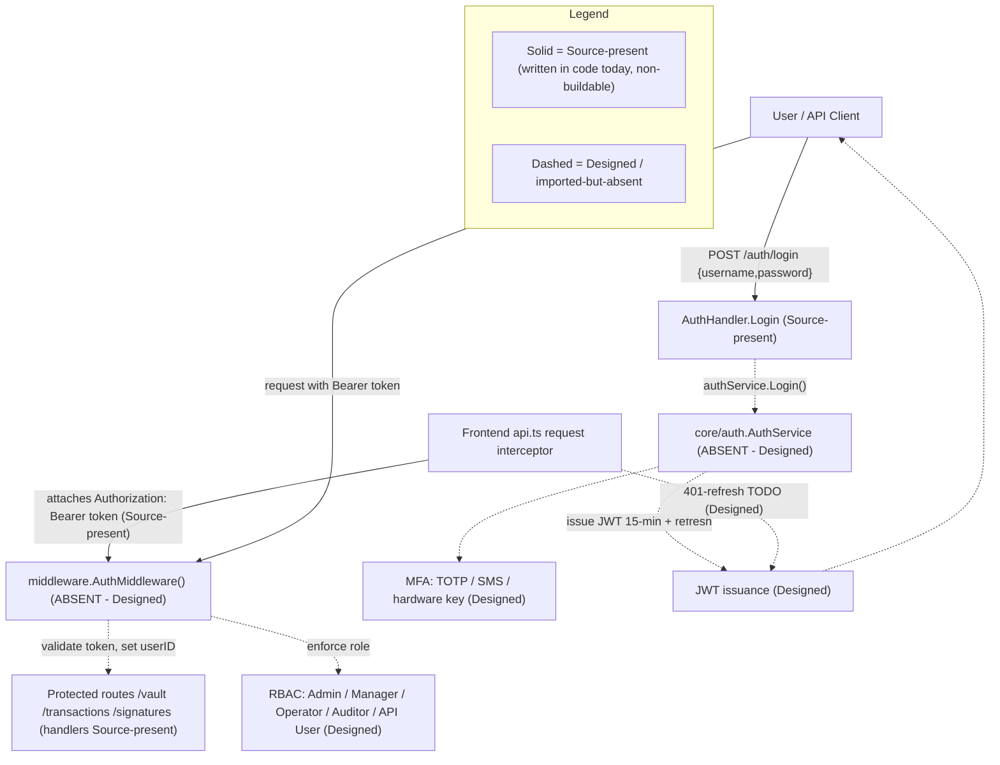

# Security Model

The Blockchain Integration Service and Dashboard is a custodial blockchain platform, and its security model spans authentication via JSON Web Token (JWT) bearer credentials, authorization through Role-Based Access Control (RBAC) mapped onto the `User.Role` field, multi-factor authentication (MFA), a password policy, session and token handling, and encryption of data at rest and in transit. `Source: backend/internal/db/schema.go:L27`. The login handler that anchors the authentication flow is present in code and returns a signed token on success, while the components that make the platform genuinely secure are specified in the design corpus but not yet built. `Source: backend/internal/api/handlers/auth.go:L21-L39`. This page documents the as-built controls against the designed target, applying a strict maturity discipline so that what runs today is never conflated with what is merely specified. The designed controls are grounded conceptually in the platform Technical Specification §6.4 (Security Architecture), while every hard claim below cites a concrete repository source.

## Maturity Legend

Every control on this page is tagged with the project-wide maturity discipline used across the documentation set:

- **Implemented** — present in code, building, and functional today. Per the single operational-truth vocabulary in [`../architecture/scaffold-vs-design.md`](../architecture/scaffold-vs-design.md), this label is **reserved** and **nothing qualifies for it** at this checkpoint (the backend has no `go.mod` and the `api` package imports absent packages; the frontend build is broken), so it is not applied to any control on this page.
- **Source-present (non-buildable)** — the code is written in source, but its containing package does not compile, so no runtime behavior may be asserted. Equivalent to *Implemented-with-defects* on the architecture pages.
- **Provisioned** — infrastructure or configuration exists and validly applies, but the capability is not yet fully wired to run.
- **Designed** — specified in the design corpus (`documentation/*.md`), absent from the code (or from validly-applicable infrastructure) today.

Read this page with one fact in front of mind: **most authentication and authorization controls are currently `Designed`.** The router references an authentication middleware package and the login handler depends on an authentication service package, but **both packages are imported and never defined** — so token validation, JWT issuance, and RBAC enforcement do not run today. `Source: backend/internal/api/routes.go:L6`, `Source: backend/internal/api/handlers/auth.go:L5`. The consolidated defect catalog that reconciles the design corpus against the on-disk scaffold is maintained in [`../architecture/scaffold-vs-design.md`](../architecture/scaffold-vs-design.md).

**Referenced from.** Once the documentation home and root-navigation pages are in place, this page will be linked from the documentation home (`../index.md`, not yet created) and the root project README ([`../../README.md`](../../README.md)); today it complements the authentication endpoint reference ([`../api-reference/authentication.md`](../api-reference/authentication.md)) and the architecture documentation.

The end-to-end authentication and authorization flow — contrasting the current source scaffold with the designed target — is shown in **Fig S1 — Authentication & Authorization Flow (Current Implemented vs Designed)**.

## Fig S1 — Authentication & Authorization Flow (Current Implemented vs Designed)

**Fig S1 — Authentication & Authorization Flow (Current Implemented vs Designed)**



**Legend.** As restated in the `Legend_S1` subgraph, solid nodes and edges denote controls that are **Source-present (non-buildable)** — written in code today but not compiling: the `AuthHandler.Login` and `Logout` handlers, the frontend request interceptor that attaches the `Authorization: Bearer` header, and the protected-route handlers. `Source: backend/internal/api/handlers/auth.go:L21-L55`, `Source: frontend/src/services/api.ts:L11-L23`. Dashed nodes and edges denote controls that are **Designed** or imported-but-absent: the `core/auth.AuthService`, JWT issuance, MFA, the `middleware.AuthMiddleware()` token validation, RBAC enforcement, and the frontend 401-refresh flow. `Source: backend/internal/api/handlers/auth.go:L5`, `Source: backend/internal/api/routes.go:L6`. As shown in **Fig S1**, only the request-shaping edge of the system exists today; everything that authenticates, authorizes, or refreshes a session is specified but not wired.

## Authentication

Authentication follows a bearer-token model. A client authenticates by sending `POST /auth/login` with a JSON body containing `username` and `password` (both bound with `binding:"required"`); on success the handler returns `200` with a `{ "token": <jwt> }` body, and clients then present that token as an `Authorization: Bearer <token>` header on every secured request. `Source: backend/internal/api/handlers/auth.go:L21-L39`. The `POST /auth/logout` route reads the caller's `userID` from the request context and invalidates the session, and it would be token-protected by the authentication middleware — but that middleware is **Designed** (imported but absent today), so no such protection runs at runtime; `POST /auth/register` is routed but **Designed**, because no `Register` method is defined on the handler. `Source: backend/internal/api/handlers/auth.go:L41-L55`, `Source: backend/internal/api/routes.go:L17-L22`, `Source: backend/internal/api/handlers/auth.go` (no `Register`). The full request/response reference — fields, status codes, and examples for all three endpoints — lives in the [authentication API reference](../api-reference/authentication.md) and is not duplicated here.

The **login and logout handlers are Source-present (non-buildable)**, and the token they would hand out is **Designed**: both delegate to `authService`, an instance of `auth.AuthService` imported from `backend/internal/core/auth`, a package that is **imported but absent from the codebase** — so the `api` package does not compile. Actual JWT issuance is therefore **Designed**. `Source: backend/internal/api/handlers/auth.go:L5`, `Source: backend/internal/api/handlers/auth.go:L32`.

### JSON Web Tokens and Session Handling

The design corpus specifies JWTs for user sessions with a **short access-token expiration of 15 minutes backed by a refresh-token mechanism**. This is **Designed**: no token generation, signing, expiry, or refresh logic is present in the readable code, since it belongs to the absent `core/auth` package. `Source: documentation/Technical Specifications.md:L480-L482`, `Source: backend/internal/api/handlers/auth.go:L5`. Session management — including inactivity timeout and forced logout under feature UA-001-4 — is likewise **Designed**. `Source: documentation/Software Requirements Specifications (SRS).md:L431`.

### Frontend Token Handling

On the client, the Axios **request interceptor is written to attach the bearer credential** whenever a token is available, so the browser would transparently authenticate each call — this code is **Source-present (non-buildable)** (the frontend build is broken, so it does not run as shipped). `Source: frontend/src/services/api.ts:L11-L23`.

```ts
const token = await getAuthToken();
if (token) config.headers['Authorization'] = `Bearer ${token}`;
```

The paired **response interceptor is a stub**: it carries a documented `HUMAN ASSISTANCE NEEDED` note to add token refresh on `401` errors, but no refresh flow is present, so a **401 auto-refresh is Designed**. `Source: frontend/src/services/api.ts:L11-L23`. Until that flow exists, an expired 15-minute access token would surface to the user as an unhandled `401` rather than a silent re-authentication.

Two further **client-side session defects** in `frontend/src/services/auth.ts` weaken the session model; both are documented, not fixed (see the fuller treatment in the [authentication reference](../api-reference/authentication.md)):

- **Logout is local-only.** `logout()` only calls `removeItem('jwt_token')` to drop the token from client storage; it **never calls `POST /auth/logout`**, so no server-side session invalidation or token revocation is triggered from the UI, and a `HUMAN ASSISTANCE NEEDED` comment notes that application-state clearing is also unfinished. `Source: frontend/src/services/auth.ts:L19-L25`.
- **Token expiry is not checked.** `isAuthenticated()` returns `true` whenever a token *string is present*; the JWT `exp`-claim verification is commented out (`HUMAN ASSISTANCE NEEDED`), so an **expired token is treated as valid** on the client. `Source: frontend/src/services/auth.ts:L27-L43`.

### API Key Authentication

For programmatic (non-interactive) access, the design corpus specifies **API-key authentication with regular rotation every 30 days** — **Designed**. `Source: documentation/Technical Specifications.md:L484-L486`. The data model anticipates this control: the `Organization` entity carries an `APIKey` field on which a per-tenant key would be stored and rotated. `Source: backend/internal/db/schema.go:L15`.

### Login Hardening Gap

The `Login` handler carries an explicit `HUMAN ASSISTANCE NEEDED` note stating that it needs additional error handling and input validation before it is production-ready; this hardening is a known gap and is documented, not fixed, by this deliverable. `Source: backend/internal/api/handlers/auth.go:L19-L20`.


## Authorization (RBAC)

Authorization is designed as Role-Based Access Control (RBAC) mapped onto the `User.Role` field of the user entity. `Source: backend/internal/db/schema.go:L27`. Two facts make the entire RBAC control **Designed** rather than Implemented. First, `Role` is declared as a plain `string` with no enumeration or database constraint, so the five-role vocabulary below is defined in the design corpus, not enforced by the schema. `Source: backend/internal/db/schema.go:L20-L30`. Second, role enforcement would occur inside `middleware.AuthMiddleware()`, which guards the protected route groups but belongs to the absent `middleware` package — so no role check runs today. `Source: backend/internal/api/routes.go:L25`.

The five roles and their permissions, reproduced from the design corpus, are enumerated below; each maps to a value of `User.Role` and cross-references functional requirement UA-001-2 (Role-based Access). `Source: documentation/Technical Specifications.md:L490-L498`, `Source: documentation/Software Requirements Specifications (SRS).md:L429`.

| Role | Permissions | Maturity |
|------|-------------|----------|
| Admin | Full access to all system functions. | Designed |
| Manager | Access to vault management, transaction processing, and analytics. | Designed |
| Operator | Access to transaction processing and basic analytics. | Designed |
| Auditor | Read-only access to all data for auditing purposes. | Designed |
| API User | Programmatic access to specific API endpoints. | Designed |

`Source: documentation/Technical Specifications.md:L490-L498`.

Authorization is additionally scoped by tenant: the `User` entity carries an `OrganizationID`, so a fully wired authorization layer would constrain each role's reach to the caller's own organization in addition to the role check above. `Source: backend/internal/db/schema.go:L23`. The `User` entity that carries both `Role` and `OrganizationID` is defined in [`../architecture/data-model.md`](../architecture/data-model.md) (see **Fig M1 — Data Model ERD**).


## Multi-Factor Authentication and Password Policy

Both of the controls in this section are **Designed**: they are specified in the design corpus and the non-functional requirements, but no supporting code is present in the scaffold (the `core/auth` package that would implement them is absent). `Source: backend/internal/api/handlers/auth.go:L5`.

### Multi-Factor Authentication

Multi-factor authentication (MFA) is required for dashboard access and would be satisfied by any one of three second factors: a Time-based One-Time Password (TOTP), SMS-based verification, or a hardware security key (for example, a YubiKey) — **Designed**. `Source: documentation/Technical Specifications.md:L468-L472`, `Source: documentation/Software Requirements Specifications (SRS).md:L493`. This maps to functional requirement UA-001-3 (Multi-factor Authentication). `Source: documentation/Software Requirements Specifications (SRS).md:L430`.

### Password Policy

The designed password policy maps to functional requirement UA-001-5 (Password Policies) and comprises the rules below — **Designed**. `Source: documentation/Technical Specifications.md:L474-L478`, `Source: documentation/Software Requirements Specifications (SRS).md:L432`.

| Rule | Requirement | Maturity |
|------|-------------|----------|
| Minimum length | 12 characters. | Designed |
| Complexity | Must include uppercase, lowercase, numbers, and special characters. | Designed |
| History | Prevent reuse of the last 5 passwords. | Designed |
| Maximum age | 90 days. | Designed |

`Source: documentation/Technical Specifications.md:L474-L478`.


## Encryption and Key Management

The encryption controls are **Designed**. From the application's own perspective there is no encryption or Transport Layer Security (TLS) termination in the Go code today. Critically, the Terraform under `infrastructure/terraform/` does **not** provide a realization path either, for two independent reasons, so these controls are **not** "Provisioned via infrastructure once applied":

1. **The encryption mechanisms are absent from the Terraform.** The RDS instance declares no `storage_encrypted`, the S3 buckets declare no server-side-encryption configuration, the ElastiCache cluster declares no `at_rest_encryption_enabled`/`transit_encryption_enabled`, and there is **no AWS Secrets Manager, KMS, or HSM resource anywhere** in the configuration. `Source: infrastructure/terraform/main.tf:L91-L117,L133-L140`.
2. **The configuration cannot validly apply.** `aws_db_instance.postgresql` uses an invalid `subnet_id` argument (RDS requires a `db_subnet_group_name`) and sets `skip_final_snapshot = true` (a data-loss risk), and the file references several resources that are never defined — `aws_security_group.{postgresql,redis,kafka}`, `aws_elasticache_subnet_group.redis`, `aws_lb_target_group.web`, `aws_ecs_task_definition.web`, and `data.aws_availability_zones.available` (the file's own `HUMAN ASSISTANCE NEEDED` block lists these as still to be added). `terraform validate`/`plan` therefore fails. `Source: infrastructure/terraform/main.tf:L102,L104,L101,L116,L129,L216-L227`.

Each control below is consequently presented as **Designed**, with the specific infrastructure gap called out. The broader Terraform security and data-loss gaps are catalogued in the [deployment guide](../guides/deployment.md).

### Encryption at Rest

All sensitive data — including user credentials and transaction details — is specified to be encrypted at rest using AES-256. `Source: documentation/Software Requirements Specifications (SRS).md:L497`. The design corpus locates this at the storage tier: RDS PostgreSQL encrypted with AWS-managed keys, S3 buckets using server-side encryption with AWS KMS, and ElastiCache for Redis with encryption enabled. This is **Designed**: none of it is realized in the Terraform — the `aws_db_instance` has no `storage_encrypted = true` (RDS defaults to unencrypted), the `aws_s3_bucket` resources declare no `aws_s3_bucket_server_side_encryption_configuration`, and the `aws_elasticache_cluster` sets no `at_rest_encryption_enabled`. `Source: documentation/Technical Specifications.md:L517-L519`, `Source: infrastructure/terraform/main.tf:L91-L105,L108-L117,L133-L140`.

### Encryption in Transit

All API communications are specified to use HTTPS with TLS 1.2 or higher. `Source: documentation/Software Requirements Specifications (SRS).md:L499`, `Source: documentation/Technical Specifications.md:L522-L523`. The Go service does not terminate TLS itself; in the designed topology this is provided by the load balancer. The Terraform *does* declare an ALB HTTPS listener plus an HTTP→HTTPS redirect, which is closer to realization than the at-rest controls — but two gaps keep it **Designed**: the listener pins `ssl_policy = "ELBSecurityPolicy-2016-08"`, a **legacy policy that permits TLS 1.0/1.1** rather than enforcing TLS 1.2+; and, as noted above, the overall configuration does not validly apply. `Source: infrastructure/terraform/main.tf:L178-L203`, `Source: documentation/Technical Specifications.md:L522-L523`.

### Secrets and Key Management

Credentials and API keys are specified to be stored and managed with AWS Secrets Manager, backed by AWS Key Management Service (KMS) for encryption keys and Hardware Security Modules (HSMs) for cryptographic key storage — **Designed**. Nothing realizes this today: there is **no `aws_secretsmanager_*`, `aws_kms_*`, or HSM/CloudHSM resource** anywhere in the Terraform, and the RDS master password is instead passed as a plain `var.postgres_password` variable. `Source: documentation/Software Requirements Specifications (SRS).md:L501`, `Source: documentation/Technical Specifications.md:L526-L528`, `Source: infrastructure/terraform/main.tf:L99`.

The `User` entity persists a `PasswordHash` field, which stores the hashed credential and **must never be serialized over the API** in any request or response body. `Source: backend/internal/db/schema.go:L26`. **Security defect (documented, not fixed):** the `PasswordHash` field carries **no `json:"-"` tag**, so if any handler marshaled a `User` struct directly (the structs are untagged and serialize every exported field) the hash **would be exposed** in the response body. The "never serialized" rule above is therefore a **Designed** contract, not a guarantee the current code enforces — it is the field-exposure gap cross-referenced from the [OpenAPI `User` schema](../api-reference/openapi.yaml). `Source: backend/internal/db/schema.go:L20-L30` (specifically L26, which lacks a `json:"-"` tag). The authentication endpoints accept a password only on login and never echo any credential material back to the client; see the [authentication API reference](../api-reference/authentication.md) for the exact response bodies.


## Compliance and Audit

The design corpus commits the platform to substantial regulatory and audit obligations, none of which are realized in the current scaffold — the entire compliance surface is **Designed**. This boundary is stated explicitly so the documentation never implies a compliance posture the code does not provide.

- **Regulatory frameworks (Designed).** The SRS enumerates GDPR, PCI DSS (where card data is handled), SOC 2 Type II, and jurisdictional blockchain/cryptocurrency compliance. No corresponding controls, data-subject workflows, or attestations exist in the code. `Source: documentation/Software Requirements Specifications (SRS).md:L546-L556`.
- **Audit trails and audit logging (Designed).** The SRS requires comprehensive audit trails of all user actions and system events, retained for a minimum of one year, to satisfy financial-audit requirements. The application persists **no audit-trail entity and emits no audit events**: the only logging wired in source is Gin access logging and worker error logs (both Source-present, non-buildable), and there is no audit sink, no tamper-evident store, and no AWS CloudTrail provisioning (the Terraform declares none). `Source: documentation/Software Requirements Specifications (SRS).md:L503,L560`, `Source: documentation/Technical Specifications.md:L429`.
- **Compliance reporting (Designed).** The requirement to generate reports demonstrating regulatory compliance has no supporting code or data pipeline. `Source: documentation/Software Requirements Specifications (SRS).md:L562`.

Because no audit evidence is produced and no compliance control executes, this deliverable makes **no assertion of compliance readiness**; the audit-evidence and control-attestation artifacts a compliance program would require are absent and remain Designed work.


## Known Gaps and Maturity Summary

**Auth-middleware caveat.** The single most important gap in the current security posture is that `internal/api/middleware.AuthMiddleware()` is referenced by the router on the logout route and on every protected group — `/vault`, `/transactions`, and `/signatures` — but the `middleware` package is **imported and never defined**. Because the middleware does not exist, **token validation and RBAC enforcement do not run today**, and the "auth-protected" route groups are therefore not actually protected at runtime. `Source: backend/internal/api/routes.go:L6`, `Source: backend/internal/api/routes.go:L21`, `Source: backend/internal/api/routes.go:L25`, `Source: backend/internal/api/routes.go:L35`, `Source: backend/internal/api/routes.go:L45`. The same applies to `core/auth.AuthService`, which the login and logout handlers depend on but which is likewise imported and absent. `Source: backend/internal/api/handlers/auth.go:L5`. Both are tagged **Designed**. The consolidated Implemented/Provisioned/Designed defect catalog — including the auth-middleware and `AuthService` rows — is maintained in [`../architecture/scaffold-vs-design.md`](../architecture/scaffold-vs-design.md).

The maturity of every control discussed on this page is summarized below.

| Control | Maturity | Evidence |
|---------|----------|----------|
| Gin access logging and panic recovery (`gin.Logger()`, `gin.Recovery()`) | Source-present (non-buildable) | `Source: backend/internal/api/routes.go:L9-L14` |
| `Login` / `Logout` handlers | Source-present (non-buildable) | `Source: backend/internal/api/handlers/auth.go:L21-L55` |
| Frontend bearer-token attach (request interceptor) | Source-present (non-buildable) | `Source: frontend/src/services/api.ts:L11-L23` |
| JWT issuance, 15-minute expiry + refresh token | Designed | `Source: documentation/Technical Specifications.md:L480-L482`; `Source: backend/internal/api/handlers/auth.go:L5` |
| Multi-factor authentication (TOTP / SMS / hardware key) | Designed | `Source: documentation/Technical Specifications.md:L468-L472` |
| Password policy (length / complexity / history / max age) | Designed | `Source: documentation/Technical Specifications.md:L474-L478` |
| API-key authentication, 30-day rotation | Designed | `Source: documentation/Technical Specifications.md:L484-L486` |
| RBAC role enforcement (five roles over `User.Role`) | Designed | `Source: backend/internal/db/schema.go:L27`; `Source: documentation/Technical Specifications.md:L490-L498` |
| `AuthMiddleware()` token validation / route protection | Designed | `Source: backend/internal/api/routes.go:L6`, `Source: backend/internal/api/routes.go:L25` |
| Frontend 401 auto-refresh | Designed | `Source: frontend/src/services/api.ts:L11-L23` |
| AES-256 encryption at rest | Designed (absent from Terraform: no `storage_encrypted`/S3 SSE/ElastiCache encryption) | `Source: documentation/Software Requirements Specifications (SRS).md:L497`; `Source: infrastructure/terraform/main.tf:L91-L117,L133-L140` |
| TLS 1.2+ encryption in transit | Designed (ALB HTTPS listener declared but legacy `ELBSecurityPolicy-2016-08` permits TLS 1.0/1.1; config does not validly apply) | `Source: documentation/Technical Specifications.md:L522-L523`; `Source: infrastructure/terraform/main.tf:L178-L203` |
| AWS Secrets Manager / KMS / HSM key management | Designed (no Secrets Manager/KMS/HSM resource in Terraform) | `Source: documentation/Software Requirements Specifications (SRS).md:L501`; `Source: infrastructure/terraform/main.tf:L91-L227` |
| Compliance controls, audit trails, and reporting (GDPR/PCI DSS/SOC 2) | Designed (no audit-trail entity, no audit events, no CloudTrail) | `Source: documentation/Software Requirements Specifications (SRS).md:L503,L546-L562`; `Source: documentation/Technical Specifications.md:L429` |


## Related Documentation

- [`../api-reference/authentication.md`](../api-reference/authentication.md) — the authentication endpoint reference: request/response bodies, status codes, and examples for `POST /auth/login`, `POST /auth/register`, and `POST /auth/logout`.
- [`../architecture/overview.md`](../architecture/overview.md) — where the authentication and authorization controls sit in the system, via **Fig A1 — Current Implemented Scaffold** and **Fig A2 — Designed Target Architecture**.
- [`../architecture/scaffold-vs-design.md`](../architecture/scaffold-vs-design.md) — the consolidated Implemented/Provisioned/Designed defect catalog, including the auth-middleware and `AuthService` rows.
- [`../architecture/data-model.md`](../architecture/data-model.md) — the `User` entity in **Fig M1 — Data Model ERD**, including the `Role` field on which RBAC maps.
- `../index.md` — documentation home (planned root-navigation landing page; not yet created).
- [`../../README.md`](../../README.md) — project readme and top-level navigation.
