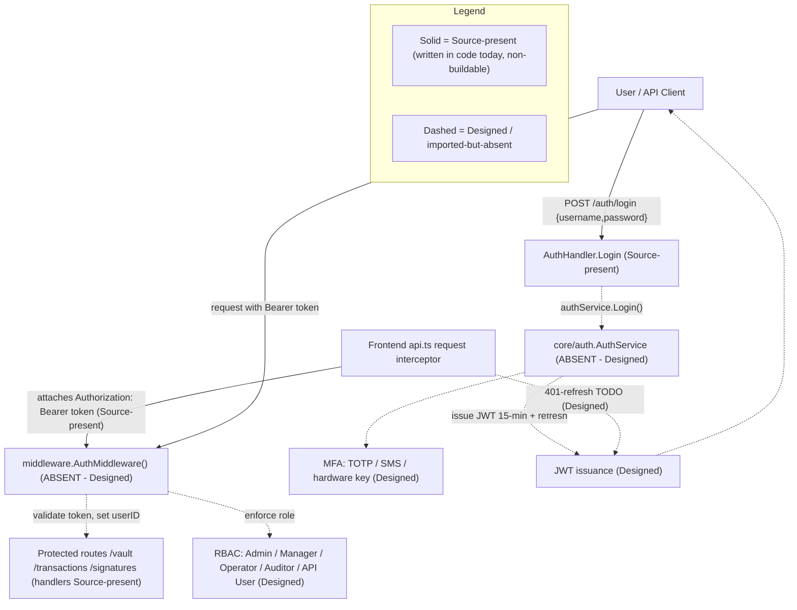

# Security Model

The Blockchain Integration Service and Dashboard is a custodial blockchain platform, and its security model spans authentication via JSON Web Token (JWT) bearer credentials, authorization through Role-Based Access Control (RBAC) mapped onto the `User.Role` field, multi-factor authentication (MFA), a password policy, session and token handling, and encryption of data at rest and in transit. `Source: backend/internal/db/schema.go:L27`. The login handler that anchors the authentication flow is **source-present but non-buildable**: it is written to return a signed token on success, but token issuance is delegated to the absent `internal/core/auth` service and the `api` package does not compile, so **no token is issued at runtime today** — JWT issuance is **Designed**. The other components that make the platform genuinely secure are likewise specified in the design corpus but not yet built. `Source: backend/internal/api/handlers/auth.go:L21-L39`, `Source: backend/internal/api/handlers/auth.go:L5`. This page documents the as-built controls against the designed target, applying a strict maturity discipline so that what runs today is never conflated with what is merely specified. The designed controls are grounded conceptually in the platform Technical Specification §6.4 (Security Architecture), while every hard claim below cites a concrete repository source.

## Maturity Legend

Every control on this page is tagged with the project-wide maturity discipline used across the documentation set:

- **Implemented** — present in code, building, and functional today. Per the single operational-truth vocabulary in [`../architecture/scaffold-vs-design.md`](../architecture/scaffold-vs-design.md), this label is **reserved** and **nothing qualifies for it** at this checkpoint (the backend has no `go.mod` and the `api` package imports absent packages; the frontend build is broken), so it is not applied to any control on this page.
- **Source-present (non-buildable)** — the code is written in source, but its containing package does not compile, so no runtime behavior may be asserted. Equivalent to *Implemented-with-defects* on the architecture pages.
- **Provisioned** — infrastructure or configuration exists and validly applies, but the capability is not yet fully wired to run.
- **Designed** — specified in the design corpus (`documentation/*.md`), absent from the code (or from validly-applicable infrastructure) today.

Read this page with one fact in front of mind: **most authentication and authorization controls are currently `Designed`.** The router references an authentication middleware package and the login handler depends on an authentication service package, but **both packages are imported and never defined** — so token validation, JWT issuance, and RBAC enforcement do not run today. `Source: backend/internal/api/routes.go:L6`, `Source: backend/internal/api/handlers/auth.go:L5`. The consolidated defect catalog that reconciles the design corpus against the on-disk scaffold is maintained in [`../architecture/scaffold-vs-design.md`](../architecture/scaffold-vs-design.md).

**Referenced from.** This page is linked from the documentation home ([`../index.md`](../index.md)) and the root project README ([`../../README.md`](../../README.md)) — both present in the repository, each listing this security model in its navigation — and it complements the authentication endpoint reference ([`../api-reference/authentication.md`](../api-reference/authentication.md)) and the architecture documentation.

The end-to-end authentication and authorization flow — contrasting the current source scaffold with the designed target — is shown in **Fig S1 — Authentication & Authorization Flow (Current Implemented vs Designed)**.

## Fig S1 — Authentication & Authorization Flow (Current Implemented vs Designed)

**Fig S1 — Authentication & Authorization Flow (Current Implemented vs Designed)**



**Legend.** As restated in the `Legend_S1` subgraph, solid nodes and edges denote controls that are **Source-present (non-buildable)** — written in code today but not compiling: the `AuthHandler.Login` and `Logout` handlers, the frontend request interceptor that attaches the `Authorization: Bearer` header, and the protected-route handlers. `Source: backend/internal/api/handlers/auth.go:L21-L55`, `Source: frontend/src/services/api.ts:L11-L23`. Dashed nodes and edges denote controls that are **Designed** or imported-but-absent: the `core/auth.AuthService`, JWT issuance, MFA, the `middleware.AuthMiddleware()` token validation, RBAC enforcement, and the frontend 401-refresh flow. `Source: backend/internal/api/handlers/auth.go:L5`, `Source: backend/internal/api/routes.go:L6`. As shown in **Fig S1**, only the request-shaping edge of the system exists today; everything that authenticates, authorizes, or refreshes a session is specified but not wired.

## Authentication

Authentication follows a bearer-token model. A client authenticates by sending `POST /auth/login` with a JSON body containing `username` and `password` (both bound with `binding:"required"`); on success the handler returns `200` with a `{ "token": <jwt> }` body, and clients then present that token as an `Authorization: Bearer <token>` header on every secured request. `Source: backend/internal/api/handlers/auth.go:L21-L39`. The `POST /auth/logout` route reads the caller's `userID` from the request context and invalidates the session, and it would be token-protected by the authentication middleware — but that middleware is **Designed** (imported but absent today), so no such protection runs at runtime; `POST /auth/register` is routed but **Designed**, because no `Register` method is defined on the handler. `Source: backend/internal/api/handlers/auth.go:L41-L55`, `Source: backend/internal/api/routes.go:L17-L22`, `Source: backend/internal/api/handlers/auth.go` (no `Register`). The full request/response reference — fields, status codes, and examples for all three endpoints — lives in the [authentication API reference](../api-reference/authentication.md) and is not duplicated here.

The **login and logout handlers are Source-present (non-buildable)**, and the token they would hand out is **Designed**: both delegate to `authService`, an instance of `auth.AuthService` imported from `backend/internal/core/auth`, a package that is **imported but absent from the codebase** — so the `api` package does not compile. Actual JWT issuance is therefore **Designed**. `Source: backend/internal/api/handlers/auth.go:L5`, `Source: backend/internal/api/handlers/auth.go:L32`.

### JSON Web Tokens and Session Handling

The design corpus specifies JWTs for user sessions with a **short access-token expiration of 15 minutes backed by a refresh-token mechanism**. This is **Designed**: no token generation, signing, expiry, or refresh logic is present in the readable code, since it belongs to the absent `core/auth` package. `Source: documentation/Technical Specifications.md:L480-L482`, `Source: backend/internal/api/handlers/auth.go:L5`. Session management — including inactivity timeout and forced logout under feature UA-001-4 — is likewise **Designed**. `Source: documentation/Software Requirements Specifications (SRS).md:L431`.

### Frontend Token Handling

On the client, the Axios **request interceptor is written to attach the bearer credential** whenever a token is available, so the browser would transparently authenticate each call — this code is **Source-present (non-buildable)** (the frontend build is broken, so it does not run as shipped). `Source: frontend/src/services/api.ts:L11-L23`.

```ts
const token = await getAuthToken();
if (token) config.headers['Authorization'] = `Bearer ${token}`;
```

The paired **response interceptor is a stub**: it carries a documented `HUMAN ASSISTANCE NEEDED` note to add token refresh on `401` errors, but no refresh flow is present, so a **401 auto-refresh is Designed**. `Source: frontend/src/services/api.ts:L11-L23`. Until that flow exists, an expired 15-minute access token would surface to the user as an unhandled `401` rather than a silent re-authentication.

Two further **client-side session defects** in `frontend/src/services/auth.ts` weaken the session model; both are documented, not fixed (see the fuller treatment in the [authentication reference](../api-reference/authentication.md)):

- **Logout is local-only.** `logout()` only calls `removeItem('jwt_token')` to drop the token from client storage; it **never calls `POST /auth/logout`**, so no server-side session invalidation or token revocation is triggered from the UI, and a `HUMAN ASSISTANCE NEEDED` comment notes that application-state clearing is also unfinished. `Source: frontend/src/services/auth.ts:L19-L25`.
- **Token expiry is not checked.** `isAuthenticated()` returns `true` whenever a token *string is present*; the JWT `exp`-claim verification is commented out (`HUMAN ASSISTANCE NEEDED`), so an **expired token is treated as valid** on the client. `Source: frontend/src/services/auth.ts:L27-L43`.

### API Key Authentication

For programmatic (non-interactive) access, the design corpus specifies **API-key authentication with regular rotation every 30 days** — **Designed**. `Source: documentation/Technical Specifications.md:L484-L486`. The data model anticipates this control: the `Organization` entity carries an `APIKey` field on which a per-tenant key would be stored and rotated. `Source: backend/internal/db/schema.go:L15`.

**API keys are secrets — handling contract (Designed).** An API key is a bearer credential and must be treated as a secret. The intended contract is to persist only a one-way **hash or verifier** of the key (never the raw key), **reveal the raw key exactly once** at creation or rotation and never again, **never** return it in read responses or DTOs, and **redact** it from all logs. **Security defect (documented, not fixed):** today `Organization.APIKey` is declared as a **plaintext `string` with no `json:"-"` tag** `Source: backend/internal/db/schema.go:L15`, so — exactly like the untagged `PasswordHash` discussed under [Secrets and Key Management](#secrets-and-key-management) — if any handler marshaled an `Organization` struct directly, the raw key would be exposed in the response body. The contract above is therefore **Designed**, not enforced by the current schema; it is mirrored in [`../architecture/data-model.md`](../architecture/data-model.md#sensitive--secret-fields) and the [OpenAPI `Organization` schema](../api-reference/openapi.yaml), where `apiKey` has been removed from the response DTO.

### Login Hardening Gap

The `Login` handler carries an explicit `HUMAN ASSISTANCE NEEDED` note stating that it needs additional error handling and input validation before it is production-ready; this hardening is a known gap and is documented, not fixed, by this deliverable. `Source: backend/internal/api/handlers/auth.go:L19-L20`.


## Authorization (RBAC)

Authorization is designed as Role-Based Access Control (RBAC) mapped onto the `User.Role` field of the user entity. `Source: backend/internal/db/schema.go:L27`. Two facts make the entire RBAC control **Designed** rather than Implemented. First, `Role` is declared as a plain `string` with no enumeration or database constraint, so the five-role vocabulary below is defined in the design corpus, not enforced by the schema. `Source: backend/internal/db/schema.go:L20-L30`. Second, role enforcement would occur inside `middleware.AuthMiddleware()`, which guards the protected route groups but belongs to the absent `middleware` package — so no role check runs today. `Source: backend/internal/api/routes.go:L25`.

The five roles and their permissions, reproduced from the design corpus, are enumerated below; each maps to a value of `User.Role` and cross-references functional requirement UA-001-2 (Role-based Access). `Source: documentation/Technical Specifications.md:L490-L498`, `Source: documentation/Software Requirements Specifications (SRS).md:L429`.

| Role | Permissions | Maturity |
|------|-------------|----------|
| Admin | Full access to all system functions. | Designed |
| Manager | Access to vault management, transaction processing, and analytics. | Designed |
| Operator | Access to transaction processing and basic analytics. | Designed |
| Auditor | Read-only access to all data for auditing purposes. | Designed |
| API User | Programmatic access to specific API endpoints. | Designed |

`Source: documentation/Technical Specifications.md:L490-L498`.

Two divergences qualify the five-role model above.

**1. Vocabulary — four client values versus five designed roles versus an unconstrained column.** The frontend's client-side `UserSchema` validates `role` against only four values — `Admin`, `Manager`, `Operator`, `Auditor` — omitting `API User`, while the backend stores `Role` as a plain unconstrained `string` with no enumeration or check constraint. `Source: frontend/src/schema/user.ts:L11`, `Source: backend/internal/db/schema.go:L27`. A caller holding the `API User` role would therefore fail client-side validation while remaining valid server-side.

**2. Letter case — the one role check that exists in code can never match.** The single role comparison anywhere in the codebase is the `Sidebar` guard on the administrator navigation link, written as `user.role === 'admin'` in **lowercase**, whereas the schema admits only the capitalized `'Admin'`. `Source: frontend/src/components/Sidebar.tsx:L29`, `Source: frontend/src/schema/user.ts:L11`. JavaScript `===` on strings is case-sensitive, so **no schema-valid role value can ever satisfy the guard** and the `/admin` route link is unreachable through the UI for every user, genuine administrators included. `Source: frontend/src/components/Sidebar.tsx:L29-L34`. This is a *fail-closed* defect — it denies rather than grants access, so it is not an authorization bypass — but it means the only place the product currently expresses a role decision expresses it incorrectly, and it must be corrected together with a server-side check rather than instead of one. Note also that `Role` appears exactly **once** in the entire backend (its declaration on the `User` entity): there is no role comparison, guard, or middleware check on the server at all, so the UI guard is not a redundant second line of defence — it is the *only* role logic in the system. `Source: backend/internal/db/schema.go:L27`.

Because enforcement on both sides is **Designed** — the auth middleware is absent and neither layer builds — both divergences are latent rather than active today; they are cataloged together as Defect 14 in [`../architecture/scaffold-vs-design.md`](../architecture/scaffold-vs-design.md#defect-catalog) and detailed in [`../architecture/frontend.md`](../architecture/frontend.md).

Authorization is additionally scoped by tenant: the `User` entity carries an `OrganizationID`, so a fully wired authorization layer would constrain each role's reach to the caller's own organization in addition to the role check above. `Source: backend/internal/db/schema.go:L23`. The `User` entity that carries both `Role` and `OrganizationID` is defined in [`../architecture/data-model.md`](../architecture/data-model.md) (see **Fig M1 — Data Model ERD**).


## Multi-Factor Authentication and Password Policy

Both of the controls in this section are **Designed**: they are specified in the design corpus and the non-functional requirements, but no supporting code is present in the scaffold (the `core/auth` package that would implement them is absent). `Source: backend/internal/api/handlers/auth.go:L5`.

### Multi-Factor Authentication

Multi-factor authentication (MFA) is required for dashboard access and would be satisfied by any one of three second factors: a Time-based One-Time Password (TOTP), SMS-based verification, or a hardware security key (for example, a YubiKey) — **Designed**. `Source: documentation/Technical Specifications.md:L468-L472`, `Source: documentation/Software Requirements Specifications (SRS).md:L493`. This maps to functional requirement UA-001-3 (Multi-factor Authentication). `Source: documentation/Software Requirements Specifications (SRS).md:L430`.

### Password Policy

The designed password policy maps to functional requirement UA-001-5 (Password Policies) and comprises the rules below — **Designed**. `Source: documentation/Technical Specifications.md:L474-L478`, `Source: documentation/Software Requirements Specifications (SRS).md:L432`.

| Rule | Requirement | Maturity |
|------|-------------|----------|
| Minimum length | 12 characters. | Designed |
| Complexity | Must include uppercase, lowercase, numbers, and special characters. | Designed |
| History | Prevent reuse of the last 5 passwords. | Designed |
| Maximum age | 90 days. | Designed |

`Source: documentation/Technical Specifications.md:L474-L478`.


## Encryption and Key Management

The encryption controls are **Designed**. From the application's own perspective there is no encryption or Transport Layer Security (TLS) termination in the Go code today. Critically, the Terraform under `infrastructure/terraform/` does **not** provide a realization path either, for two independent reasons, so these controls are **not** "Provisioned via infrastructure once applied":

1. **The encryption mechanisms are absent from the Terraform.** The RDS instance declares no `storage_encrypted`, the S3 buckets declare no server-side-encryption configuration, the ElastiCache cluster declares no `at_rest_encryption_enabled`/`transit_encryption_enabled`, and there is **no AWS Secrets Manager, KMS, or HSM resource anywhere** in the configuration. `Source: infrastructure/terraform/main.tf:L91-L117,L133-L140`.
2. **The configuration cannot validly apply.** `aws_db_instance.postgresql` uses an invalid `subnet_id` argument (RDS requires a `db_subnet_group_name`) and sets `skip_final_snapshot = true` (a data-loss risk), and the file references several resources that are never defined — `aws_security_group.{postgresql,redis,kafka}`, `aws_elasticache_subnet_group.redis`, `aws_lb_target_group.web`, `aws_ecs_task_definition.web`, and `data.aws_availability_zones.available` (the file's own `HUMAN ASSISTANCE NEEDED` block lists these as still to be added). `terraform validate`/`plan` therefore fails. `Source: infrastructure/terraform/main.tf:L102,L104,L101,L116,L129,L216-L227`.

Each control below is consequently presented as **Designed**, with the specific infrastructure gap called out. The broader Terraform security and data-loss gaps are catalogued in the [deployment guide](../guides/deployment.md).

### Encryption at Rest

All sensitive data — including user credentials and transaction details — is specified to be encrypted at rest using AES-256. `Source: documentation/Software Requirements Specifications (SRS).md:L497`. The design corpus locates this at the storage tier: RDS PostgreSQL encrypted with AWS-managed keys, S3 buckets using server-side encryption with AWS KMS, and ElastiCache for Redis with encryption enabled. This is **Designed**: none of it is realized in the Terraform — the `aws_db_instance` has no `storage_encrypted = true` (RDS defaults to unencrypted), the `aws_s3_bucket` resources declare no `aws_s3_bucket_server_side_encryption_configuration`, and the `aws_elasticache_cluster` sets no `at_rest_encryption_enabled`. `Source: documentation/Technical Specifications.md:L517-L519`, `Source: infrastructure/terraform/main.tf:L91-L105,L108-L117,L133-L140`.

### Encryption in Transit

All API communications are specified to use HTTPS with TLS 1.2 or higher. `Source: documentation/Software Requirements Specifications (SRS).md:L499`, `Source: documentation/Technical Specifications.md:L522-L523`. The Go service does not terminate TLS itself; in the designed topology this is provided by the load balancer. The Terraform *does* declare an ALB HTTPS listener plus an HTTP→HTTPS redirect, which is closer to realization than the at-rest controls — but two gaps keep it **Designed**: the listener pins `ssl_policy = "ELBSecurityPolicy-2016-08"`, a **legacy policy that permits TLS 1.0/1.1** rather than enforcing TLS 1.2+; and, as noted above, the overall configuration does not validly apply. `Source: infrastructure/terraform/main.tf:L178-L203`, `Source: documentation/Technical Specifications.md:L522-L523`.

### Secrets and Key Management

Credentials and API keys are specified to be stored and managed with AWS Secrets Manager, backed by AWS Key Management Service (KMS) for encryption keys and Hardware Security Modules (HSMs) for cryptographic key storage — **Designed**. Nothing realizes this today: there is **no `aws_secretsmanager_*`, `aws_kms_*`, or HSM/CloudHSM resource** anywhere in the Terraform, and the RDS master password is instead passed as a plain `var.postgres_password` variable. Worse, that variable is **undeclared**: `main.tf` references `var.postgres_password` `Source: infrastructure/terraform/main.tf:L99`, but `variables.tf` declares the (sensitive) master-password variable under the different name `rds_password` `Source: infrastructure/terraform/variables.tf:L64`, so the reference resolves to no declared variable — an additional reason the configuration is **Declared-but-invalid** and cannot validly apply (catalogued with the other Terraform gaps in the [deployment guide](../guides/deployment.md)). `Source: documentation/Software Requirements Specifications (SRS).md:L501`, `Source: documentation/Technical Specifications.md:L526-L528`.

The `User` entity persists a `PasswordHash` field, which stores the hashed credential and **must never be serialized over the API** in any request or response body. `Source: backend/internal/db/schema.go:L26`. **Security defect (documented, not fixed):** the `PasswordHash` field carries **no `json:"-"` tag**, so if any handler marshaled a `User` struct directly (the structs are untagged and serialize every exported field) the hash **would be exposed** in the response body. The "never serialized" rule above is therefore a **Designed** contract, not a guarantee the current code enforces — it is the field-exposure gap cross-referenced from the [OpenAPI `User` schema](../api-reference/openapi.yaml). `Source: backend/internal/db/schema.go:L20-L30` (specifically L26, which lacks a `json:"-"` tag). The authentication endpoints accept a password only on login and never echo any credential material back to the client; see the [authentication API reference](../api-reference/authentication.md) for the exact response bodies.

**Application-level secrets and sensitive material (Designed contracts).** Beyond the password hash above, two data-model fields are security-sensitive and require explicit handling that no code enforces today:

- **`Organization.APIKey` — secret.** Handled per the [API Key Authentication](#api-key-authentication) contract: store only a hash/verifier, reveal once, never return it in DTOs, and redact it from logs. It is currently a plaintext, untagged `string`. `Source: backend/internal/db/schema.go:L15`.
- **`Signature.RawSignature` — sensitive cryptographic material.** Classify it explicitly as sensitive; **minimize retention** — the settlement processor caches the full signature object (including `RawSignature`) under `signature:<id>` in Redis for **24 hours** `Source: backend/internal/tasks/signature_processor.go:L46-L58`, a retention/exposure concern amplified because the designed ElastiCache declares **no** `at_rest_encryption_enabled`/`transit_encryption_enabled` (see [Encryption at Rest](#encryption-at-rest)); **encrypt** it in transit and at rest; and **never** log it. `Source: backend/internal/db/schema.go:L64`.

Both are **Designed** contracts, consistent with the classifications in [`../architecture/data-model.md`](../architecture/data-model.md#sensitive--secret-fields), the [signatures API reference](../api-reference/signatures.md), and the [signature-management guide](../guides/signature-management.md).


## Application and API Security

The design corpus commits to two whole families of control that have **no counterpart in the current code**: *Application Security* — input validation and sanitization, output encoding, and prepared statements — and *API Security* — rate limiting, API versioning, and OAuth 2.0. `Source: documentation/Technical Specifications.md:L551-L555,L557-L560`. Both families also appear as nodes on the design corpus's own security diagram. `Source: documentation/Technical Specifications.md:L592-L595,L596-L597`. Two of the commitments are additionally restated as numbered security non-functional requirements in the SRS — rate limiting and input validation `Source: documentation/Software Requirements Specifications (SRS).md:L507,L509` — and the corpus names OWASP practices as the governing external reference. `Source: documentation/Software Requirements Specifications (SRS).md:L920`.

Every control in this section is **Designed**. The table states what the corpus requires against what the code measurably contains; the notes that follow give the evidence.

| Control (committed by the corpus) | Requirement | Measured state in code | Maturity |
|-----------------------------------|-------------|------------------------|----------|
| Input validation & sanitization (injection prevention) | All user inputs validated and sanitized. `Source: documentation/Software Requirements Specifications (SRS).md:L509` | 4 handlers bind a JSON body; only **2** `binding:"required"` tags exist repo-wide (both on the login body); no `validate:` tags; no `DisallowUnknownFields`; the 3 Zod schemas have **zero** consumers | **Designed** |
| Output encoding (XSS prevention) | Output encoding to prevent XSS attacks. `Source: documentation/Technical Specifications.md:L553` | No explicit encoding control; backend renders no HTML (no template loader, no `c.HTML`); SPA relies solely on React's default JSX escaping | **Designed** |
| Prepared statements (SQL-injection prevention) | Use of prepared statements to prevent SQL injection. `Source: documentation/Technical Specifications.md:L554` | **No SQL statement exists anywhere.** The `db` package contains exactly one database call — `sqlx.Connect` — and the `db.Repository` every service targets is undefined | **Designed** |
| Rate limiting (abuse / DDoS prevention) | API endpoints shall implement rate limiting. `Source: documentation/Software Requirements Specifications (SRS).md:L507` | Zero occurrences of any limiter, throttle, WAF, or Shield resource in the backend, the SPA, or the Terraform configuration | **Designed** |
| API versioning | API versioning to maintain backward compatibility. `Source: documentation/Technical Specifications.md:L559` | The router registers **no** version prefix; the corpus documents `/api/v1/...` | **Designed** |
| OAuth 2.0 authorization | OAuth 2.0 for secure API authorization. `Source: documentation/Technical Specifications.md:L560` | No OAuth flow, client registry, scope, or provider integration in code; the scheme in source is a bearer JWT plus a designed API key | **Designed** |

### Input validation and sanitization (Designed)

Four handlers bind a JSON request body with `c.ShouldBindJSON` — transaction, signature, vault, and auth. `Source: backend/internal/api/handlers/transaction.go:L23`, `Source: backend/internal/api/handlers/signature.go:L26`, `Source: backend/internal/api/handlers/vault.go:L39`, `Source: backend/internal/api/handlers/auth.go:L27`. Against those four bind sites the entire backend declares exactly **two** validation constraints — `binding:"required"` on the login body's `Username` and `Password` — and no `validate:` tags at all. `Source: backend/internal/api/handlers/auth.go:L23-L24`. Three of the four bound bodies therefore enforce **nothing**: a request may omit every field and still bind successfully. Nor is `DisallowUnknownFields` ever enabled, so an unexpected or misspelled key is silently discarded instead of rejected — the mechanism that makes the transaction destination-field drift fail quietly rather than loudly (see [`../api-reference/transactions.md`](../api-reference/transactions.md#post-transactionscreate)).

On the client, three Zod schemas are declared but **no module under `frontend/src` imports any of them**, so no schema validation executes; one of the three is not even exported (Defect 15). `Source: frontend/src/schema/transaction.ts:L3`, `Source: frontend/src/schema/user.ts:L3`, `Source: frontend/src/schema/vault.ts:L3`. The only validation that the SPA source actually invokes is a pair of hand-rolled regular-expression helpers applied at a **single** call site — the transaction destination address — while a third helper, `isValidEmail`, is never called at all. `Source: frontend/src/utils/validators.ts:L3,L8,L16`, `Source: frontend/src/components/TransactionForm.tsx:L4,L28`. **Sanitization**, as distinct from validation, appears nowhere in either layer: no escaping, stripping, or normalization routine exists.

### Output encoding and XSS (Designed)

No explicit output-encoding control exists on either side of the system. The backend renders no HTML at all — it registers no template loader and makes no `c.HTML` call, and every handler responds through `c.JSON`. `Source: backend/internal/api/handlers/transaction.go:L24,L34,L50`. The SPA relies solely on React's default JSX text escaping. That default is a genuine mitigation, and the tree currently contains **zero** `dangerouslySetInnerHTML` uses and **zero** direct `innerHTML` assignments, so no escape hatch is open today. `Source: frontend/src/components/Header.tsx:L25`. But it is an inherited framework behaviour rather than the encoding discipline the corpus commits to, and it does not extend to non-HTML sinks such as URL, attribute, or style contexts — so the control is recorded as **Designed**, with the current absence of unsafe sinks noted as the reason no XSS vector is presently known.

### Prepared statements and SQL injection (Designed)

There is no data-access layer to audit. The `db` package holds a single package-level handle and exactly one database call — `sqlx.Connect` — with no `Query`, `Exec`, `Prepare`, or raw-SQL string anywhere in the package. `Source: backend/internal/db/postgres.go:L10,L18`. The `db.Repository` type that every core service method targets is undefined, so **no SQL statement exists in the repository at all**, parameterized or otherwise. `Source: backend/internal/core/vault/service.go:L11`, `Source: backend/internal/core/transaction/service.go:L13`. The chosen driver stack (`sqlx` over `lib/pq`) supports bound parameters natively, so the committed control is reachable — but at this checkpoint it is *unexercised* rather than implemented, and there is no query to inspect for injection risk. One caution for whoever builds that layer: `schema.go` declares GORM models while `postgres.go` connects via `sqlx`, so the parameterization discipline has to be carried by whichever persistence path is settled on (Defect 4). `Source: backend/internal/db/schema.go:L1-L9`.

### Rate limiting (Designed)

No rate limiter exists at any layer. The router applies exactly two pieces of middleware to the engine — `gin.Logger()` and `gin.Recovery()` — and no limiting middleware on any route or group. `Source: backend/internal/api/routes.go:L13-L14`. No limiting library is referenced anywhere in the backend, and the Terraform configuration declares sixteen resources — VPC, subnets, security groups, RDS, ElastiCache, MSK, two S3 buckets, ECS cluster and service, the load balancer, both listeners, and a Route 53 record — **none** of which is a WAF web ACL, a Shield protection, or a throttling rule. `Source: infrastructure/terraform/main.tf:L9-L226`, `Source: infrastructure/terraform/main.tf:L168-L203`. Redis is provisioned and would be the natural shared counter store for a distributed limiter, but nothing uses it for that purpose — its only source-present uses are the two worker caches. `Source: backend/internal/tasks/transaction_processor.go:L55`, `Source: backend/internal/tasks/signature_processor.go:L52`. Because the ALB terminates traffic with no rate control in front of the application and none inside it, an abuse or volumetric-attack scenario has **no mitigating control at any tier** today.

### Cross-site request forgery (not committed by the corpus)

Recorded for completeness rather than as a gap against a commitment: the design corpus names **no** CSRF control, and the session scheme in source does not require a cookie-based one. The frontend attaches credentials as an `Authorization: Bearer <token>` header from a request interceptor rather than relying on an ambient cookie, so the browser does not authenticate cross-site requests automatically. `Source: frontend/src/services/api.ts:L11-L17`. This is a structural property of the chosen scheme, not an implemented defence — and it would stop holding if the **Designed** refresh-token flow were later delivered through a cookie, at which point a CSRF control would become necessary. No such control is currently specified anywhere in the corpus.

## Compliance and Audit

The design corpus commits the platform to substantial regulatory and audit obligations, none of which are realized in the current scaffold — the entire compliance surface is **Designed**. This boundary is stated explicitly so the documentation never implies a compliance posture the code does not provide.

- **Regulatory frameworks (Designed).** The SRS enumerates GDPR, PCI DSS (where card data is handled), SOC 2 Type II, and jurisdictional blockchain/cryptocurrency compliance. No corresponding controls, data-subject workflows, or attestations exist in the code. `Source: documentation/Software Requirements Specifications (SRS).md:L548,L552,L554,L556`.
- **KYC/AML checks (Designed).** The SRS requires Know Your Customer (KYC) and Anti-Money Laundering (AML) checks as mandated by the applicable financial regulations, and repeats the obligation as a project constraint. `Source: documentation/Software Requirements Specifications (SRS).md:L550`, `Source: documentation/Software Requirements Specifications (SRS).md:L184`. Nothing in the code performs identity verification, sanctions/watchlist screening, or transaction monitoring: the only persisted party is `User` (username, email, `Role`, password hash) with no identity-document, verification-status, or risk-score field, and no screening call exists on the vault-creation or transaction-submission paths. `Source: backend/internal/db/schema.go:L20-L30`, `Source: backend/internal/core/vault/service.go:L24-L46`, `Source: backend/internal/core/transaction/service.go:L40-L48`. KYC/AML is therefore **Designed** in full, including the customer-onboarding workflow, the screening integration, and the suspicious-activity reporting it would require.
- **Data retention policies (Designed).** The SRS requires retention policies that comply with applicable law and states the target periods — transaction data 7 years, signature data 1 year, user activity logs 2 years, system logs 90 days. `Source: documentation/Software Requirements Specifications (SRS).md:L558`, `Source: documentation/Software Requirements Specifications (SRS).md:L646-L650`. No retention policy is implemented or provisioned: the Terraform declares no S3 lifecycle rule, no bucket versioning, and no RDS `backup_retention_period` — retention appears only as an unimplemented suggestion in a comment. `Source: infrastructure/terraform/main.tf:L134-L140`, `Source: infrastructure/terraform/variables.tf:L104`. The only retention-adjacent behavior written in source is Redis caching, and it does not implement the policy either: settled signatures are cached with a 24-hour TTL while transaction results are cached with a TTL of `0`, meaning **no expiry at all**. `Source: backend/internal/tasks/signature_processor.go:L52`, `Source: backend/internal/tasks/transaction_processor.go:L55`. Both worker packages are source-present (non-buildable), so neither behavior runs today.
- **Audit trails and audit logging (Designed).** The SRS requires comprehensive audit trails of all user actions and system events, retained for a minimum of one year, to satisfy financial-audit requirements. The application persists **no audit-trail entity and emits no audit events**: the only logging wired in source is Gin access logging and worker error logs (both Source-present, non-buildable), and there is no audit sink, no tamper-evident store, and no AWS CloudTrail provisioning (the Terraform declares none). `Source: documentation/Software Requirements Specifications (SRS).md:L503,L560`, `Source: documentation/Technical Specifications.md:L429`.
- **Compliance reporting (Designed).** The requirement to generate reports demonstrating regulatory compliance has no supporting code or data pipeline. `Source: documentation/Software Requirements Specifications (SRS).md:L562`.

Because no audit evidence is produced and no compliance control executes, this deliverable makes **no assertion of compliance readiness**; the audit-evidence and control-attestation artifacts a compliance program would require are absent and remain Designed work.


## Known Gaps and Maturity Summary

**Auth-middleware caveat.** The single most important gap in the current security posture is that `internal/api/middleware.AuthMiddleware()` is referenced by the router on the logout route and on every protected group — `/vault`, `/transactions`, and `/signatures` — but the `middleware` package is **imported and never defined**. Because the middleware does not exist, **token validation and RBAC enforcement do not run today**, and the "auth-protected" route groups are therefore not actually protected at runtime. `Source: backend/internal/api/routes.go:L6`, `Source: backend/internal/api/routes.go:L21`, `Source: backend/internal/api/routes.go:L25`, `Source: backend/internal/api/routes.go:L35`, `Source: backend/internal/api/routes.go:L45`. The same applies to `core/auth.AuthService`, which the login and logout handlers depend on but which is likewise imported and absent. `Source: backend/internal/api/handlers/auth.go:L5`. Both are tagged **Designed**. The consolidated Implemented/Provisioned/Designed defect catalog — including the auth-middleware and `AuthService` rows — is maintained in [`../architecture/scaffold-vs-design.md`](../architecture/scaffold-vs-design.md).

The maturity of every control discussed on this page is summarized below.

| Control | Maturity | Evidence |
|---------|----------|----------|
| Gin access logging and panic recovery (`gin.Logger()`, `gin.Recovery()`) | Source-present (non-buildable) | `Source: backend/internal/api/routes.go:L9-L14` |
| `Login` / `Logout` handlers | Source-present (non-buildable) | `Source: backend/internal/api/handlers/auth.go:L21-L55` |
| Frontend bearer-token attach (request interceptor) | Source-present (non-buildable) | `Source: frontend/src/services/api.ts:L11-L23` |
| JWT issuance, 15-minute expiry + refresh token | Designed | `Source: documentation/Technical Specifications.md:L480-L482`; `Source: backend/internal/api/handlers/auth.go:L5` |
| Multi-factor authentication (TOTP / SMS / hardware key) | Designed | `Source: documentation/Technical Specifications.md:L468-L472` |
| Password policy (length / complexity / history / max age) | Designed | `Source: documentation/Technical Specifications.md:L474-L478` |
| API-key authentication, 30-day rotation | Designed | `Source: documentation/Technical Specifications.md:L484-L486` |
| RBAC role enforcement (five roles over `User.Role`) | Designed | `Source: backend/internal/db/schema.go:L27`; `Source: documentation/Technical Specifications.md:L490-L498` |
| `AuthMiddleware()` token validation / route protection | Designed | `Source: backend/internal/api/routes.go:L6`, `Source: backend/internal/api/routes.go:L25` |
| Frontend 401 auto-refresh | Designed | `Source: frontend/src/services/api.ts:L11-L23` |
| Input validation and sanitization (injection prevention) | Designed (only 2 `binding:"required"` tags repo-wide, both on the login body; no `validate:` tags; no `DisallowUnknownFields`; the 3 Zod schemas have zero consumers; no sanitization anywhere) | `Source: documentation/Software Requirements Specifications (SRS).md:L509`; `Source: documentation/Technical Specifications.md:L552`; `Source: backend/internal/api/handlers/auth.go:L23-L24`; `Source: frontend/src/utils/validators.ts:L3,L8,L16` |
| Output encoding / XSS prevention | Designed (no explicit encoding control; backend renders no HTML; SPA relies on React's default JSX escaping, with zero `dangerouslySetInnerHTML` or `innerHTML` sinks today) | `Source: documentation/Technical Specifications.md:L553,L593`; `Source: backend/internal/api/handlers/transaction.go:L24,L34` |
| Prepared statements / SQL-injection prevention | Designed (no SQL statement exists at all — the `db` package holds one `sqlx.Connect` call and the `db.Repository` every service targets is undefined) | `Source: documentation/Technical Specifications.md:L554,L594`; `Source: backend/internal/db/postgres.go:L10,L18` |
| API rate limiting (abuse / DDoS prevention) | Designed (no limiter middleware on the engine or any route; no limiting library; no WAF, Shield, or throttling rule among the 16 Terraform resources) | `Source: documentation/Software Requirements Specifications (SRS).md:L507`; `Source: documentation/Technical Specifications.md:L558,L595`; `Source: backend/internal/api/routes.go:L13-L14`; `Source: infrastructure/terraform/main.tf:L9-L226` |
| API versioning and OAuth 2.0 authorization | Designed (router registers no version prefix; no OAuth flow, client registry, or scope in code) | `Source: documentation/Technical Specifications.md:L559-L560,L596-L597`; `Source: backend/internal/api/routes.go:L9-L54` |
| Role comparison in the UI (`Sidebar` Admin-link guard) | Source-present (non-buildable), and incorrect as written — `user.role === 'admin'` can never match the schema's `'Admin'`, so the Admin nav link is unreachable for every user; fail-closed, and the only role logic anywhere in the system | `Source: frontend/src/components/Sidebar.tsx:L29`; `Source: frontend/src/schema/user.ts:L11`; `Source: backend/internal/db/schema.go:L27` |
| AES-256 encryption at rest | Designed (absent from Terraform: no `storage_encrypted`/S3 SSE/ElastiCache encryption) | `Source: documentation/Software Requirements Specifications (SRS).md:L497`; `Source: infrastructure/terraform/main.tf:L91-L117,L133-L140` |
| TLS 1.2+ encryption in transit | Designed (ALB HTTPS listener declared but legacy `ELBSecurityPolicy-2016-08` permits TLS 1.0/1.1; config does not validly apply) | `Source: documentation/Technical Specifications.md:L522-L523`; `Source: infrastructure/terraform/main.tf:L178-L203` |
| AWS Secrets Manager / KMS / HSM key management | Designed (no Secrets Manager/KMS/HSM resource in Terraform) | `Source: documentation/Software Requirements Specifications (SRS).md:L501`; `Source: infrastructure/terraform/main.tf:L91-L227` |
| Compliance controls, audit trails, and reporting (GDPR, KYC/AML, PCI DSS, SOC 2 Type II, blockchain/crypto, data retention) | Designed (no audit-trail entity, no audit events, no CloudTrail, no KYC/AML screening, no retention policy) | `Source: documentation/Software Requirements Specifications (SRS).md:L503,L546-L562`; `Source: documentation/Technical Specifications.md:L429` |
| KYC/AML customer screening and transaction monitoring | Designed (no identity-verification field, screening integration, or monitoring call in code) | `Source: documentation/Software Requirements Specifications (SRS).md:L550,L184`; `Source: backend/internal/db/schema.go:L20-L30` |
| Data retention policies (transactions 7y, signatures 1y, activity logs 2y, system logs 90d) | Designed (no S3 lifecycle rule, no RDS backup retention; the only source-present TTLs are a 24h signature cache and a non-expiring transaction cache) | `Source: documentation/Software Requirements Specifications (SRS).md:L558,L646-L650`; `Source: infrastructure/terraform/main.tf:L134-L140`; `Source: backend/internal/tasks/signature_processor.go:L52`; `Source: backend/internal/tasks/transaction_processor.go:L55` |


## Related Documentation

- [`../api-reference/authentication.md`](../api-reference/authentication.md) — the authentication endpoint reference: request/response bodies, status codes, and examples for `POST /auth/login`, `POST /auth/register`, and `POST /auth/logout`.
- [`../architecture/overview.md`](../architecture/overview.md) — where the authentication and authorization controls sit in the system, via **Fig A1 — Current Implemented Scaffold** and **Fig A2 — Designed Target Architecture**.
- [`../architecture/scaffold-vs-design.md`](../architecture/scaffold-vs-design.md) — the consolidated Implemented/Provisioned/Designed defect catalog, including the auth-middleware and `AuthService` rows.
- [`../architecture/data-model.md`](../architecture/data-model.md) — the `User` entity in **Fig M1 — Data Model ERD**, including the `Role` field on which RBAC maps.
- [`../index.md`](../index.md) — documentation home and root-navigation landing page, which links to this security model.
- [`../../README.md`](../../README.md) — project readme and top-level navigation.
