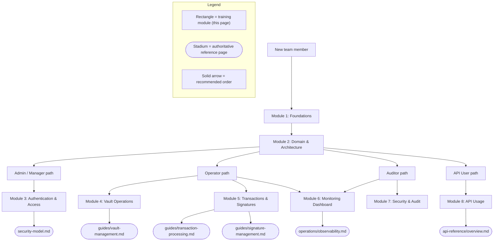

# Training Materials

This is the written **training and onboarding course** for the Blockchain
Integration Service and Dashboard. It fulfills the Software Project Proposal's
Training-Materials deliverable, whose two items are *Video tutorials for system
usage* and *Written guides for common operations*. `Source: documentation/Software Project Proposal.md` (DELIVERABLES, item 10) This page delivers the written guides for common operations and role-based
onboarding; the **video tutorials remain Designed** and are addressed in
[Video Tutorials](#video-tutorials) below.

The course is organized as role-based learning paths that reference the existing
end-user guides, the architecture set, the security model, and the operations
documentation rather than duplicating them, so a trainee always lands on the
authoritative page for each task.

## Maturity Legend and How to Use This Course

This course follows the project-wide maturity discipline defined in the
reconciliation page's [Maturity Legend](../architecture/scaffold-vs-design.md#maturity-legend).
Two categories of training are distinguished so no trainee is misled:

- **Conceptual and documentation training — usable today.** Understanding the
  domain (vaults, signatures, transactions), the architecture, the maturity
  discipline, the API surface, the security model, and how to navigate the
  documentation. These modules are exercisable now against the repository and its
  documentation.
- **Hands-on operational walkthroughs — Designed.** Any step that instructs a
  trainee to perform an action in the *running* application (log in, create a
  vault, submit a transaction, watch the dashboard update) describes the
  **intended** running system and is **Designed**. The application does not build
  or run from this repository as-is, so these walkthroughs become executable only
  after the defects catalogued in
  [`../architecture/scaffold-vs-design.md`](../architecture/scaffold-vs-design.md#defect-catalog)
  are resolved. Each hands-on module states this explicitly.

This honest split lets the course be delivered and used now for onboarding and
comprehension while accurately representing what cannot yet be executed.

## Learning Paths by Role

The five roles below are the Designed RBAC roles from the security model; each
maps to a value of `User.Role`. `Source: docs/security/security-model.md` **Figure TR1** shows the recommended learning path for each role through this
course and the authoritative pages it draws on.

**Figure TR1 — Role-Based Learning Paths (recommended onboarding order)**

As **Figure TR1** shows, every role starts with Foundations and Domain &
Architecture, then branches into the modules relevant to that role. The mapping
of roles to permissions is Designed and is the authoritative basis for which
modules each role needs. `Source: docs/security/security-model.md`

| Role | Recommended modules |
|------|---------------------|
| Admin | 1, 2, 3, 6, 7, and a working knowledge of all others |
| Manager | 1, 2, 3, 4, 5, 6 |
| Operator | 1, 2, 4, 5, 6 |
| Auditor | 1, 2, 6, 7 |
| API User | 1, 2, 3, 8 |

## Module 1: Foundations (usable today)

**Objective.** Understand what the platform is, its maturity discipline, and how
to read this documentation.

- The system is a **custodial blockchain integration platform** whose domain is
  vaults, signatures, and transactions, with a Go/Gin backend over 18 REST
  endpoints and a React 18 dashboard. `Source: backend/internal/api/routes.go:L9-L54`
- Learn the maturity vocabulary — Implemented, Implemented-with-defects
  (source-present, non-buildable), Provisioned, Designed — from the
  [Maturity Legend](../architecture/scaffold-vs-design.md#maturity-legend). Every
  claim in the docs carries a `Source:` citation and a maturity label.
- Navigate using the [documentation home](../index.md).

**Exercise (usable today).** Open the [scaffold-vs-design reconciliation](../architecture/scaffold-vs-design.md)
and locate three capabilities, one at each maturity level.

## Module 2: Domain and Architecture (usable today)

**Objective.** Understand the five entities and the current-versus-target
architecture.

- Study the five entities — `Organization`, `User`, `Vault`, `Transaction`,
  `Signature` — and the ERD in [`../architecture/data-model.md`](../architecture/data-model.md).
  `Source: backend/internal/db/schema.go:L11-L68`
- Study the before/after architecture pair (**Fig A1** current scaffold, **Fig
  A2** designed target) in [`../architecture/overview.md`](../architecture/overview.md).

**Exercise (usable today).** In [`../architecture/data-flow.md`](../architecture/data-flow.md),
trace the transaction-settlement sequence and identify which steps are Designed.

## Module 3: Authentication and Access (hands-on steps Designed)

**Objective.** Understand login, roles, MFA, and session management (UA-001).

- Read the [security model](../security/security-model.md) for the JWT, RBAC,
  MFA, and password-policy design. All of these controls are **Designed**: the
  `AuthService`, the authentication middleware, and the config package are
  absent, so no login, token issuance, or role check runs today.
  `Source: docs/security/security-model.md`
- Note the exact route protection: `POST /auth/login` and `POST /auth/register`
  are **public**; `POST /auth/logout` and every vault, transaction, and signature
  group are **Designed** to sit behind the absent authentication middleware.
  `Source: backend/internal/api/routes.go:L9-L54`

**Hands-on walkthrough (Designed).** Logging in through the dashboard and
receiving a session become executable only once the authentication path builds.
Until then, use the [authentication API reference](../api-reference/authentication.md)
to understand the intended request and response shapes.

## Module 4: Vault Operations (hands-on steps Designed)

**Objective.** Perform common vault operations (VM-001): create, list, view,
update, delete.

- Authoritative reference: [`../guides/vault-management.md`](../guides/vault-management.md).
- The five vault endpoints are `POST /vault/create`, `GET /vault/list`,
  `GET /vault/:id`, `PUT /vault/:id`, and `DELETE /vault/:id`. `Source: backend/internal/api/routes.go:L9-L54`
- Note the resource-path divergence: the backend registers a singular `/vault`
  group while the frontend calls the plural `/vaults` — see
  [`../api-reference/vaults.md`](../api-reference/vaults.md).

**Hands-on walkthrough (Designed).** Creating and managing a vault in the running
dashboard is Designed; the step-by-step usage and troubleshooting content lives
in the vault-management guide and applies once the scaffold builds.

## Module 5: Transactions and Signatures (hands-on steps Designed)

**Objective.** Create and track transactions (TP-001) and request signatures
(SG-001), including the asynchronous settlement model.

- Authoritative references: [`../guides/transaction-processing.md`](../guides/transaction-processing.md)
  and [`../guides/signature-management.md`](../guides/signature-management.md).
- The asynchronous settlement is driven by a background ticker processor;
  training must include the latent startup ticker panic as a known failure mode.
  `Source: backend/internal/tasks/transaction_processor.go:L13-L16`
- **Safety note.** Never copy real ledger accounts from examples into a live
  transaction command. The API examples use unmistakable placeholders and
  test-network fixtures for this reason — see
  [`../api-reference/transactions.md`](../api-reference/transactions.md).
- **Sensitive material.** Raw signatures are cryptographic material: minimize
  their retention, keep them encrypted, and never log them — see
  [`../guides/signature-management.md`](../guides/signature-management.md).

**Hands-on walkthrough (Designed).** Submitting a transaction and watching it
settle is Designed; the guides carry the intended step-by-step flow.

## Module 6: Monitoring Dashboard — Operator Depth (hands-on steps Designed)

**Objective.** Operate the Monitoring and Analytics dashboard (MA-001) with the
depth an operator needs day-to-day.

This module is the operator-focused core of the course. The dashboard's Designed
capabilities map to the MA-001 requirements — system-health monitoring,
transaction analytics, performance metrics, custom reports, alerts and
notifications, and data visualization. `Source: documentation/Software Requirements Specifications (SRS).md:L448-L456`

- Authoritative references: [`../operations/observability.md`](../operations/observability.md),
  the [dashboard template](../operations/dashboard-template.json), and the
  [runbook](../operations/runbook.md).
- **Reading the panels.** Learn which signals are reused emission-only today and
  which are Designed additions. In particular, the `/health` panel is bound to a
  scrape-reachability signal, not to a Designed health endpoint that does not yet
  exist; an operator must not read it as application liveness until the endpoint
  ships. `Source: docs/operations/dashboard-template.json`
- **Log hygiene.** An operator must never widen log queries to expose sensitive
  fields; the logging allowlist and redaction contract in
  [`../operations/observability.md`](../operations/observability.md) prohibits
  logging Authorization headers, cookies, JWTs, passwords, API keys, raw
  signatures, and request bodies.
- **Responding to alerts.** Use the [runbook](../operations/runbook.md) failure
  modes (build failure, ticker panic, settlement retries) as the operator's
  first-response reference.

**Hands-on walkthrough (Designed).** Live dashboards populate only once the
service emits metrics and the observability additions are built. Until then, the
dashboard template and observability guide teach the intended panels, queries,
and thresholds so an operator is ready on day one.

## Module 7: Security and Audit (usable today, controls Designed)

**Objective.** Understand the audit and compliance posture an Auditor reviews.

- Read the [security model](../security/security-model.md) for encryption, secret
  management, and access logging (UA-001-6). Access logs, audit trails, and
  compliance reporting are **Designed**. `Source: docs/security/security-model.md`
- Review the infrastructure security and data-loss gaps in the
  [deployment guide](../guides/deployment.md) so an auditor understands the
  current Terraform posture.

**Exercise (usable today).** From the security model, list which of the five
roles has read-only access for auditing and why RBAC is Designed rather than
enforced today.

## Module 8: API Usage (hands-on steps Designed)

**Objective.** Use the REST API programmatically as an API User.

- Authoritative references: [`../api-reference/overview.md`](../api-reference/overview.md)
  and the machine-readable [OpenAPI specification](../api-reference/openapi.yaml).
- Route and method parity is source-derived from the router; request and response
  bodies are Designed/inferred. Treat the schemas as the intended contract.
  `Source: backend/internal/api/routes.go:L9-L54`
- **CLI safety.** When testing endpoints, never place a real credential in a
  command argument where it lands in shell history; prompt for it or pipe it
  through stdin — see [`../api-reference/authentication.md`](../api-reference/authentication.md).

**Hands-on walkthrough (Designed).** Live API calls succeed only once the backend
builds and authenticates; the OpenAPI contract is the executable target.

## Video Tutorials

The proposal's Training-Materials deliverable also lists *video tutorials for
system usage*. `Source: documentation/Software Project Proposal.md` (DELIVERABLES, item 10) Video artifacts cannot be produced within this documentation-only
deliverable and are therefore **Designed**. When they are produced, each should
mirror one module above — Foundations, Domain and Architecture, Authentication,
Vault Operations, Transactions and Signatures, the Monitoring Dashboard,
Security and Audit, and API Usage — and each should carry the same
usable-today-versus-Designed caveat so viewers are not misled about what executes.

## Training Readiness Summary

| Module | Focus | Usable today? |
|--------|-------|---------------|
| 1 — Foundations | Domain, maturity discipline, navigation | Yes |
| 2 — Domain & Architecture | Entities, ERD, before/after architecture | Yes |
| 3 — Authentication & Access | Login, RBAC, MFA (UA-001) | Concepts yes; hands-on Designed |
| 4 — Vault Operations | VM-001 CRUD | Concepts yes; hands-on Designed |
| 5 — Transactions & Signatures | TP-001, SG-001, async settlement | Concepts yes; hands-on Designed |
| 6 — Monitoring Dashboard | MA-001 operator depth | Concepts yes; live data Designed |
| 7 — Security & Audit | Encryption, secrets, audit posture | Yes; controls Designed |
| 8 — API Usage | Programmatic REST access | Concepts yes; live calls Designed |
| Video tutorials | Recorded walkthroughs | Designed (not produced in docs-only) |

## Related Documentation

- [System Administration Guide](../operations/system-administration.md) — the
  operator/admin companion to this course.
- [Documentation home](../index.md) — full navigation and audience map.
- [Scaffold vs. Design reconciliation](../architecture/scaffold-vs-design.md) —
  the authoritative maturity matrix and defect catalog this course defers to.
