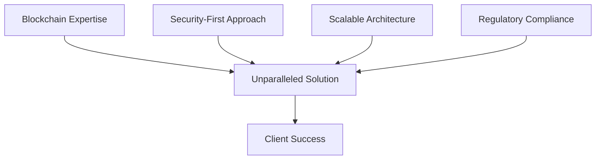
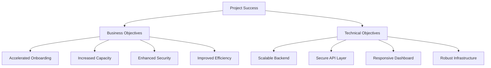
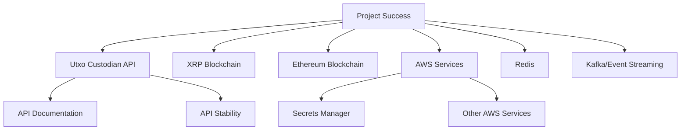
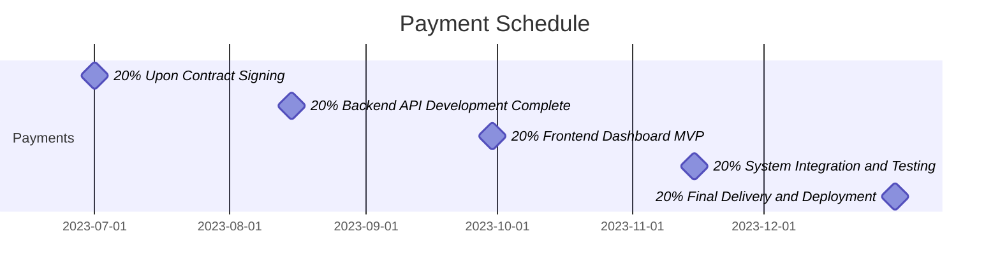
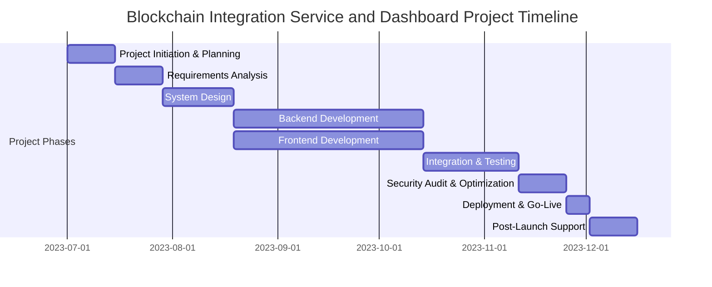
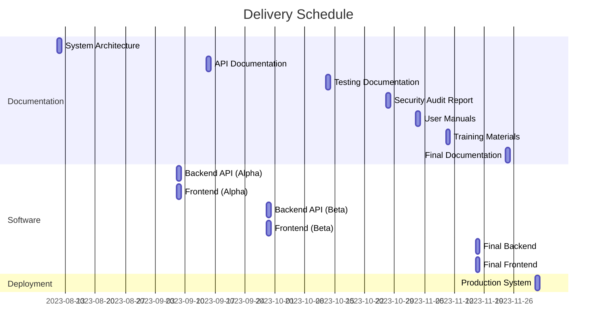

# EXECUTIVE SUMMARY

## PROJECT OVERVIEW

The Blockchain Integration Service and Dashboard project aims to develop a robust, secure, and scalable system for a cryptocurrency startup. This solution addresses the client's need for efficient management of blockchain transactions across multiple networks, specifically XRP and Ethereum, while integrating with Utxo custodian. The proposed system consists of two main components:

1. A high-performance backend service written in Golang, providing critical API endpoints for vault management, signature generation, and transaction processing.
2. A modern, responsive frontend dashboard for real-time monitoring, signature requests, and analytics.

This comprehensive solution will enable the client to streamline their blockchain operations, enhance security measures, and rapidly onboard new clients.

## OBJECTIVES

1. Develop a secure and scalable backend service that integrates with Utxo custodian and supports XRP and Ethereum blockchains.
2. Create a user-friendly frontend dashboard for efficient vault and signature management.
3. Implement robust security measures, including encryption, authentication, and secure credential storage.
4. Ensure high performance, low latency, and the ability to handle numerous concurrent requests.
5. Provide comprehensive API documentation and Swagger docs for ease of integration and maintenance.
6. Design the system for horizontal scalability and fault tolerance.
7. Ensure compliance with relevant financial and blockchain regulations.

## VALUE PROPOSITION

Our agency offers unique advantages for this project:

1. **Blockchain Expertise**: Our team's deep understanding of blockchain technologies, particularly XRP and Ethereum, ensures a tailored solution that meets the client's specific needs.

2. **Security-First Approach**: We prioritize security at every level, from secure coding practices to implementing state-of-the-art encryption and authentication mechanisms.

3. **Scalable Architecture**: Our design focuses on high performance and scalability, allowing the system to grow seamlessly with the client's business.

4. **Regulatory Compliance**: Our experience in financial technology ensures that the solution will adhere to all relevant regulations and implement necessary audit trails.

5. **Future-Proof Design**: The system's modular architecture allows for easy integration of additional custodians and blockchain networks, ensuring long-term value for the client.

By choosing our agency, the client gains a partner committed to delivering a cutting-edge, secure, and scalable blockchain integration solution that will drive their business forward in the competitive cryptocurrency space.

# PROJECT OBJECTIVES

## BUSINESS GOALS

1. Accelerate client onboarding process by 50% through streamlined vault management and signature generation.
2. Increase transaction processing capacity by 200% to support rapid business growth.
3. Enhance security measures to minimize the risk of unauthorized access and potential financial losses.
4. Improve operational efficiency by reducing manual intervention in blockchain transactions by 80%.
5. Expand market reach by supporting multiple blockchain networks, starting with XRP and Ethereum.
6. Achieve 99.99% uptime for critical blockchain operations to ensure uninterrupted service for clients.

## TECHNICAL GOALS

1. Develop a high-performance, scalable backend service in Golang that integrates seamlessly with Utxo custodian.
2. Implement asynchronous processing for signature requests with Redis-based caching for optimal performance.
3. Create a secure API layer with endpoints for vault management, signature generation, and transaction processing.
4. Design and implement a modern, responsive frontend dashboard for real-time monitoring and management.
5. Establish robust security measures, including encryption, authentication, and secure credential storage using AWS Secrets Manager.
6. Achieve horizontal scalability and fault tolerance to handle high concurrent loads and ensure system resilience.
7. Implement comprehensive logging and monitoring systems for proactive issue detection and resolution.
8. Develop and maintain detailed API documentation, including Swagger docs, for ease of integration and maintenance.

## SUCCESS CRITERIA

| Criterion | Target | Measurement Method |
|-----------|--------|---------------------|
| API Response Time | < 100ms for 95% of requests | Automated performance testing and monitoring |
| System Uptime | 99.99% | Continuous monitoring and incident tracking |
| Concurrent Request Handling | 10,000 requests per second | Load testing and performance benchmarks |
| Client Onboarding Time | 50% reduction from current baseline | Time tracking from account creation to first transaction |
| Transaction Processing Time | < 5 seconds for 99% of transactions | Transaction log analysis |
| Security Incidents | Zero unauthorized access attempts | Security audit logs and incident reports |
| User Satisfaction | > 90% positive feedback | User surveys and feedback analysis |
| API Documentation Completeness | 100% coverage of all endpoints | Documentation review and developer feedback |
| Regulatory Compliance | 100% adherence to relevant regulations | Regular compliance audits and assessments |

The success of the Blockchain Integration Service and Dashboard project will be determined by meeting or exceeding these business and technical goals, as measured by the defined success criteria. Regular assessments and stakeholder reviews will be conducted to ensure the project remains aligned with these objectives throughout its lifecycle.

# SCOPE OF WORK

## IN-SCOPE

1. Backend Service Development
   - Golang-based backend service implementation
   - Integration with Utxo custodian
   - Support for XRP and Ethereum blockchains
   - API endpoints development:
     - Get All Vaults
     - Get Raw Signature
     - Check Signature Status
     - Publish Signature
   - Asynchronous processing for signature requests
   - Redis integration for caching and status updates
   - AWS Secrets Manager integration for credential storage
   - Comprehensive error handling and logging
   - Kafka or similar event streaming service integration

2. Frontend Dashboard Development
   - Modern, responsive web application
   - Vault listing and management interface
   - Signature request functionality
   - Real-time signature status updates
   - Basic analytics and monitoring features

3. Security Implementation
   - Encryption of all communications
   - Authentication mechanisms
   - Minimization of external library usage
   - Secure coding practices

4. Documentation
   - Comprehensive API documentation
   - Swagger docs for all endpoints

5. Performance Optimization
   - High-performance, low-latency system design
   - Horizontal scalability implementation
   - Fault-tolerance mechanisms

6. Compliance
   - Implementation of necessary audit trails
   - Adherence to relevant financial and blockchain regulations

7. Testing
   - Unit testing for all components
   - Integration testing
   - Performance testing
   - Security testing

8. Deployment
   - Initial system setup and configuration
   - Deployment to production environment

## OUT-OF-SCOPE

1. Support for additional custodians beyond Utxo
2. Integration with blockchain networks other than XRP and Ethereum
3. Advanced analytics features beyond basic monitoring
4. Integration with external microservices not specified in the initial requirements
5. Automated backup and recovery system for user wallets
6. Mobile application development
7. Ongoing system maintenance and support (to be covered under a separate agreement)
8. User training and onboarding (can be provided as an additional service)
9. Custom reporting tools or dashboards beyond the specified requirements
10. Integration with existing client systems not specified in the initial requirements

## ASSUMPTIONS

1. Client will provide timely access to necessary Utxo custodian APIs and documentation
2. XRP and Ethereum blockchain networks will remain stable and accessible throughout the project
3. Client will provide required AWS credentials and access for Secrets Manager integration
4. Necessary hardware infrastructure will be available for deployment
5. Client will assign a dedicated point of contact for project coordination and decision-making
6. Third-party services (Redis, Kafka) will be available and accessible as needed
7. Client will provide any required regulatory compliance guidelines specific to their operations
8. Development team will have access to necessary development tools and environments

## DEPENDENCIES

1. Utxo Custodian API
   - Availability and stability of the API
   - Timely updates to API documentation
   - Support for required functionalities

2. Blockchain Networks
   - Stability and accessibility of XRP and Ethereum networks
   - Consistency in transaction processing times

3. AWS Services
   - Availability of AWS Secrets Manager
   - Reliability of other required AWS services (e.g., EC2, VPC)

4. Third-Party Services
   - Redis availability and performance
   - Kafka or chosen event streaming service reliability

5. Development Tools
   - Availability of required Golang libraries and tools
   - Compatibility of frontend development frameworks

6. Regulatory Compliance
   - Timely provision of specific regulatory requirements by the client
   - Stability of regulatory environment during development

7. Client Resources
   - Availability of client personnel for reviews and approvals
   - Timely provision of any client-specific data or configurations

8. Infrastructure
   - Availability of required hardware for deployment
   - Network infrastructure to support high-performance requirements

# BUDGET AND COST ESTIMATES

## COST BREAKDOWN

The following table provides a detailed breakdown of the project costs:

| Category | Item | Quantity | Unit Cost | Total Cost |
|----------|------|----------|-----------|------------|
| Labor | Senior Backend Developer | 800 hours | $150/hour | $120,000 |
| Labor | Senior Frontend Developer | 600 hours | $140/hour | $84,000 |
| Labor | DevOps Engineer | 400 hours | $130/hour | $52,000 |
| Labor | Security Specialist | 200 hours | $160/hour | $32,000 |
| Labor | Project Manager | 400 hours | $120/hour | $48,000 |
| Software | AWS Services (est. 6 months) | 1 | $15,000 | $15,000 |
| Software | Redis Enterprise Cloud (est. 6 months) | 1 | $6,000 | $6,000 |
| Software | Kafka or similar event streaming service (est. 6 months) | 1 | $9,000 | $9,000 |
| Software | Development Tools and Licenses | 1 | $5,000 | $5,000 |
| Hardware | Development and Testing Servers | 4 | $2,500 | $10,000 |
| Miscellaneous | Contingency Fund (10% of total) | 1 | $38,100 | $38,100 |
| **Total** | | | | **$419,100** |

## PAYMENT SCHEDULE

The proposed payment schedule is tied to project milestones and deliverables:

1. 20% ($83,820) upon contract signing and project initiation
2. 20% ($83,820) upon completion of backend API development and documentation
3. 20% ($83,820) upon delivery of frontend dashboard MVP (Minimum Viable Product)
4. 20% ($83,820) upon completion of system integration and successful testing
5. 20% ($83,820) upon final delivery, deployment, and client acceptance

## BUDGET CONSIDERATIONS

Several factors could potentially impact the budget. We will manage these risks through careful planning, regular communication, and proactive mitigation strategies:

1. **Scope Creep**: Any additions to the project scope could increase costs. We will manage this through strict change control processes and clear communication with the client.

2. **Integration Challenges**: Unforeseen difficulties in integrating with Utxo custodian or blockchain networks could require additional development time. We have allocated some buffer in our estimates, but significant issues could impact the budget.

3. **Security Requirements**: As the project progresses, additional security measures may be identified as necessary, potentially increasing costs. Our security specialist will conduct regular assessments to identify and address such needs early.

4. **Regulatory Compliance**: Changes in regulatory requirements could necessitate additional development or documentation work. We will stay informed of relevant regulations and adapt as necessary.

5. **Performance Optimization**: Achieving the required high performance and low latency might require additional optimization work. We have factored this into our estimates, but extreme cases could impact the budget.

6. **Third-Party Service Costs**: The costs of AWS, Redis, and Kafka services are estimates based on expected usage. Actual costs may vary depending on the system's performance and scaling needs.

7. **Extended Testing**: If extensive issues are uncovered during testing phases, additional development and testing time may be required, potentially impacting the budget.

To manage these considerations:

- We will maintain a contingency fund (included in the cost breakdown) to address unforeseen issues.
- Regular project status meetings will be held to identify and address potential budget impacts early.
- Detailed tracking of hours and expenses will be maintained and shared with the client to ensure transparency.
- Any potential budget overruns will be communicated to the client immediately, along with proposed solutions or adjustments.

By carefully managing these considerations and maintaining open communication with the client, we aim to deliver the project within the proposed budget while meeting all specified requirements and quality standards.

# TIMELINE AND MILESTONES

## PROJECT TIMELINE

The project is estimated to take approximately 6 months from initiation to completion. Here's a high-level timeline outlining the major phases:

## KEY MILESTONES

| Milestone | Description | Estimated Date |
|-----------|-------------|----------------|
| M1: Project Kickoff | Project initiation, team assembly, and initial planning complete | 2023-07-07 |
| M2: Requirements Finalized | Detailed requirements document approved by stakeholders | 2023-07-21 |
| M3: System Design Approved | Architecture and detailed design documents finalized and approved | 2023-08-11 |
| M4: Backend API Development Complete | All backend API endpoints implemented and unit tested | 2023-09-22 |
| M5: Frontend Dashboard MVP | Minimum Viable Product of the frontend dashboard ready for integration | 2023-09-22 |
| M6: Integration Complete | Backend and frontend fully integrated and ready for system testing | 2023-10-20 |
| M7: Security Audit Passed | All security measures implemented and verified by security audit | 2023-11-03 |
| M8: Performance Optimization Complete | System meets or exceeds all performance requirements | 2023-11-10 |
| M9: User Acceptance Testing (UAT) Passed | System approved by client after successful UAT | 2023-11-24 |
| M10: Go-Live | System deployed to production environment and operational | 2023-12-01 |
| M11: Project Closure | Post-launch support completed, final documentation delivered | 2023-12-15 |

## CRITICAL PATH

The following tasks and activities are critical to keeping the project on schedule:

1. Requirements Analysis: Delays in finalizing requirements could impact all subsequent phases.

2. System Design: A robust and approved design is crucial for smooth development.

3. Backend API Development: The frontend and integration phases depend on the completion of backend APIs.

4. Integration: Any delays in integration could impact testing and subsequent phases.

5. Security Audit: Failing the security audit could require significant rework and delay deployment.

6. Performance Optimization: Ensuring the system meets performance requirements is crucial for client acceptance.

7. User Acceptance Testing: Client approval is necessary before proceeding to deployment.

To manage the critical path:

- Regular status updates and progress tracking will be conducted.
- Any potential delays in critical path activities will be immediately escalated and addressed.
- Resources will be allocated prioritizing critical path tasks.
- Parallel development of backend and frontend will be utilized where possible to optimize the timeline.
- Early and continuous integration testing will be performed to identify and resolve issues promptly.
- Proactive communication with the client will be maintained to ensure quick turnaround on approvals and feedback.

By closely monitoring and managing these critical path elements, we aim to keep the project on schedule and deliver a high-quality Blockchain Integration Service and Dashboard within the proposed timeline.

# DELIVERABLES

## LIST OF DELIVERABLES

1. Backend Service
   - Golang-based API service
   - Integration with Utxo custodian
   - Support for XRP and Ethereum blockchains
   - Asynchronous processing system
   - Redis integration for caching and status updates
   - AWS Secrets Manager integration
   - Kafka or similar event streaming service integration

2. Frontend Dashboard
   - Responsive web application
   - Vault management interface
   - Signature request functionality
   - Real-time status updates
   - Basic analytics and monitoring features

3. API Documentation
   - Comprehensive API documentation
   - Swagger docs for all endpoints

4. Source Code
   - Backend service source code
   - Frontend dashboard source code
   - Build and deployment scripts

5. Testing Documentation
   - Unit test results
   - Integration test results
   - Performance test results
   - Security audit report

6. User Manuals
   - System administration guide
   - User guide for the frontend dashboard

7. Technical Documentation
   - System architecture document
   - Database schema documentation
   - Deployment guide

8. Security Documentation
   - Security implementation details
   - Encryption protocols used
   - Authentication mechanisms

9. Compliance Documentation
   - Audit trail implementation details
   - Regulatory compliance report

10. Training Materials
    - Video tutorials for system usage
    - Written guides for common operations

## DELIVERY SCHEDULE

| Deliverable | Estimated Delivery Date |
|-------------|-------------------------|
| System Architecture Document | 2023-08-11 |
| Backend API (Alpha Version) | 2023-09-08 |
| Frontend Dashboard (Alpha Version) | 2023-09-08 |
| API Documentation (Draft) | 2023-09-15 |
| Backend API (Beta Version) | 2023-09-29 |
| Frontend Dashboard (Beta Version) | 2023-09-29 |
| Testing Documentation | 2023-10-13 |
| Security Audit Report | 2023-10-27 |
| User Manuals | 2023-11-03 |
| Training Materials | 2023-11-10 |
| Final Backend Service | 2023-11-17 |
| Final Frontend Dashboard | 2023-11-17 |
| Final Documentation Package | 2023-11-24 |
| Deployed Production System | 2023-12-01 |

## ACCEPTANCE CRITERIA

1. Backend Service
   - Successfully integrates with Utxo custodian
   - Supports XRP and Ethereum blockchains
   - All API endpoints function as specified
   - Asynchronous processing works correctly
   - Meets performance requirements (handles 10,000 requests per second)
   - Implements all specified security measures

2. Frontend Dashboard
   - Displays list of all vaults correctly
   - Allows users to request signatures for specific vaults
   - Shows signature request status in real-time
   - Provides basic analytics and monitoring features
   - Is responsive and works on major browsers and devices

3. API Documentation
   - Covers all endpoints comprehensively
   - Includes accurate request/response examples
   - Swagger docs are complete and functional

4. Source Code
   - Passes code review for quality and best practices
   - Includes necessary comments and documentation
   - Build and deployment scripts work as expected

5. Testing Documentation
   - Shows 95% or higher unit test coverage
   - Integration tests cover all major system flows
   - Performance tests demonstrate meeting of requirements
   - Security audit report shows no critical vulnerabilities

6. User Manuals
   - Cover all system features and functions
   - Are clear and understandable to target users

7. Technical Documentation
   - Accurately reflects the implemented system architecture
   - Provides complete and correct database schema
   - Deployment guide successfully results in working system when followed

8. Security Documentation
   - Details all implemented security measures
   - Encryption and authentication mechanisms are clearly explained

9. Compliance Documentation
   - Demonstrates implementation of required audit trails
   - Shows compliance with all specified regulations

10. Training Materials
    - Cover all key system operations
    - Are clear and effective for target users

Final acceptance will be based on successful User Acceptance Testing (UAT) by the client, demonstrating that the system meets all specified requirements and functions correctly in a production-like environment.