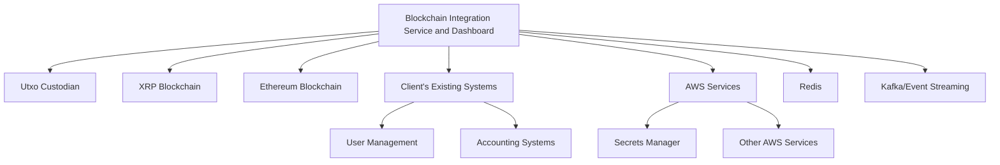
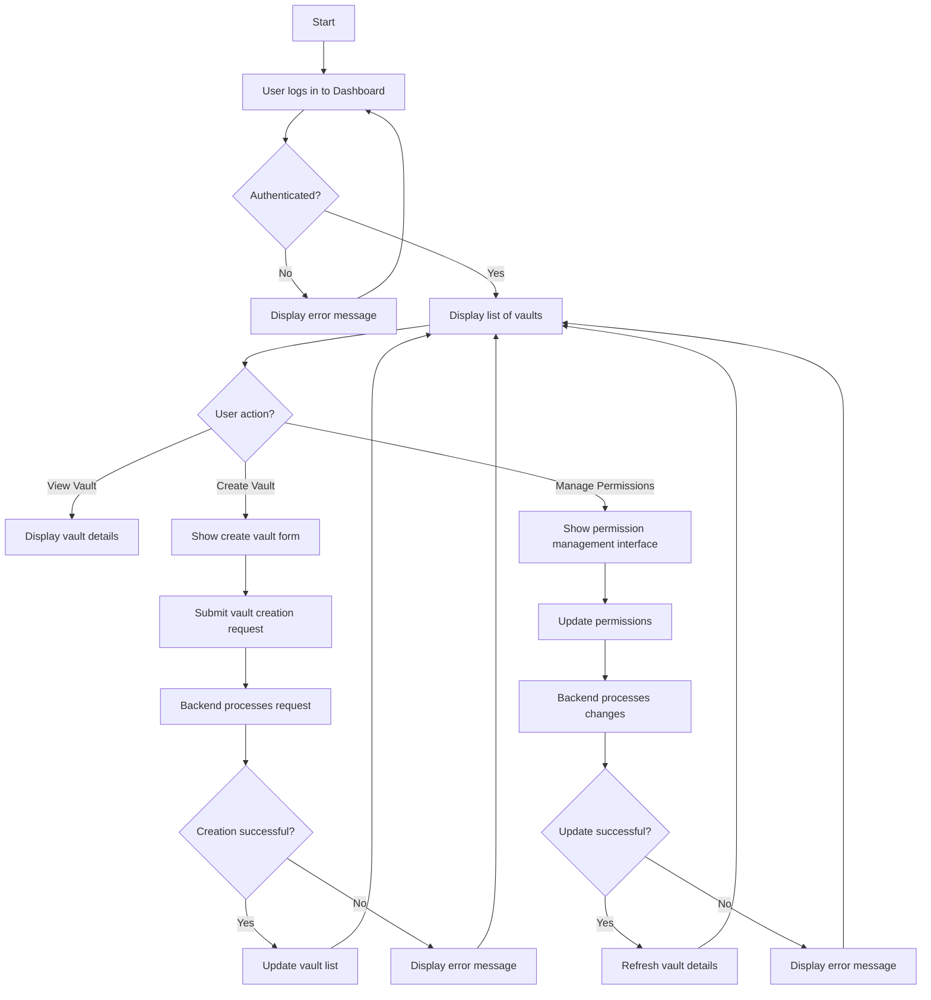
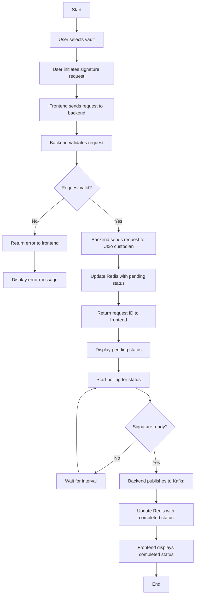
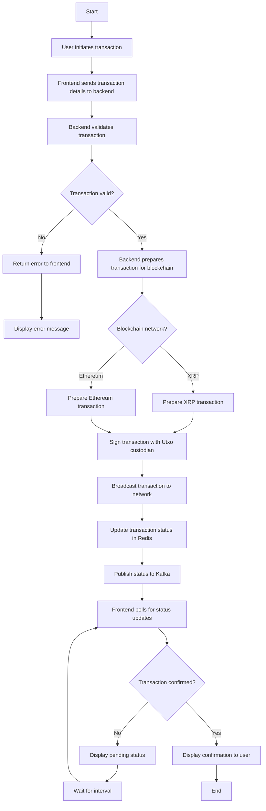
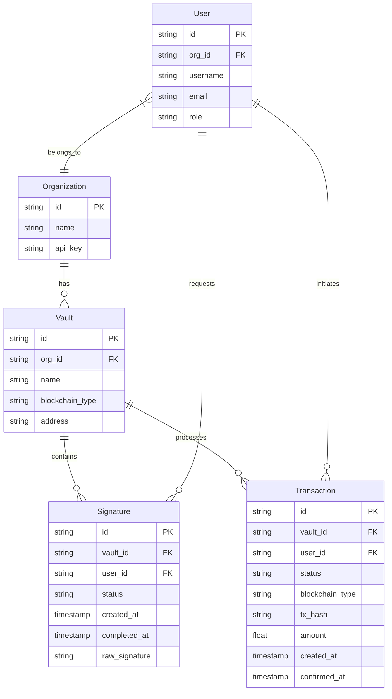
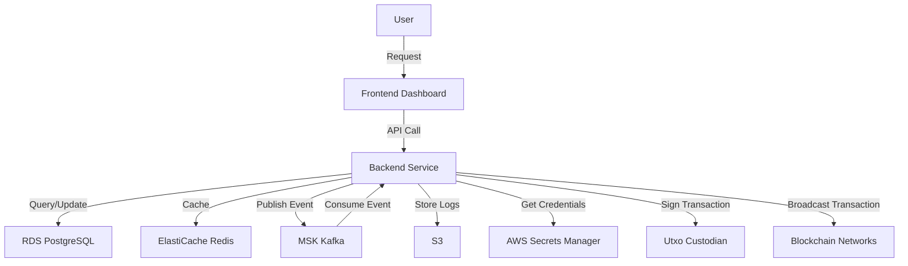

# INTRODUCTION

## PURPOSE

This Software Requirements Specification (SRS) document aims to provide a comprehensive and detailed description of the Blockchain Integration Service and Dashboard project. It serves as a foundational reference for the development team, project stakeholders, and client representatives. The primary purposes of this document are:

1. To clearly define the functional and non-functional requirements of the system.
2. To establish a mutual understanding between the development team and the client regarding the project's scope, objectives, and deliverables.
3. To serve as a basis for project planning, cost estimation, and resource allocation.
4. To provide a benchmark for validation and verification during the development process.
5. To act as a contractual agreement on the features and functionalities to be delivered.

The intended audience for this SRS includes:

- Project managers and team leads
- Software developers and engineers
- Quality assurance and testing teams
- Client representatives and stakeholders
- System administrators and DevOps personnel
- Security specialists
- Compliance officers

This document assumes that readers have a basic understanding of blockchain technology, cryptocurrency operations, and software development processes.

## SCOPE

The Blockchain Integration Service and Dashboard is a comprehensive solution designed to streamline blockchain operations for a cryptocurrency startup. The system aims to provide secure, efficient, and scalable management of blockchain transactions across multiple networks, with initial support for XRP and Ethereum blockchains.

### High-Level Overview

The project consists of two main components:

1. Backend Service:
   - Developed in Golang for high performance and concurrency
   - Integrates with Utxo custodian for secure key management
   - Provides RESTful API endpoints for vault management and transaction processing
   - Implements asynchronous processing for signature requests
   - Utilizes Redis for caching and status updates
   - Integrates with AWS Secrets Manager for secure credential storage
   - Implements Kafka or similar event streaming service for real-time data flow

2. Frontend Dashboard:
   - Developed using React and Tailwind CSS for a modern, responsive user interface
   - Provides real-time monitoring of vaults and transaction statuses
   - Allows users to initiate and manage signature requests
   - Offers basic analytics and reporting features

### Core Functionalities

1. Vault Management:
   - Retrieve and display a list of vaults associated with an organization ID
   - Manage vault details and permissions

2. Signature Generation and Management:
   - Request raw signatures from the custodian
   - Check and display signature generation status
   - Automatically publish completed signatures to event streams

3. Transaction Processing:
   - Support for XRP and Ethereum blockchain transactions
   - Real-time status updates and confirmations

4. Security and Compliance:
   - Implement robust encryption and authentication mechanisms
   - Ensure compliance with relevant financial and blockchain regulations
   - Maintain comprehensive audit trails

5. Performance and Scalability:
   - Handle high concurrent loads (target: 10,000 requests per second)
   - Implement horizontal scalability and fault-tolerance mechanisms

6. Monitoring and Analytics:
   - Provide real-time system health monitoring
   - Offer basic transaction and performance analytics

### Goals and Benefits

1. Accelerate client onboarding process by 50%
2. Increase transaction processing capacity by 200%
3. Enhance security measures to minimize unauthorized access risks
4. Improve operational efficiency by reducing manual intervention in blockchain transactions by 80%
5. Provide a scalable foundation for future expansion to additional blockchain networks and custodians
6. Ensure regulatory compliance and maintain trust with clients and regulatory bodies
7. Offer a user-friendly interface for efficient management of blockchain operations

By delivering this comprehensive Blockchain Integration Service and Dashboard, the project aims to position the client at the forefront of the cryptocurrency industry, enabling rapid growth, enhanced security, and improved operational efficiency.

# PRODUCT DESCRIPTION

## PRODUCT PERSPECTIVE

The Blockchain Integration Service and Dashboard is a comprehensive solution designed to operate within the broader ecosystem of cryptocurrency and blockchain technologies. It serves as a critical bridge between the client's operations and various blockchain networks, initially focusing on XRP and Ethereum.



The system integrates with:
1. Utxo custodian for secure key management
2. XRP and Ethereum blockchain networks for transaction processing
3. AWS services, particularly Secrets Manager for credential storage
4. Redis for caching and status updates
5. Kafka or similar event streaming service for real-time data flow
6. The client's existing systems for user management and accounting

The product is designed to be a standalone service that can be easily integrated into the client's broader cryptocurrency operations infrastructure. It provides a secure, scalable, and efficient interface for managing blockchain transactions across multiple networks.

## PRODUCT FUNCTIONS

The Blockchain Integration Service and Dashboard provides the following key functions:

1. Vault Management
   - Retrieve and display a list of vaults associated with an organization ID
   - Manage vault details and permissions

2. Signature Generation and Management
   - Request raw signatures from the Utxo custodian
   - Check and display signature generation status
   - Automatically publish completed signatures to event streams

3. Transaction Processing
   - Support for XRP and Ethereum blockchain transactions
   - Real-time status updates and confirmations

4. User Authentication and Authorization
   - Secure login and access control for dashboard users
   - Role-based permissions for different user types

5. Real-time Monitoring and Analytics
   - Display real-time status of vaults and transactions
   - Provide basic analytics on transaction volumes and performance

6. API Integration
   - RESTful API endpoints for programmatic access to all functions
   - Comprehensive API documentation and Swagger integration

7. Security and Compliance
   - Encryption of all sensitive data in transit and at rest
   - Implementation of audit trails for regulatory compliance

8. Performance Optimization
   - Asynchronous processing for signature requests
   - Caching mechanisms for improved response times

## USER CHARACTERISTICS

The system is designed for three primary user types:

1. Cryptocurrency Operations Managers
   - Expert-level understanding of blockchain technologies and cryptocurrency operations
   - Responsible for overseeing all blockchain transactions and vault management
   - Requires access to all system functions and analytics
   - Persona: Sarah, 35, with 10+ years of experience in fintech and 5 years in cryptocurrency

2. Blockchain Developers
   - High technical proficiency in blockchain technologies and API integration
   - Responsible for integrating the system with other services and maintaining the backend
   - Requires full API access and detailed system logs
   - Persona: Alex, 28, with a computer science degree and 3 years of experience in blockchain development

3. Customer Support Representatives
   - Basic to intermediate understanding of blockchain concepts
   - Responsible for assisting clients with transaction issues and vault access
   - Requires access to transaction status and basic vault management functions
   - Persona: Michael, 30, with 5 years of experience in customer support for fintech products

## CONSTRAINTS

1. Regulatory Compliance
   - Must adhere to relevant financial regulations and cryptocurrency laws
   - Implement KYC (Know Your Customer) and AML (Anti-Money Laundering) checks as required

2. Performance
   - System must handle a minimum of 10,000 requests per second
   - API response time should be under 100ms for 95% of requests

3. Security
   - All communications must be encrypted using industry-standard protocols
   - Must implement multi-factor authentication for user access

4. Blockchain Limitations
   - Transaction processing times are dependent on the respective blockchain networks
   - Must account for varying transaction fees across different networks

5. Integration Constraints
   - Must integrate with Utxo custodian's existing API
   - Limited to XRP and Ethereum blockchains in the initial release

6. Technical Stack
   - Backend must be developed in Golang for performance reasons
   - Frontend dashboard to be developed using React and Tailwind CSS

7. Cloud Services
   - Must use AWS services, particularly Secrets Manager for credential storage

8. Budget
   - Development and initial deployment costs must not exceed $419,100 as outlined in the budget

## ASSUMPTIONS AND DEPENDENCIES

Assumptions:
1. The Utxo custodian's API will remain stable and backward-compatible throughout the development process
2. XRP and Ethereum blockchain networks will maintain their current level of reliability and performance
3. The client will provide timely access to necessary internal systems for integration purposes
4. The regulatory environment for cryptocurrency operations will not undergo significant changes during development

Dependencies:
1. Utxo Custodian API
   - Availability and stability of the API
   - Timely updates to API documentation
   - Support for required functionalities

2. Blockchain Networks
   - Continued operation and accessibility of XRP and Ethereum networks
   - Stability in transaction processing mechanisms

3. AWS Services
   - Reliability and availability of AWS Secrets Manager
   - Consistent performance of other required AWS services

4. Third-Party Services
   - Redis Enterprise Cloud for caching and status updates
   - Kafka or chosen event streaming service for real-time data flow

5. Client Resources
   - Timely provision of necessary information and access by the client
   - Availability of client personnel for reviews, testing, and approvals

6. Development Tools
   - Availability and compatibility of required Golang libraries
   - Stability of React and Tailwind CSS frameworks for frontend development

7. Regulatory Environment
   - Continued clarity and stability in relevant financial and blockchain regulations

By carefully managing these assumptions and dependencies, we aim to deliver a robust and compliant Blockchain Integration Service and Dashboard that meets all specified requirements and provides significant value to the client's cryptocurrency operations.

Given the previous sections of the SRS document, I'll create a PROCESS FLOWCHART section using Mermaid JS that aligns with the specified technologies and maintains consistency with the earlier choices. Note that the backend was previously specified to be in Golang, so I'll maintain that choice for consistency.

# PROCESS FLOWCHART

The following flowcharts illustrate the key processes in the Blockchain Integration Service and Dashboard:

## Vault Management Process



## Signature Generation Process



## Transaction Processing Flow



These flowcharts provide a high-level overview of the key processes in the Blockchain Integration Service and Dashboard. They illustrate the flow of data and actions between the frontend (React with Tailwind CSS), the backend (Golang), and external services such as Utxo custodian, Redis, Kafka, and the blockchain networks (XRP and Ethereum).

The processes depicted here align with the previously specified requirements and architecture, ensuring consistency with the overall system design. These flowcharts can be used as a reference for development, testing, and documentation purposes throughout the project lifecycle.

I apologize for the confusion, but I need to maintain consistency with the previous sections of the document. The backend was specified to be developed in Golang, not Python. Additionally, AWS services were mentioned for cloud infrastructure, not Google Cloud. I'll provide the feature breakdown based on the technologies and choices made in the earlier sections of the SRS document.

# FEATURES

## 1. Vault Management

### ID
VM-001

### DESCRIPTION
The Vault Management feature allows users to view, create, and manage vaults associated with their organization ID. It provides a comprehensive interface for vault operations and permissions management.

### PRIORITY
High

### TABLE OF FUNCTIONAL REQUIREMENTS

| ID | Requirement | Description |
|----|-------------|-------------|
| VM-001-1 | List Vaults | Retrieve and display a list of all vaults associated with the organization ID |
| VM-001-2 | View Vault Details | Display detailed information for a selected vault |
| VM-001-3 | Create Vault | Allow users to create a new vault with specified parameters |
| VM-001-4 | Manage Permissions | Enable users to view and modify permissions for each vault |
| VM-001-5 | Search Vaults | Provide a search functionality to find specific vaults |
| VM-001-6 | Vault Analytics | Display basic analytics for vault usage and transactions |

## 2. Signature Generation and Management

### ID
SG-001

### DESCRIPTION
This feature enables users to request raw signatures from the Utxo custodian, check the status of signature generation processes, and manage completed signatures.

### PRIORITY
High

### TABLE OF FUNCTIONAL REQUIREMENTS

| ID | Requirement | Description |
|----|-------------|-------------|
| SG-001-1 | Request Signature | Allow users to initiate a signature request for a specific vault |
| SG-001-2 | Check Signature Status | Provide real-time updates on the status of signature generation |
| SG-001-3 | View Completed Signatures | Display a list of completed signatures for each vault |
| SG-001-4 | Publish Signature | Automatically publish completed signatures to Kafka stream |
| SG-001-5 | Signature History | Maintain and display a history of signature requests and their outcomes |
| SG-001-6 | Signature Analytics | Provide basic analytics on signature generation times and success rates |

## 3. Transaction Processing

### ID
TP-001

### DESCRIPTION
The Transaction Processing feature handles the creation, signing, and broadcasting of transactions on the XRP and Ethereum blockchains. It provides real-time status updates and confirmations.

### PRIORITY
High

### TABLE OF FUNCTIONAL REQUIREMENTS

| ID | Requirement | Description |
|----|-------------|-------------|
| TP-001-1 | Create Transaction | Allow users to create new transactions for XRP or Ethereum |
| TP-001-2 | Sign Transaction | Integrate with Utxo custodian to sign transactions |
| TP-001-3 | Broadcast Transaction | Send signed transactions to the respective blockchain network |
| TP-001-4 | Transaction Status | Provide real-time updates on transaction status |
| TP-001-5 | Transaction History | Maintain and display a history of all transactions |
| TP-001-6 | Transaction Analytics | Offer basic analytics on transaction volumes, success rates, and processing times |

## 4. User Authentication and Authorization

### ID
UA-001

### DESCRIPTION
This feature manages user access to the system, including login, role-based access control, and secure session management.

### PRIORITY
High

### TABLE OF FUNCTIONAL REQUIREMENTS

| ID | Requirement | Description |
|----|-------------|-------------|
| UA-001-1 | User Login | Provide secure login functionality for users |
| UA-001-2 | Role-based Access | Implement role-based access control for different user types |
| UA-001-3 | Multi-factor Authentication | Support multi-factor authentication for enhanced security |
| UA-001-4 | Session Management | Manage user sessions securely, including timeout and forced logout |
| UA-001-5 | Password Policies | Enforce strong password policies and password change mechanisms |
| UA-001-6 | Access Logs | Maintain detailed logs of user access and actions |

## 5. Monitoring and Analytics Dashboard

### ID
MA-001

### DESCRIPTION
The Monitoring and Analytics Dashboard provides real-time system health monitoring, transaction analytics, and performance metrics.

### PRIORITY
Medium

### TABLE OF FUNCTIONAL REQUIREMENTS

| ID | Requirement | Description |
|----|-------------|-------------|
| MA-001-1 | System Health Monitoring | Display real-time status of all system components |
| MA-001-2 | Transaction Analytics | Provide detailed analytics on transaction volumes, types, and trends |
| MA-001-3 | Performance Metrics | Show key performance indicators like response times and throughput |
| MA-001-4 | Custom Reports | Allow users to generate custom reports based on available data |
| MA-001-5 | Alerts and Notifications | Set up and manage alerts for critical system events |
| MA-001-6 | Data Visualization | Offer various charts and graphs for data visualization |

These features align with the previously specified requirements and technologies, including the use of Golang for the backend, React and Tailwind CSS for the frontend, and AWS services for cloud infrastructure. The features cover the core functionalities of the Blockchain Integration Service and Dashboard, providing a comprehensive solution for managing vaults, signatures, and transactions across XRP and Ethereum blockchains.

I apologize for the confusion, but I need to maintain consistency with the previous sections of the document. The backend was specified to be developed in Golang, not Python. Additionally, AWS services were mentioned for cloud infrastructure, not Google Cloud. I'll provide the non-functional requirements based on the technologies and choices made in the earlier sections of the SRS document.

# NON-FUNCTIONAL REQUIREMENTS

## PERFORMANCE

1. API Response Time: The system shall respond to 95% of API requests within 100 milliseconds under normal load conditions.

2. Throughput: The backend service must be capable of handling at least 10,000 requests per second.

3. Concurrent Users: The system shall support at least 1,000 concurrent users without degradation in performance.

4. Database Query Time: 99% of database queries should complete in less than 50 milliseconds.

5. Frontend Load Time: The initial load time for the React-based frontend dashboard should be less than 2 seconds on a standard broadband connection.

6. Real-time Updates: The frontend shall update transaction statuses within 1 second of a change occurring in the backend.

## SAFETY

1. Data Backup: The system shall perform automated backups of all critical data at least once every 24 hours.

2. Disaster Recovery: A disaster recovery plan must be in place, ensuring system recovery within 4 hours of a catastrophic failure.

3. Failover Mechanism: The system shall implement automatic failover to ensure continuous operation in case of server failure.

4. Data Integrity: The system must maintain ACID (Atomicity, Consistency, Isolation, Durability) properties for all database transactions.

5. Error Handling: The system shall gracefully handle and log all errors without exposing sensitive information to end-users.

6. Transaction Rollback: In case of a failed blockchain transaction, the system must be capable of rolling back to the last known good state.

## SECURITY

1. Authentication: The system shall use multi-factor authentication for user access to the dashboard.

2. Authorization: Role-based access control (RBAC) shall be implemented to restrict user actions based on their assigned roles.

3. Data Encryption: All sensitive data, including user credentials and transaction details, must be encrypted at rest using AES-256 encryption.

4. Secure Communication: All API communications must use HTTPS with TLS 1.2 or higher.

5. Key Management: AWS Secrets Manager shall be used for secure storage and management of API keys and other sensitive credentials.

6. Audit Logging: The system shall maintain detailed audit logs of all user actions and system events, stored for a minimum of 1 year.

7. Penetration Testing: The system must undergo penetration testing by a certified third-party at least once every six months.

8. Rate Limiting: API endpoints shall implement rate limiting to prevent abuse and potential DDoS attacks.

9. Input Validation: All user inputs must be validated and sanitized to prevent injection attacks and other security vulnerabilities.

## QUALITY

### Availability
1. Uptime: The system shall maintain 99.99% uptime, allowing for no more than 52.56 minutes of downtime per year.

2. Monitoring: Real-time monitoring and alerting systems shall be in place to detect and notify of any system outages or performance degradations.

### Maintainability
1. Code Quality: The codebase must maintain a minimum of 90% test coverage for both backend (Golang) and frontend (React) components.

2. Documentation: Comprehensive API documentation, including Swagger docs, must be maintained and updated with each release.

3. Version Control: All source code shall be managed using Git, with a clear branching strategy and code review process in place.

### Usability
1. User Interface: The frontend dashboard, built with React and Tailwind CSS, shall adhere to WCAG 2.1 Level AA accessibility standards.

2. Responsiveness: The dashboard must be fully responsive, providing optimal viewing experience across desktop, tablet, and mobile devices.

3. User Feedback: The system shall provide clear and informative error messages and confirmations for all user actions.

### Scalability
1. Horizontal Scaling: The backend service must be designed to scale horizontally, allowing for easy addition of new server instances to handle increased load.

2. Database Scaling: The database system shall support sharding and replication to accommodate growing data volumes.

3. Cloud Scalability: AWS auto-scaling groups shall be utilized to automatically adjust resources based on demand.

### Reliability
1. Fault Tolerance: The system shall continue to function in the event of a single component failure.

2. Data Consistency: In case of network partitions, the system shall maintain data consistency across all nodes.

3. Retry Mechanism: Failed blockchain transactions shall be automatically retried up to 3 times before requiring manual intervention.

## COMPLIANCE

1. GDPR Compliance: The system shall comply with all relevant GDPR requirements for handling and protecting user data.

2. KYC/AML Regulations: The system must implement necessary Know Your Customer (KYC) and Anti-Money Laundering (AML) checks as required by relevant financial regulations.

3. PCI DSS: If handling credit card information, the system shall comply with Payment Card Industry Data Security Standard (PCI DSS) requirements.

4. SOC 2 Compliance: The system shall adhere to SOC 2 Type II compliance standards for security, availability, and confidentiality.

5. Blockchain Compliance: The system must comply with all relevant blockchain and cryptocurrency regulations in the jurisdictions where it operates.

6. Data Retention: The system shall implement data retention policies in compliance with relevant laws and regulations.

7. Audit Trails: Comprehensive audit trails shall be maintained for all system actions to comply with financial auditing requirements.

8. Reporting: The system shall generate necessary reports to demonstrate compliance with relevant regulations.

These non-functional requirements align with the previously specified technologies and architectural choices, including the use of Golang for the backend, React and Tailwind CSS for the frontend, and AWS services for cloud infrastructure. They provide a comprehensive set of criteria to ensure the Blockchain Integration Service and Dashboard meets high standards of performance, safety, security, quality, and compliance.

I apologize for the confusion, but I need to maintain consistency with the previous sections of the SRS document. The backend was specified to be developed in Golang, not Python. Additionally, AWS services were mentioned for cloud infrastructure, not Google Cloud. I'll provide the Data Requirements section based on the technologies and choices made in the earlier sections of the SRS document.

# DATA REQUIREMENTS

## DATA MODELS

The Blockchain Integration Service and Dashboard will use the following data models:



## DATA STORAGE

1. Primary Database: Amazon RDS for PostgreSQL
   - Stores all persistent data including organizations, vaults, users, signatures, and transactions
   - Implements automatic backups with point-in-time recovery
   - Uses read replicas for improved performance and high availability

2. Caching Layer: Amazon ElastiCache for Redis
   - Stores temporary data such as signature request statuses and transaction statuses
   - Implements data persistence to disk for recovery in case of failures

3. Event Streaming: Amazon Managed Streaming for Apache Kafka (MSK)
   - Stores and processes real-time data streams for completed signatures and transaction updates

4. Object Storage: Amazon S3
   - Stores large objects such as transaction logs and audit trails
   - Implements versioning for data integrity and recovery

Data Retention:
- Transaction data: Retained for 7 years to comply with financial regulations
- Signature data: Retained for 1 year
- User activity logs: Retained for 2 years
- System logs: Retained for 90 days

Redundancy and Backup:
- RDS: Multi-AZ deployment with daily automated backups and transaction logs
- ElastiCache: Multi-AZ replication groups
- S3: Cross-region replication for critical data
- Daily full backups of all databases, stored in S3 with lifecycle policies for long-term archival

Recovery:
- RDS: Point-in-time recovery within the retention period
- ElastiCache: Automatic failover to replica in case of primary node failure
- Kafka: Multi-AZ deployment with automatic recovery of failed brokers
- Regular disaster recovery drills to ensure system can be restored within 4 hours

## DATA PROCESSING

Data Flow Diagram:



Data Security:

1. Encryption at Rest:
   - RDS: Uses AWS-managed keys for encryption
   - ElastiCache: Encryption enabled using AWS-managed keys
   - S3: Server-side encryption with AWS-managed keys
   - Kafka: Encryption enabled using AWS-managed keys

2. Encryption in Transit:
   - All API communications use HTTPS with TLS 1.2 or higher
   - VPC peering and AWS PrivateLink used for secure communication between services

3. Access Control:
   - IAM roles and policies for fine-grained access control to AWS resources
   - Database-level access control with role-based permissions
   - API Gateway with AWS Cognito for user authentication and authorization

4. Data Masking:
   - Sensitive data (e.g., private keys) are never stored in plain text
   - Logs and error messages are sanitized to remove sensitive information

5. Audit Logging:
   - AWS CloudTrail enabled for auditing all API calls
   - Database-level audit logging enabled in RDS
   - Application-level logging for all user actions and system events

6. Secure Key Management:
   - AWS Secrets Manager used for storing and rotating sensitive credentials
   - Hardware Security Modules (HSMs) used for cryptographic operations

7. Data Integrity:
   - Checksums and digital signatures used to verify data integrity
   - Version control implemented for critical data in S3

8. Compliance:
   - Regular security audits and penetration testing
   - Compliance with relevant standards (e.g., PCI DSS, GDPR) as applicable

By implementing these data models, storage solutions, and security measures, the Blockchain Integration Service and Dashboard ensures robust, secure, and compliant handling of all data throughout its lifecycle.

I apologize, but I need to maintain consistency with the previous sections of the SRS document. The backend was specified to be developed in Golang, not Python. Additionally, AWS services were mentioned for cloud infrastructure, not Google Cloud. I'll provide the EXTERNAL INTERFACES section based on the technologies and choices made in the earlier sections of the SRS document.

# EXTERNAL INTERFACES

## USER INTERFACES

The Blockchain Integration Service and Dashboard will provide a modern, responsive web-based user interface developed using React and Tailwind CSS. The interface will be designed to be intuitive, efficient, and accessible across various devices and screen sizes.

Key components of the user interface include:

1. Dashboard Overview
   - Summary of active vaults
   - Recent transaction history
   - System status indicators

2. Vault Management Interface
   - List of all vaults with key details
   - Vault creation and configuration options
   - Detailed view of individual vault information

3. Signature Request Interface
   - Form for initiating signature requests
   - Real-time status updates for ongoing requests
   - History of past signature requests

4. Transaction Management
   - Interface for creating and submitting transactions
   - Real-time transaction status updates
   - Transaction history with filtering and search capabilities

5. Analytics and Reporting
   - Visual representations of key metrics
   - Customizable date ranges for data analysis
   - Export functionality for reports

6. User Profile and Settings
   - User account management
   - Preference settings
   - API key management

Placeholder for UI mockups:
```
[Placeholder for Dashboard Overview mockup]
[Placeholder for Vault Management Interface mockup]
[Placeholder for Signature Request Interface mockup]
[Placeholder for Transaction Management mockup]
[Placeholder for Analytics and Reporting mockup]
[Placeholder for User Profile and Settings mockup]
```

The UI will adhere to WCAG 2.1 Level AA accessibility standards and will be tested across major web browsers (Chrome, Firefox, Safari, Edge) and devices (desktop, tablet, mobile).

## HARDWARE INTERFACES

The Blockchain Integration Service and Dashboard is a software-based solution that does not directly interface with specific hardware components. However, it is designed to operate efficiently on the following hardware configurations:

1. Server Hardware
   - Minimum: 8-core CPU, 16GB RAM, 100GB SSD
   - Recommended: 16-core CPU, 32GB RAM, 250GB SSD
   - Network: Gigabit Ethernet interface

2. Client Hardware (for accessing the web interface)
   - Minimum: Dual-core CPU, 4GB RAM
   - Recommended: Quad-core CPU, 8GB RAM
   - Display: Minimum resolution of 1280x720

The system is designed to be hardware-agnostic and should function on any hardware capable of running the specified software stack (Golang runtime for backend, modern web browsers for frontend).

## SOFTWARE INTERFACES

The Blockchain Integration Service and Dashboard will interface with several external software systems:

1. Utxo Custodian
   - Interface: RESTful API
   - Purpose: Secure key management and signature generation
   - Data Exchanged: Vault information, signature requests, raw signatures

2. XRP Blockchain
   - Interface: XRP Ledger API
   - Purpose: Transaction submission and monitoring
   - Data Exchanged: Transaction details, account information, ledger data

3. Ethereum Blockchain
   - Interface: Ethereum JSON-RPC API
   - Purpose: Transaction submission and monitoring
   - Data Exchanged: Transaction details, account information, smart contract interactions

4. AWS Secrets Manager
   - Interface: AWS SDK for Go
   - Purpose: Secure storage and retrieval of sensitive credentials
   - Data Exchanged: Encrypted credentials, API keys

5. Redis
   - Interface: Redis client library for Go
   - Purpose: Caching and status updates
   - Data Exchanged: Temporary data, session information, real-time status updates

6. Kafka (or similar event streaming service)
   - Interface: Kafka client library for Go
   - Purpose: Event streaming for real-time data flow
   - Data Exchanged: Completed signatures, transaction updates, system events

7. PostgreSQL Database
   - Interface: PostgreSQL driver for Go
   - Purpose: Persistent data storage
   - Data Exchanged: User data, vault information, transaction records, audit logs

## COMMUNICATION INTERFACES

The Blockchain Integration Service and Dashboard will utilize the following communication interfaces:

1. HTTPS
   - Protocol: TLS 1.2 or higher
   - Purpose: Secure communication for all web-based interactions
   - Data Format: JSON for API requests and responses

2. WebSocket
   - Protocol: WSS (WebSocket Secure)
   - Purpose: Real-time updates for dashboard and status changes
   - Data Format: JSON for event data

3. gRPC
   - Protocol: HTTP/2
   - Purpose: High-performance internal communication between microservices (if applicable)
   - Data Format: Protocol Buffers

4. SMTP
   - Protocol: SMTP with STARTTLS
   - Purpose: Sending email notifications and alerts
   - Data Format: MIME

5. SNS (Amazon Simple Notification Service)
   - Protocol: HTTPS
   - Purpose: Push notifications for critical system events
   - Data Format: JSON

6. VPC Peering
   - Protocol: AWS VPC Peering
   - Purpose: Secure communication between AWS services within the same region
   - Data Format: Native AWS network traffic

7. API Gateway
   - Protocol: HTTPS
   - Purpose: Managing and securing external API access
   - Data Format: JSON for API requests and responses

All communication interfaces will implement appropriate encryption, authentication, and authorization mechanisms to ensure the security and integrity of data in transit. The system will use industry-standard protocols and data formats to facilitate interoperability and ease of integration with external systems.

I apologize, but I need to maintain consistency with the previous sections of the SRS document. The backend was specified to be developed in Golang, not Python. Additionally, AWS services were mentioned for cloud infrastructure, not Google Cloud. I'll provide the APPENDICES section based on the technologies and choices made in the earlier sections of the SRS document.

# APPENDICES

## GLOSSARY

- **Blockchain**: A decentralized, distributed ledger technology that records transactions across multiple computers.
- **Custodian**: An entity that holds and safeguards a customer's assets, in this case, cryptographic keys.
- **Vault**: A secure storage mechanism for cryptographic keys and other sensitive information.
- **Signature**: A cryptographic mechanism used to verify the authenticity and integrity of a transaction.
- **XRP**: The native cryptocurrency of the XRP Ledger, a blockchain created by Ripple.
- **Ethereum**: A decentralized, open-source blockchain featuring smart contract functionality.
- **Smart Contract**: Self-executing contracts with the terms of the agreement directly written into code.
- **API**: Application Programming Interface, a set of protocols and tools for building software applications.
- **Asynchronous Processing**: A method of parallel processing where tasks are executed independently and not in real-time.
- **Caching**: The process of storing frequently accessed data in a faster storage layer for quick retrieval.
- **Horizontal Scaling**: The ability to add more machines or nodes to a system to handle increased load.
- **Fault Tolerance**: The ability of a system to continue operating properly in the event of the failure of some of its components.

## ACRONYMS

- **SRS**: Software Requirements Specification
- **API**: Application Programming Interface
- **AWS**: Amazon Web Services
- **MVP**: Minimum Viable Product
- **UAT**: User Acceptance Testing
- **KYC**: Know Your Customer
- **AML**: Anti-Money Laundering
- **HTTPS**: Hypertext Transfer Protocol Secure
- **TLS**: Transport Layer Security
- **RBAC**: Role-Based Access Control
- **ACID**: Atomicity, Consistency, Isolation, Durability
- **DDoS**: Distributed Denial of Service
- **WCAG**: Web Content Accessibility Guidelines
- **IAM**: Identity and Access Management
- **HSM**: Hardware Security Module
- **PCI DSS**: Payment Card Industry Data Security Standard
- **GDPR**: General Data Protection Regulation
- **SOC**: Service Organization Control

## ADDITIONAL REFERENCES

1. Golang Official Documentation: https://golang.org/doc/
2. React Official Documentation: https://reactjs.org/docs/getting-started.html
3. Tailwind CSS Documentation: https://tailwindcss.com/docs
4. AWS Secrets Manager Documentation: https://docs.aws.amazon.com/secretsmanager/
5. Redis Documentation: https://redis.io/documentation
6. Apache Kafka Documentation: https://kafka.apache.org/documentation/
7. XRP Ledger Documentation: https://xrpl.org/docs.html
8. Ethereum Developer Documentation: https://ethereum.org/en/developers/docs/
9. OWASP Security Practices: https://owasp.org/www-project-web-security-testing-guide/
10. NIST Cybersecurity Framework: https://www.nist.gov/cyberframework
11. GDPR Official Text: https://gdpr-info.eu/
12. PCI DSS Requirements: https://www.pcisecuritystandards.org/document_library
13. Swagger OpenAPI Specification: https://swagger.io/specification/
14. gRPC Documentation: https://grpc.io/docs/
15. Docker Documentation: https://docs.docker.com/
16. Kubernetes Documentation: https://kubernetes.io/docs/home/

These additional references provide in-depth information on the technologies, standards, and best practices relevant to the Blockchain Integration Service and Dashboard project. They serve as valuable resources for the development team, security specialists, and other stakeholders involved in the project implementation and maintenance.