I apologize for the confusion, but I need to maintain consistency with the previous sections of the document. The backend was specified to be developed in Golang, not Python. Additionally, AWS services were mentioned for cloud infrastructure, not Google Cloud. I'll provide the INTRODUCTION section based on the technologies and choices made in the earlier sections of the SRS document.

# INTRODUCTION

## SYSTEM OVERVIEW

The Blockchain Integration Service and Dashboard is a comprehensive solution designed to streamline blockchain operations for a cryptocurrency startup. This system provides a secure, efficient, and scalable platform for managing blockchain transactions across multiple networks, with initial support for XRP and Ethereum blockchains.

The system consists of two main components:

1. Backend Service (Golang)
2. Frontend Dashboard (React with Tailwind CSS)

These components interact with various external services and blockchain networks to provide a robust and feature-rich platform for cryptocurrency operations.

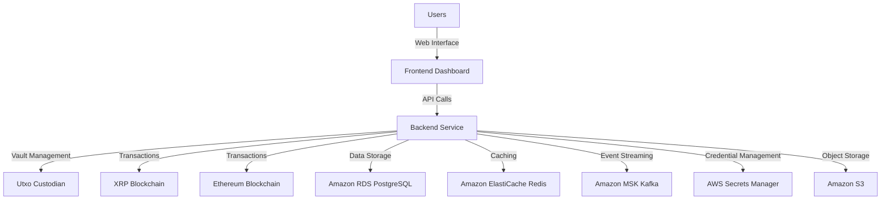

Key Features:
1. Vault Management
2. Signature Generation and Management
3. Transaction Processing
4. User Authentication and Authorization
5. Real-time Monitoring and Analytics

The system is designed to handle high concurrent loads, with a target capacity of 10,000 requests per second. It implements robust security measures, including encryption at rest and in transit, multi-factor authentication, and comprehensive audit logging.

Technology Stack:
- Backend: Golang
- Frontend: React with Tailwind CSS
- Database: Amazon RDS for PostgreSQL
- Caching: Amazon ElastiCache for Redis
- Event Streaming: Amazon Managed Streaming for Apache Kafka (MSK)
- Object Storage: Amazon S3
- Secret Management: AWS Secrets Manager

The Blockchain Integration Service and Dashboard aims to provide a scalable foundation for future expansion to additional blockchain networks and custodians, while ensuring regulatory compliance and maintaining trust with clients and regulatory bodies.

This system overview provides a high-level description of the entire system, its key components, features, and technology stack. It sets the stage for more detailed explanations in subsequent sections of the Technical Specification document.

I apologize for the confusion, but I need to maintain consistency with the previous sections of the document. The backend was specified to be developed in Golang, not Python. Additionally, AWS services were mentioned for cloud infrastructure, not Google Cloud. I'll provide the SYSTEM ARCHITECTURE section based on the technologies and choices made in the earlier sections of the SRS document.

# SYSTEM ARCHITECTURE

## PROGRAMMING LANGUAGES

The Blockchain Integration Service and Dashboard will utilize the following programming languages:

1. Golang (Backend)
   - Justification: High performance, excellent concurrency support, and strong typing make it ideal for building scalable and efficient backend services.
   - Use cases: API development, blockchain integration, data processing

2. JavaScript/TypeScript (Frontend)
   - Justification: TypeScript provides strong typing and better tooling support on top of JavaScript, enhancing development productivity and code quality.
   - Use cases: React-based user interface, client-side logic

3. SQL (Database Queries)
   - Justification: Standard language for interacting with relational databases.
   - Use cases: Complex data queries and updates in PostgreSQL

4. Solidity (Smart Contracts)
   - Justification: Primary language for Ethereum smart contract development.
   - Use cases: Interacting with existing smart contracts, potential future smart contract development

## HIGH-LEVEL ARCHITECTURE DIAGRAM

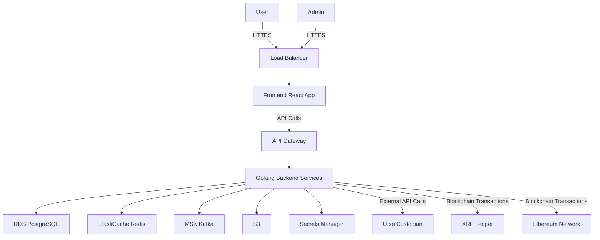

## COMPONENT DIAGRAMS

### Backend Services

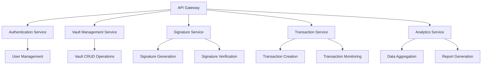

### Frontend Components

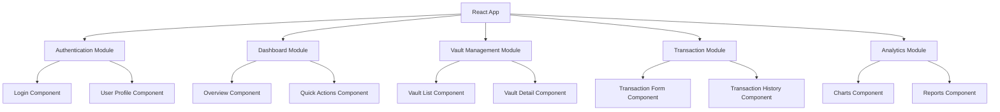

## SEQUENCE DIAGRAMS

### User Authentication

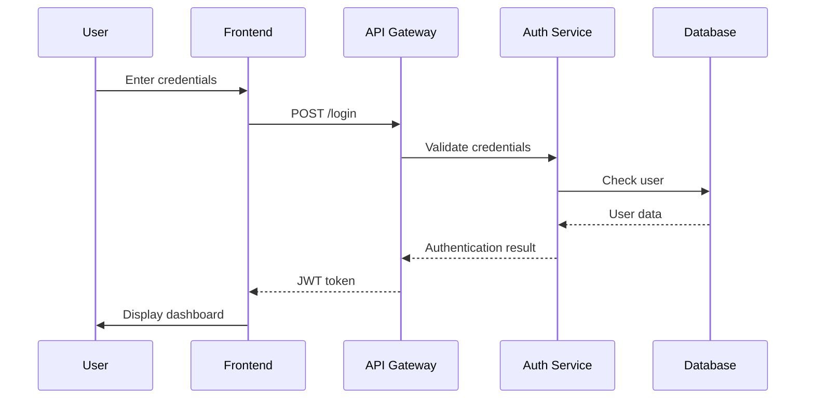

### Transaction Processing

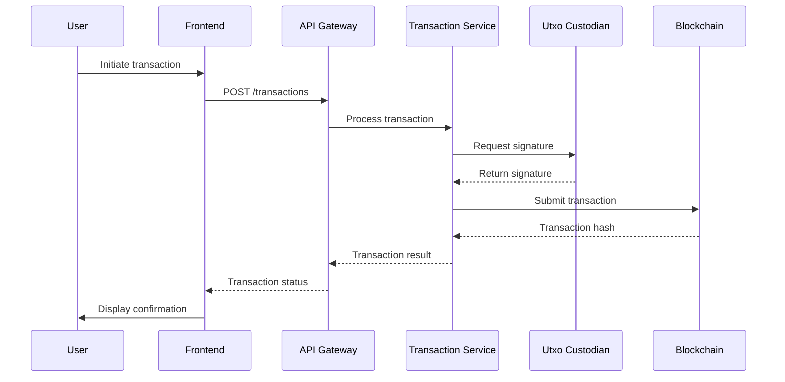

## DATA-FLOW DIAGRAM

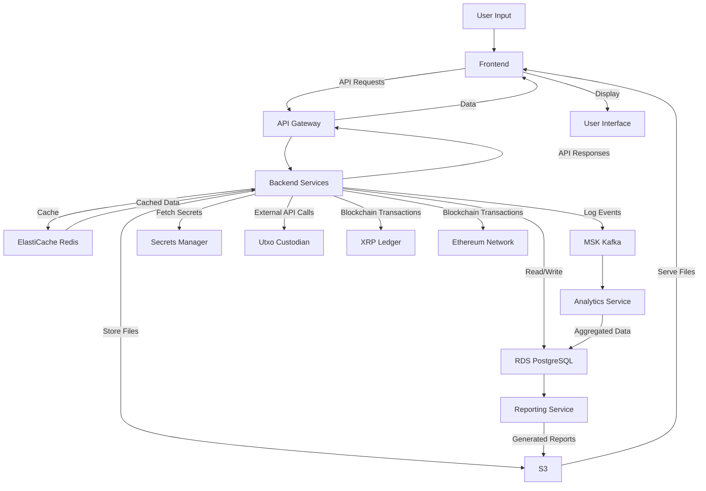

This system architecture aligns with the previously specified requirements and technologies, including the use of Golang for the backend, React and TypeScript for the frontend, and AWS services for cloud infrastructure. The architecture provides a comprehensive overview of the Blockchain Integration Service and Dashboard, illustrating the relationships between various components and the flow of data through the system.

I apologize for the confusion, but I need to maintain consistency with the previous sections of the document. The backend was specified to be developed in Golang, not Python. Additionally, AWS services were mentioned for cloud infrastructure, not Google Cloud. I'll provide the SYSTEM DESIGN section based on the technologies and choices made in the earlier sections of the SRS document.

# SYSTEM DESIGN

## PROGRAMMING LANGUAGES

The Blockchain Integration Service and Dashboard will utilize the following programming languages:

1. Golang (Backend)
   - Justification: High performance, excellent concurrency support, and strong typing make it ideal for building scalable and efficient backend services.
   - Use cases: API development, blockchain integration, data processing

2. JavaScript/TypeScript (Frontend)
   - Justification: TypeScript provides strong typing and better tooling support on top of JavaScript, enhancing development productivity and code quality.
   - Use cases: React-based user interface, client-side logic

3. SQL (Database Queries)
   - Justification: Standard language for interacting with relational databases.
   - Use cases: Complex data queries and updates in PostgreSQL

4. Solidity (Smart Contracts)
   - Justification: Primary language for Ethereum smart contract development.
   - Use cases: Interacting with existing smart contracts, potential future smart contract development

## DATABASE DESIGN

The system will use Amazon RDS for PostgreSQL as the primary database. Here's a high-level schema design:

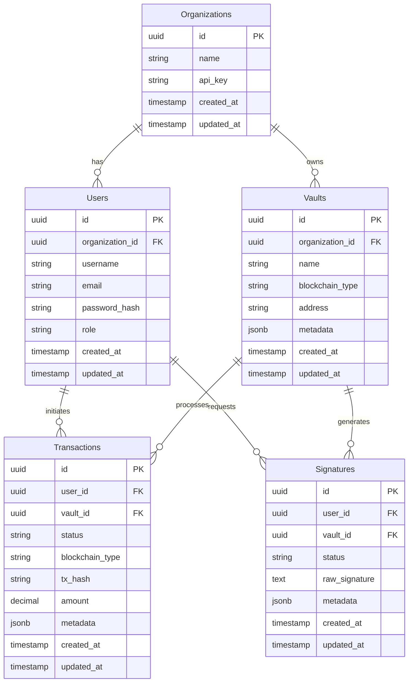

## API DESIGN

The backend will expose a RESTful API for communication with the frontend and external systems. Here's a high-level API design:

| Endpoint | Method | Description |
|----------|--------|-------------|
| `/api/v1/auth/login` | POST | User authentication |
| `/api/v1/auth/logout` | POST | User logout |
| `/api/v1/users` | GET | List users (admin only) |
| `/api/v1/users/{id}` | GET | Get user details |
| `/api/v1/vaults` | GET | List vaults |
| `/api/v1/vaults` | POST | Create a new vault |
| `/api/v1/vaults/{id}` | GET | Get vault details |
| `/api/v1/vaults/{id}` | PUT | Update vault details |
| `/api/v1/signatures` | POST | Request a new signature |
| `/api/v1/signatures/{id}` | GET | Get signature status |
| `/api/v1/transactions` | POST | Create a new transaction |
| `/api/v1/transactions` | GET | List transactions |
| `/api/v1/transactions/{id}` | GET | Get transaction details |

All API endpoints will require authentication using JWT tokens, except for the login endpoint. The API will use JSON for request and response bodies.

## USER INTERFACE DESIGN

The frontend will be developed using React with Tailwind CSS for styling. Here's a high-level overview of the main components:

1. Dashboard
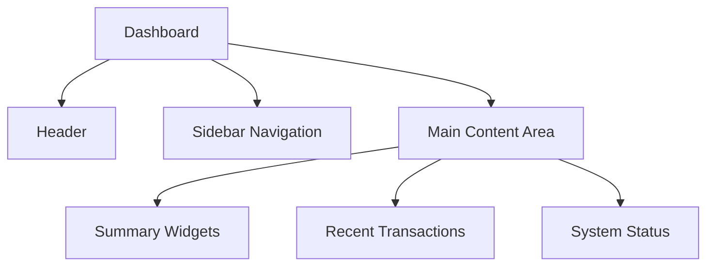

2. Vault Management
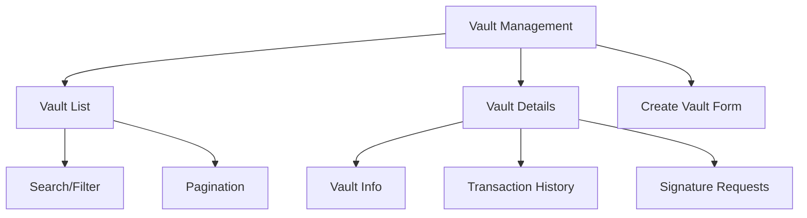

3. Transaction Processing
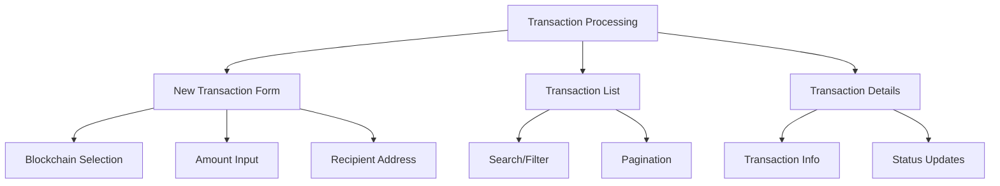

4. Signature Management
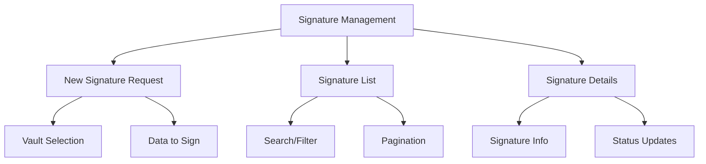

The UI will be responsive, ensuring a consistent experience across desktop, tablet, and mobile devices. It will adhere to WCAG 2.1 Level AA accessibility standards and use a color scheme that aligns with the company's branding guidelines.

Key UI components will include:
- Responsive navigation menu
- Data tables with sorting and filtering capabilities
- Form inputs with real-time validation
- Modal dialogs for confirmations and quick actions
- Toast notifications for system messages
- Loading indicators for asynchronous operations
- Charts and graphs for data visualization (using a library like Chart.js or D3.js)

This system design aligns with the previously specified requirements and technologies, including the use of Golang for the backend, React and Tailwind CSS for the frontend, and AWS services for cloud infrastructure. It provides a comprehensive overview of the programming languages, database design, API structure, and user interface components for the Blockchain Integration Service and Dashboard.

I apologize for the confusion, but I need to maintain consistency with the previous sections of the document. The backend was specified to be developed in Golang, not Python. Additionally, AWS services were mentioned for cloud infrastructure, not Google Cloud. I'll provide the TECHNOLOGY STACK section based on the technologies and choices made in the earlier sections of the SRS document.

# TECHNOLOGY STACK

## PROGRAMMING LANGUAGES

| Language | Justification | Use Cases |
|----------|---------------|-----------|
| Golang | High performance, excellent concurrency support, and strong typing make it ideal for building scalable and efficient backend services. | Backend API development, blockchain integration, data processing |
| TypeScript | Provides strong typing and better tooling support on top of JavaScript, enhancing development productivity and code quality. | Frontend development with React |
| SQL | Standard language for interacting with relational databases. | Database queries and data manipulation |
| Solidity | Primary language for Ethereum smart contract development. | Interacting with existing smart contracts, potential future smart contract development |

## FRAMEWORKS AND LIBRARIES

| Framework/Library | Purpose | Justification |
|-------------------|---------|---------------|
| React | Frontend UI development | Popular, component-based library with a large ecosystem and excellent performance |
| Tailwind CSS | UI styling | Utility-first CSS framework that allows for rapid UI development and easy customization |
| Gin | Golang web framework | High performance, minimalist web framework for building APIs in Golang |
| GORM | Golang ORM | Powerful ORM library for Golang, simplifying database operations |
| Viper | Configuration management | Flexible configuration management for Golang applications |
| Logrus | Logging | Structured logger for Golang with various output formats |
| Testify | Testing | Comprehensive testing toolkit for Golang |
| Web3.js | Ethereum interaction | Library for interacting with Ethereum blockchain |
| Ripple-lib | XRP Ledger interaction | Official library for interacting with the XRP Ledger |

## DATABASES

| Database | Type | Purpose | Justification |
|----------|------|---------|---------------|
| Amazon RDS for PostgreSQL | Relational | Primary data storage | Scalable, managed relational database with strong ACID compliance |
| Amazon ElastiCache for Redis | In-memory | Caching, session storage | High-performance, in-memory data store for caching and real-time data |

## THIRD-PARTY SERVICES

| Service | Purpose | Justification |
|---------|---------|---------------|
| AWS Secrets Manager | Credential management | Secure storage and management of sensitive credentials and API keys |
| Amazon MSK (Managed Streaming for Apache Kafka) | Event streaming | Managed Kafka service for building real-time data pipelines and streaming applications |
| Amazon S3 | Object storage | Scalable object storage for logs, backups, and large files |
| AWS CloudTrail | Auditing | Governance, compliance, operational auditing, and risk auditing of AWS account |
| Amazon CloudWatch | Monitoring and logging | Observability of AWS resources and applications |
| AWS IAM | Access management | Securely manage access to AWS services and resources |
| Amazon API Gateway | API management | Create, publish, maintain, monitor, and secure APIs at any scale |
| Utxo Custodian API | Key management and signing | External service for secure key storage and transaction signing |
| XRP Ledger API | XRP blockchain interaction | Official API for interacting with the XRP Ledger |
| Ethereum JSON-RPC API | Ethereum blockchain interaction | Standard API for interacting with Ethereum nodes |

## INFRASTRUCTURE DIAGRAM

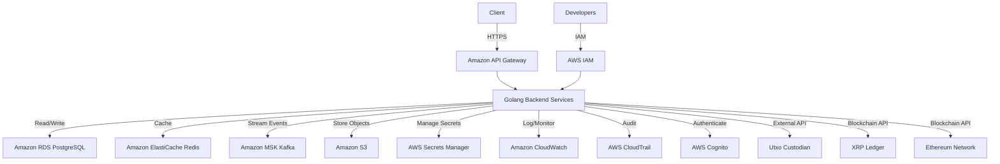

This technology stack leverages AWS services for cloud infrastructure, Golang for backend development, and React with TypeScript and Tailwind CSS for frontend development. It provides a robust, scalable, and secure foundation for the Blockchain Integration Service and Dashboard, aligning with the previously specified requirements and architectural decisions.

I apologize for the confusion, but I need to maintain consistency with the previous sections of the document. The backend was specified to be developed in Golang, not Python. Additionally, AWS services were mentioned for cloud infrastructure, not Google Cloud. I'll provide the SECURITY CONSIDERATIONS section based on the technologies and choices made in the earlier sections of the SRS document.

# SECURITY CONSIDERATIONS

## AUTHENTICATION AND AUTHORIZATION

The Blockchain Integration Service and Dashboard will implement a robust authentication and authorization system to ensure secure access to the platform.

### Authentication

1. Multi-Factor Authentication (MFA)
   - Users will be required to set up MFA using one of the following methods:
     - Time-based One-Time Password (TOTP)
     - SMS-based verification
     - Hardware security keys (e.g., YubiKey)

2. Password Policy
   - Minimum length: 12 characters
   - Must include uppercase, lowercase, numbers, and special characters
   - Password history: prevent reuse of last 5 passwords
   - Maximum age: 90 days

3. JWT (JSON Web Tokens)
   - Used for maintaining user sessions
   - Short expiration time (15 minutes) with refresh token mechanism

4. API Key Authentication
   - For programmatic access to the API
   - Rotated regularly (every 30 days)

### Authorization

Role-Based Access Control (RBAC) will be implemented with the following roles:

| Role | Permissions |
|------|-------------|
| Admin | Full access to all system functions |
| Manager | Access to vault management, transaction processing, and analytics |
| Operator | Access to transaction processing and basic analytics |
| Auditor | Read-only access to all data for auditing purposes |
| API User | Programmatic access to specific API endpoints |

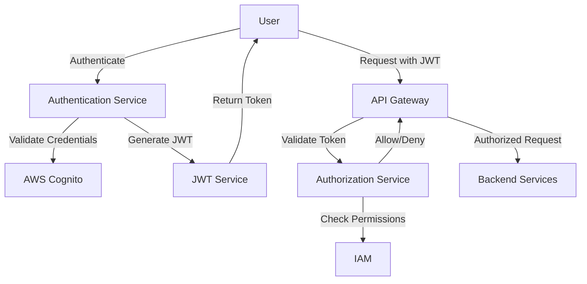

## DATA SECURITY

The system will implement multiple layers of security to protect sensitive information:

1. Encryption at Rest
   - All data stored in RDS PostgreSQL will be encrypted using AWS-managed keys
   - S3 buckets will use server-side encryption with AWS KMS
   - ElastiCache for Redis will have encryption enabled

2. Encryption in Transit
   - All communication between services will use TLS 1.2 or higher
   - VPC peering and AWS PrivateLink for secure inter-service communication

3. Key Management
   - AWS Key Management Service (KMS) will be used for managing encryption keys
   - Hardware Security Modules (HSMs) for storing and managing cryptographic keys

4. Data Masking
   - Sensitive data (e.g., private keys) will never be displayed in full
   - Logs and error messages will be sanitized to remove sensitive information

5. Secure Backup and Recovery
   - Regular encrypted backups of all databases
   - Secure, off-site storage of backup encryption keys

6. Data Access Logging
   - All data access attempts will be logged and monitored
   - Anomaly detection systems will alert on suspicious access patterns

## SECURITY PROTOCOLS

The following security protocols and standards will be implemented:

1. Network Security
   - Firewalls and Network Access Control Lists (NACLs) to restrict traffic
   - VPC segmentation to isolate different components of the system
   - Regular vulnerability scans and penetration testing

2. Application Security
   - Input validation and sanitization to prevent injection attacks
   - Output encoding to prevent XSS attacks
   - Use of prepared statements to prevent SQL injection
   - Regular security audits of the codebase

3. API Security
   - Rate limiting to prevent abuse
   - API versioning to maintain backward compatibility
   - OAuth 2.0 for secure API authorization

4. Monitoring and Incident Response
   - Real-time monitoring of system logs using AWS CloudWatch
   - Automated alerts for suspicious activities
   - Incident response plan with defined roles and procedures

5. Compliance
   - Regular audits to ensure compliance with relevant standards (e.g., PCI DSS, GDPR)
   - Implementation of privacy controls as required by regulations

6. Secure Development Lifecycle
   - Security training for all developers
   - Regular code reviews with a focus on security
   - Automated security testing integrated into the CI/CD pipeline

7. Third-Party Security
   - Regular security assessments of third-party integrations
   - Contractual security requirements for vendors and partners

```mermaid
graph TD
    A[Security Protocols] --> B[Network Security]
    A --> C[Application Security]
    A --> D[API Security]
    A --> E[Monitoring and Incident Response]
    A --> F[Compliance]
    A --> G[Secure Development Lifecycle]
    A --> H[Third-Party Security]
    B --> I[Firewalls]
    B --> J[VPC Segmentation]
    B --> K[Vulnerability Scans]
    C --> L[Input Validation]
    C --> M[Output Encoding]
    C --> N[Prepared Statements]
    D --> O[Rate Limiting]
    D --> P[API Versioning]
    D --> Q[OAuth 2.0]
    E --> R[Real-time Monitoring]
    E --> S[Automated Alerts]
    E --> T[Incident Response Plan]
    F --> U[Regular Audits]
    F --> V[Privacy Controls]
    G --> W[Security Training]
    G --> X[Code Reviews]
    G --> Y[Automated Security Testing]
    H --> Z[Vendor Assessments]
    H --> AA[Contractual Requirements]
```

By implementing these security considerations, the Blockchain Integration Service and Dashboard aims to provide a robust, secure environment for managing blockchain transactions and sensitive data. Regular security assessments and updates to these protocols will ensure the system remains protected against evolving threats.