# INTRODUCTION

## SYSTEM OVERVIEW

The Blockchain Integration Service and Dashboard is a comprehensive solution designed to streamline blockchain operations for a cryptocurrency startup. This system provides a secure, efficient, and scalable platform for managing blockchain transactions across multiple networks, with initial support for XRP and Ethereum blockchains.

The system consists of two main components:

1. Backend Service (Golang)
2. Frontend Dashboard (React 18 + TypeScript, Create React App)

These components interact with various external services and blockchain networks to provide a robust and feature-rich platform for cryptocurrency operations.

> **Figure conventions used throughout this document.** Every diagram below is numbered `Figure TS-1` … `Figure TS-15`, carries a descriptive title immediately above it and a `Legend` immediately below it, and is referenced by that name from the surrounding prose. Because Mermaid's `sequenceDiagram` and `erDiagram` cannot host an in-diagram legend, and because the diagram bodies in this document are retained design artifacts that must not be altered, **all legends are given as prose** rather than as legend subgraphs. Unless a legend says otherwise, every figure in this document depicts the **Designed** target architecture — not the current implementation. The Implemented / Provisioned / Designed reconciliation for the on-disk code is maintained separately in `docs/architecture/scaffold-vs-design.md`, and the current-versus-target architecture pair is `Fig A1`/`Fig A2` in `docs/architecture/overview.md`.

**Figure TS-1** maps the system's two components onto the external services and blockchain networks they depend on; it is the widest view in this document, and every later figure refines one region of it.

**Figure TS-1 — System Context: Components and External Integrations (Designed target)**

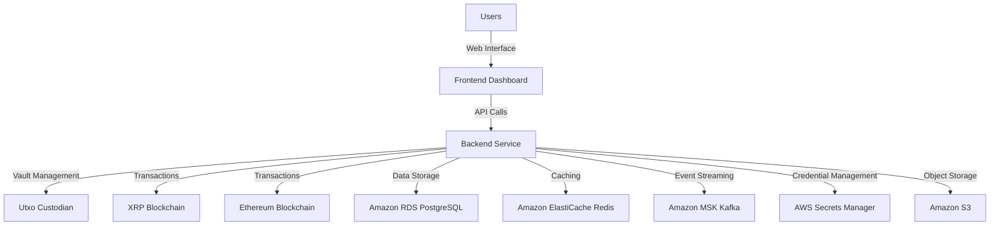
```mermaid
graph TD
    A[Frontend Dashboard] -->|API Calls| B[Backend Service]
    B -->|Vault Management| C[Utxo Custodian]
    B -->|Transactions| D[XRP Blockchain]
    B -->|Transactions| E[Ethereum Blockchain]
    B -->|Data Storage| F[Amazon RDS PostgreSQL]
    B -->|Caching| G[Amazon ElastiCache Redis]
    B -->|Event Streaming| H[Amazon MSK Kafka]
    B -->|Credential Management| I[AWS Secrets Manager]
    B -->|Object Storage| J[Amazon S3]
    K[Users] -->|Web Interface| A
```

**Legend — Figure TS-1**

- **Rectangle** — a component of this system (`Frontend Dashboard`, `Backend Service`), an external managed service (`Amazon RDS PostgreSQL`, `Amazon ElastiCache Redis`, `Amazon MSK Kafka`, `AWS Secrets Manager`, `Amazon S3`), an external counterparty (`Utxo Custodian`), a blockchain network (`XRP Blockchain`, `Ethereum Blockchain`), or the human actor (`Users`).
- **Arrow** — direction of dependency: the source initiates the interaction. The **arrow label** names the *purpose* of that integration (`API Calls`, `Vault Management`, `Transactions`, `Data Storage`, `Caching`, `Event Streaming`, `Credential Management`, `Object Storage`, `Web Interface`) rather than a protocol.
- **Maturity** — every external integration shown is **Designed**. `internal/blockchain` and `internal/custodian` are imported by the composition root but do not exist on disk `Source: backend/cmd/server/main.go:L8-L9`; `backend/internal/` contains only `api`, `core`, `db`, and `tasks`. No backend file references Kafka, S3, or Secrets Manager at all. Only the PostgreSQL and Redis initializers exist in source `Source: backend/internal/db/postgres.go`, `Source: backend/internal/db/redis.go`, and because the module does not build, those are **source-present (non-buildable)** rather than Implemented.

Key Features:
1. Vault Management
2. Signature Generation and Management
3. Transaction Processing
4. User Authentication and Authorization
5. Real-time Monitoring and Analytics

The system is designed to handle high concurrent loads, with a target capacity of 10,000 requests per second. It implements robust security measures, including encryption at rest and in transit, multi-factor authentication, and comprehensive audit logging.

Technology Stack:
- Backend: Golang
- Frontend: React 18 + TypeScript (Create React App); Tailwind CSS is a design-time proposal only, not a declared dependency (Designed)
- Database: Amazon RDS for PostgreSQL
- Caching: Amazon ElastiCache for Redis
- Event Streaming: Amazon Managed Streaming for Apache Kafka (MSK)
- Object Storage: Amazon S3
- Secret Management: AWS Secrets Manager

The Blockchain Integration Service and Dashboard aims to provide a scalable foundation for future expansion to additional blockchain networks and custodians, while ensuring regulatory compliance and maintaining trust with clients and regulatory bodies.

This system overview provides a high-level description of the entire system, its key components, features, and technology stack. It sets the stage for more detailed explanations in subsequent sections of the Technical Specification document.

# SYSTEM ARCHITECTURE

## PROGRAMMING LANGUAGES

The Blockchain Integration Service and Dashboard will utilize the following programming languages:

1. Golang (Backend)
   - Justification: High performance, excellent concurrency support, and strong typing make it ideal for building scalable and efficient backend services.
   - Use cases: API development, blockchain integration, data processing

2. JavaScript/TypeScript (Frontend)
   - Justification: TypeScript provides strong typing and better tooling support on top of JavaScript, enhancing development productivity and code quality.
   - Use cases: React-based user interface, client-side logic

3. SQL (Database Queries)
   - Justification: Standard language for interacting with relational databases.
   - Use cases: Complex data queries and updates in PostgreSQL

4. Solidity (Smart Contracts)
   - Justification: Primary language for Ethereum smart contract development.
   - Use cases: Interacting with existing smart contracts, potential future smart contract development

## HIGH-LEVEL ARCHITECTURE DIAGRAM

**Figure TS-2** expands the `Backend Service` box of **Figure TS-1** into the edge tier that fronts it, showing both human entry points and the full set of downstream dependencies of the backend tier.

**Figure TS-2 — High-Level Architecture: Edge Tier to Backend Dependencies (Designed target)**

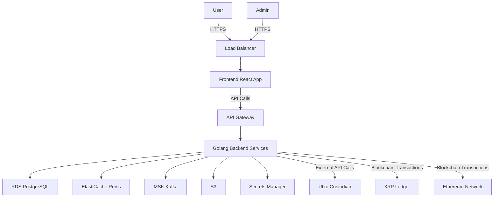
```mermaid
graph TD
    A[User] -->|HTTPS| B[Load Balancer]
    B --> C[Frontend React App]
    C -->|API Calls| D[API Gateway]
    D --> E[Golang Backend Services]
    E --> F[RDS PostgreSQL]
    E --> G[ElastiCache Redis]
    E --> H[MSK Kafka]
    E --> I[S3]
    E --> J[Secrets Manager]
    E -->|External API Calls| K[Utxo Custodian]
    E -->|Blockchain Transactions| L[XRP Ledger]
    E -->|Blockchain Transactions| M[Ethereum Network]
    N[Admin] -->|HTTPS| B
```

**Legend — Figure TS-2**

- **Rectangle** — a deployable tier (`Frontend React App`, `Golang Backend Services`), an edge component (`Load Balancer`, `API Gateway`), a managed data service (`RDS PostgreSQL`, `ElastiCache Redis`, `MSK Kafka`, `S3`, `Secrets Manager`), an external system (`Utxo Custodian`, `XRP Ledger`, `Ethereum Network`), or a human actor (`User`, `Admin`).
- **Labelled arrow** — names the protocol or interaction class (`HTTPS`, `API Calls`, `External API Calls`, `Blockchain Transactions`). **Unlabelled arrow** — an internal call within the trust boundary, where the protocol is an implementation detail.
- **Two entry points, one edge.** `User` and `Admin` both enter through the same `Load Balancer`; the design does not give administrators a separate ingress, so administrative privilege is expected to be enforced by role rather than by network path (see **Figure TS-14**).
- **Maturity** — **Designed**. The Terraform stack declares an Application Load Balancer and an ECS Fargate service, and declares no API Gateway resource of any kind `Source: infrastructure/terraform/main.tf:L143-L165,L168-L174`, so the `API Gateway` box in this figure is a design-time abstraction rather than a declared component; compare **Figure TS-13**.

## COMPONENT DIAGRAMS

### Backend Services

**Figure TS-3** decomposes the single `Golang Backend Services` box of **Figure TS-2** into its designed services and the capabilities each owns.

**Figure TS-3 — Backend Service Decomposition (Designed target)**

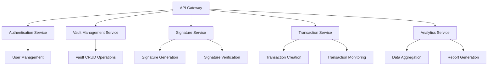
```mermaid
graph TD
    A[API Gateway] --> B[Authentication Service]
    A --> C[Vault Management Service]
    A --> D[Signature Service]
    A --> E[Transaction Service]
    A --> F[Analytics Service]
    B --> G[User Management]
    C --> H[Vault CRUD Operations]
    D --> I[Signature Generation]
    D --> J[Signature Verification]
    E --> K[Transaction Creation]
    E --> L[Transaction Monitoring]
    F --> M[Data Aggregation]
    F --> N[Report Generation]
```

**Legend — Figure TS-3**

- **Three levels, read top to bottom.** Level 1 is the single entry point (`API Gateway`); level 2 is a **service** (`Authentication`, `Vault Management`, `Signature`, `Transaction`, `Analytics`); level 3 is a **capability** owned by the service above it (for example `Vault CRUD Operations` under `Vault Management Service`).
- **Arrow** — "routes to" between levels 1 and 2, and "comprises" between levels 2 and 3. No arrow in this figure represents a data store or an external call; those appear in **Figure TS-2** and **Figure TS-7**.
- **Maturity — partially divergent from the code.** The scaffold contains **three** core services, not five: `internal/core/vault`, `internal/core/transaction`, and `internal/core/signature`. The `Authentication Service` is imported as `internal/core/auth` but that package is **absent**, and there is no analytics service of any kind. `Analytics Service`, `Data Aggregation`, and `Report Generation` are therefore **Designed** with no counterpart in the source tree. `Source: backend/internal/core/ (contains only vault, transaction, signature)`, `Source: backend/internal/api/handlers/auth.go:L5`.

### Frontend Components

**Figure TS-4** performs the same decomposition for the `Frontend React App` box of **Figure TS-2**, giving the designed module and component hierarchy of the single-page application.

**Figure TS-4 — Frontend Component Hierarchy (Designed target)**

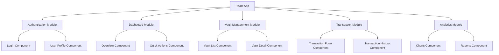
```mermaid
graph TD
    A[React App] --> B[Authentication Module]
    A --> C[Dashboard Module]
    A --> D[Vault Management Module]
    A --> E[Transaction Module]
    A --> F[Analytics Module]
    B --> G[Login Component]
    B --> H[User Profile Component]
    C --> I[Overview Component]
    C --> J[Quick Actions Component]
    D --> K[Vault List Component]
    D --> L[Vault Detail Component]
    E --> M[Transaction Form Component]
    E --> N[Transaction History Component]
    F --> O[Charts Component]
    F --> P[Reports Component]
```

**Legend — Figure TS-4**

- **Three levels, read top to bottom.** Level 1 is the SPA root (`React App`); level 2 is a **feature module** (`Authentication`, `Dashboard`, `Vault Management`, `Transaction`, `Analytics`); level 3 is a **presentational component** rendered within that module.
- **Arrow** — "renders / owns". The figure describes composition only: it carries no routing, no state-management topology, and no API binding. Client-side state is not depicted here.
- **Maturity** — **Designed**. The on-disk application is organised as **5 pages** plus **8 shared components** rather than as the five modules shown, and the Redux store registers only `vault`, `transaction`, and `user` reducers — so the `Analytics Module` has no store slice behind it and the `Analytics` page's import of `analyticsSlice` is broken. `Source: frontend/src/pages/`, `Source: frontend/src/components/`, `Source: frontend/src/store/index.ts:L8-L12`.

## SEQUENCE DIAGRAMS

### User Authentication

**Figure TS-5** traces the designed login exchange across the tiers introduced in **Figure TS-2**, ending with a JWT returned to the browser.

**Figure TS-5 — User Authentication Sequence: Login Success Path (Designed target)**

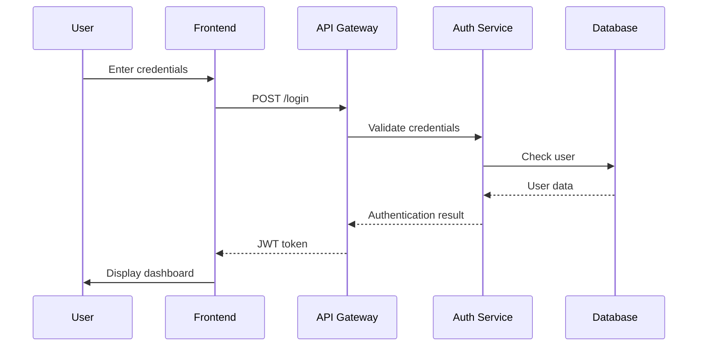
```mermaid
sequenceDiagram
    participant U as User
    participant F as Frontend
    participant A as API Gateway
    participant AS as Auth Service
    participant DB as Database

    U->>F: Enter credentials
    F->>A: POST /login
    A->>AS: Validate credentials
    AS->>DB: Check user
    DB-->>AS: User data
    AS-->>A: Authentication result
    A-->>F: JWT token
    F->>U: Display dashboard
```

**Legend — Figure TS-5**

Mermaid `sequenceDiagram` does not support an in-diagram legend, so the notation is explained here:

- **Participants** — **U** the end user; **F** the frontend; **A** the API Gateway; **AS** the Auth Service; **DB** the database of record.
- **Solid arrow (`->>`)** — a request or forward call. **Dashed arrow (`-->>`)** — the corresponding reply. Read strictly top to bottom; the vertical axis is time.
- **Success path only.** The diagram contains no `alt` fragment, so the credential-rejection branch is **not** depicted. For the two-branch version including the `401` outcome, see `Fig B1` in `docs/architecture/data-flow.md`.
- **Maturity** — **Designed**. `AS` corresponds to `internal/core/auth`, which is imported but **absent**; the `Login` handler that would drive this exchange is **source-present (non-buildable)**. `Source: backend/internal/api/handlers/auth.go:L21-L39`.

### Transaction Processing

**Figure TS-6** traces the designed transaction exchange, adding the custodian and the blockchain network to the tiers of **Figure TS-5**.

**Figure TS-6 — Transaction Processing Sequence: Sign and Submit (Designed target)**

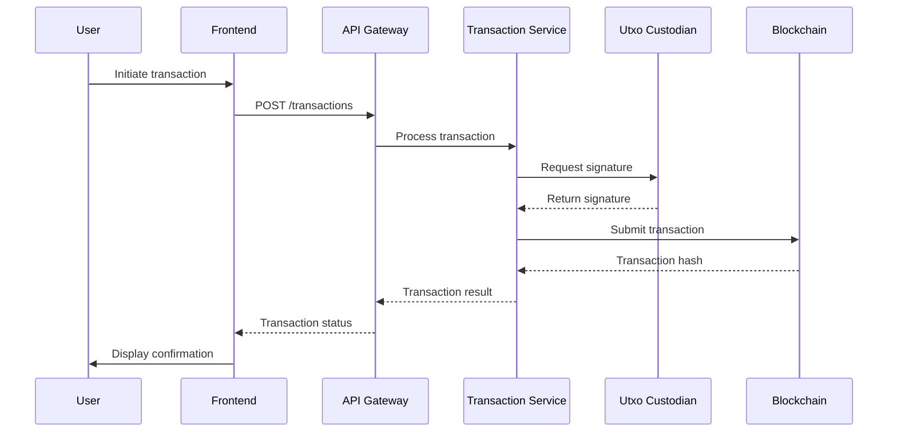
```mermaid
sequenceDiagram
    participant U as User
    participant F as Frontend
    participant A as API Gateway
    participant TS as Transaction Service
    participant UC as Utxo Custodian
    participant BC as Blockchain

    U->>F: Initiate transaction
    F->>A: POST /transactions
    A->>TS: Process transaction
    TS->>UC: Request signature
    UC-->>TS: Return signature
    TS->>BC: Submit transaction
    BC-->>TS: Transaction hash
    TS-->>A: Transaction result
    A-->>F: Transaction status
    F->>U: Display confirmation
```

**Legend — Figure TS-6**

Mermaid `sequenceDiagram` does not support an in-diagram legend, so the notation is explained here:

- **Participants** — **U** the end user; **F** the frontend; **A** the API Gateway; **TS** the Transaction Service; **UC** the Utxo Custodian (external key holder that performs signing); **BC** the target blockchain network.
- **Solid arrow (`->>`)** — a request or forward call. **Dashed arrow (`-->>`)** — the corresponding reply. The vertical axis is time.
- **Signing is external by design.** The private key never reaches this system: `TS` asks `UC` for a signature and receives one back, then submits the signed transaction to `BC`. This custodial boundary is the reason a custodian appears in every transaction path.
- **This figure is fully synchronous, and the implementation's design is not.** The user is shown waiting for the blockchain's `Transaction hash` in the same request. The as-designed backend instead splits the work into a synchronous **command** (persist with `Status = Pending`) and an asynchronous **settlement** performed by a ticker-driven background processor that advances the record to `Status = Processed`. For the split version see `Fig B2` in `docs/architecture/data-flow.md`. `Source: backend/internal/tasks/transaction_processor.go`.
- **Maturity** — **Designed**. `UC` and `BC` correspond to `internal/custodian` and `internal/blockchain`, both imported but **absent**, so no part of this exchange executes today.

## DATA-FLOW DIAGRAM

**Figure TS-7** consolidates the paths of Figures TS-2, TS-5, and TS-6 into a single end-to-end view, and is the only figure in this document that shows return flows and feedback loops.

**Figure TS-7 — End-to-End Data Flow Including Return Paths (Designed target)**

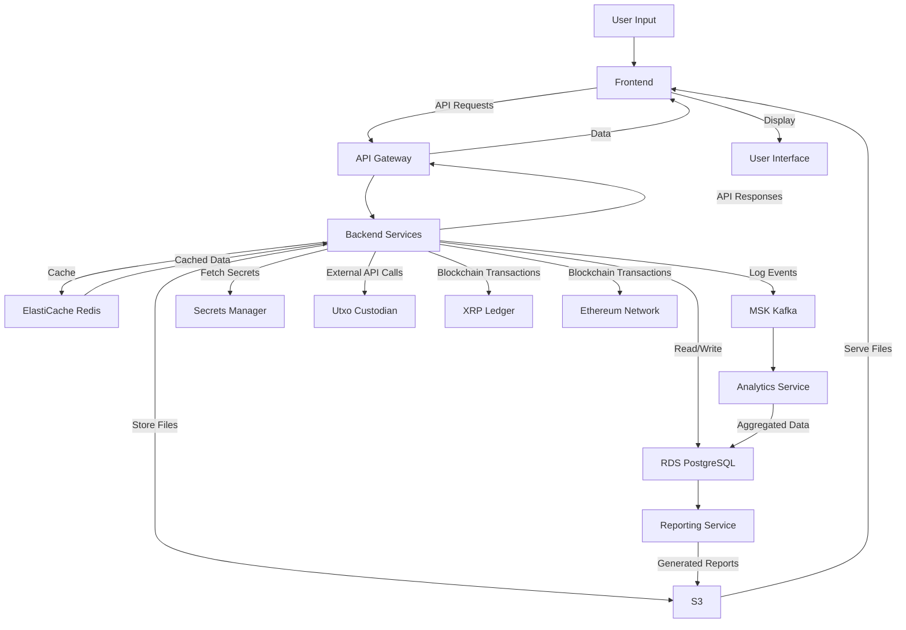
```mermaid
graph TD
    A[User Input] --> B[Frontend]
    B -->|API Requests| C[API Gateway]
    C --> D[Backend Services]
    D -->|Read/Write| E[RDS PostgreSQL]
    D -->|Cache| F[ElastiCache Redis]
    D -->|Log Events| G[MSK Kafka]
    D -->|Store Files| H[S3]
    D -->|Fetch Secrets| I[Secrets Manager]
    D -->|External API Calls| J[Utxo Custodian]
    D -->|Blockchain Transactions| K[XRP Ledger]
    D -->|Blockchain Transactions| L[Ethereum Network]
    G --> M[Analytics Service]
    M -->|Aggregated Data| E
    E --> N[Reporting Service]
    N -->|Generated Reports| H
    H -->|Serve Files| B
    F -->|Cached Data| D
    D -->|API Responses| C
    C -->|Data| B
    B -->|Display| O[User Interface]
```

**Legend — Figure TS-7**

- **Rectangle** — a process (`Frontend`, `API Gateway`, `Backend Services`, `Analytics Service`, `Reporting Service`), a data store (`RDS PostgreSQL`, `ElastiCache Redis`, `S3`), a transport (`MSK Kafka`), an external system (`Utxo Custodian`, `XRP Ledger`, `Ethereum Network`), or a terminator (`User Input`, `User Interface`).
- **Arrow label** — the **kind of data** crossing that boundary, not the protocol: `Read/Write`, `Cache`, `Cached Data`, `Log Events`, `Store Files`, `Serve Files`, `Fetch Secrets`, `External API Calls`, `Blockchain Transactions`, `Aggregated Data`, `Generated Reports`, `API Responses`, `Data`, `Display`.
- **The graph is deliberately cyclic.** Three pairs form round trips rather than duplicated edges: `Backend Services ⇄ ElastiCache Redis` (`Cache` out, `Cached Data` back), `API Gateway ⇄ Frontend` (`API Requests` in, `Data` back), and `Backend Services → API Gateway` (`API Responses`). A cycle here means a request/response pair, never an infinite loop.
- **Two derived-data paths.** Events published to `MSK Kafka` are consumed by `Analytics Service`, whose `Aggregated Data` is written back to PostgreSQL; separately `Reporting Service` reads PostgreSQL and writes `Generated Reports` to S3, which the frontend then serves. Both paths are read-only with respect to the operational records they derive from.
- **Maturity** — **Designed**, and the absences differ in kind. `MSK Kafka` and `S3` are *declared* in Terraform but declared-but-invalid, and no backend file references either service `Source: infrastructure/terraform/main.tf:L120-L140`. `Secrets Manager`, `Analytics Service`, and `Reporting Service` are absent from the repository entirely — no Terraform resource and no package. The Kafka fan-out that carries `Log Events` into the analytics path is therefore design-only end to end.

This system architecture aligns with the previously specified requirements and technologies, including the use of Golang for the backend, React and TypeScript for the frontend, and AWS services for cloud infrastructure. The architecture provides a comprehensive overview of the Blockchain Integration Service and Dashboard, illustrating the relationships between various components and the flow of data through the system.

# SYSTEM DESIGN

## PROGRAMMING LANGUAGES

The Blockchain Integration Service and Dashboard will utilize the following programming languages:

1. Golang (Backend)
   - Justification: High performance, excellent concurrency support, and strong typing make it ideal for building scalable and efficient backend services.
   - Use cases: API development, blockchain integration, data processing

2. JavaScript/TypeScript (Frontend)
   - Justification: TypeScript provides strong typing and better tooling support on top of JavaScript, enhancing development productivity and code quality.
   - Use cases: React-based user interface, client-side logic

3. SQL (Database Queries)
   - Justification: Standard language for interacting with relational databases.
   - Use cases: Complex data queries and updates in PostgreSQL

4. Solidity (Smart Contracts)
   - Justification: Primary language for Ethereum smart contract development.
   - Use cases: Interacting with existing smart contracts, potential future smart contract development

## DATABASE DESIGN

The system will use Amazon RDS for PostgreSQL as the primary database. Here's a high-level schema design:

**Figure TS-8** is the authoritative designed schema for the `RDS PostgreSQL` store that appears as a single box in Figures TS-2 and TS-7, giving its five entities, their attributes, and their cardinalities.

**Figure TS-8 — Database Schema Entity-Relationship Diagram (Designed target)**

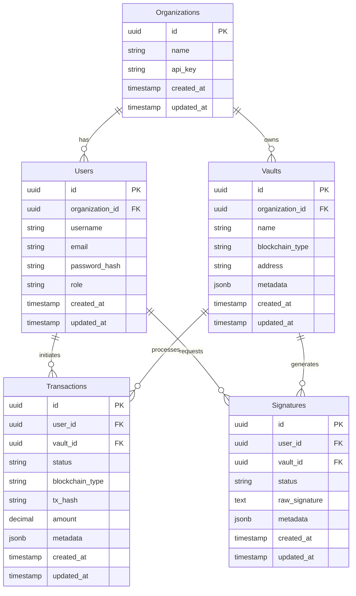
```mermaid
erDiagram
    Organizations ||--o{ Users : has
    Organizations ||--o{ Vaults : owns
    Users ||--o{ Transactions : initiates
    Users ||--o{ Signatures : requests
    Vaults ||--o{ Transactions : processes
    Vaults ||--o{ Signatures : generates

    Organizations {
        uuid id PK
        string name
        string api_key
        timestamp created_at
        timestamp updated_at
    }

    Users {
        uuid id PK
        uuid organization_id FK
        string username
        string email
        string password_hash
        string role
        timestamp created_at
        timestamp updated_at
    }

    Vaults {
        uuid id PK
        uuid organization_id FK
        string name
        string blockchain_type
        string address
        jsonb metadata
        timestamp created_at
        timestamp updated_at
    }

    Transactions {
        uuid id PK
        uuid user_id FK
        uuid vault_id FK
        string status
        string blockchain_type
        string tx_hash
        decimal amount
        jsonb metadata
        timestamp created_at
        timestamp updated_at
    }

    Signatures {
        uuid id PK
        uuid user_id FK
        uuid vault_id FK
        string status
        text raw_signature
        jsonb metadata
        timestamp created_at
        timestamp updated_at
    }
```

**Legend — Figure TS-8**

Mermaid `erDiagram` does not support an in-diagram legend, so the crow's-foot notation is explained here:

- **`||--o{`** — a one-to-many relationship. The `||` end means **exactly one** and the `o{` end means **zero or more**. Read `Organizations ||--o{ Users : has` as "one organization has zero or more users".
- **Relationship label** — the verb naming the relationship (`has`, `owns`, `initiates`, `requests`, `processes`, `generates`). It is read from the `||` side toward the `o{` side.
- **Attribute markers** — **`PK`** primary key, **`FK`** foreign key. The leading token on each attribute line is its **type** (`uuid`, `string`, `text`, `decimal`, `jsonb`, `timestamp`).
- **Two owners per child record.** `Transactions` and `Signatures` each carry **both** a `user_id` and a `vault_id` foreign key, so every such record is attributable to an actor *and* to a vault. `Organizations` is the multi-tenancy root: it owns `Users` and `Vaults` directly, and owns transactions and signatures transitively.
- **`jsonb metadata` is an intentional extension point** on `Vaults`, `Transactions`, and `Signatures`, allowing per-blockchain fields without a migration.
- **Maturity** — **Designed**. The on-disk GORM models define the same five entities but diverge in two documented ways: each model embeds `gorm.Model` *and* redeclares `ID uuid.UUID`, `CreatedAt`, and `UpdatedAt` (a dual-identifier inconsistency), and `status` is an unconstrained `string` rather than an enumeration. The as-coded field-level reference is `Fig M1` in `docs/architecture/data-model.md`. `Source: backend/internal/db/schema.go:L11-L68`.

## API DESIGN

The backend will expose a RESTful API for communication with the frontend and external systems. Here's a high-level API design. The following table documents the **Designed** REST contract (target state):

| Endpoint | Method | Description |
|----------|--------|-------------|
| `/api/v1/auth/login` | POST | User authentication |
| `/api/v1/auth/logout` | POST | User logout |
| `/api/v1/users` | GET | List users (admin only) |
| `/api/v1/users/{id}` | GET | Get user details |
| `/api/v1/vaults` | GET | List vaults |
| `/api/v1/vaults` | POST | Create a new vault |
| `/api/v1/vaults/{id}` | GET | Get vault details |
| `/api/v1/vaults/{id}` | PUT | Update vault details |
| `/api/v1/signatures` | POST | Request a new signature |
| `/api/v1/signatures/{id}` | GET | Get signature status |
| `/api/v1/transactions` | POST | Create a new transaction |
| `/api/v1/transactions` | GET | List transactions |
| `/api/v1/transactions/{id}` | GET | Get transaction details |

> **As-coded vs Designed — API base path.** The table above is the **Designed** target. The **as-coded (source-present, non-buildable)** router exposes **unprefixed** routes (no `/api/v1`) in four groups. The three resource groups — `/vault` (**singular**, not plural `/vaults`), `/transactions`, and `/signatures` — each expose explicit action sub-paths (`/create`, `/list`) plus `:id` parameters for `GET`, `PUT`, and `DELETE`. The `/auth` group does **not** follow that shape: it exposes only `/login`, `/register`, and `/logout`, with no `/create`, no `/list`, and no `:id` route. All routes except `login`/`register` are **declared as** auth-protected via `middleware.AuthMiddleware()`, which is itself **Designed**: the `backend/internal/api/middleware` package is imported but absent from the scaffold, so the guard is declared rather than enforced. The `/api/v1` prefix, the plural resource names (`/vaults`), and the `/users` endpoints are **Designed** and not present in the current code. `Source: backend/internal/api/routes.go:L6,L9-L54`.

All API endpoints will require authentication using JWT tokens, except for the login endpoint. The API will use JSON for request and response bodies.

## USER INTERFACE DESIGN

The frontend is built with React 18 and TypeScript (Create React App). Note: Tailwind CSS was proposed for styling at design time but is NOT a declared/installed dependency — `frontend/package.json` declares no Tailwind and the source tree contains zero `.css` files, so it is a **Designed**, not **Implemented**, choice. `Source: frontend/package.json:L5-L19`. Here's a high-level overview of the main components:

Figures **TS-9** through **TS-12** are the four screen-composition trees, one per primary screen. They share a single notation, given once in the **Legend — Figures TS-9 to TS-12** below **Figure TS-12**; each figure's own caption names only what that screen contains.

1. Dashboard

**Figure TS-9** gives the region and widget composition of the Dashboard screen, which is the landing surface reached after the login exchange of **Figure TS-5**.

**Figure TS-9 — Dashboard Screen Composition (Designed target)**

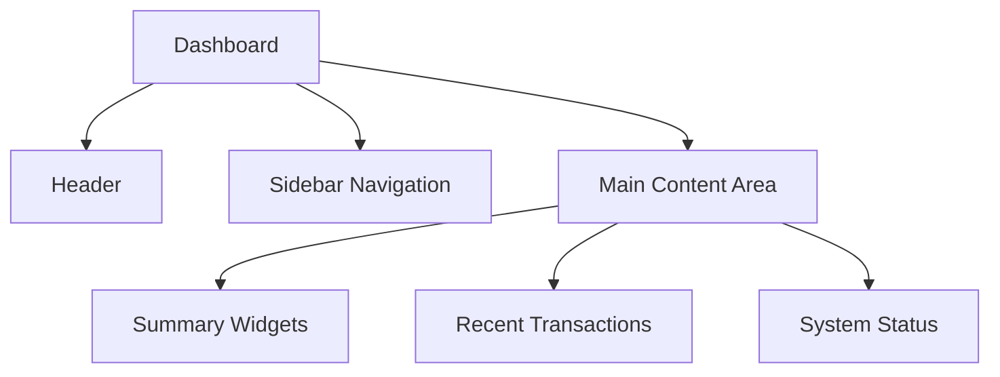
```mermaid
graph TD
    A[Dashboard] --> B[Header]
    A --> C[Sidebar Navigation]
    A --> D[Main Content Area]
    D --> E[Summary Widgets]
    D --> F[Recent Transactions]
    D --> G[System Status]
```

2. Vault Management

**Figure TS-10** gives the composition of the Vault Management screen, whose vault records are the `Vaults` entity of **Figure TS-8**.

**Figure TS-10 — Vault Management Screen Composition (Designed target)**

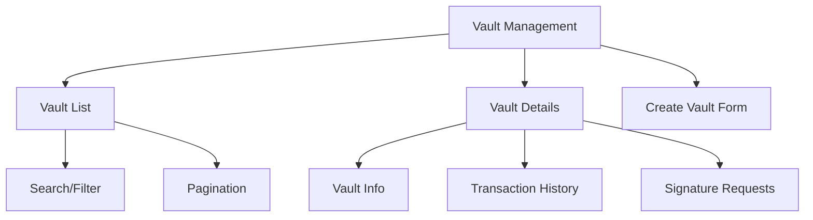
```mermaid
graph TD
    A[Vault Management] --> B[Vault List]
    A --> C[Vault Details]
    A --> D[Create Vault Form]
    B --> E[Search/Filter]
    B --> F[Pagination]
    C --> G[Vault Info]
    C --> H[Transaction History]
    C --> I[Signature Requests]
```

3. Transaction Processing

**Figure TS-11** gives the composition of the Transaction Processing screen, which is the user-facing entry point for the exchange in **Figure TS-6**.

**Figure TS-11 — Transaction Processing Screen Composition (Designed target)**

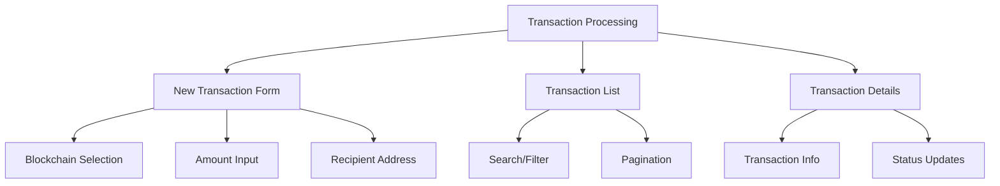
```mermaid
graph TD
    A[Transaction Processing] --> B[New Transaction Form]
    A --> C[Transaction List]
    A --> D[Transaction Details]
    B --> E[Blockchain Selection]
    B --> F[Amount Input]
    B --> G[Recipient Address]
    C --> H[Search/Filter]
    C --> I[Pagination]
    D --> J[Transaction Info]
    D --> K[Status Updates]
```

4. Signature Management

**Figure TS-12** gives the composition of the Signature Management screen, whose records are the `Signatures` entity of **Figure TS-8**.

**Figure TS-12 — Signature Management Screen Composition (Designed target)**

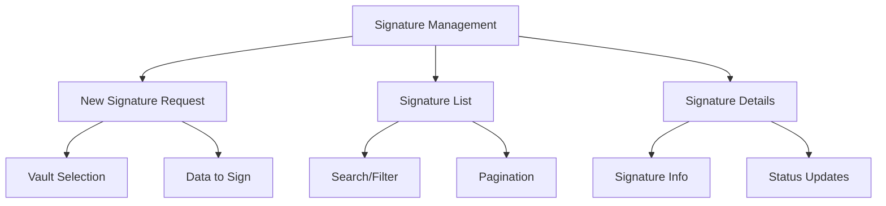
```mermaid
graph TD
    A[Signature Management] --> B[New Signature Request]
    A --> C[Signature List]
    A --> D[Signature Details]
    B --> E[Vault Selection]
    B --> F[Data to Sign]
    C --> G[Search/Filter]
    C --> H[Pagination]
    D --> I[Signature Info]
    D --> J[Status Updates]
```

**Legend — Figures TS-9 to TS-12**

These four figures share one notation:

- **Three levels, read top to bottom.** Level 1 is the **screen** (`Dashboard`, `Vault Management`, `Transaction Processing`, `Signature Management`); level 2 is a **region or panel** within that screen (`Header`, `Sidebar Navigation`, `Vault List`, `Transaction Details`, …); level 3 is a **control or content block** within that region (`Search/Filter`, `Pagination`, `Amount Input`, `Status Updates`, …).
- **Arrow** — "contains". No arrow in these four figures represents navigation, data flow, or an API call.
- **These are information-architecture trees, not visual mockups.** They fix *what appears on each screen and how it nests*, and deliberately say nothing about layout, position, sizing, typography, or colour. No visual design is implied or specified by them.
- **Recurring pattern.** Three of the four screens repeat the same list/detail/create triad with `Search/Filter` and `Pagination` on the list — an intentional consistency across resources rather than four independent designs.
- **Maturity** — **Designed**. The corresponding pages exist in source but do not build, and the surfaces diverge: `VaultManagement.tsx` contains **no** `<form>`, `<input>`, or `<button>` element — it renders only `Header`, `Sidebar`, `VaultList`, and `VaultDetails`, and passes a `handleCreateVault` callback down to `VaultList` — so the `Create Vault Form` in **Figure TS-10** has a handler but no markup behind it `Source: frontend/src/pages/VaultManagement.tsx:L54-L76`. The only two `<form>` elements anywhere under `frontend/src` belong to `TransactionForm` and `SignatureRequest` `Source: frontend/src/components/TransactionForm.tsx`, `Source: frontend/src/components/SignatureRequest.tsx`.

The UI will be responsive, ensuring a consistent experience across desktop, tablet, and mobile devices. It will adhere to WCAG 2.1 Level AA accessibility standards and use a color scheme that aligns with the company's branding guidelines.

Key UI components will include:
- Responsive navigation menu
- Data tables with sorting and filtering capabilities
- Form inputs with real-time validation
- Modal dialogs for confirmations and quick actions
- Toast notifications for system messages
- Loading indicators for asynchronous operations
- Charts and graphs for data visualization (using a library like Chart.js or D3.js)

This system design aligns with the previously specified requirements and technologies, including the use of Golang for the backend, React and TypeScript for the frontend (Tailwind CSS remains a design-time proposal, not an installed dependency), and AWS services for cloud infrastructure. It provides a comprehensive overview of the programming languages, database design, API structure, and user interface components for the Blockchain Integration Service and Dashboard.

# TECHNOLOGY STACK

## PROGRAMMING LANGUAGES

| Language | Justification | Use Cases |
|----------|---------------|-----------|
| Golang | High performance, excellent concurrency support, and strong typing make it ideal for building scalable and efficient backend services. | Backend API development, blockchain integration, data processing |
| TypeScript | Provides strong typing and better tooling support on top of JavaScript, enhancing development productivity and code quality. | Frontend development with React |
| SQL | Standard language for interacting with relational databases. | Database queries and data manipulation |
| Solidity | Primary language for Ethereum smart contract development. | Interacting with existing smart contracts, potential future smart contract development |

## FRAMEWORKS AND LIBRARIES

| Framework/Library | Purpose | Justification |
|-------------------|---------|---------------|
| React | Frontend UI development | Popular, component-based library with a large ecosystem and excellent performance |
| Tailwind CSS *(Designed — not installed)* | UI styling (proposed) | Utility-first CSS framework proposed at design time; NOT a declared dependency in `frontend/package.json` and no `.css` files exist in the source tree |
| Gin | Golang web framework | High performance, minimalist web framework for building APIs in Golang |
| GORM | Golang ORM | Powerful ORM library for Golang, simplifying database operations |
| Viper | Configuration management | Flexible configuration management for Golang applications |
| Logrus | Logging | Structured logger for Golang with various output formats |
| Testify | Testing | Comprehensive testing toolkit for Golang |
| Web3.js | Ethereum interaction | Library for interacting with Ethereum blockchain |
| Ripple-lib | XRP Ledger interaction | Official library for interacting with the XRP Ledger |

## DATABASES

| Database | Type | Purpose | Justification |
|----------|------|---------|---------------|
| Amazon RDS for PostgreSQL | Relational | Primary data storage | Scalable, managed relational database with strong ACID compliance |
| Amazon ElastiCache for Redis | In-memory | Caching, session storage | High-performance, in-memory data store for caching and real-time data |

## THIRD-PARTY SERVICES

| Service | Purpose | Justification |
|---------|---------|---------------|
| AWS Secrets Manager | Credential management | Secure storage and management of sensitive credentials and API keys |
| Amazon MSK (Managed Streaming for Apache Kafka) | Event streaming | Managed Kafka service for building real-time data pipelines and streaming applications |
| Amazon S3 | Object storage | Scalable object storage for logs, backups, and large files |
| AWS CloudTrail | Auditing | Governance, compliance, operational auditing, and risk auditing of AWS account |
| Amazon CloudWatch | Monitoring and logging | Observability of AWS resources and applications |
| AWS IAM | Access management | Securely manage access to AWS services and resources |
| Amazon API Gateway | API management | Create, publish, maintain, monitor, and secure APIs at any scale |
| Utxo Custodian API | Key management and signing | External service for secure key storage and transaction signing |
| XRP Ledger API | XRP blockchain interaction | Official API for interacting with the XRP Ledger |
| Ethereum JSON-RPC API | Ethereum blockchain interaction | Standard API for interacting with Ethereum nodes |

## INFRASTRUCTURE DIAGRAM

**Figure TS-13** restates the architecture of **Figure TS-2** in terms of named AWS services, adding the operational and governance services (`CloudWatch`, `CloudTrail`, `Cognito`, `IAM`) that the earlier figure omits.

**Figure TS-13 — AWS Infrastructure Topology (Designed target)**

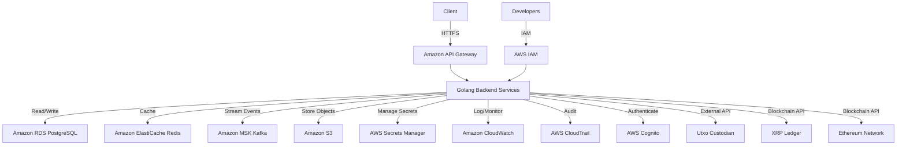
```mermaid
graph TD
    A[Client] -->|HTTPS| B[Amazon API Gateway]
    B --> C[Golang Backend Services]
    C -->|Read/Write| D[Amazon RDS PostgreSQL]
    C -->|Cache| E[Amazon ElastiCache Redis]
    C -->|Stream Events| F[Amazon MSK Kafka]
    C -->|Store Objects| G[Amazon S3]
    C -->|Manage Secrets| H[AWS Secrets Manager]
    C -->|Log/Monitor| I[Amazon CloudWatch]
    C -->|Audit| J[AWS CloudTrail]
    C -->|Authenticate| K[AWS Cognito]
    C -->|External API| L[Utxo Custodian]
    C -->|Blockchain API| M[XRP Ledger]
    C -->|Blockchain API| N[Ethereum Network]
    O[Developers] -->|IAM| P[AWS IAM]
    P --> C
```

**Legend — Figure TS-13**

- **Rectangle** — a named AWS managed service, the application tier (`Golang Backend Services`), an external system (`Utxo Custodian`, `XRP Ledger`, `Ethereum Network`), or an actor (`Client`, `Developers`).
- **Labelled arrow** — the role that dependency plays (`HTTPS`, `Read/Write`, `Cache`, `Stream Events`, `Store Objects`, `Manage Secrets`, `Log/Monitor`, `Audit`, `Authenticate`, `External API`, `Blockchain API`, `IAM`).
- **Two distinct planes.** The **runtime** plane is the `Client → API Gateway → Backend Services → {data, external}` path. The **operational/governance** plane is everything the backend emits to or authenticates against — `CloudWatch` (metrics and logs), `CloudTrail` (audit), `Cognito` (identity), `IAM` — plus the separate `Developers → AWS IAM → Backend Services` administrative path, which is a human access route and **not** a request path.
- **Maturity — this figure diverges materially from what Terraform declares.** The committed stack declares 16 resources: a VPC with public and private subnets, two security groups, an Application Load Balancer with two listeners, an ECS cluster and Fargate service, a Route53 record, RDS PostgreSQL, ElastiCache Redis, **an MSK Kafka cluster**, and **two S3 buckets** `Source: infrastructure/terraform/main.tf:L9-L215`. It declares **no** API Gateway, Cognito, Secrets Manager, CloudTrail, or CloudWatch resource at all — so of this figure's four operational/governance boxes, none exists, and `CloudWatch` appears only in the stack's own trailing to-do comment `Source: infrastructure/terraform/main.tf:L226`. Note also that the runtime ingress differs in kind: the declared edge is an ALB, not the `Amazon API Gateway` drawn here. Nothing here is Provisioned even where it is declared, because the configuration fails `terraform validate` with 17 errors, so the **entire figure is Designed**. The declaration-state view of the same topology — solid boxes for declared resources, dashed for referenced-but-never-declared — is `Fig O2` in `docs/guides/deployment.md`.

This technology stack leverages AWS services for cloud infrastructure, Golang for backend development, and React with TypeScript for frontend development (Tailwind CSS is a design-time proposal, not currently installed). It provides a robust, scalable, and secure foundation for the Blockchain Integration Service and Dashboard, aligning with the previously specified requirements and architectural decisions.

# SECURITY CONSIDERATIONS

## AUTHENTICATION AND AUTHORIZATION

The Blockchain Integration Service and Dashboard will implement a robust authentication and authorization system to ensure secure access to the platform.

### Authentication

1. Multi-Factor Authentication (MFA)
   - Users will be required to set up MFA using one of the following methods:
     - Time-based One-Time Password (TOTP)
     - SMS-based verification
     - Hardware security keys (e.g., YubiKey)

2. Password Policy
   - Minimum length: 12 characters
   - Must include uppercase, lowercase, numbers, and special characters
   - Password history: prevent reuse of last 5 passwords
   - Maximum age: 90 days

3. JWT (JSON Web Tokens)
   - Used for maintaining user sessions
   - Short expiration time (15 minutes) with refresh token mechanism

4. API Key Authentication
   - For programmatic access to the API
   - Rotated regularly (every 30 days)

### Authorization

Role-Based Access Control (RBAC) will be implemented with the following roles:

| Role | Permissions |
|------|-------------|
| Admin | Full access to all system functions |
| Manager | Access to vault management, transaction processing, and analytics |
| Operator | Access to transaction processing and basic analytics |
| Auditor | Read-only access to all data for auditing purposes |
| API User | Programmatic access to specific API endpoints |

**Figure TS-14** shows how the roles in the table above are enforced at request time, splitting the flow into a one-time authentication exchange and a per-request authorization check.

**Figure TS-14 — Authentication and Authorization Request Flow (Designed target)**

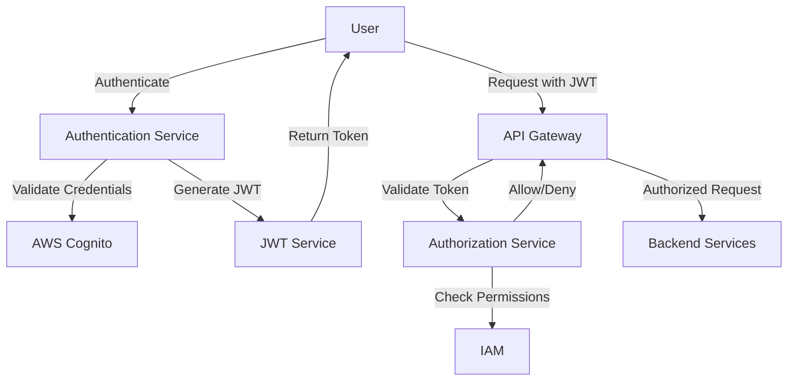
```mermaid
graph TD
    A[User] -->|Authenticate| B[Authentication Service]
    B -->|Validate Credentials| C[AWS Cognito]
    B -->|Generate JWT| D[JWT Service]
    D -->|Return Token| A
    A -->|Request with JWT| E[API Gateway]
    E -->|Validate Token| F[Authorization Service]
    F -->|Check Permissions| G[IAM]
    F -->|Allow/Deny| E
    E -->|Authorized Request| H[Backend Services]
```

**Legend — Figure TS-14**

- **Rectangle** — the actor (`User`), an internal security component (`Authentication Service`, `JWT Service`, `Authorization Service`), an AWS service (`AWS Cognito`, `IAM`), the edge (`API Gateway`), or the protected tier (`Backend Services`).
- **Arrow label** — the step being performed (`Authenticate`, `Validate Credentials`, `Generate JWT`, `Return Token`, `Request with JWT`, `Validate Token`, `Check Permissions`, `Allow/Deny`, `Authorized Request`).
- **Two phases in one figure.** The upper cycle `User → Authentication Service → {Cognito, JWT Service} → User` happens **once per session** and yields a token. The lower cycle `User → API Gateway → Authorization Service → API Gateway → Backend Services` happens **on every request** and carries that token. The `Allow/Deny` arrow returning to `API Gateway` is the decision point: only an allowed request continues to `Backend Services`, so a denial terminates at the edge and never reaches application code.
- **Authentication is separated from authorization by design** — credential verification (`Cognito`) and permission evaluation (`IAM`) are different components, so the RBAC roles in the table above are evaluated per request rather than baked into the token at login.
- **Maturity** — **Designed**. The router *declares* `middleware.AuthMiddleware()` on every non-auth route, but the `backend/internal/api/middleware` package is imported and **absent**, so the guard is declared rather than enforced; there is no Cognito or IAM integration in code, and `User.Role` is an unconstrained `string` with no enforcement anywhere. `Source: backend/internal/api/routes.go:L6,L25`, `Source: backend/internal/db/schema.go:L27`.

## DATA SECURITY

The system will implement multiple layers of security to protect sensitive information:

1. Encryption at Rest
   - All data stored in RDS PostgreSQL will be encrypted using AWS-managed keys
   - S3 buckets will use server-side encryption with AWS KMS
   - ElastiCache for Redis will have encryption enabled

2. Encryption in Transit
   - All communication between services will use TLS 1.2 or higher
   - VPC peering and AWS PrivateLink for secure inter-service communication

3. Key Management
   - AWS Key Management Service (KMS) will be used for managing encryption keys
   - Hardware Security Modules (HSMs) for storing and managing cryptographic keys

4. Data Masking
   - Sensitive data (e.g., private keys) will never be displayed in full
   - Logs and error messages will be sanitized to remove sensitive information

5. Secure Backup and Recovery
   - Regular encrypted backups of all databases
   - Secure, off-site storage of backup encryption keys

6. Data Access Logging
   - All data access attempts will be logged and monitored
   - Anomaly detection systems will alert on suspicious access patterns

## SECURITY PROTOCOLS

The following security protocols and standards will be implemented:

1. Network Security
   - Firewalls and Network Access Control Lists (NACLs) to restrict traffic
   - VPC segmentation to isolate different components of the system
   - Regular vulnerability scans and penetration testing

2. Application Security
   - Input validation and sanitization to prevent injection attacks
   - Output encoding to prevent XSS attacks
   - Use of prepared statements to prevent SQL injection
   - Regular security audits of the codebase

3. API Security
   - Rate limiting to prevent abuse
   - API versioning to maintain backward compatibility
   - OAuth 2.0 for secure API authorization

4. Monitoring and Incident Response
   - Real-time monitoring of system logs using AWS CloudWatch
   - Automated alerts for suspicious activities
   - Incident response plan with defined roles and procedures

5. Compliance
   - Regular audits to ensure compliance with relevant standards (e.g., PCI DSS, GDPR)
   - Implementation of privacy controls as required by regulations

6. Secure Development Lifecycle
   - Security training for all developers
   - Regular code reviews with a focus on security
   - Automated security testing integrated into the CI/CD pipeline

7. Third-Party Security
   - Regular security assessments of third-party integrations
   - Contractual security requirements for vendors and partners

**Figure TS-15** collects the seven numbered protocol groups above into a single taxonomy so the full control surface can be seen at once.

**Figure TS-15 — Security Protocol Taxonomy (Designed target)**

```mermaid
graph TD
    A[Security Protocols] --> B[Network Security]
    A --> C[Application Security]
    A --> D[API Security]
    A --> E[Monitoring and Incident Response]
    A --> F[Compliance]
    A --> G[Secure Development Lifecycle]
    A --> H[Third-Party Security]
    B --> I[Firewalls]
    B --> J[VPC Segmentation]
    B --> K[Vulnerability Scans]
    C --> L[Input Validation]
    C --> M[Output Encoding]
    C --> N[Prepared Statements]
    D --> O[Rate Limiting]
    D --> P[API Versioning]
    D --> Q[OAuth 2.0]
    E --> R[Real-time Monitoring]
    E --> S[Automated Alerts]
    E --> T[Incident Response Plan]
    F --> U[Regular Audits]
    F --> V[Privacy Controls]
    G --> W[Security Training]
    G --> X[Code Reviews]
    G --> Y[Automated Security Testing]
    H --> Z[Vendor Assessments]
    H --> AA[Contractual Requirements]
```

**Legend — Figure TS-15**

- **This figure is a taxonomy, not a flow.** Level 1 is the root subject (`Security Protocols`); level 2 is one of the **seven control categories** enumerated in the numbered list above (`Network Security`, `Application Security`, `API Security`, `Monitoring and Incident Response`, `Compliance`, `Secure Development Lifecycle`, `Third-Party Security`); level 3 is an **individual control** belonging to that category.
- **Arrow** — "comprises". Unlike Figures TS-2, TS-6, TS-7, and TS-14, **no arrow here represents a request, a data movement, or an ordering**. Reading this diagram as a sequence would be a misreading; it is a classification of the control surface.
- **Scope of the tree** — one root, **7 categories**, and **19 leaf controls** (26 edges). The tree mirrors the numbered list above one-for-one, so it is exhaustive with respect to that list rather than illustrative.
- **Maturity** — **Designed**, uniformly and without exception. No leaf in this tree has a counterpart in the repository: controls such as `Rate Limiting`, `Input Validation`, `Prepared Statements`, and `OAuth 2.0` appear nowhere in the backend source, and the only security-adjacent code present is an `import` of an auth middleware package that does not exist. `Source: backend/internal/api/routes.go:L6`. The implemented security posture of this documentation deliverable — dependency-vulnerability triage and the compensating controls that make it defensible — is recorded separately in `docs/security/security-model.md`.

By implementing these security considerations, the Blockchain Integration Service and Dashboard aims to provide a robust, secure environment for managing blockchain transactions and sensitive data. Regular security assessments and updates to these protocols will ensure the system remains protected against evolving threats.